# Convex Quadratics II: Source Conditions, Spectral Structure, and Stochastic Gradient Descent

[← Back to course page](./)

**Lecture notes on convex quadratics:** [Part I (§1–6)](part1.html) · **Part II (§7–8)** · [Part III (§9)](part3.html) · [Part IV (§10)](part4.html)

---

This is Part II of the lecture notes on optimization algorithms for convex quadratics. The problem setup and notation are introduced in [Part I](part1.html#sec-1).

### Contents

- [7. Convergence Under Source Conditions and Spectral Structure](#sec-7)
- [8. Stochastic Gradient Descent for Least Squares](#sec-8)
- [Related Literature](#related)
- [References](#references)
- [Summary](#summary)

---

## 7. Convergence Under Source Conditions and Spectral Structure {#sec-7}

### Beyond worst-case analysis

Up to this point, we emphasized worst-case bounds obtained from extreme eigenvalues alone. In this section, we obtain refined and improved guarantees that take into account the entire spectrum of the matrix $A$, rather than its extreme eigenvalues. These refined bounds are important in practice because in high-dimensional problems, the *distribution* of eigenvalues is often far from the worst case, and exploiting this structure leads to substantially sharper estimates.

As motivation, recall from [Section 4](part1.html#sec-4) that the conjugate gradient method satisfies the exact error formula

$$
f(x_k) - f^\ast \;=\; \min_{\substack{p \in \mathcal{P}_k \\ p(0)=1}}\, \frac{1}{2}\sum_{i=1}^d \lambda_i\,p(\lambda_i)^{2}\,c_i^2, \tag{12}
$$

where $c_i$ are the coefficients of $e_0 = x_0 - x^\ast$ in the eigenbasis of $A$. The worst-case analysis upper bounds this minimum by exhibiting a particular polynomial $p$ — a (shifted) Chebyshev polynomial — and then bounding the resulting sum by pulling out the maximum: $\max_{\lambda\in[\alpha,\beta]} p(\lambda)^2$ in the positive definite case, or $\max_{\lambda\in[0,\beta]} \lambda\, p(\lambda)^2$ in the positive semidefinite case. This bound ignores two sources of structure:

1. **Initial error.** If the components $c_i$ of the initial error are small for small eigenvalues, the sum is dominated by well-conditioned directions. This is captured by *source conditions*.

2. **Eigenvalue density.** If most eigenvalues lie far from the point where $\lambda\, p(\lambda)^{2}$ is largest, replacing the sum by an integral against the spectral density gives a sharper estimate. This is the *spectral integral* approach.

We develop both ideas in turn, then combine them.

### Source conditions

A **source condition** of order $s \in \mathbb{R}$ is the assumption

$$e_0 = A^s\,w \qquad \text{for some } w \in \mathbb{R}^d \text{ with } \lVert w\rVert^2 \leq M.$$

In the eigenbasis, this means $c_i = \lambda_i^s\,\tilde{c}_i$ where $\tilde{c}_i = v_i^\top w$. In the regime $s>0$, the factor $\lambda_i^s$ suppresses the components of $e_0$ along eigenvectors with small eigenvalues, so the initial error is concentrated in the large-eigenvalue directions of $A$. The regime $s\in (-\tfrac{1}{2},0)$ is also meaningful but for a different reason. Since $\lVert e_0\rVert^2 = \sum_i \lambda_i^{2s} w_i^2$ and $2s < 0$, the factor $\lambda_i^{2s}$ amplifies small-eigenvalue components. For polynomial eigenvalue decay $\lambda_i \asymp i^{-\alpha}$ with isotropic $w$, the initial error $\lVert e_0\rVert^2 \asymp d^{-2s\alpha}\lVert w\rVert^2$ grows with $d$ while $\lVert w\rVert^2$ stays of constant order. Therefore convergence guarantees that depend on $\lVert w\rVert$ rather than on $\lVert e_0\rVert$, which we will derive in this section, may still be meaningful.

**Example (Source conditions in kernel regression).**
The source condition arises naturally in kernel regression, where it is equivalent to a classical smoothness condition on the target function.

**Setup.** Suppose data points $x_1,\dots,x_n$ are drawn i.i.d. from a measure $\nu$ on $\mathbb{R}^d$, and the labels are generated by an unknown function: $y_i = h(x_i)$. As recalled in [Section 6](part1.html#sec-6), kernel regression solves the linear system $K\alpha = y$, where $K_{ij} = k(x_i,x_j)$ is the kernel matrix and $y = (y_1,\dots,y_n)^\top$. The corresponding estimate of $h$ is then the function $x\mapsto \sum_{i=1}^n \alpha_i k(x,x_i).$  The question is: when does the source condition hold for this problem, and what does it say about $h$? To answer this, we pass through the continuous integral operator $T$ associated with the kernel, which serves as the large-$n$ limit of the linear system.

**The integral operator.** As we have seen in [Section 6](part1.html#sec-6), the kernel $k$ and the data distribution $\nu$ define an **integral operator** $T\colon L^2(\nu) \to L^2(\nu)$ by

$$(Tf)(x) = \int k(x,x')\,f(x')\,d\nu(x').$$

By the celebrated Mercer's theorem this operator admits an eigendecomposition

$$T\phi_i = \mu_i\,\phi_i, \qquad \mu_1 \geq \mu_2 \geq \cdots > 0,$$

with eigenfunctions $\phi_i$ forming an orthonormal basis for $L^2(\nu)$. For the Laplace kernel on $[0,1]$, these eigenfunctions have increasing spatial frequency as $i$ grows: $\phi_1$ is a smooth hump, $\phi_2$ has one oscillation, and successive eigenfunctions oscillate more and more rapidly. The animation below illustrates this for the Laplace kernel on $[0,1]$ with uniform measure and bandwidth $\sigma = 0.1$.

**Source condition as smoothness/lack of oscillations.** Any function $h \in L^2(\nu)$ can be expanded in the eigenbasis as

$$h = \sum_{i\geq 1} \hat{h}_i\,\phi_i.$$

The source condition $h = T^s g$ with $\lVert g\rVert^2_{L^2(\nu)}\leq M$ reads, in the eigenbasis, as

$$\hat{h}_i = \mu_i^s\,\hat{g}_i, \qquad \sum_{i\geq 1} \hat{g}_i^2 \leq M^2,$$

where $\hat{h}_i$ and $\hat{g}_i$ denote the coefficients of $h$ and $g$ in the eigenbasis, i.e.,

$$\hat{h}_i := \langle h, \phi_i \rangle_{L^2(\nu)}, \qquad \hat{g}_i := \langle g, \phi_i \rangle_{L^2(\nu)}.$$

Equivalently, this amounts to requiring

$$\sum_{i\geq 1} \mu_i^{-2s}\,\lvert\hat{h}_i\rvert^2 \leq M^2.$$

This forces the coefficients of $h$ to decay at least as fast as $\mu_i^s$. For most interesting kernels, the higher-indexed eigenfunctions have increasing oscillations/frequency.

There is also a close connection of the source condition to a quantitative measure of smoothness. This connection is cleanest in one dimension. For the Laplace kernel on $[0,1]$, the eigenvalues decay as $\mu_i \asymp i^{-2}$ and the eigenfunctions closely approximate sines and cosines (up to boundary effects), so the coefficients $\hat{h}_i = \langle h, \phi_i \rangle$ are closely related to the Fourier coefficients of $h$. The standard Fourier characterization of Sobolev spaces says that $f \in H^m$ (i.e., $f$ has $m$ square-integrable derivatives) if and only if $\sum_i i^{2m}\lvert\hat{f}_i\rvert^2 < \infty$. Since $\mu_i \asymp i^{-2}$, the source condition $\sum_i \mu_i^{-2s}\lvert\hat{h}_i\rvert^2 \leq M^2$ becomes $\sum_i i^{4s}\lvert\hat{h}_i\rvert^2 \leq M^2$, which turns out to precisely characterize the Sobolev space $H^{2s}([0,1])$. Thus $s = 1/2$ corresponds to one derivative, $s = 1$ to two derivatives, and so on. 

**From operator to matrix.** We now connect the function-level source condition to the finite-sample linear system. Let $\hat\mu_i$ and $v_i$ denote the eigenvalues and eigenvectors of the normalized kernel matrix $\tfrac{1}{n}K$. Given a function $f$, define its sampled vector by evaluation,

$$f^{(n)} := \tfrac{1}{\sqrt{n}}\bigl(f(x_1),\dots,f(x_n)\bigr)^\top \in \mathbb{R}^n.$$

We have already seen in [Section 6](part1.html#sec-6) that we expect $\hat\mu_i \approx \mu_i$. Similarly, we expect that if $v_i$ is an eigenvector of $\tfrac{1}{n}K$ corresponding to eigenvalue $\hat\mu_i$, then for any function $f\in L_2(\nu)$ that we have 

$$\frac{v^\top_i f^{(n)}}{\sqrt{n}}=\frac{1}{n}\sum_{i=1}^n (v_i)_j f(x_j)\approx \int \phi_i(x) f(x)~d\nu(x)=\hat f_i.$$

Now consider running gradient descent on the normalized system $\tfrac{1}{n}K\alpha = \tfrac{1}{n}y$, which has the same solution $\alpha^\ast = K^{-1}y$ but now $A = \tfrac{1}{n}K$ has bounded eigenvalues $\hat\mu_i \approx \mu_i$. Starting from $\alpha_0 = 0$, the initial error $e_0 = \alpha^\ast$ has coefficients

$$c_i \;:=\; v_i^\top e_0 \;=\; \frac{v_i^\top(\tfrac{1}{n}y)}{\hat\mu_i}\;=\; \frac{v_i^\top h^{(n)}}{\sqrt{n}\hat\mu_i} \;\approx\; \frac{\hat{h}_i}{\sqrt{n}\,\mu_i}.$$

If the function-level source condition $h = T^s g$ holds (so $\hat{h}_i = \mu_i^s\,\hat{g}_i$), this becomes

$$c_i \;\approx\; \frac{\mu_i^{s-1}}{\sqrt{n}}\,\hat{g}_i \;=\; \hat\mu_i^{s-1}\,w_i, \qquad \text{where}\quad w_i = \frac{\hat{g}_i}{\sqrt{n}}.$$

Note that

$$\|w\|_2^2=\frac{1}{n}\sum_{i=1}^n \hat{g}_i^2\approx \|g\|^2_{L^2(\nu)}.$$

Thus we have the matrix-level source condition $e_0 = A^{s'}w$ with exponent $s' = s - 1$. The exponent shift is the essential point: **a function-level source condition of order $s$ translates to a matrix-level source condition of order $s' = s-1$.** In particular, one needs $s > 1$ (e.g. $h \in H^{2+\epsilon}$ for the Laplace kernel).

**Numerical illustration.** The figures below demonstrate this on a Laplace kernel ($\sigma = 0.15$) with $n = 200$ points drawn uniformly from $[0,1]$. The first figure plots the initial-error coefficients $\lvert c_i\rvert$ versus $\hat\mu_i$ on a log-log scale; the slope of the log-log fit directly reveals the matrix-level source parameter $s'$ that enters Theorem 7.1. For a smooth target $h(x) = \sin(2\pi x) + \tfrac12\cos(4\pi x)$ (left panel), the fitted slope is $s' \approx 0.4$, so Theorem 7.1 predicts rate $O(k^{-1.8})$. For a rough target of random signs (right panel), the fitted slope is $s' \approx -0.9$: the initial error is concentrated in the small-eigenvalue directions, so no source condition holds.

The next figure explains *why* the source exponent changes across kernels. For translation-invariant kernels on $[0,1]$, the eigenfunctions are approximately the same (Fourier modes), so the projections $b_i = v_i^\top(y/n)$ are nearly kernel-independent (left panel: all four kernels overlap). What differs is the eigenvalue decay: $\lambda_i \asymp i^{-\alpha}$ with $\alpha = 2$ (Laplace), $4$ (Matérn 3/2), $6$ (Matérn 5/2), or super-polynomial (Gaussian). Since $c_i = b_i/\lambda_i$, dividing by faster-decaying eigenvalues inflates the high-index coefficients more, producing a less favorable slope (right panel). If $b_i \propto i^{-r}$ for some target-dependent $r$, then $c_i \propto \lambda_i^{r/\alpha - 1}$, giving $s' = r/\alpha - 1$. As $\alpha$ increases, $s'$ decreases --- not because the target projects differently, but because each eigenvalue is smaller and dividing by it inflates $c_i$ more.

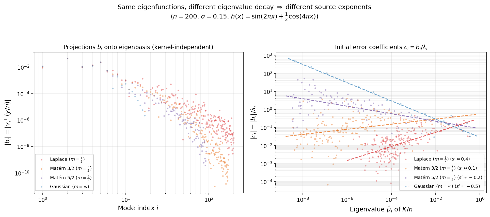

We now show how the source condition controls the rate of convergence of gradient descent. The GD rate is $O(k^{-(1+2s)})$, with two distinct payoffs depending on the sign of $s$:

1. **(faster rate when $s > 0$).** The rate $O(\lVert w\rVert^2\cdot k^{-(1+2s)})$ is strictly faster than $O(\lVert e_0\rVert^2\cdot k^{-1})$. The source condition concentrates the initial error on large-eigenvalue directions, which GD resolves quickly.

2. **(dimension-free rate when $s \in (-\tfrac{1}{2}, 0)$).** The rate $O(\lVert w\rVert^2/ k^{1+2s})$ is slower than $O(\lVert e_0\rVert^2/k)$ in terms of $k$, but the bound depends on $\lVert w\rVert^2$ rather than $\lVert e_0\rVert^2$. For polynomial eigenvalue decay $\lambda_i \asymp i^{-\alpha}$ with isotropic $w$, the initial error scales as

$$
\lVert e_0\rVert^2 \;=\; \sum_{i=1}^n \lambda_i^{2s}\,w_i^2 \;\approx\; \frac{\lVert w\rVert^2}{n}\sum_{i=1}^n i^{-2s\alpha} \;\asymp\; \frac{\lVert w\rVert^2}{n}\cdot n^{\,1-2s\alpha} \;=\; n^{-2s\alpha}\,\lVert w\rVert^2,
$$

Therefore, the vanilla bound diverges as $n \to \infty$, whereas the source-condition bound $O(\lVert w\rVert^2/ k^{1+2s})$ is independent of $n$.

**Theorem 7.1 (GD with source condition).** *If the initial error satisfies $e_0 = A^s w$ for some $s > -\tfrac{1}{2}$, then GD with $\eta = 1/\beta$ satisfies*

$$f(x_k) - f^\ast \leq \frac{\beta^{1+2s}}{2}\left(\frac{1+2s}{2k+1+2s}\right)^{1+2s}\|w\|^2. \tag{13}$$

*In particular, $f(x_k) - f^\ast = O\left(\beta^{1+2s}\,k^{-(1+2s)}\,\lVert w\rVert ^2\right)$ as $k \to \infty$.*

*Proof.* For GD with stepsize $\eta = 1/\beta$, the error satisfies $e_k = (I - A/\beta)^k e_0$, so

$$
f(x_k) - f^\ast = \frac{1}{2}\sum_{i=1}^d \lambda_i\,(1-\lambda_i/\beta)^{2k}\,c_i^2.
$$

Writing $c_i = \lambda_i^s \tilde{c}_i$ with $\tilde{c}_i = v_i^\top w$, this becomes

$$
f(x_k) - f^\ast = \frac{1}{2}\sum_{i=1}^d \lambda_i^{1+2s}\,(1-\lambda_i/\beta)^{2k}\,\tilde{c}_i^2,
$$

and therefore

$$
f(x_k) - f^\ast \leq \frac{\|w\|^2}{2}\,\max_{\lambda \in [0,\beta]}\, \lambda^{1+2s}(1-\lambda/\beta)^{2k}. \tag{14}
$$

It suffices to maximize $g(t) = t^{1+2s}(1-t)^{2k}$ over $t \in [0,1]$, with the identification $\lambda = \beta t$. An elementary computation shows

$$
\max_{t\in [0,1]}g(t) = \left(\frac{1+2s}{2k+1+2s}\right)^{1+2s}\left(\frac{2k}{2k+1+2s}\right)^{2k} \leq \left(\frac{1+2s}{2k+1+2s}\right)^{1+2s}.
$$

Multiplying by $\beta^{1+2s}/2$ and $\lVert w\rVert ^2$ gives the bound $(13)$. $\square$

The source condition can also be exploited by time-varying stepsizes. The relevant polynomial problem is now

$$
\min_{\substack{p \in \mathcal P_k^r\\ p(0)=1}} \max_{\lambda \in [0,\beta]} \lambda^{1+2s}p(\lambda)^2.
$$

After the affine change of variables $\lambda = \frac{\beta}{2}(1-t)$, this becomes a minimax problem on $[-1,1]$ with weight $(1-t)^{1+2s}$. The solutions of this extremal problem are the **Jacobi polynomials**. You will derive this minimax construction in the next homework and will prove the following theorem.

**Theorem 7.2 (Time-varying stepsizes with source condition).** *For every $s > -\tfrac{1}{2}$ and every horizon $k \geq 1$, there exists a sequence of stepsizes $\eta_1,\dots,\eta_k$ such that the corresponding GD iterate satisfies*

$$
f(x_k)-f^\ast
\leq C_s\,\beta^{1+2s}\,k^{-2(1+2s)}\,\|w\|^2. \tag{15}
$$

where $C_s>0$ depends only on $s$. 

In particular, the rate goes from $O(k^{-2})$ for Chebyshev accelerated GD without the source condition to $O(k^{-2(1+2s)})$ when the source condition holds. In principle, the stepsizes in the theorem are given by the reciprocals of the roots of the relevant Jacobi polynomial, and depend explicitly on $s$. This is not a serious drawback, however, because the same convergence rate is inherited by the conjugate gradient method, which achieves it adaptively without needing the stepsizes explicitly.

**Corollary 7.1 (CG with source condition).** *If the initial error satisfies $e_0 = A^s w$ for some $s > -\tfrac{1}{2}$, then the CG iterates satisfy*

$$
f(x_k^{\mathrm{CG}})-f^\ast
\leq C_s\,\beta^{1+2s}\,k^{-2(1+2s)}\,\|w\|^2,
$$

*and CG terminates in at most $m$ iterations, where $m$ is the number of distinct nonzero eigenvalues of $A$.*

The following figure shows the actual convergence of gradient descent (with stepsize $\eta = 1/\beta$) and conjugate gradient on the smooth  target for kernel regression. The dashed lines show the predicted rates: $O(k^{-1.8})$ for GD (Theorem 7.1) and $O(k^{-3.6})$ for CG (Corollary 7.1). Both methods track their predicted rates well.

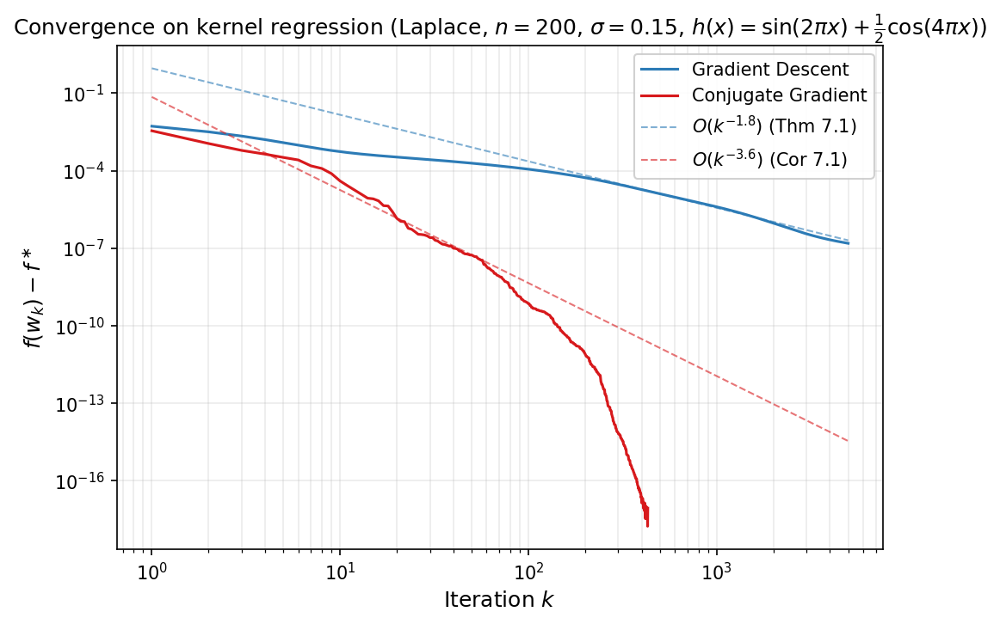

### The spectral integral

Source conditions improve rates by considering structure in the *initial error*. A complementary improvement comes from considering structure in the *eigenvalue distribution*. Recall from $(12)$ that for any first-order method whose error has the form $e_k = p_k(A)\,e_0$ for some polynomial $p_k \in \mathcal{P}_k$ with $p_k(0)=1$ — which includes gradient descent with stepsizes $\eta_j$ (where $p_k(\lambda) = \prod_j(1-\eta_j\lambda)$), the Chebyshev iteration, and the conjugate gradient method (which adaptively minimizes over $p_k$) — we have

$$
f(x_k) - f^\ast = \frac{1}{2}\sum_{i=1}^d \lambda_i\,p_k(\lambda_i)^{2}\,c_i^2,
$$

where $c_i$ are the coordinates of $e_0$ in the eigenbasis of $A$. The idea is that if $d$ is large and the eigenvalues are well-spread out, the sum in the expression may be estimated as an integral with respect to a continuous density.  To make this precise define the **spectral error measure**

$$\mu = \sum_{i=1}^d c_i^2\,\delta_{\lambda_i},$$

where $\delta_{\lambda_i}$ is a Dirac delta measure. Observe that $\mu([0,\beta]) = \lVert e_0\rVert ^2$ and the error can be written as an integral:

$$
f(x_k) - f^\ast = \frac{1}{2}\int_0^\beta \lambda\,p_k(\lambda)^{2}\,d\mu(\lambda). \tag{16}
$$

When $d$ is large and the eigenvalues are well-spread, the discrete measure $\mu$ is well-approximated by a continuous density. Suppose $d\mu(\lambda) \approx \phi(\lambda)\,d\lambda$ for a nonnegative function $\phi$---the **spectral error density**. The density $\phi$ encodes both the eigenvalue distribution and the initial error profile: if the eigenvalue density of $A$ is $\rho_A$ and the error components are roughly uniform ($c_i^2 \approx \lVert e_0\rVert ^2/d$), then $\phi(\lambda) \approx \lVert e_0\rVert ^2\rho_A(\lambda)$. Note that $\phi$ need not be integrable; what matters is that the error integral $(16)$, which has an extra factor of $\lambda$, converges.

Under this approximation, $f(x_k) - f^\ast \approx \mathcal{E}_k$, where

$$
\mathcal{E}_k := \frac{1}{2}\int_0^\beta \lambda\,p_k(\lambda)^{2}\,\phi(\lambda)\,d\lambda.
$$

In particular, for fixed-stepsize GD with $\eta = 1/\beta$, we have $p_k(\lambda) = (1-\lambda/\beta)^k$ and the integrand $\lambda(1-\lambda/\beta)^{2k}$ is sharply peaked near its maximizer $\lambda^\ast = \beta/(2k+1)$ for large $k$, decaying rapidly away from this point. The animation below illustrates this concentration: as $k$ grows the peak narrows and shifts toward zero.

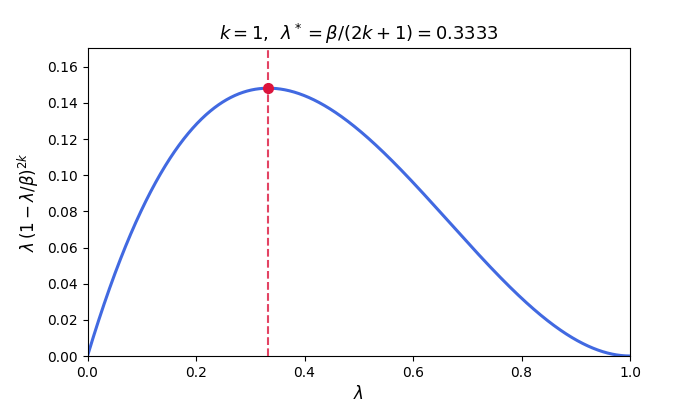

The integral is therefore controlled by the behavior of $\phi$ near $\lambda^\ast$---which shifts toward zero as $k$ grows. The next two subsections exploit this concentration to obtain convergence rates that depend on the spectral density.

### Power-law spectral density

When the spectral error density follows a power law near the origin:

$$\phi(\lambda) = M\,\lambda^{a-1} \qquad \text{on } (0, \beta],$$ 

the exponent $a$ controls the spectral mass near zero. For $a > 1$, the density vanishes at zero (few eigenvalues near the origin); for $a = 1$, the density is flat; for $0 < a < 1$, the density diverges but remains integrable.

The figure below illustrates the three regimes. The left panel plots the spectral error density $\phi(\lambda) = M\lambda^{a-1}$: for $a > 1$ it vanishes at the origin, for $a = 1$ it is flat, and for $a < 1$ it diverges (still integrable when $a > 0$). The right panel plots the integrand $\lambda\,\phi(\lambda) = M\lambda^a$ that appears in the spectral integral $\mathcal{E}_k$: even when $\phi$ itself is non-integrable ($a \leq 0$), the extra $\lambda$ factor makes the integrand integrable whenever $a > -1$.

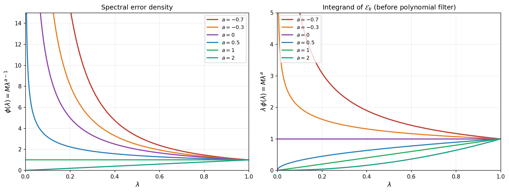

**Example (polynomial eigenvalue decay).** Kernels such as Laplace and Matérn have eigenvalues that decay polynomially: $\lambda_i \asymp i^{-\alpha}$ for some $\alpha > 0$. To find the corresponding spectral exponent $a$,  we can compute the eigenvalue density $\rho_A$. The empirical CDF of the eigenvalues is $F(\lambda) = \tfrac{1}{d}\cdot \lvert\lbrace i:\lambda_i \leq \lambda\rbrace \rvert$. Since $\lambda_i = Ci^{-\alpha}$ is decreasing, $\lambda_i \leq \lambda$ iff $i \geq (C/\lambda)^{1/\alpha}$, so

$$F(\lambda) \approx 1 - \frac{(C/\lambda)^{1/\alpha}}{d} = 1 - \frac{C^{1/\alpha}}{d}\,\lambda^{-1/\alpha}.$$

Differentiating gives $\rho_A(\lambda) = F'(\lambda) \propto \lambda^{-1/\alpha - 1}$. With isotropic error ($c_i^2 \approx \lVert e_0\rVert^2/d$), the spectral error density is $\phi(\lambda)  \propto \lambda^{-1/\alpha - 1}$. Matching to $\phi = M\lambda^{a-1}$ gives $a = -1/\alpha$. 

Since $a = -1/\alpha < 0$, the total mass $\lVert e_0\rVert^2 = \int \phi\,d\lambda$ diverges---the density $\phi(\lambda) \propto \lambda^{-1/\alpha-1}$ has a non-integrable singularity at $\lambda = 0$. In kernel regression (starting from $x_0 = 0$), this has a concrete interpretation: the initial error is $e_0 = A^{-1}b$, so its spectral coefficients are $c_i = b_i/\lambda_i$. Because $\lambda_i \to 0$ polynomially, the coefficients $c_i$ grow for modes with small eigenvalues. As $n$ increases, more and more modes with tiny eigenvalues appear, each contributing a large $c_i^2$ term, and $\lVert e_0\rVert^2 = \sum c_i^2$ diverges. In particular, the vanilla rate $O(\lVert e_0\rVert ^2/k)$ becomes meaningless.

Suppose more generally that $c_i$ satisfy a source condition $e_0 = A^s w$, and therefore $c_i = \lambda_i^s w_i$. If in addition, the coordinates $w_i$ are isotropic ($w_i^2 \approx \lVert w\rVert^2/d$), the spectral error density becomes $\phi(\lambda) \propto \lambda^{2s}\rho_A(\lambda) \propto \lambda^{- \tfrac{1}{\alpha} - 1+2s}$. The source condition counteracts the $1/\lambda_i$ blow-up: $c_i = \lambda_i^s w_i$ decays with the eigenvalues. 

We are now ready to derive the rate of convergence of gradient descent under the power-law spectrum.

**Theorem 7.2 (Power-law spectral density).** *Assume the spectral error density is $\phi(\lambda)=M\lambda^{a-1}$ on $(0,\beta]$ for some $M>0$ and $a>-1$. Then the GD iterates with $\eta = 1/\beta$ satisfy*

$$\mathcal{E}_k = \frac{M\,\beta^{a+1}}{2}\cdot\frac{\Gamma(a+1)\,\Gamma(2k+1)}{\Gamma(2k+a+2)}.$$

*In particular, as $k \to \infty$, we have*

$$\mathcal{E}_k \sim \frac{M\,\Gamma(a+1)\,\beta^{a+1}}{2\,(2k)^{a+1}}. \tag{17}$$

*Proof.* Substituting $t = \lambda/\beta$ yields

$$
\int_0^\beta \lambda^{a}(1-\lambda/\beta)^{2k}\,d\lambda = \beta^{a+1}\int_0^1 t^{a}(1-t)^{2k}\,dt = \beta^{a+1}\,B(a+1,\, 2k+1),
$$

where $B(p,q) = \Gamma(p)\Gamma(q)/\Gamma(p+q)$ is the Beta function. The asymptotics follow from the standard estimate $\Gamma(n+c)/\Gamma(n) \sim n^c$ as $n \to \infty$, applied with $n = 2k+1$ and $c = a+1$. $\square$

**Relationship to the $O(1/k)$ bound.** The vanilla $O(1/k)$ bound of [Theorem 6.1](part1.html#thm-6-1) is a *max-bound*: it replaces the spectral filter $\lambda(1-\lambda/\beta)^{2k}$ by its pointwise maximum over $\lambda$, then pulls the maximum outside the integral:

$$\mathcal{E}_k \leq \frac{1}{2}\max_{\lambda}\bigl[\lambda(1-\lambda/\beta)^{2k}\bigr]\int_0^\beta \phi(\lambda)\,d\lambda \leq \frac{\beta}{2(2k+1)}\lVert e_0\rVert^2.$$

The price is that the entire initial error norm $\lVert e_0\rVert^2 = \int \phi\,d\lambda$ appears as a single constant, discarding all information about *where* in the spectrum the error lives. The spectral integral keeps $\phi(\lambda)$ inside the integral, so the rate reflects the spectral distribution of the error, not just its total size. Concretely, two things can happen:

1. **$\lVert e_0\rVert^2$ is finite but the error concentrates on large eigenvalues** ($a > 0$). The spectral integral gives $O(k^{-(a+1)})$ with $a+1 > 1$, strictly faster than $O(1/k)$. The vanilla bound is finite but wasteful because it treats all eigenvalue directions equally.

2. **$\lVert e_0\rVert^2 \approx \infty$** ($-1 < a \leq 0$, e.g. polynomial eigenvalue decay without a source condition). The vanilla bound gives $\infty$---it says nothing. But the spectral integral is still finite because the $\lambda$ factor in the integrand $\lambda(1-\lambda/\beta)^{2k}\phi(\lambda) = M\lambda^a(1-\lambda/\beta)^{2k}$ *vanishes* at $\lambda = 0$, canceling the singularity of $\phi$. The result is a finite bound $O(k^{-(a+1)})$ with $0 < a+1 \leq 1$.

The following table summarizes these regimes in general.

| Exponent $a$ | $\lVert e_0\rVert^2 = \int\phi$ | Rate | vs.\ $O(1/k)$ bound |
|---|---|---|---|
| $a \geq 0$ | finite ($a>0$) or $\infty$ ($a=0$) | $O(k^{-(a+1)})$, $a+1\geq 1$ | **improves** on $O(1/k)$ |
| $-1 < a < 0$ | $\infty$ | $O(k^{-(a+1)})$, $a+1<1$ | $O(1/k)$ bound is **vacuous**; spectral integral is the only finite bound |

**Example (Matérn kernels in $\mathbb{R}^p$).** A Matérn-$m$ kernel in dimension $p$ has eigenvalue decay $\lambda_i \asymp i^{-(2m+p)/p}$, so $\alpha = (2m+p)/p$ and the base spectral exponent is $a = -p/(2m+p)$. A source condition $e_0 = A^s w$ with isotropic $w$ shifts this to $a_{\mathrm{eff}} = 2s - \tfrac{p}{2m+p}$, giving the rate $\mathcal{E}_k = O(k^{-(2s + 1 - \frac{p}{2m+p})})$. The table below lists several concrete cases in $p=1$.

| Kernel | $m$ | $a$ (no source) | Rate ($s=0$) | $a_{\mathrm{eff}}$ ($s=\tfrac{1}{2}$) | Rate ($s=\tfrac{1}{2}$) |
|---|---|---|---|---|---|
| Laplace | $\tfrac{1}{2}$ | $-\tfrac{1}{2}$ | $O(k^{-1/2})$ | $\tfrac{1}{2}$ | $O(k^{-3/2})$ |
| Matérn 3/2 | $\tfrac{3}{2}$ | $-\tfrac{1}{4}$ | $O(k^{-3/4})$ | $\tfrac{3}{4}$ | $O(k^{-7/4})$ |
| Matérn 5/2 | $\tfrac{5}{2}$ | $-\tfrac{1}{6}$ | $O(k^{-5/6})$ | $\tfrac{5}{6}$ | $O(k^{-11/6})$ |

Without a source condition ($s=0$), the rate is always *slower* than $O(1/k)$ and the vanilla bound is vacuous ($\lVert e_0\rVert^2 = \infty$). With even a modest source condition $s = \tfrac{1}{2}$, the effective exponent flips to $a_{\mathrm{eff}} > 0$ and the rate becomes *faster* than $O(1/k)$. Smoother kernels (larger $m$) are closer to the $O(1/k)$ threshold in both directions: the penalty without a source condition is milder, but so is the improvement with one. Increasing $p$ makes everything harder: the base exponent $a = -p/(2m+p)$ is more negative, so a stronger source condition is needed to cross the $O(1/k)$ boundary ($s > p/(2(2m+p))$).

Crucially, the spectral integral bound depends on the density parameter $M$, not on the total mass $\lVert e_0\rVert^2 = \int \phi\,d\lambda$. For Matérn kernels with $a < 0$, the norm $\lVert e_0\rVert^2$ diverges as $n \to \infty$, making the vanilla $O(1/k)$ constant blow up. The spectral integral remains finite because the filter $\lambda(1-\lambda/\beta)^{2k}$ automatically suppresses the small-eigenvalue directions responsible for the divergence. The result is a **dimension-free** rate: $M$ depends on the spectral *shape*, not the problem size.

**Effect of kernel smoothness.** The figure below compares GD convergence on the *same* target function $h(x) = \sin(2\pi x) + \tfrac{1}{2}\cos(4\pi x)$ across the Matérn family: Laplace ($m=\tfrac12$), Matérn 3/2, Matérn 5/2, and Gaussian. The y-axis shows the relative gap $(f(x_k)-f^\ast)/(f(x_0)-f^\ast)$. The ordering is striking and at first glance counter-intuitive: *rougher* kernels converge faster. The Gaussian kernel makes essentially no progress in 5000 iterations, while the Laplace kernel reduces the gap by five orders of magnitude.

The initial error norms illustrate the divergence phenomenon discussed above. With $n=200$ points and the same target, the initial function gaps $f(x_0)-f^\ast$ are nearly identical across the first three kernels ($\approx 0.01$), yet $\lVert e_0\rVert^2$ explodes as the kernel gets smoother:

| Kernel | $\lVert e_0\rVert^2$ | $f(x_0)-f^\ast$ | $\kappa$ |
|---|---|---|---|
| Laplace | $\approx 1$ | $\approx 0.013$ | $1.4 \times 10^5$ |
| Matérn 3/2 | $\approx 700$ | $\approx 0.012$ | $1.1 \times 10^{10}$ |
| Matérn 5/2 | $\approx 3\times 10^8$ | $\approx 0.012$ | $1.8 \times 10^{14}$ |
| Gaussian | $\approx 5\times 10^{39}$ | $\approx 2.5 \times 10^{9}$ | $3.6 \times 10^{29}$ |

The function gap (which contains the stabilizing $\lambda_i$ factor) is dimension-stable, but $\lVert e_0\rVert^2$ grows by 40 orders of magnitude from Laplace to Gaussian. This is exactly why the vanilla $O(1/k)$ bound --- which uses $\lVert e_0\rVert^2$ as its constant --- becomes meaningless for smooth kernels, while the spectral integral remains informative.

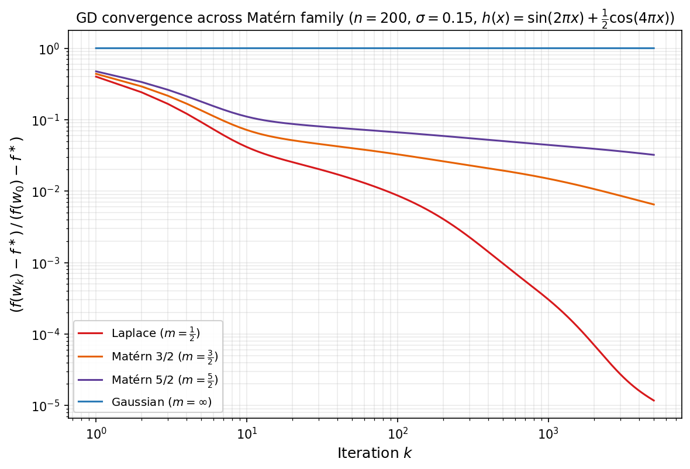

### The Laplace method for positive definite spectra

When $A \succ 0$, the eigenvalues lie in $[\alpha, \beta]$ with $\alpha > 0$, and the base rate of convergence for GD is exponential: $O((1-\alpha/\beta)^{2k})$. The spectral integral can still yield improvements, but they take the form of a *polynomial correction* to the exponential rate rather than a change in the polynomial exponent. The argument is based on the so-called Laplace estimate for integrals of exponential functions.

**Theorem 7.3 (Laplace upper bound).** *Let $A \succ 0$ with eigenvalues in $[\alpha, \beta]$, and suppose the spectral error density $\phi$ satisfies*

$$\phi(\lambda) \leq C\,(\lambda - \alpha)^p \qquad \textit{on } [\alpha, \beta]$$

*for constants $C > 0$ and $p > -1$. Then for every $k \geq 1$ the GD iterates with $\eta = 1/\beta$ satisfy*

$$\mathcal{E}_k \leq \frac{C\,\Gamma(p+1)}{2}\left[\alpha + \frac{(p+1)(\beta-\alpha)}{2k}\right]{\left(\frac{\beta-\alpha}{2k}\right)^{p+1}\left(1-\kappa^{-1}\right)^{2k}}. \tag{18}$$

*In particular, the leading term is $\tfrac{C\,\alpha\,\Gamma(p+1)}{2}\bigl(\tfrac{\beta-\alpha}{2k}\bigr)^{p+1}(1-\kappa^{-1})^{2k}$, and the bracketed correction is $1 + O(1/k)$.*

*Proof.* Substitute $u = \lambda - \alpha$ in $\mathcal{E}_k$ to get

$$
\mathcal{E}_k = \frac{1}{2}\int_0^{\beta-\alpha} (\alpha + u)\,\bigl(1 - \tfrac{\alpha+u}{\beta}\bigr)^{2k}\,\phi(\alpha + u)\,du.
$$

Next, factor out the dominant exponential using the identity 

$$1-\tfrac{\alpha+u}{\beta} = (1-\tfrac{\alpha}{\beta})(1 - \tfrac{u}{\beta - \alpha})$$

to get

$$
\mathcal{E}_k= \frac{(1-\kappa^{-1})^{2k}}{2}\int_0^{\beta-\alpha} (\alpha + u)\left(1 - \frac{u}{\beta-\alpha}\right)^{2k}\phi(\alpha + u)\,du.
$$

Using the hypothesis $\phi(\alpha+u)\leq Cu^p$, we bound the last integral by

$$
C\int_0^{\beta-\alpha}\bigl[\alpha\,u^p + u^{p+1}\bigr]\left(1-\tfrac{u}{\beta-\alpha}\right)^{2k}du.
$$

For each exponent $q \in \lbrace p, p+1\rbrace$, the substitution $v = 2ku/(\beta-\alpha)$ gives

$$
\int_0^{\beta-\alpha} u^q\left(1-\tfrac{u}{\beta-\alpha}\right)^{2k}du \;=\; \left(\tfrac{\beta-\alpha}{2k}\right)^{q+1}\!\!\int_0^{2k} v^q\left(1-\tfrac{v}{2k}\right)^{2k}dv \;\leq\; \left(\tfrac{\beta-\alpha}{2k}\right)^{q+1}\Gamma(q+1),
$$

where in the last step we used the pointwise inequality $(1-v/(2k))^{2k}\leq e^{-v}$ on $[0,2k]$ and extended the integral to $[0,\infty)$. Combining the two cases ($q = p, p+1$) and using equality $\Gamma(p+2) = (p+1)\Gamma(p+1)$, we deduce

$$
\mathcal{E}_k \;\leq\; \frac{C\,(1-\kappa^{-1})^{2k}}{2}\left(\frac{\beta-\alpha}{2k}\right)^{p+1}\Gamma(p+1)\left[\alpha + \frac{(p+1)(\beta-\alpha)}{2k}\right],
$$

which completes the proof. $\square$

Compared with the worst-case bound $f(x_k) - f^\ast \leq (1-\alpha/\beta)^{2k}(f(x_0)-f^\ast)$, the Laplace estimate reveals a polynomial improvement of order $k^{-(p+1)}$ that depends on how the spectral density vanishes at the left edge of the spectrum. A flat density ($p = 0$) gives a $1/k$ improvement; a square-root vanishing ($p = 1/2$) gives $k^{-3/2}$; higher-order vanishing gives even larger gains.

The figure below compares several edge exponents $p$ against the same exponential backbone, showing the progressive polynomial correction predicted by Theorem 7.3.

### Application: Marchenko--Pastur spectrum

We now specialize to the linear least-squares setting from the beginning of the notes, but with a random design matrix $D\in\mathbb{R}^{n\times d}$ whose entries are iid with zero mean and unit variance. Consider

$$
\min_{x\in\mathbb{R}^d} \frac{1}{2n}\|Dx-y\|^2.
$$

This is exactly the quadratic problem from [Section 1](part1.html#sec-1), equivalently the problem of solving the normal equations $Ax=b$, with

$$
A=\frac{1}{n}D^\top D,\qquad b=\frac{1}{n}D^\top y.
$$

The **Marchenko--Pastur distribution** arises as the limiting spectral distribution of the sample covariance / Gram matrix $A = \tfrac{1}{n}D^\top D$ when the entries of $D \in \mathbb{R}^{n \times d}$ are iid with zero mean and unit variance, in the proportional asymptotic regime 

$$\tfrac{d}{n} \to \gamma > 0\qquad \textrm{as}\qquad n\to \infty.$$ 

Here, convergence is meant in the following precise sense. Letting $\lambda_1(A),\dots,\lambda_d(A)$ denote the eigenvalues of $A$, define the *empirical spectral measure*

$$
\hat{\mu}_A \;=\; \frac{1}{d}\sum_{i=1}^{d}\delta_{\lambda_i(A)},
$$

Note that this measure is itself random because $A$ is random. Marchenko and Pastur showed that $\hat{\mu}\_A$ weakly converges to a deterministic limit measure $\mu\_{\mathrm{MP}}$, called *Marchenko--Pastur law*. That is for any bounded continuous function $f$, it holds:

$$
\int f\,d\hat{\mu}_A \;\xrightarrow[n\to\infty]{\text{a.s.}}\; \int f\,d\mu_{\mathrm{MP}}.
$$

This type of weak convergence is denoted $\hat{\mu}\_A\;\Rightarrow\;\mu\_{\mathrm{MP}}$.

The animation below illustrates this convergence for the three regimes $\gamma \in \lbrace 0.5,\,1,\,2\rbrace $ (with iid standard Gaussian entries in $D$). For each frame a fresh $D$ is drawn at the given $n$, the $d$ eigenvalues of $A=\tfrac{1}{n}D^\top D$ are computed, and their *empirical frequency density* is plotted: the eigenvalues are sorted into equal-width bins $\lbrace B_j\rbrace $ on the $\lambda$-axis, and each bin height equals

$$
\frac{\#\{i:\lambda_i(A) \in B_j\}}{d \cdot \lvert B_j\rvert},
$$

so that the total area of the histogram equals $1$ (matching the mass of $\hat{\mu}\_A$). As $n$ grows, this histogram collapses onto the Marchenko--Pastur density curve overlaid in black. In the rank-deficient case $\gamma = 2$ the matrix $A$ has exactly $d - n$ zero eigenvalues, which form an atom of mass $1-1/\gamma$ at $\lambda=0$ in $\hat\mu_A$; those are excluded from the histogram, so the bulk integrates to the remaining mass $1/\gamma$ and aligns with $\rho\_{\mathrm{MP}}$ on $[\lambda\_-,\lambda\_+]$.

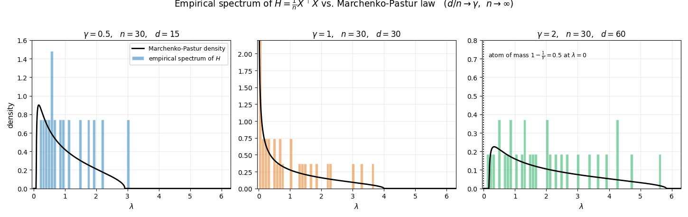

Concretely, $\mu_{MP}$ admits the decomposition

$$
\mu_{MP} \;=\; \max\!\left(0,\;1-\tfrac{1}{\gamma}\right)\,\delta_{0} \;+\; \rho_{MP}(\lambda)\,d\lambda,
$$

consisting of (i) a point mass at $\lambda=0$ of weight $\max(0,\,1-1/\gamma)$, which is nonzero only when $\gamma > 1$ and accounts for the $d-n$ forced zero eigenvalues of $A$, and (ii) an absolutely continuous part supported on $[\lambda_-,\lambda_+]$ with density

$$
\rho_{MP}(\lambda) = \frac{\sqrt{(\lambda_+ - \lambda)(\lambda - \lambda_-)}}{2\pi\gamma\,\lambda}, \qquad \lambda \in [\lambda_-, \lambda_+],
$$

where $\lambda_\pm := (1 \pm \sqrt{\gamma})^2$. The continuous part carries total mass $\min(1,\,1/\gamma)$, so together with the atom the measure integrates to $1$.

To connect the Marchenko--Pastur law with the spectral integral bounds, we assume directly that the **reweighted empirical spectral measure**

$$
\nu_d:=\sum_{i=1}^d c_i^2\,\delta_{\lambda_i}
$$

has the same asymptotic shape as the empirical spectral measure of $A$, that is

$$\nu_d \;\Rightarrow\; \lVert e_0\rVert^2\,\mu_{MP}, \qquad \text{a.s.     as    }       n\to\infty,\ d/n\to\gamma.$$

This is the only property used below and holds for example if we initialize at $x_0=0$ and $x^{\ast}\sim \mathcal{N}(0,\frac{R}{d}I_d)$ for any constant $R>0$.

Let us now look at the convergence of GD for the least squares problem.

1. **$\gamma < 1$ (no atom at zero).** Here $\lambda_- > 0$ and therefore $n>d$. This setting is relevant for linear regression with more feature vectors $(n)$ than the dimension of the space $(d)$. The problem is positive definite with

$$\kappa = \frac{\lambda_+}{\lambda_-} = \frac{(1+\sqrt\gamma)^2}{(1-\sqrt\gamma)^2}.$$

Near the left edge $\lambda_-$, the density vanishes like a square root:

$$
\rho_{MP}(\lambda) \sim \frac{\sqrt{(\lambda_+ - \lambda_-)(\lambda - \lambda_-)}}{2\pi\gamma\,\lambda_-} = \frac{2\gamma^{1/4}\sqrt{\lambda - \lambda_-}}{2\pi\gamma\,(1-\sqrt\gamma)^2} \quad \text{as } \lambda \to \lambda_-^+.
$$

With isotropic initialization, Theorem 7.3 applies with $\alpha = \lambda_-$, $\beta = \lambda_+$, and $p = 1/2$. Since $\Gamma(3/2) = \sqrt\pi/2$, the estimate $(18)$ gives

$$
\mathcal{E}_k \sim \frac{\tilde{C}(\gamma)}{k^{3/2}}\left(1 - \frac{1}{\kappa}\right)^{2k}\|e_0\|^2 \quad \text{as } k \to \infty,
$$

where $\tilde{C}(\gamma)$ is an explicit constant depending on the aspect ratio $\gamma$.

2. **$\gamma = 1$ (hard edge at zero).** This is the case of a square data matrix $n=d$. Then the left edge is $\lambda_-=0$ and

$$
\rho_{MP}(\lambda) = \frac{\sqrt{4-\lambda}}{2\pi\sqrt{\lambda}} \sim \frac{1}{\pi\sqrt{\lambda}} \quad \text{as } \lambda \to 0^+.
$$

Thus under isotropic initialization $\phi(\lambda) \sim \tfrac{\lVert e_0\rVert^2}{\pi}\,\lambda^{-1/2}$ near $\lambda=0$ (power-law exponent $a=1/2$ in Theorem 7.2 with $s=0$, $M = \lVert e_0\rVert^2/\pi$, $\beta = 4$). The asymptotic $(17)$ then gives

$$
\mathcal{E}_k \;\sim\; \frac{\lVert e_0\rVert^2}{\sqrt{2\pi}\,k^{3/2}} \qquad \text{as } k \to \infty.
$$

3. **$\gamma > 1$ (rank deficient).** The empirical spectrum has an atom at $0$ of asymptotic mass $1-1/\gamma$, so globally $\alpha=0$. However, the nonzero spectrum still lies in $[(\sqrt{\gamma}-1)^2,\ (\sqrt{\gamma}+1)^2]$. Since the objective gap carries the factor $\lambda$ in $(16)$, the nullspace part does not contribute to $f(x_k)-f^\ast$. Therefore the nonzero spectral component behaves as in the positive definite case, with

$$
\alpha_{\mathrm{eff}} = (\sqrt{\gamma}-1)^2,\qquad \beta=(\sqrt{\gamma}+1)^2,
$$

and the same asymptotic form

$$
\mathcal{E}_k\sim \frac{\hat{C}(\gamma)}{k^{3/2}}\left(1-\frac{\alpha_{\mathrm{eff}}}{\beta}\right)^{2k}\|e_0\|^2.
$$

In all three regimes, the square-root edge behavior of Marchenko--Pastur yields the same $k^{-3/2}$ polynomial factor; what changes is whether it multiplies an exponential term (gap $>0$) or appears alone (gap $=0$).

### Extensions to the Krylov method

We now turn to the analogous analysis for the **Krylov method**. Passing directly to the limit under the reweighted spectral assumption $\nu_d\Rightarrow\nu$ of the earlier subsections, finding the best stepsize sequence is equivalent to solving the polynomial problem

$$
\mathcal{E}_k \;=\; \min_{\substack{p\in\mathcal{P}_k\\ p(0)=1}}\,\int_{0}^{\beta}\lambda\,p(\lambda)^2\,d\nu(\lambda), \tag{19}
$$

where $\nu$ is the limiting (reweighted) spectral measure supported on $[0,\beta]$ --- for example $\nu=\lVert e_0\rVert^2\,\mu_{MP}$ in the Marchenko--Pastur setting --- and $\mathcal{P}_k$ consists of degree at most $k$ polynomials. Note that the constraint set $\mathcal{V}_k:=\lbrace p\in \mathcal{P}_k: p(0)=1\rbrace$ is a finite-dimensional affine space. 

Interestingly, we will now see that the solution to $(19)$ can be computed explicitly. The key idea is to realize that the objective has the form $$\lVert p\rVert^2$$ where the norm is induced by the inner product $$\langle f,g\rangle=\int_{0}^{\beta} fg\,d\mu$$ with reweighted measure $$d\mu(\lambda)=\lambda\cdot d\nu(\lambda)$$. Let $$\psi_0,\dots,\psi_k$$ be any orthonormal basis of $$\mathcal{P}_k$$ with respect to this inner product; such a basis can be constructed analytically by Gram--Schmidt. Writing $$p=\sum_{i=0}^k u_i\,\psi_i$$ for unknown coefficients $$u_i$$, the optimization problem $(19)$ is equivalent to

$$
\min_{u\in \mathbb{R}^{k+1}}\; \lVert u\rVert_2^2 \qquad \textrm{subject to}\qquad \sum_{i=0}^k u_i\psi_i(0)=1,
$$

which amounts to finding the minimum-norm vector in a hyperplane. The solution is the rescaled outward normal, with coordinates $$u_i=\psi_i(0)\big/\sum_{j=0}^k \psi_j(0)^2$$. Therefore, the optimal polynomial $p$ that solves $(19)$ is

$$
p^{\ast}(t)=\frac{\sum_{i=0}^{k}\psi_i(0)\psi_i(t)}{\sum_{i=0}^k \psi_i(0)^2}.
$$

Thus we have proved the following theorem. 

**Theorem 7.4 (Minimum-norm polynomial).** *Let $\psi_0,\dots,\psi_k$ be any orthonormal basis of $\mathcal{P}_k$ with respect to the inner product $\langle f,g\rangle=\int fg\,d\mu$, where $d\mu(\lambda)=\lambda\,d\nu(\lambda)$. Then the unique solution of $(19)$ is*

$$
p^\ast(t) \;=\; \frac{\sum_{i=0}^{k}\psi_i(0)\,\psi_i(t)}{\sum_{i=0}^{k}\psi_i(0)^2} \qquad \text{with minimal value}\quad \frac{1}{\sum_{i=0}^{k}\psi_i(0)^2}. \tag{20}
$$

We now apply Theorem 7.4 to the Marchenko--Pastur problem in the critical case $\gamma=1$. The orthogonal polynomials with respect to the corresponding measure turn out to be the Chebyshev polynomials of the second kind $U_k$.

**Theorem 7.5 (CG on Marchenko--Pastur, critical case).** *Suppose $\gamma=1$ and the reweighted spectral assumption $\nu_d\Rightarrow \lVert e_0\rVert^2\,\mu_{MP}$ holds. Then for every $k\geq 1$,* it holds:

$$
\mathcal{E}_k \;=\; \frac{3\,\lVert e_0\rVert^2}{(k+1)(k+2)(2k+3)}. \tag{22}
$$

In particular, this is the rate achieved by the iterates of the CG algorithm.

*Proof.* Specializing the Marchenko--Pastur distribution to $\gamma=1$ yields

$$
\rho_{MP}(\lambda) \;=\; \frac{\sqrt{4-\lambda}}{2\pi\sqrt{\lambda}}\qquad\textrm{on}\qquad[0,4].
$$

Therefore the measure $d\mu(\lambda):=\lambda\,\rho_{MP}(\lambda)\,d\lambda$ that appears in $(19)$ is

$$
d\mu(\lambda) \;=\; \frac{\sqrt{\lambda(4-\lambda)}}{2\pi}\,d\lambda \qquad\textrm{on}\qquad [0,4],
$$

and minimizing the right-hand side of $(19)$ amounts to

$$
\mathcal{E}_k \;=\; \frac{\lVert e_0\rVert^2}{2}\,\min_{\substack{p\in\mathcal{P}_k\\ p(0)=1}}\int_{0}^{4} p(\lambda)^2\,d\mu(\lambda).
$$

This is the abstract problem of Theorem 7.4. It suffices now to identify an orthogonal basis of $\mathcal{P}_k$ in $L^2(\mu)$. Apply the affine change of variables

$$
x(\lambda) \;:=\; \frac{\lambda}{2}-1,
$$

which maps $[0,4]$ to $[-1,1]$. With this change of coordinates we have $\sqrt{\lambda(4-\lambda)}=2\sqrt{1-x^2}$ and $d\lambda=2\,dx$, hence $d\mu = \tfrac{2}{\pi}\sqrt{1-x^2}\,dx$. A standard fact is that the Chebyshev polynomials of the second kind $U_j$ from [Section 6](part1.html#sec-6) are orthogonal on $[-1,1]$ with weight $\sqrt{1-x^2}$ and their square norm is $\int_{-1}^{1}U_j(x)^2\sqrt{1-x^2}\,dx=\pi/2$. Therefore

$$
q_j(\lambda) \;:=\; U_j\!\bigl(x(\lambda)\bigr),
$$

is an *orthonormal* basis of $\mathcal{P}_k$ in $L^2(\mu)$. Using the identities $U_j(-1)=(-1)^j(j+1)$ and $U_j(1)=j+1$ from [Section 6](part1.html#sec-6) gives $q_j(0)^2=(j+1)^2$. Substituting into the orthogonal-polynomial formula $(21)$ gives

$$
\min_{\substack{p\in\mathcal{P}_k\\ p(0)=1}}\int_{0}^{4}p(\lambda)^2\,d\mu(\lambda) \;=\;  \frac{1}{\sum_{j=0}^{k}(j+1)^2} \;=\; \frac{6}{(k+1)(k+2)(2k+3)},
$$

Multiplying by $\lVert e_0\rVert^2/2$ yields the bound $(22)$. $\square$

Two remarks comparing $(22)$ with the GD bound at $\gamma=1$ are in order.

1. **Improvement over the universal CG bound.** The universal CG bound from [Theorem 6.3](part1.html#thm-6-3) gives $f(x_k^{\mathrm{CG}})-f^\ast=O(\lVert e_0\rVert^2/k^{2})$. The MP analysis improves this to $O(\lVert e_0\rVert^2/k^{3})$.

2. **Comparison with GD.** Contrasting $(22)$ with the GD asymptotic $\mathcal E_k\sim \lVert e_0\rVert^2/(\sqrt{2\pi}\,k^{3/2})$ derived in regime $2$ above, CG converges at the faster rate $k^{-3}$ at the critical aspect ratio.

**Numerical illustration.** The figure below confirms both rates on a random linear least-squares problem at the critical aspect ratio. We draw $D\in\mathbb R^{n\times n}$ with iid standard Gaussian entries ($n=d=1500$, so $\gamma=1$), form $A=\tfrac{1}{n}D^\top D$ (whose limiting spectrum is $\mu_{MP}$ on $[0,4]$), pick $x^\ast$ uniformly on the sphere of radius $\sqrt{n}$, and run GD with stepsize $\eta=1/\lambda_{\max}(A)$ and CG starting from $x_0=0$, plotting the median objective gap over $30$ independent trials (shaded bands show the $10$--$90\%$ interquantile range). Both curves match their predicted sublinear rates --- $O(k^{-3/2})$ for GD and $O(k^{-3})$ for CG. The GD band is essentially invisible (the empirical rate is highly self-averaging across draws of $A$), while the CG band widens slightly in the tail, reflecting CG's greater sensitivity to the random small-eigenvalue structure of $A$.

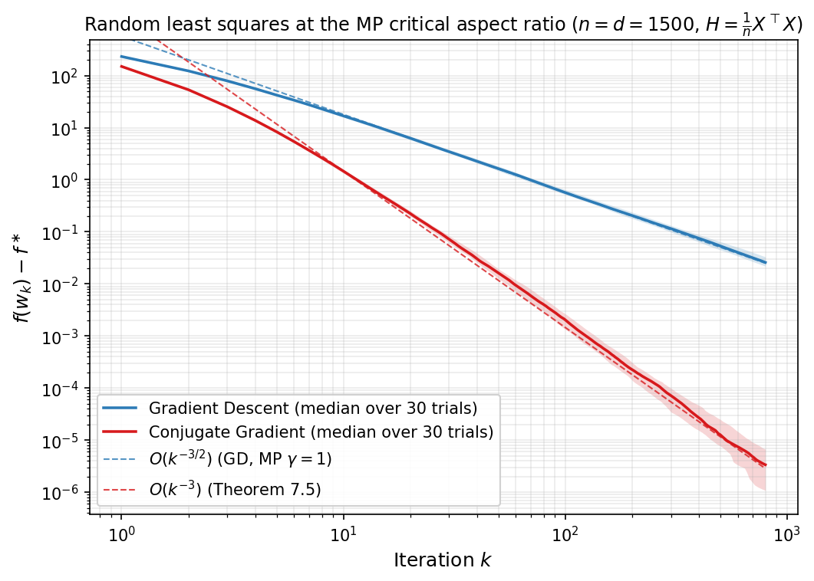

As the final application of the spectral integral approach, we now derive convergence of CG under a power-law spectrum. We assume the spectral error density is $\phi(\lambda)=M\lambda^{a-1}$ on $(0,\beta]$ for some $M>0$ and $a>-1$. The relevant measure is therefore  $d\mu(\lambda):=\lambda\,\phi(\lambda)\,d\lambda=M\lambda^{a}\,d\lambda$. After the affine rescaling $x=2\lambda/\beta-1$ that maps $[0,\beta]$ to $[-1,1]$, this measure becomes $d\mu=M(\beta/2)^{a+1}(1+x)^{a}\,dx$, so the relevant orthogonal family is that of the classical **Jacobi polynomials** with parameters $(0,a)$. We briefly recall their definition and the three properties used in the proof below.

**Jacobi polynomials.** For parameters $p,q>-1$, the *Jacobi polynomials* $\lbrace P_k^{(p,q)}\rbrace_{k\geq 0}$ are a family of polynomials with $\deg P_k^{(p,q)}=k$ that are orthogonal on $[-1,1]$ with respect to the weight $w_{p,q}(x):=(1-x)^{p}(1+x)^{q}$, normalized by the convention

$$
P_k^{(p,q)}(1) \;=\; \binom{k+p}{k}.
$$

 In our setting we only need the specialization $(p,q)=(0,a)$. The proof of Theorem 7.6 relies on the following three standard facts about this family.

1. **Orthogonality and squared norms:**

$$
\int_{-1}^{1} P_i^{(0,a)}(x)\,P_j^{(0,a)}(x)\,(1+x)^{a}\,dx \;=\; \frac{2^{a+1}}{2j+a+1}\,{\bf 1}_{i=j}.
$$

2. **Endpoint identity:**

$$
P_j^{(0,a)}(-1) \;=\; (-1)^{j}\binom{j+a}{j} \qquad\text{where}\qquad \binom{j+a}{j}:=\frac{\Gamma(j+a+1)}{j!\,\Gamma(a+1)}.
$$

3. **Asymptotic growth via Stirling:** as $j\to\infty$, we have

$$
\binom{j+a}{j} \;=\; \frac{\Gamma(j+a+1)}{j!\,\Gamma(a+1)} \;\sim\; \frac{j^{a}}{\Gamma(a+1)}.
$$

**Theorem 7.6 (CG on power-law spectral density).** *Assume the spectral error density is $\phi(\lambda)=M\lambda^{a-1}$ on $(0,\beta]$ for some $M>0$ and $a>-1$. Then the CG iterates satisfy*

$$
\mathcal{E}_k^{\mathrm{CG}} \;\leq\; \frac{M\,\beta^{a+1}}{2\,S_k(a)} \qquad\textrm{where}\qquad S_k(a):=\sum_{j=0}^{k}(2j+a+1)\binom{j+a}{j}^{2}. \tag{23}
$$

*In particular, as $k\to\infty$,* we have

$$
\mathcal{E}_k^{\mathrm{CG}} \;\sim\; \frac{M\,\Gamma(a+1)\,\Gamma(a+2)\,\beta^{a+1}}{2\,k^{2(a+1)}}. \tag{24}
$$

*Proof.* Substituting $\phi(\lambda)=M\lambda^{a-1}$ into $(19)$ and writing $d\mu(\lambda):=\lambda\,\phi(\lambda)\,d\lambda=M\lambda^{a}\,d\lambda$ on $[0,\beta]$ yields

$$
\mathcal{E}_k^{\mathrm{CG}} \;=\; \frac{1}{2}\,\min_{\substack{p\in\mathcal{P}_k\\ p(0)=1}}\int_{0}^{\beta} p(\lambda)^{2}\,d\mu(\lambda).
$$

This is the abstract problem of Theorem 7.4. By the orthogonal-polynomial form $(20)$, it suffices to identify an orthogonal basis of $\mathcal{P}_k$ in $L^{2}(\mu)$. Apply the affine change of variables

$$
x(\lambda) \;:=\; \frac{2\lambda}{\beta}-1,
$$

which maps $[0,\beta]$ to $[-1,1]$. Hence we have $d\mu = M(\beta/2)^{a+1}(1+x)^{a}\,dx$. Classically, the so-called Jacobi polynomials $P_j^{(0,a)}$ are orthogonal on $[-1,1]$ with weight $(1+x)^{a}$ and squared norms

$$
\int_{-1}^{1} P_j^{(0,a)}(x)^{2}\,(1+x)^{a}\,dx \;=\; \frac{2^{a+1}}{2j+a+1},
$$

That is,

$$
q_j(\lambda) \;:=\; P_j^{(0,a)}\!\bigl(x(\lambda)\bigr)
$$

is an orthogonal basis of $\mathcal{P}_k$ in $L^{2}(\mu)$. A standard computation therefore shows

$$
\min_{\substack{p\in\mathcal{P}_k\\ p(0)=1}}\int_{0}^{\beta}p(\lambda)^{2}\,d\mu(\lambda) \;=\; \biggl(\sum_{j=0}^{k}\frac{q_j(0)^{2}}{h_j}\biggr)^{-1} \;=\; \frac{M\,\beta^{a+1}}{S_k(a)},
$$

where $h_j:=\lVert q_j\rVert_{L^{2}(\mu)}^{2}=M\beta^{a+1}/(2j+a+1)$ is the squared $L^{2}(\mu)$ norm of $q_j$, and the denominator $S_k(a)$ is the sum defined in $(23)$, obtained by using the Jacobi endpoint identity $P_j^{(0,a)}(-1)=(-1)^{j}\binom{j+a}{j}$ to evaluate $q_j(0)^{2}=\binom{j+a}{j}^{2}$. Multiplying by $1/2$ yields $(23)$. For the asymptotic estimate, Stirling gives $\binom{j+a}{j}=\Gamma(j+a+1)/(j!\,\Gamma(a+1))\sim j^{a}/\Gamma(a+1)$ as $j\to\infty$, and therefore

$$
S_k(a) \;\sim\; \frac{2}{\Gamma(a+1)^{2}}\sum_{j=0}^{k} j^{2a+1} \;\sim\; \frac{k^{2(a+1)}}{(a+1)\,\Gamma(a+1)^{2}} \;=\; \frac{k^{2(a+1)}}{\Gamma(a+1)\,\Gamma(a+2)},
$$

Substituting into $(23)$ yields $(24)$. $\square$

Thus we see a significant acceleration of $O(k^{-2(a+1)})$ for CG compared to the rate of gradient descent $O(k^{-(a+1)})$ in Theorem 7.2.

**Numerical illustration.** The figure below confirms $(24)$ on a synthetic diagonal problem with prescribed power-law density. We pick $\beta=1$ and three exponents $a\in\lbrace \tfrac{1}{2},1,\tfrac{3}{2}\rbrace $. For each $a$, we set $d=2 \times 10^{4}$, place the eigenvalues $\lambda_i$ at the equispaced quantiles of $\phi(\lambda)/\int\phi$ on $(0,\beta]$, and choose the initial error coordinates $c_i^{2}$ so that the discrete spectral measure $\sum_i c_i^{2}\delta_{\lambda_i}$ is the natural Riemann discretization of $\phi(\lambda)\,d\lambda$. We then run GD with $\eta=1/\beta$ and CG starting from $x_0=0$. The dotted reference lines plot the predicted asymptotics $(17)$ and $(24)$ with the constants written in closed form (no fitting). For every $a$, the empirical GD curve hugs its $k^{-(a+1)}$ reference across a long time horizon. The CG curves match the steeper $k^{-2(a+1)}$ slope over the polynomial regime before falling off the cliff to numerical zero, the latter reflecting CG's exact-arithmetic property of converging in at most $d$ steps.

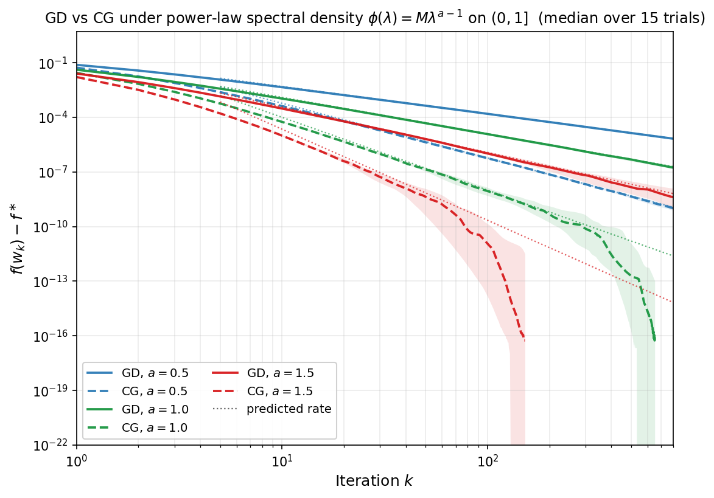

---

## 8. Stochastic Gradient Descent for Least Squares {#sec-8}

All the algorithms studied so far---gradient descent, Chebyshev-accelerated gradient descent, and CG---access the matrix $A$ only through matrix-vector products $v\mapsto Av$. For the canonical least squares problem 

$$\min_{x\in \mathbb{R}^d} f(x):=\tfrac{1}{2n}\|Dx-y\|^2,$$ 

each such matrix vector product requires access to every row of $D\in \mathbb{R}^{n\times d}$ and requires $O(nd)$ basic arithmetic operations. When the dataset is large, this can be prohibitively expensive, and the runtime is dominated by data access rather than by the number of iterations.

The natural alternative is **stochastic gradient descent (SGD)**, which at each step replaces the full gradient by a cheap unbiased estimator computed from a single data point, or a small batch. In this section, we analyze the performance of this algorithm. 

### Setup

Let $(x,y) \in \mathbb{R}^d \times \mathbb{R}$ be drawn from a distribution $\mathcal{D}$. The simplest example is when $\mathcal{D}$ is a uniform distribution over finitely many points.
 and consider the population square loss

$$
L(w) = \tfrac{1}{2}\,\mathbb{E}\bigl[(y - \langle w, x\rangle)^2\bigr], \qquad w \in \mathbb{R}^d.
$$

We define the matrix 

$$
H := \mathbb{E}[xx^\top] \qquad\textrm{and set}\qquad \mu := \lambda_{\min}(H).
$$

We assume $H \succ 0$ throughout the section. As usual, for a vector $u$, we will use the norm $\lVert u\rVert _H^2 := u^\top H u$ induced by $H$. Exactly as in the deterministic least squares problem of [Section 1](part1.html#sec-1) under the identification $A=H$, the excess population risk is the exact quadratic form 

$$L(w) - L(w_\ast) = \tfrac{1}{2}\|w - w_\ast\|_H^2.$$

We impose a single fourth-moment bound on the feature vectors: there is a constant $R > 0$ satisfying the  condition

$$
\mathbb{E}\bigl[\|x\|^2\, xx^\top\bigr] \;\preceq\; R^2\, H. \tag{25}
$$

This section in essence asserts that a type of fourth moment of $x$ is bounded by the second moment. Three standard settings where $(25)$ holds are the following:

1. **Bounded features.** If $\lVert x\rVert  \le R$ almost surely, then $(25)$ holds.
2. **Gaussian features.** If $x \sim \mathcal{N}(0, H)$, then Isserlis' formula gives
$$\mathbb{E}[\|x\|^2\, xx^\top] = (\operatorname{Tr} H)\,H + 2H^2,$$ and therefore $(25)$ holds with $R^2 = \operatorname{Tr} H + 2\lVert H\rVert _{\mathrm{op}} \le 3\operatorname{Tr}(H)$.
3. **Whitened features.** Suppose $x = H^{1/2} z$, where the coordinates of $z$ are i.i.d., centered, have unit variance, and have kurtosis $\kappa = \mathbb{E} z_i^4 < \infty$. Then an elementary algebraic manipulations  give

$$\mathbb{E}[\|x\|^2\, xx^\top] = H^{1/2}\bigl[(\operatorname{Tr} H)\,I + 2H + (\kappa-3)\operatorname{diag}(H)\bigr]H^{1/2},$$

and therefore $(25)$ holds with $R^2 = \operatorname{Tr} H + (\kappa - 1)\lVert H\rVert _{\mathrm{op}}$.

Taking traces in $(25)$ yields $\operatorname{Tr}(H) = \mathbb{E}\lVert x\rVert ^2 \le R^2$, and in particular $H \preceq R^2 I$; thus $R^2$ upper bounds the top eigenvalue of $H$, and will play a role analogous to $\beta$ in [Section 1](part1.html#sec-1).

**Constant-stepsize SGD** is the algorithm

$$
w_t = w_{t-1} + \gamma\,(y_t - \langle w_{t-1}, x_t\rangle)\,x_t, \qquad t=1,2,\ldots, \tag{26}
$$

where $(x_t,y_t)$ are i.i.d. copies of $(x,y)$ and the stepsize satisfies $0 < \gamma < 1/R^2$. In contrast to the deterministic gradient method, the iterates $w_t$ **do not converge** to $w_\ast$; instead they contract exponentially to a **noise floor** proportional to $\gamma$ and oscillate around it. The size of this floor is governed by the covariance of the stochastic gradient at the minimizer. Define

$$
\Sigma := \mathbb{E}\bigl[(y - \langle w_\ast, x\rangle)^2\, xx^\top\bigr],
\quad
\sigma_{\mathrm{MLE}}^2 := \tfrac{1}{2}\operatorname{Tr}(H^{-1}\Sigma),
\quad
\rho_{\mathrm{misspec}} := \frac{d\,\lVert H^{-1/2}\Sigma H^{-1/2}\rVert_{\mathrm{op}}}{\operatorname{Tr}(H^{-1}\Sigma)}.
$$

The misspecification parameter $\rho_{\mathrm{misspec}}$ takes values in $[1,d]$ and measures how far the problem is from well specified. In particular, it equals $1$ in the additive-noise model $y = \langle w_\ast, x\rangle + \eta$ with $\eta$ independent of $x$ and $\mathbb{E}[\eta^2]=\sigma^2$ (since then $\Sigma = \sigma^2 H$). The following theorem quantifies last-iterate behavior of the SGD.

**Theorem 8.1 (Last-iterate constant-stepsize SGD).** *Under assumption $(25)$, strong convexity $H \succeq \mu I$ for some $\mu>0$, and with stepsize $0 < \gamma < 1/R^2$, the iterates $(26)$ satisfy*

$$
\mathbb{E}[L(w_t)] - L(w_\ast) \;\leq\;
\underbrace{e^{-\gamma \mu t}\,R^2\,\lVert w_0-w_\ast\rVert^2}_{\text{bias}}
\;+\;
\underbrace{\frac{\gamma\,\operatorname{Tr}(\Sigma)}{2-\gamma R^2}}_{\text{noise floor}}. \tag{27}
$$

*Proof.* The first-order optimality condition $\nabla L(w_\ast)=0$ reads $\mathbb{E}[(y - \langle w_\ast, x\rangle)x]=0$. Set $e_t := w_t - w_\ast$, $B_t := I - \gamma x_t x_t^\top$, and $\xi_t := -(y_t - \langle w_\ast, x_t\rangle)x_t$. Then  we have $\mathbb{E}[\xi_t]=0$, $\mathbb{E}[\xi_t\xi_t^\top]=\Sigma$, and elementary algebra shows that $(26)$ becomes the recursion

$$
e_t = B_t\,e_{t-1} - \gamma\,\xi_t. \tag{28}
$$ 

Because this recursion is linear, we decompose $e_t = b_t + v_t$ into the *bias process* $b_t$, which propagates the initial error $w_0 - w_\ast$ through the noiseless part of the recursion, and the *variance process* $v_t$, which accumulates the gradient noise $\xi_1,\ldots,\xi_t$ starting from zero:

$$
\begin{aligned}
b_0 &= w_0 - w_\ast, &\qquad b_t &= B_t\,b_{t-1} &&\text{for all } t\geq 1,\\
v_0 &= 0,            &\qquad v_t &= B_t\,v_{t-1} - \gamma\,\xi_t &&\text{for all } t\geq 1.
\end{aligned} \tag{29}
$$

Adding the two recursions gives $b_t + v_t = B_t(b_{t-1} + v_{t-1}) - \gamma\,\xi_t$ with $b_0 + v_0 = w_0 - w_\ast = e_0$, so by induction $e_t = b_t + v_t$ as claimed. Note that $b_t$ depends only on the features $x_1,\ldots,x_t$ (through the contractions $B_s$) and the fixed initial error, while $v_t$ depends on the gradient-noise terms $\xi_1,\ldots,\xi_t$. Note that since $v_0=0$ and $\mathbb{E}[\xi_t]=0$, induction immediately gives $\mathbb{E}[v_t]=0$ for all $t$.

Since $L(w) - L(w_\ast) = \tfrac{1}{2}\lVert w-w_\ast\rVert_H^2$, the elementary inequality $\lVert a+b\rVert_H^2 \le 2\lVert a\rVert_H^2 + 2\lVert b\rVert_H^2$ applied to $e_t = b_t + v_t$ gives

$$
\mathbb{E}[L(w_t)] - L(w_\ast) \;=\; \tfrac{1}{2}\mathbb{E}\lVert e_t\rVert_H^2 \;\leq\; \mathbb{E}\lVert b_t\rVert_H^2 \;+\; \mathbb{E}\lVert v_t\rVert_H^2,
$$

so it suffices to bound the two terms on the right.

**Bias contraction.** Conditioning on the past in the bias recursion and expanding the square yields

$$
\begin{aligned}
\mathbb{E}\bigl[\lVert b_t\rVert^2 \mid b_{t-1}\bigr]
&\;=\;\mathbb{E}\bigl[\lVert (I-\gamma\,xx^{\top})\,b_{t-1}\rVert^2 \mid b_{t-1}\bigr] \\
&\;=\; \lVert b_{t-1}\rVert^2 \;-\; 2\gamma\,b_{t-1}^\top H\,b_{t-1} \;+\; \gamma^2\,b_{t-1}^\top\underbrace{\mathbb{E}[\lVert x\rVert^2\,xx^\top]}_{\preceq\,R^2 H}\,b_{t-1}.
\end{aligned}
$$

Applying the fourth-moment bound $(25)$ in the last term replaces $\mathbb{E}[\lVert x\rVert^2 xx^\top]$ by $R^2 H$ and collapses the two $H$-quadratic forms, giving

$$
\mathbb{E}\bigl[\lVert b_t\rVert^2\mid b_{t-1}\bigr] \;\leq\; \lVert b_{t-1}\rVert^2 \;-\; \gamma\bigl(2 - \gamma R^2\bigr)\,b_{t-1}^\top H\,b_{t-1}.
$$

Since $\gamma R^2 < 1$ gives $2 - \gamma R^2 \ge 1$, and strong convexity $H \succeq \mu I$ gives $b_{t-1}^\top H\,b_{t-1} \ge \mu\,\lVert b_{t-1}\rVert^2$, we obtain the one-step contraction

$$
\mathbb{E}\bigl[\lVert b_t\rVert^2\mid b_{t-1}\bigr] \;\leq\; \lVert b_{t-1}\rVert^2 \;-\; \gamma\,b_{t-1}^\top H\,b_{t-1} \;\leq\; (1 - \gamma\mu)\,\lVert b_{t-1}\rVert^2.
$$

Taking total expectation,  using the tower rule, and iterating from $b_0 = w_0 - w_\ast$, yields

$$
\mathbb{E}\lVert b_t\rVert^2 \;\leq\; (1-\gamma\mu)^t\,\lVert w_0 - w_\ast\rVert^2 \;\leq\; e^{-\gamma\mu t}\,\lVert w_0 - w_\ast\rVert^2.
$$

Finally, combining with the operator bound $H \preceq R^2 I$ (a consequence of $\operatorname{Tr}(H) = \mathbb{E}\lVert x\rVert^2 \le R^2$) converts the $\ell^2$ bound into the $H$-weighted one,

$$
\mathbb{E}\lVert b_t\rVert_H^2 \;=\; \mathbb{E}[b_t^\top H\,b_t] \;\leq\; R^2\,\mathbb{E}\lVert b_t\rVert^2 \;\leq\; R^2\,e^{-\gamma\mu t}\,\lVert w_0 - w_\ast\rVert^2. \tag{30}
$$

**Variance floor.** Set $C_t := \mathbb{E}[v_t v_t^\top]$. Squaring the variance recursion gives

$$
v_t v_t^\top \;=\; B_t\,v_{t-1}v_{t-1}^\top\,B_t^\top \;-\; \gamma\,B_t v_{t-1}\xi_t^\top \;-\; \gamma\,\xi_t v_{t-1}^\top B_t^\top \;+\; \gamma^2\,\xi_t\xi_t^\top.
$$

We claim that the two cross terms have zero mean. The key facts are that $v_{t-1}$ depends only on $(x_1,\xi_1),\dots,(x_{t-1},\xi_{t-1})$ and is therefore independent of the fresh data $(x_t,y_t)$, and that $\mathbb{E}[\xi_t] = \nabla L(w_\ast) = 0$ by definition of $w_\ast$. Conditioning on $v_{t-1}$ and taking the expectation over $(x_t,y_t)$ gives

$$
\begin{aligned}
\mathbb{E}\bigl[B_t\,v_{t-1}\xi_t^\top \,\big|\, v_{t-1}\bigr]
&= \mathbb{E}\bigl[(I-\gamma x_tx_t^\top)\,v_{t-1}\,\xi_t^\top \,\big|\, v_{t-1}\bigr] \\
&= v_{t-1}\,\mathbb{E}[\xi_t]^\top - \gamma\,\mathbb{E}\bigl[x_tx_t^\top v_{t-1}\,\xi_t^\top \,\big|\, v_{t-1}\bigr] \\
&= -\gamma\,\mathbb{E}\bigl[(v_{t-1}^\top x_t)\,x_t\,\xi_t^\top \,\big|\, v_{t-1}\bigr],
\end{aligned}
$$

where the last line uses $\mathbb{E}[\xi_t]=0$ and $x_tx_t^\top v_{t-1}=(v_{t-1}^\top x_t)x_t$. The last line is linear in $v_{t-1}$. Thus taking the outer expectation over $v_{t-1}$ replaces $v_{t-1}$ by $\mathbb{E}[v_{t-1}]=0$. Therefore using the tower rule for expectations we deduce $\mathbb{E}[B_t\,v_{t-1}\xi_t^\top]=0$, as claimed.

Define the covariance $C_t:=\mathbb{E}[v_tv^{\top}_t]$  and the linear operator on matrices $\mathcal M(M) := \mathbb{E}[(I-\gamma xx^\top)\,M\,(I-\gamma xx^\top)]$. Then using the equality $\mathbb{E}[\xi_t\xi_t^\top] = \Sigma$, we obtain the key recursion for the covariance

$$
C_t \;=\; \mathcal{M}(C_{t-1}) + \gamma^2\,\Sigma. \tag{31}
$$

We next show that the sequence $\lbrace C_t\rbrace$ is monotone in the PSD order. To see this, subtracting consecutive copies of $(31)$ gives $C_{t+1} - C_t = \mathcal{M}(C_t - C_{t-1})$. Therefore, by induction starting from $C_1 - C_0 = \gamma^2\Sigma \succeq 0$ and using that $\mathcal{M}$ preserves PSD order, every consecutive difference is PSD and therefore $C_t \preceq C_{t+1}$, as claimed.

Taking traces in $(31)$ and using the identity $\operatorname{Tr}((xx^\top)\,C\,(xx^\top)) = (x^\top Cx)\,\lVert x\rVert^2$ to simplify the resulting fourth-order term gives

$$
\operatorname{Tr}(C_t) \;=\; \operatorname{Tr}(C_{t-1}) \;-\; 2\gamma\,\operatorname{Tr}(HC_{t-1}) \;+\; \gamma^2\,\mathbb{E}\bigl[(x^\top C_{t-1}x)\,\lVert x\rVert^2\bigr] \;+\; \gamma^2\,\operatorname{Tr}(\Sigma).
$$

The fourth-moment bound $(25)$ controls the third term via $\mathbb{E}[(x^\top Cx)\lVert x\rVert^2] = \operatorname{Tr}(C\,\mathbb{E}[\lVert x\rVert^2 xx^\top]) \le R^2\operatorname{Tr}(HC)$. Combined with $\gamma R^2 < 1$, so that $2-\gamma R^2 \ge 1$, and strong convexity $H \succeq \mu I$, so that $\operatorname{Tr}(HC_{t-1}) \ge \mu\operatorname{Tr}(C_{t-1})$, we obtain the one-step contraction

$$
\operatorname{Tr}(C_t) \;\le\; (1-\gamma\mu)\,\operatorname{Tr}(C_{t-1}) \;+\; \gamma^2\,\operatorname{Tr}(\Sigma).
$$

Iterating from $C_0 = 0$ yields

$$
\operatorname{Tr}(C_t) \;=\; \mathbb{E}\lVert v_t\rVert^2 \;\leq\; \frac{\gamma\,\operatorname{Tr}(\Sigma)}{\mu} \qquad\text{for all }t\ge 0.
$$

Taking into account that $C_t$ is nondecreasing in PSD order, we see that $C_t$ lies in the compact set of PSD matrices with trace bounded by $\gamma\operatorname{Tr}(\Sigma)/\mu$.  Therefore the sequence admits a limit point $C_\infty \succeq 0$, and taking the trace and the limit in $(31)$ we deduce that $C_{\infty}$ satisfies

$$
\operatorname{Tr}(C_\infty) \;=\; \operatorname{Tr}(\mathcal{M}(C_\infty)) + \gamma^2\operatorname{Tr}(\Sigma).
$$

Expanding $\mathcal{M}(C_\infty)$ and rearranging yields

$$
2\operatorname{Tr}(HC_\infty) \;=\; \gamma\,\mathbb{E}\bigl[(x^\top C_\infty x)\lVert x\rVert^2\bigr] + \gamma\,\operatorname{Tr}(\Sigma).
$$

The fourth-moment assumption $(25)$ bounds

$$
\mathbb{E}\bigl[(x^\top Cx)\lVert x\rVert^2\bigr] \;=\; \operatorname{Tr}\!\bigl(C\,\mathbb{E}[\lVert x\rVert^2 xx^\top]\bigr) \;\leq\; R^2\operatorname{Tr}(HC),
$$

so $2\operatorname{Tr}(HC_\infty) \le \gamma R^2\operatorname{Tr}(HC_\infty) + \gamma\operatorname{Tr}(\Sigma)$, and rearranging gives $\operatorname{Tr}(HC_\infty) \le \gamma\operatorname{Tr}(\Sigma)/(2-\gamma R^2)$. Since $C_t \preceq C_\infty$ in PSD order and $H \succeq 0$, we deduce

$$
\mathbb{E}\lVert v_t\rVert_H^2 \;=\; \operatorname{Tr}(HC_t) \;\leq\; \operatorname{Tr}(HC_\infty) \;\leq\; \frac{\gamma\,\operatorname{Tr}(\Sigma)}{2 - \gamma R^2}.
$$

Combining the bias and variance bounds yields $(27)$. $\square$

The bound $(27)$ decomposes the excess risk into a **bias** term that contracts at the geometric rate $e^{-\gamma\mu t}$---exactly the rate GD with stepsize $\gamma$ would achieve on a $\mu$-strongly-convex quadratic---and a **noise floor** $\gamma\operatorname{Tr}(\Sigma)/(2-\gamma R^2)$ that is independent of $t$ and proportional to the stepsize. A smaller $\gamma$ lowers the floor but slows the contraction, while a larger $\gamma$ contracts faster to a correspondingly higher floor: a classical bias--variance trade-off that no single constant stepsize can avoid.

**Numerical illustration.** The figure below makes the two phases of $(27)$ visible on the well-specified isotropic Gaussian model $x \sim \mathcal{N}(0, I_d)$, $y = \langle w_\ast, x\rangle + \eta$ with $\eta \sim \mathcal{N}(0,\sigma^2)$, for which $H = I$, $\mu = 1$, $R^2 = d+2$, and $\operatorname{Tr}(\Sigma) = d\sigma^2$. Taking $d=20$, $\sigma=0.3$, $w_0=0$, and stepsizes $\gamma R^2 \in \lbrace 0.2,0.5,0.8\rbrace$, we plot the median over $80$ trials of the single-iterate excess risk $L(w_t)-L(w_\ast)$ together with its $10$--$90\%$ interquantile band, and the asymptotic noise floor $\gamma\operatorname{Tr}(\Sigma)/(2(2-\gamma R^2))$ (dotted), which is the stationary excess risk of SGD on this model and which the bound $(27)$ tracks up to a factor of two. Each run contracts exponentially at rate $e^{-\gamma\mu t}$ until it reaches the stepsize-dependent floor, around which it then oscillates; smaller $\gamma$ gives a lower floor but a slower approach.

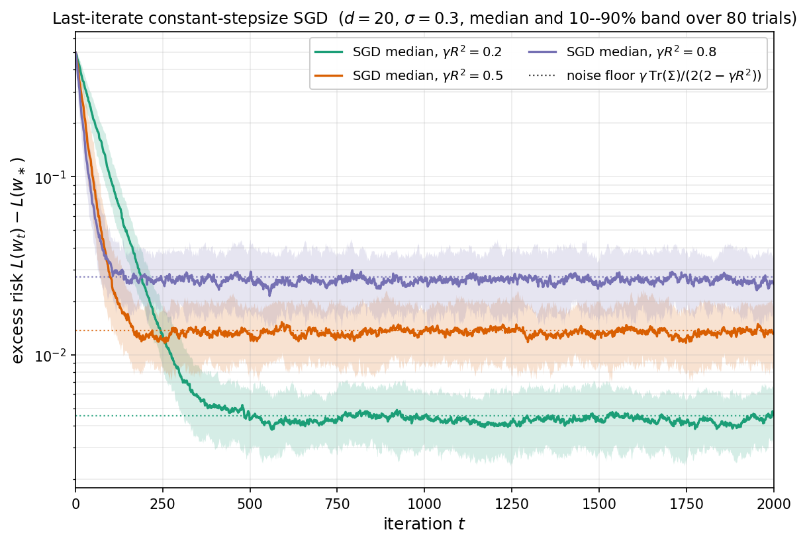

Even though the function values along the last iterate do not converge to the minimal values, we will see now that surprisingly, the function values do converge when measured along the *average iterate*. More precisely, define the **tail average**

$$
\overline{w}_{t:T} \;:=\; \frac{1}{T - t}\sum_{s=t}^{T-1} w_s, \qquad 0 \le t < T.
$$

The cutoff $t$ discards a burn-in phase during which the iterates are still contracting toward $w_\ast$; averaging over $[t,T)$ then suppresses the variance below the floor of Theorem 8.1, as the next result shows.

**Theorem 8.2 (Tail-averaged constant-stepsize SGD).** *Under assumption $(25)$ and with stepsize $0 < \gamma < 1/R^2$, the tail-averaged SGD iterates of $(26)$ satisfy*

$$
\mathbb{E}[L(\overline w_{t:T})] - L(w_\ast)
\;\leq\;
\underbrace{e^{-\gamma \mu t}\,R^2\,\|w_0-w_\ast\|^2}_{\text{bias}}
\;+\;
\underbrace{2\Big(1 + \tfrac{\gamma R^2}{1-\gamma R^2}\,\rho_{\mathrm{misspec}}\Big)\,\frac{\sigma_{\mathrm{MLE}}^2}{T-t}}_{\text{variance}}. \tag{32}
$$

The bound $(32)$ displays the classical bias--variance tradeoff of stochastic least squares. The bias contracts at the linear rate $e^{-\gamma \mu t}$---exactly the GD rate of [Corollary 2.2](part1.html#cor-2-2) with $R^2$ in place of $\beta$---and decays with the *burn-in length* $t$. The variance, in contrast, is independent of the initialization and decays only as $1/(T-t)$ with the *averaging window* $T-t$, matching the statistically optimal rate. Choosing $t$ to be a constant fraction of $T$ (say $t = T/2$) therefore makes the bias negligible and recovers the $O(\sigma_{\mathrm{MLE}}^2/T)$ rate of the MLE.

*Remark.* In the well-specified additive-noise model $y = \langle w_\ast, x\rangle + \eta$, where $\eta$ is independent of $x$ with $\mathbb{E}[\eta]=0$ and $\mathbb{E}[\eta^2]=\sigma^2$, a direct computation gives $\Sigma = \sigma^2 H$, and hence $\sigma_{\mathrm{MLE}}^2 = \tfrac{1}{2}d\sigma^2$ and $\rho_{\mathrm{misspec}} = 1$. After a burn-in that makes the bias negligible, Theorem 8.2 reduces to $\mathbb{E}[L(\overline w_{t:T})] - L(w_\ast) \lesssim d\sigma^2/(T-t)$.

**Numerical illustration.** The figure below separates the two phases predicted by $(32)$ on the well-specified isotropic Gaussian model $x \sim \mathcal{N}(0, I_d)$, $y = \langle w_\ast, x\rangle + \eta$ with $\eta \sim \mathcal{N}(0,\sigma^2)$, taking $d=20$, $\sigma=0.3$, $w_0 = 0$, and stepsize $\gamma = \tfrac{1}{2}/(d+2)$ (so $\gamma R^2 = \tfrac12$). We plot the median over $60$ trials of the last-iterate risk $L(w_t) - L(w_\ast)$ and the tail-averaged risk $L(\overline w_{t/2:t}) - L(w_\ast)$ (shaded bands show the $10$--$90\%$ interquantile range), together with the bound $(32)$ specialized to burn-in $s=t/2$. The last iterate decays exponentially until it hits a noise floor on the order of $\gamma d\sigma^2$ and then stops improving, whereas the tail average keeps decaying at the $1/t$ rate. The theoretical bound $(32)$ upper-bounds the tail-averaged curve across the entire horizon.

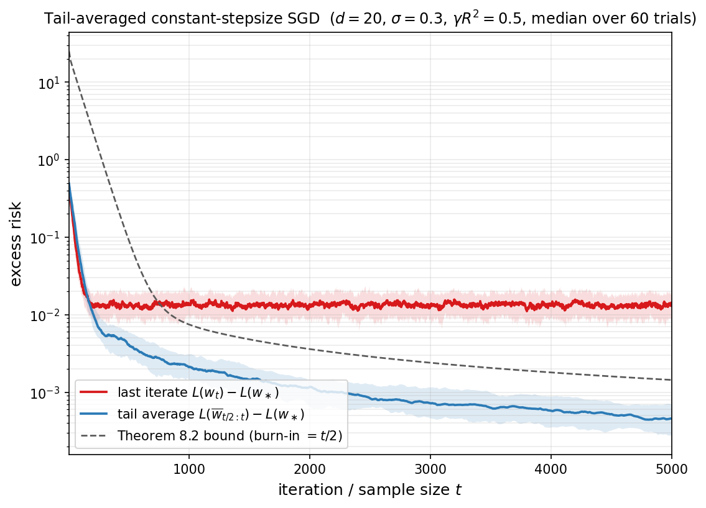

The animation below further visualizes the same comparison in two dimensions, on a fresh least-squares instance with $H = \mathrm{diag}(1, 0.25)$, $w_\ast = (2,-1)$, $w_0 = (-2.5, 2)$, $\sigma = 0.6$, stepsize $\gamma R^2 = 0.5$, and $T = 2000$ iterations (the viewport is zoomed onto $w_\ast$ and only every $100$th iterate is shown). All three methods run in the streaming setting of Theorems 8.1 and 8.2. Let us make the following observations, consistent with Theorems 8.1 and 8.2.

* GD glides smoothly down the contour ellipses and converges to $w_\ast$ at the geometric rate $e^{-\gamma\mu t}$.
* SGD's last iterate contracts at the same geometric rate while it is far from $w_\ast$, but once it reaches a stepsize-dependent neighbourhood it is dominated by the gradient noise and oscillates around $w_\ast$ forever, never improving --- this is precisely the noise floor in Theorem 8.1.
* The tail-averaged green curve smooths out the SGD oscillations and continues to drift toward $w_\ast$ as more iterates are absorbed into the average. By the end of the run it has tightened around $w_\ast$: its excess risk shrinks like $1/(T-t)$ rather than plateauing, exactly as Theorem 8.2 predicts.

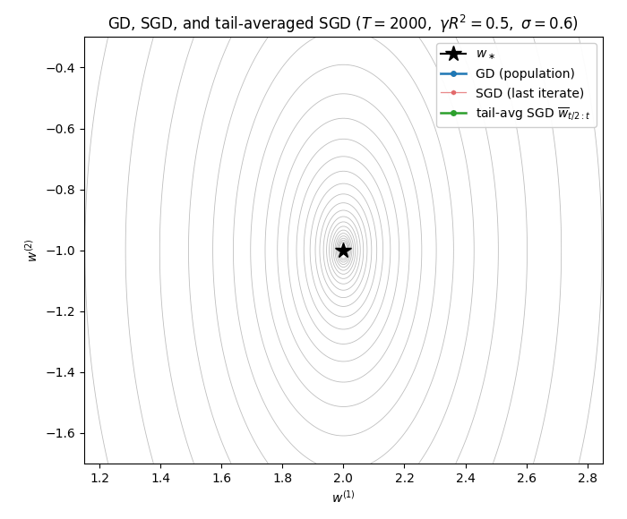

*Proof.* We follow the setup of the proof of Theorem 8.1: the linear error recursion $(28)$, the bias--variance decomposition $(29)$, and the covariance recursion $(31)$. Write $\overline b_{t:T} := \tfrac{1}{T-t}\sum_{s=t}^{T-1} b_s$ and $\overline v_{t:T} := \tfrac{1}{T-t}\sum_{s=t}^{T-1} v_s$ for the tail averages of the bias and variance processes, so that $\overline w_{t:T} - w_\ast = \overline b_{t:T} + \overline v_{t:T}$. The elementary inequality $\lVert a+b\rVert_H^2 \le 2\lVert a\rVert_H^2 + 2\lVert b\rVert_H^2$ then yields

$$
\mathbb{E}[L(\overline w_{t:T})] - L(w_\ast)
\;=\; \tfrac{1}{2}\mathbb{E}\lVert\overline b_{t:T}+\overline v_{t:T}\rVert_H^2
\;\leq\;
\mathbb{E}\lVert\overline b_{t:T}\rVert_H^2 \;+\; \mathbb{E}\lVert\overline v_{t:T}\rVert_H^2. \tag{33}
$$

We now bound each of the two summands.

**Bias contraction.** By Jensen's inequality and the $H$-weighted bias bound $(30)$, we get

$$
\mathbb{E}\lVert\overline b_{t:T}\rVert_H^2 \;\leq\; \frac{1}{T-t}\sum_{s=t}^{T-1}\mathbb{E}\lVert b_s\rVert_H^2 \;\leq\; R^2\,e^{-\gamma\mu t}\,\lVert w_0 - w_\ast\rVert^2. \tag{34}
$$

**Variance averaging in terms of $C_\infty$.** Set $A := I - \gamma H$, so that $0 \preceq A \preceq I$. Iterating the variance recursion in $(29)$ from $s$ to $r$ gives

$$
v_r \;=\; \prod_{u=s+1}^{r}(I-\gamma x_u x_u^\top)\,v_s \;-\; \gamma\sum_{u=s+1}^{r}\Bigl(\prod_{j=u+1}^{r}(I-\gamma x_j x_j^\top)\Bigr)\,\xi_u,
$$

taking expectation conditional on $v_s$ eliminates the second term leaving the expression 

$$\mathbb{E}[v_r\mid v_s]=A^{r-s}v_s.$$

For $r \ge s$, the tower rule then yields the cross-covariance

$$
\mathbb{E}[v_r v_s^\top] \;=\; \mathbb{E}\bigl[\mathbb{E}[v_r\mid v_s]\,v_s^\top\bigr] \;=\; \mathbb{E}\bigl[A^{r-s}v_s v_s^\top\bigr] \;=\; A^{r-s}\,C_s,
$$

where the second equality pulls the $v_s$-measurable factor $v_s^\top$ out of the conditional expectation and the third uses that $A^{r-s}$ is deterministic. For $r < s$, taking the transpose and using that $A = I - \gamma H$ and $C_r$ are symmetric gives $\mathbb{E}[v_r v_s^\top] = (\mathbb{E}[v_s v_r^\top])^\top = (A^{s-r}C_r)^\top = C_r A^{s-r}$. Now split the double sum $\mathbb{E}[\overline v_{t:T}\overline v_{t:T}^\top] = (T-t)^{-2}\sum_{r,s=t}^{T-1}\mathbb{E}[v_r v_s^\top]$ along $r > s$, $r = s$, $r < s$ and reindex each off-diagonal triangle by $\tau := \lvert r-s\rvert$. This produces the diagonal $\sum_s C_s$ and the symmetric off-diagonal contribution $\sum_s\sum_{\tau\ge 1}(A^\tau C_s + C_s A^\tau)$. At $\tau = 0$ the symmetric term $A^\tau C_s + C_s A^\tau$ equals $2C_s$, so extending the inner sum to $\tau \ge 0$ over-counts the diagonal by the PSD quantity $\sum_s C_s$; dropping this over-count yields the PSD upper bound

$$
\mathbb{E}[\overline v_{t:T}\overline v_{t:T}^\top]
\;\preceq\;
\frac{1}{(T-t)^2}\sum_{s=t}^{T-1}\sum_{\tau=0}^{T-1-s}\bigl(A^\tau C_s + C_s A^\tau\bigr).
$$

Taking the $H$-trace and using that $A$ commutes with $H$, every $\operatorname{Tr}(HA^\tau C_s)$ is nonnegative, so we can extend the inner sum to all $\tau \geq 0$. The geometric series sums to $(I-A)^{-1} = (\gamma H)^{-1}$, and using $C_s \preceq C_\infty$ in PSD order we conclude

$$
\mathbb{E}\lVert\overline v_{t:T}\rVert_H^2
\;\leq\;
\frac{2\,\operatorname{Tr}(C_\infty)}{\gamma\,(T-t)}. \tag{35}
$$

**Bounding the stationary covariance.** Recall that the sequence $\lbrace C_t\rbrace$ is monotone in PSD order. Combined with the trace bound $\operatorname{Tr}(C_t) \le \gamma\operatorname{Tr}(\Sigma)/\mu$ from Theorem 8.1, this yields full convergence in $\mathbb{R}^{d\times d}$ to some $C_{\infty}$. To see this, for any $u \in \mathbb{R}^d$, the scalar $u^\top C_t u$ is nondecreasing and bounded, hence convergent. The polarization identity then extends this to convergence of every bilinear form $u^\top C_t v$, and taking $u, v$ to be standard basis vectors shows that $C_t$ converges entrywise to a limit $C_\infty \succeq 0$. Continuity of the linear map $\mathcal{M}$ then lets us pass to the limit in $(31)$ to obtain the matrix fixed-point 

$$C_\infty = \mathcal{M}(C_\infty) + \gamma^2\Sigma,$$ 

Expanding $\mathcal{M}$ and cancelling $C_\infty$ yields the matrix equation

$$
HC_\infty + C_\infty H \;=\; \gamma\,\mathcal{S}(C_\infty) + \gamma\,\Sigma, \qquad \text{where}\quad \mathcal{S}(M) := \mathbb{E}\bigl[(x^\top M x)\,xx^\top\bigr]. \tag{36}
$$

Introduce now the auxiliary operator 

$$\widetilde{\mathcal{T}}(M) := HM + MH - \gamma HMH.$$ 

In particular, we may rewrite $(36)$ as

$$\widetilde{\mathcal{T}}(C_\infty) = \gamma\mathcal{S}(C_\infty) + \gamma\Sigma - \gamma HC_\infty H$$ 

and dropping the last PSD term yields 

$$\widetilde{\mathcal{T}}(C_\infty) \preceq \gamma\mathcal{S}(C_\infty) + \gamma\Sigma.$$

By the helper Lemma 8.3 below (applied with $A = I - \gamma H$), the operator $\widetilde{\mathcal{T}}$ admits the explicit, PSD-monotone inverse

$$
\widetilde{\mathcal{T}}^{-1}(M) \;=\; \gamma\sum_{k\ge 0} A^k\, M\, A^k. \tag{37}
$$

Applying $\widetilde{\mathcal{T}}^{-1}$ to both sides preserves the PSD ordering by Lemma 8.3, and yields

$$
C_\infty \;\preceq\; \underbrace{\gamma\,\widetilde{\mathcal{T}}^{-1}\mathcal{S}(C_\infty)}_{=:\,\mathcal{P}(C_\infty)} + \gamma\,\widetilde{\mathcal{T}}^{-1}(\Sigma). \tag{38}
$$

Define now $\lVert \Sigma\rVert _H := \lVert H^{-1/2}\Sigma H^{-1/2}\rVert _{\mathrm{op}}$ and note that we trivially have $\Sigma \preceq \lVert \Sigma\rVert _H\,H$. From the formula $(37)$ for $\widetilde{\mathcal{T}}^{-1}$ and the fact that $A$ commutes with $H$, we obtain

$$
\widetilde{\mathcal{T}}^{-1}H \;=\; \gamma\sum_{k\ge 0}A^{2k}H \;\preceq\; \gamma\sum_{k\ge 0}A^{k}H \;=\; I,
$$

and applying the PSD-preserving inverse $\widetilde{\mathcal{T}}^{-1}$ from Lemma 8.3 to the inequality $\Sigma \preceq \lVert\Sigma\rVert_H\,H$ gives $\widetilde{\mathcal{T}}^{-1}\Sigma \preceq \lVert \Sigma\rVert _H\,\widetilde{\mathcal{T}}^{-1}H \preceq \lVert \Sigma\rVert _H\,I$. The operator $\mathcal{S}$ is linear and PSD-monotone, so combined with the fourth-moment bound $(25)$, every $M$ with $0 \preceq M \preceq aI$ satisfies $\mathcal{S}(M) \preceq a\,\mathcal{S}(I) \preceq aR^2 H$. Applying the PSD-preserving inverse $\widetilde{\mathcal{T}}^{-1}$ and using the bound $\widetilde{\mathcal{T}}^{-1}H \preceq I$ gives

$$
\mathcal{P}(M) \;=\; \gamma\,\widetilde{\mathcal{T}}^{-1}\mathcal{S}(M) \;\preceq\; a\gamma R^2\,\widetilde{\mathcal{T}}^{-1}H \;\preceq\; a\gamma R^2\,I. \tag{39}
$$

Iterating $(38)$ unfolds $C_\infty$ as

$$
C_\infty \;\preceq\; \mathcal{P}^{k+1}(C_\infty) \;+\; \gamma\sum_{j=0}^{k}\mathcal{P}^{j}\bigl(\widetilde{\mathcal{T}}^{-1}\Sigma\bigr) \qquad \text{for every } k\ge 0,
$$

obtained by applying the PSD-monotone operator $\mathcal{P}$ to $(38)$ and substituting back. The contraction $(39)$ propagates through powers of $\mathcal{P}$.  We apply this in two ways. First, since $C_\infty \preceq \operatorname{Tr}(C_\infty)\,I$, we get

$$
\mathcal{P}^{k+1}(C_\infty) \;\preceq\; \operatorname{Tr}(C_\infty)\,(\gamma R^2)^{k+1}\,I \;\xrightarrow[k\to\infty]{}\; 0,
$$

so the residual term vanishes. Second, since $\widetilde{\mathcal{T}}^{-1}\Sigma \preceq \lVert\Sigma\rVert_H\,I$ from above, the geometric series satisfies

$$
\gamma\sum_{j=0}^{\infty}\mathcal{P}^{j}\bigl(\widetilde{\mathcal{T}}^{-1}\Sigma\bigr) \;\preceq\; \gamma\,\lVert\Sigma\rVert_H\sum_{j=0}^{\infty}(\gamma R^2)^{j}\,I \;=\; \frac{\gamma\,\lVert\Sigma\rVert_H}{1-\gamma R^2}\,I.
$$

Letting $k\to\infty$ therefore yields the crude operator bound

$$
C_\infty \;\preceq\; \frac{\gamma\,\lVert\Sigma\rVert_H}{1 - \gamma R^2}\,I. \tag{40}
$$

To sharpen $(40)$ to a trace bound we plug back into the matrix Lyapunov equation $(36)$. The operator bound $(40)$ together with PSD-monotonicity and linearity of $\mathcal{S}$ gives

$$
\mathcal{S}(C_\infty) \;\preceq\; \frac{\gamma\,\lVert\Sigma\rVert_H}{1-\gamma R^2}\,\mathcal{S}(I) \;\preceq\; \frac{\gamma R^2\,\lVert\Sigma\rVert_H}{1-\gamma R^2}\,H,
$$

where the second inequality is $\mathcal{S}(I) \preceq R^2 H$ from $(25)$. Multiplying $(36)$ on the left by $H^{-1}$ and taking traces, the left-hand side becomes

$$
\operatorname{Tr}\bigl(H^{-1}(HC_\infty + C_\infty H)\bigr) \;=\; \operatorname{Tr}(C_\infty) + \operatorname{Tr}(H^{-1}C_\infty H) \;=\; 2\operatorname{Tr}(C_\infty),
$$

For the right-hand side, $\gamma\operatorname{Tr}(H^{-1}\Sigma)$ stays as is, and the bound on $\mathcal{S}(C_\infty)$ is

$$
\gamma\operatorname{Tr}\bigl(H^{-1}\mathcal{S}(C_\infty)\bigr) \;\leq\; \frac{\gamma^2 R^2\,\lVert\Sigma\rVert_H}{1-\gamma R^2}\,\operatorname{Tr}(H^{-1}H) \;=\; \frac{\gamma^2 R^2\,d\,\lVert\Sigma\rVert_H}{1-\gamma R^2}.
$$

We thus arrive at the estimate

$$
2\operatorname{Tr}(C_\infty)
\;\leq\;
\gamma\operatorname{Tr}(H^{-1}\Sigma) + \frac{\gamma^2 R^2\,d\,\lVert\Sigma\rVert_H}{1-\gamma R^2}.
$$

Substituting into $(35)$ and recognizing $\sigma_{\mathrm{MLE}}^2 = \tfrac12\operatorname{Tr}(H^{-1}\Sigma)$ and $\rho_{\mathrm{misspec}} = d\,\lVert\Sigma\rVert_H/\operatorname{Tr}(H^{-1}\Sigma)$ yields the final variance bound

$$
\mathbb{E}\lVert\overline v_{t:T}\rVert_H^2
\;\leq\;
2\Big(1 + \frac{\gamma R^2}{1-\gamma R^2}\,\rho_{\mathrm{misspec}}\Big)\frac{\sigma_{\mathrm{MLE}}^2}{T-t}. \tag{41}
$$

Combining the bias bound $(34)$ and the variance bound $(41)$ with the decomposition $(33)$ produces $(32)$. $\square$

It remains to record the algebraic fact about $\widetilde{\mathcal{T}}$ used in the proof above.

**Lemma 8.3 (Inverse of $\widetilde{\mathcal{T}}$).** *Let $H$ be a symmetric positive definite matrix and $\gamma > 0$ with $\gamma\lVert H\rVert_{\mathrm{op}} < 1$. Set $A := I - \gamma H$ and define the linear operator on symmetric matrices*

$$\widetilde{\mathcal{T}}(M) := HM + MH - \gamma HMH.$$

*Then $\widetilde{\mathcal{T}}$ is invertible with*

$$\widetilde{\mathcal{T}}^{-1}(M) \;=\; \gamma\sum_{k=0}^{\infty} A^k\, M\, A^k.$$

*Proof.* Expand $A M A = (I-\gamma H)\,M\,(I-\gamma H) = M - \gamma HM - \gamma MH + \gamma^2 HMH$, so that

$$M - AMA \;=\; \gamma\bigl(HM + MH - \gamma HMH\bigr) \;=\; \gamma\,\widetilde{\mathcal{T}}(M). \tag{42}$$

The hypothesis $\gamma\lVert H\rVert_{\mathrm{op}}<1$ together with $H \succ 0$ yields $0 \prec A \prec I$  and therefore the series

$$\Phi(M) \;:=\; \gamma\sum_{k\ge 0}A^k\,M\,A^k$$

converges absolutely. Applying $(42)$ with $M$ replaced by $\Phi(M)$ and reindexing gives the telescoping identity

$$
\widetilde{\mathcal{T}}\bigl(\Phi(M)\bigr) \;=\; \tfrac{1}{\gamma}\bigl(\Phi(M) - A\,\Phi(M)\,A\bigr) \;=\; \sum_{k\ge 0}A^k M A^k - \sum_{k\ge 1}A^k M A^k \;=\; M.
$$

The same calculation with the order of $\Phi$ and $\widetilde{\mathcal{T}}$ reversed gives $\Phi\bigl(\widetilde{\mathcal{T}}(M)\bigr) = M$, so $\Phi = \widetilde{\mathcal{T}}^{-1}$, completing the proof. $\square$

The variance term $\sigma_{\mathrm{MLE}}^2/(T-t)$ in Theorem 8.2 is in fact sharp: no algorithm processing $T$ stochastic samples can do better than the $\sigma^2 d/T$ rate that tail-averaged constant-stepsize SGD already achieves. The matching lower bound, due to Mourtada [Mou22], is proved in §9.

### Mini-batches, saturation, and the critical batch size

In practice each step of $(26)$ is replaced by an average over a small **mini-batch** of $B$ samples. This raises an immediate question: how does the bound of Theorem 8.2 change with $B$, and how large should $B$ be? The answer is essentially read off the variance term, and uncovers the phenomenon of **batch saturation**: once the noise has been driven below the remaining optimization bias, additional samples per step buy nothing. To keep the formulas readable we fix the stepsize at $\gamma R^2 = \tfrac{1}{2}$ throughout this section, so that $\gamma R^2/(1-\gamma R^2) = 1$ and the variance prefactor of $(32)$ collapses to $2(1+\rho_{\mathrm{misspec}})$.

For an integer $B \geq 1$, the mini-batch variant of $(26)$ takes the step

$$
w_t \;=\; w_{t-1} + \frac{\gamma}{B}\sum_{j=1}^{B}\bigl(y_{t,j}-\langle w_{t-1},x_{t,j}\rangle\bigr)\,x_{t,j},
$$

with $(x_{t,j},y_{t,j})$ independent copies of $(x,y)$. Setting

$$
\widehat H_t \;:=\; \frac{1}{B}\sum_{j=1}^{B} x_{t,j}x_{t,j}^{\top}, \qquad \overline\xi_t \;:=\; -\frac{1}{B}\sum_{j=1}^{B}\bigl(y_{t,j}-\langle w_\ast,x_{t,j}\rangle\bigr)\,x_{t,j},
$$

the error $w_t - w_\ast$ obeys the same linear recursion as in $(28)$, with $xx^\top$ replaced by the empirical average $\widehat H_t$ and the noise covariance scaled by $1/B$:

$$
w_t - w_\ast \;=\; (I-\gamma\widehat H_t)\,(w_{t-1}-w_\ast) \;-\; \gamma\,\overline\xi_t, \qquad \mathbb{E}[\widehat H_t] = H, \qquad \mathbb{E}[\overline\xi_t\overline\xi_t^\top] = \tfrac{1}{B}\,\Sigma.
$$

A short calculation, expanding $\widehat H_t^2$ and using independence, shows that the fourth-moment bound $\mathbb{E}[\widehat H_t^2] \preceq R^2 H$ continues to hold with the same constant $R^2$ as in $(25)$. Tracking the $1/B$ factor through the bias--variance proof of Theorem 8.2, and writing $\overline w_{t:T}^{(B)}$ for the resulting tail average, then gives the **mini-batch tail-averaged bound**

$$
\mathbb{E}[L(\overline w_{t:T}^{(B)})] - L(w_\ast) \;\leq\; \underbrace{R^2\,e^{-\gamma\mu t}\,\|w_0-w_\ast\|^2}_{\text{bias}} \;+\; \underbrace{2(1+\rho_{\mathrm{misspec}})\,\frac{\sigma_{\mathrm{MLE}}^2}{B(T-t)}}_{\text{variance}}.
$$

The bias depends only on the number of *parameter updates* $t$, while the variance scales as $1/(B(T-t))$ in the total number of *averaged samples*. The two natural ways of using this bound correspond to the two natural resources in stochastic optimization: parallel time and sample budget.

**Fixed-update regime.** Suppose first that the parallel wall-clock budget $T$ is held fixed, so that a batch of $B$ samples is processed at the same cost as a single sample. The bias is then independent of $B$, while the variance decreases as $1/B$ until it falls below the bias. Equating the two terms at burn-in $t=T/2$ identifies the **critical batch size**

$$
B_{\mathrm{crit}}(T) \;\approx\; \frac{(1+\rho_{\mathrm{misspec}})\,\sigma_{\mathrm{MLE}}^2}{T\,e^{-\gamma\mu T/2}\,R^2\,\|w_0-w_\ast\|^2}.
$$

For $B \ll B_{\mathrm{crit}}(T)$, doubling the batch roughly halves the excess risk; for $B \gg B_{\mathrm{crit}}(T)$ the variance is already negligible and the curve flattens at the deterministic bias level. This is batch saturation.

**Fixed-sample regime.** Suppose now that the total number of samples $N=BT$ is held fixed and the tail window is $t=T/2$, so that $B(T-t) = N/2$. The variance term then collapses to an $O(\sigma_{\mathrm{MLE}}^2/N)$ statistical floor that does not depend on $B$ at all, and only the bias depends on $B$, through $T = N/B$:

$$
\mathbb{E}[L(\overline w_{T/2:T}^{(B)})] - L(w_\ast) \;\leq\; R^2\,\exp\!\Big(-\tfrac{\gamma\mu N}{2B}\Big)\,\|w_0-w_\ast\|^2 \;+\; \frac{4(1+\rho_{\mathrm{misspec}})\,\sigma_{\mathrm{MLE}}^2}{N}.
$$

The largest useful batch is the largest $B$ for which the bias is still on the order of the statistical floor, namely

$$
B \;\lesssim\; \frac{\gamma\mu\,N}{\log\!\Big(\tfrac{R^2\,\|w_0-w_\ast\|^2\,N}{(1+\rho_{\mathrm{misspec}})\,\sigma_{\mathrm{MLE}}^2}\Big)}.
$$

Below this threshold the algorithm is **statistically limited** and any further reduction in error requires more samples; above it the algorithm is **optimization limited**, because too few updates have been spent removing the bias.

**Numerical illustration.** The figure below illustrates both regimes on the same well-specified isotropic Gaussian model used in Theorems 8.1 and 8.2, with $d=20$ and $\sigma=0.3$. For each batch size $B \in \lbrace 1,2,4,\ldots,512\rbrace$ we run constant-stepsize mini-batch SGD with burn-in $t=T/2$ and report the median, with a $10$--$90\%$ interquantile band, of the tail-averaged excess risk $L(\overline w_{T/2:T}^{(B)})-L(w_\ast)$ over $45$ trials. The left panel fixes the number of updates at $T=250$ and shows the fixed-update regime: the variance decays like $1/B$ until the curve flattens at the deterministic bias level around the predicted $B_{\mathrm{crit}}\approx 41$. The right panel fixes the total sample budget at $N=8192$ and shows the fixed-sample regime: the risk is essentially flat for moderate $B$, since the variance depends only on $N$, but rises sharply once $B$ is so large that $T=N/B$ is too small to absorb the bias.

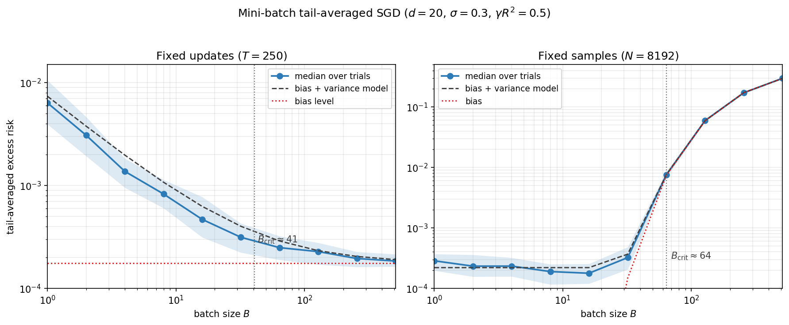

Theorem 8.1 is the classical last-iterate bound for constant-stepsize SGD on least squares and dates back to [RM51,Pol87,KY03]; the streamlined proof via the bias--variance decomposition and a Lyapunov equation for the stationary noise covariance is standard and appears, with variants, in e.g. [BM11, BM13, DB15, JKK+18]. Theorem 8.2 is due to Jain, Kakade, Kidambi, Netrapalli, Pillutla, and Sidford [JKK+18], who established minimax optimality of tail-averaged constant-stepsize SGD for least squares via a Markov-chain/covariance analysis. The matching minimax lower bound that confirms this optimality is the subject of §9.

---

### Interpolation and the randomized Kaczmarz algorithm

Theorems 8.1 and 8.2 expressed the excess risk as a bias plus a noise floor, with the noise floor governed by the residual $y - \langle w_\ast, x\rangle$ at the minimizer. **Interpolation** is the limiting regime in which this residual vanishes:

$$y \;=\; \langle w_\ast, x\rangle \qquad \text{almost surely,}$$

equivalently $\Sigma = \mathbb{E}[(y - \langle w_\ast, x\rangle)^2 xx^\top] = 0$ and $\sigma_{\mathrm{MLE}}^2 = 0$, so the noise floors in $(27)$ and $(32)$ disappear. Theorem 8.1 then specializes to a clean linear-rate statement.

**Corollary 8.4 (SGD on interpolation problems).** *Suppose $y = \langle w_\ast, x\rangle$ almost surely, $H \succeq \mu I$ for some $\mu > 0$, and assumption $(25)$ holds. Then for any $0 < \gamma < 1/R^2$, the constant-stepsize iterates $(26)$ satisfy*

$$\mathbb{E}[L(w_t)] - L(w_\ast) \;\leq\; e^{-\gamma\mu t}\,R^2\,\lVert w_0 - w_\ast\rVert^2.$$

This is a sharp departure from the noisy regime: in interpolation, *constant-stepsize* SGD --- with no averaging, no decreasing stepsize, and no batch growth --- already achieves linear convergence, contracting at the per-step rate $\gamma\mu$, optimized to $\mu/R^2$ at $\gamma = 1/R^2$.

A canonical example is the **discrete consistent linear system**: given $D \in \mathbb{R}^{n\times d}$ with rows $d_1,\ldots,d_n$ and $y \in \mathbb{R}^n$ satisfying $y = D w_\ast$ for some $w_\ast$, Corollary 8.4 governs the constant-stepsize SGD iteration in which $(x,y) = (d_i, y_i)$ is sampled uniformly from $\lbrace 1,\ldots,n\rbrace$. In this setup $H = D^\top D / n$, $\mu = \sigma_{\min}^2(D)/n$, and the smallest valid $R^2$ in $(25)$ is $\max_i \lVert d_i\rVert^2$, so the optimal stepsize $\gamma = 1/R^2$ yields the SGD rate $\sigma_{\min}^2(D)/(n\,\max_i\lVert d_i\rVert^2)$.

A natural question is whether one can do better by exploiting the row geometry. The classical **randomized Kaczmarz** algorithm of Strohmer and Vershynin [SV09] does exactly this: it samples rows with norm-weighted probability and uses a row-adaptive stepsize that performs an exact orthogonal projection at each step.

**Algorithm 2** (Randomized Kaczmarz)

**Input:** $D \in \mathbb{R}^{n\times d}$ with nonzero rows $d_1, \ldots, d_n$, $\;y \in \mathbb{R}^n$, $\;w_0 \in \mathbb{R}^d$

Set $p_i = \lVert d_i\rVert^2 / \lVert D\rVert_F^2$ for $i = 1, \ldots, n$

**For** $t = 0, 1, 2, \ldots$ do:

$\qquad$ sample $i_t \in \lbrace 1, \ldots, n\rbrace$ with probability $p_{i_t}$

$\qquad w_{t+1} = w_t \;+\; \dfrac{y_{i_t} - \langle d_{i_t}, w_t\rangle}{\lVert d_{i_t}\rVert^2}\,d_{i_t}$

Each update can be geometrically understood as an orthogonal projection: $w_{t+1}$ is the closest point to $w_t$ in the affine hyperplane $\lbrace w \in \mathbb{R}^d : \langle d_{i_t}, w\rangle = y_{i_t}\rbrace$. To make the geometry concrete, consider the 2D consistent system with $n=5$ unit-norm rows $d_1,\ldots,d_5 \in \mathbb{R}^2$ and right-hand side $y_i = \langle d_i, w_\ast\rangle$, so that the lines $\ell_i = \lbrace w \in \mathbb{R}^2 : \langle d_i, w\rangle = y_i\rbrace$ all pass through the common point $w_\ast$. Starting from a fixed $w_0$, each Kaczmarz step picks one of the five lines (uniformly, since $\lVert d_i\rVert = 1$) and replaces $w_t$ by its orthogonal projection onto that line. The animation below shows the first $14$ iterations: at each step the chosen line $\ell_{i_t}$ is drawn in red and the dashed arrow traces the projection from $w_t$ to $w_{t+1}$.

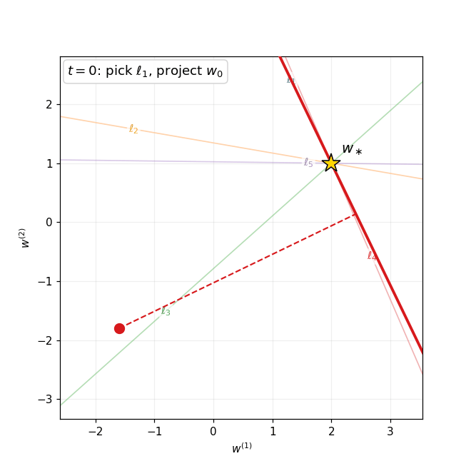

 The following theorem captures the classical convergence guarantee.

**Theorem 8.5 (Strohmer-Vershynin).** *Assume $D \in \mathbb{R}^{n\times d}$ has linearly independent columns and that $y = D w_\ast$. The randomized Kaczmarz iterates of Algorithm 2 satisfy*

$$\mathbb{E}\,\lVert w_t - w_\ast\rVert^2 \;\leq\; \Big(1 - \frac{\sigma_{\min}^2(D)}{\lVert D\rVert_F^2}\Big)^t\,\lVert w_0 - w_\ast\rVert^2.$$

*Proof.* Subtract $w_\ast$ from both sides of the Kaczmarz update and use the equality $y_{i_t} = \langle d_{i_t}, w_\ast\rangle$ to rewrite the residual as $y_{i_t} - \langle d_{i_t}, w_t\rangle = -\langle d_{i_t},\,w_t - w_\ast\rangle$, giving

$$w_{t+1} - w_\ast \;=\; (w_t - w_\ast) \;-\; \frac{\langle d_{i_t},\,w_t - w_\ast\rangle}{\lVert d_{i_t}\rVert^2}\,d_{i_t}.$$

Squaring and expanding yields the estimate

$$\lVert w_{t+1} - w_\ast\rVert^2 \;=\; \lVert w_t - w_\ast\rVert^2 \;-\; 2\,\frac{\langle d_{i_t},\,w_t - w_\ast\rangle^2}{\lVert d_{i_t}\rVert^2} \;+\; \frac{\langle d_{i_t},\,w_t - w_\ast\rangle^2}{\lVert d_{i_t}\rVert^4}\,\lVert d_{i_t}\rVert^2,$$

Combining the cross term and the last term, we therefore arrive at the expression

$$\lVert w_{t+1} - w_\ast\rVert^2 \;=\; \lVert w_t - w_\ast\rVert^2 \;-\; \frac{\langle d_{i_t},\, w_t - w_\ast\rangle^2}{\lVert d_{i_t}\rVert^2}.$$

Taking conditional expectation over $i_t \sim p$, we obtain

$$\mathbb{E}\bigl[\lVert w_{t+1}-w_\ast\rVert^2 \,\big|\, w_t\bigr] \;=\; \lVert w_t - w_\ast\rVert^2 \;-\; \frac{1}{\lVert D\rVert_F^2}\sum_{i=1}^n \langle d_i,\,w_t - w_\ast\rangle^2 \;=\; \lVert w_t - w_\ast\rVert^2 \;-\; \frac{\lVert D(w_t - w_\ast)\rVert^2}{\lVert D\rVert_F^2}.$$

Linear independence of the columns of $D$ yields $\lVert Du\rVert^2 \geq \sigma_{\min}^2(D)\,\lVert u\rVert^2$ for every $u \in \mathbb{R}^d$, so

$$\mathbb{E}\bigl[\lVert w_{t+1}-w_\ast\rVert^2 \,\big|\, w_t\bigr] \;\leq\; \Big(1 - \frac{\sigma_{\min}^2(D)}{\lVert D\rVert_F^2}\Big)\,\lVert w_t - w_\ast\rVert^2.$$

Iterating this one-step contraction from $t=0$ produces the claim. $\square$

**Comparison with SGD.** Writing $\overline{\lVert d\rVert^2} := \tfrac{1}{n}\sum_i\lVert d_i\rVert^2$ for the average squared row norm, the Kaczmarz rate of Theorem 8.5 reads $\sigma_{\min}^2(D)/\lVert D\rVert_F^2 = \sigma_{\min}^2(D)/(n\,\overline{\lVert d\rVert^2})$. Lining this up with the SGD rate derived above, we obtain the comparison

$$\underbrace{\frac{\sigma_{\min}^2(D)}{n\,\max_i\lVert d_i\rVert^2}}_{\text{SGD (uniform sampling)}} \;\leq\; \underbrace{\frac{\sigma_{\min}^2(D)}{n\,\overline{\lVert d\rVert^2}}}_{\text{Kaczmarz}},$$

Note that we are only comparing upper-bounds on performance. Nonetheless, the comparison is meaningful. The difference between the two bound is whether the *worst* or the *average* squared row norm appears in the denominator. The two coincide when all row norms are equal; the Kaczmarz rate dominates by the row-norm spread $\max_i\lVert d_i\rVert^2 / \overline{\lVert d\rVert^2}$, which can be arbitrarily large when the rows are scaled very differently. Behind the gain is a small algorithmic shift: Kaczmarz draws rows with norm-weighted probability rather than uniformly, and uses the row-adaptive stepsize $1/\lVert d_{i_t}\rVert^2$ rather than the global $1/\max_i\lVert d_i\rVert^2$. Together these two adjustments swap $\max_i\lVert d_i\rVert^2$ for $\overline{\lVert d\rVert^2}$ in the per-step contraction.

**Remark (why not just solve a smaller linear subsystem?).** A natural alternative to Kaczmarz is to pick a small subset of $m \geq d$ rows of $D$ and solve the reduced system $D_S w = y_S$ directly. Deterministic row selection is delicate: an arbitrary $d$-row submatrix can have a much smaller minimum singular value than $D$ itself, and finding a *well-conditioned* subset is hard in general (the column-subset-selection problem). The randomized version --- random row sampling --- leads to a different class of techniques called **sketching**. The two techniques are largely complementary. 

**Remark (why not rescale rows and run standard SGD?).** Another tempting reduction is to renormalize each equation, $\tilde d_i := d_i/\lVert d_i\rVert$ and $\tilde y_i := y_i/\lVert d_i\rVert$, so that the rescaled system $\tilde D w = \tilde y$ has unit-norm rows. The rescaling also changes the stepsize prescribed by Theorem 8.1: the smallest valid $R^2$ is now $\tilde R^2 = \max_i\lVert\tilde d_i\rVert^2 = 1$, so the optimal stepsize on the rescaled problem is $\gamma = 1/\tilde R^2 = 1$ rather than the smaller $1/\max_i\lVert d_i\rVert^2$ used on the original. With this prescribed stepsize, standard SGD on $\tilde D w = \tilde y$ produces the update

$$w_{t+1} = w_t + (\tilde y_{i_t} - \langle \tilde d_{i_t}, w_t\rangle)\,\tilde d_{i_t} \;=\; w_t + \frac{y_{i_t} - \langle d_{i_t}, w_t\rangle}{\lVert d_{i_t}\rVert^2}\,d_{i_t},$$

which is the Kaczmarz projection step. Indeed, this is exactly Algorithm 2 applied to the rescaled system $(\tilde D,\tilde y)$, since the norm-weighted distribution $p_i = \lVert\tilde d_i\rVert^2/\lVert\tilde D\rVert_F^2$ collapses to uniform when all rows have unit norm. So the question is *which system one applies the projection update to*: the original $(D,y)$, where the norm-weighted distribution favors long rows, or the rescaled $(\tilde D,\tilde y)$, where every row is sampled equally. The two are different algorithms, and Theorem 8.5 gives correspondingly different rates: $\sigma_{\min}^2(D)/\lVert D\rVert_F^2$ on the original, $\sigma_{\min}^2(\tilde D)/n$ on the rescaled. The rescaling can either improve or degrade $\sigma_{\min}$, so neither variant dominates the other in general.

**Numerical illustration.** The figure below compares the three algorithms above --- uniform-sampling SGD on $D$ with stepsize $\gamma = 1/\max_i\lVert d_i\rVert^2$, uniform-sampling SGD on the row-rescaled system $\tilde D, \tilde y$ with stepsize $\gamma = 1$, and randomized Kaczmarz --- on a synthetic interpolation least-squares instance with $n=500$, $d=50$, and rows $d_i \sim \mathcal{N}(0, I_d)$ rescaled so that the row norms span a multiplicative range of $8$. The right-hand side is $y = D w_\ast$ for a random unit vector $w_\ast$, and all three algorithms start from $w_0 = 0$. Solid curves are the median of $\lVert w_t - w_\ast\rVert^2$ over $25$ trials and the shaded ribbons are the corresponding $10$--$90\%$ interquantile bands. All three curves exhibit linear convergence, with Kaczmarz roughly $6\times$ steeper than the original-scale SGD --- exactly the row-norm spread $\max_i\lVert d_i\rVert^2/\overline{\lVert d\rVert^2}$. On this isotropic example rescaled SGD is in fact slightly faster still, since the rescaling here improves the conditioning of the gram matrix; on other instances the ranking of the green and blue curves can flip.

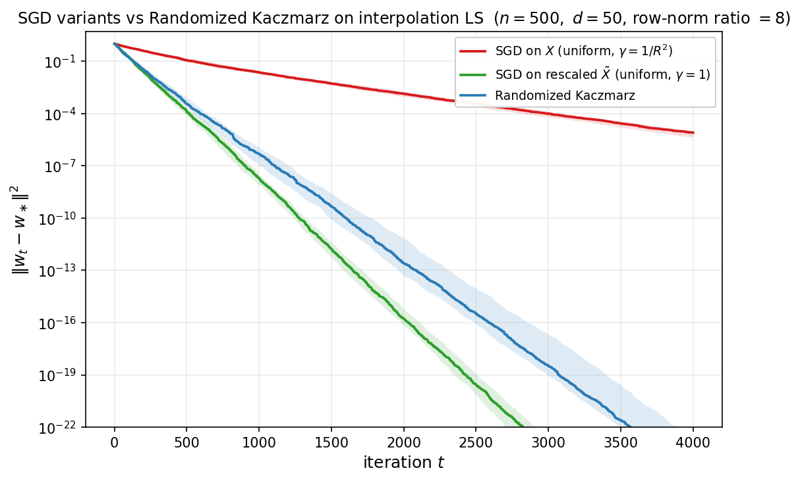

The Kaczmarz method itself, in its deterministic cyclic form, dates back to Kaczmarz [Kac37]. The randomized variant of Algorithm 2 and the geometric rate of Theorem 8.5 are due to Strohmer and Vershynin [SV09]; the connection between Kaczmarz and importance-sampled SGD on interpolation problems was articulated by Needell, Srebro, and Ward [NSW16], and the broader family of randomized iterative methods (block, sketch-and-project, and accelerated variants) is unified by Gower and Richtárik [GR15].

---

## Related Literature {#related}

The results discussed in these notes are largely classical in numerical optimization, Krylov methods, inverse problems, and random matrix theory. The novelty of these notes is mostly **synthesis and alignment of viewpoints**: optimization complexity bounds, Krylov polynomial optimality, source-condition regularity, and random-matrix spectral asymptotics are presented in one unified quadratic framework.

- **Source conditions and spectral-decay rates.** The source-condition framework and decay-dependent rates are standard in inverse problems and regularization theory; see [EHN96, Han95].
- **Marchenko--Pastur asymptotics.** The limiting spectral law is due to [MP67], with modern expositions in [BS10, Ver18].
- **Average-case optimization complexity.** The spectral-integral viewpoint used throughout Section 7 is closely tied to the average-case analysis framework developed by Pedregosa, Scieur, and Paquette and collaborators [PS20, SP20, PvMPP21, CGPSP22]: convergence rates are governed by the limiting spectral density of the Hessian rather than by extremal eigenvalues alone, and the edge/tail behavior of this density determines the asymptotic exponent.
- **Stochastic gradient descent for least squares.** The constant-stepsize, tail-averaged SGD analysis in Section 8 follows the Markov-chain/covariance approach of [JKK+18], which establishes minimax optimality of tail-averaged SGD for the linear regression problem.
- **Interpolation and randomized Kaczmarz.** The randomized Kaczmarz algorithm of Theorem 8.5 is due to Strohmer and Vershynin [SV09], building on the classical cyclic method of Kaczmarz [Kac37]; the connection between Kaczmarz and importance-sampled SGD on interpolation least squares was articulated by Needell, Srebro, and Ward [NSW16], and the broader family of randomized iterative methods is unified by Gower and Richtárik [GR15].

<!--
### How the present results map to the cited literature

The notes combine ideas that appear in different communities; the table below makes this correspondence explicit.

| Result in these notes | Where it appears in the literature | Relation |
|---|---|---|
| Theorem 2.1 + Corollaries 1--2 (GD linear rates on PD quadratics) | [Pol64], [Nes04], [Nes18] | Standard spectral analysis of fixed-step gradient methods on strongly convex smooth quadratics. |
| Theorem 3.1 (Chebyshev stepsizes, $O(\sqrt{\kappa}\ln(1/\varepsilon))$) | [Var62], [You71], [Saa03] | Classical Chebyshev semi-iterative acceleration and minimax polynomial construction on $[\alpha,\beta]$. |
| Theorems 3--4 (Krylov optimality and CG correctness) | [HS52], [Lan52], [Saa03], [Gre97] | Canonical Krylov-space characterization: CG realizes the polynomial/Krylov minimizer with three-term recurrences. |
| Theorems 5--7 (PSD regime: $O(1/k)$ for GD, $O(1/k^2)$ for Chebyshev/CG) | [Saa03], [EHN96], [Han95] | Same polynomial-filter mechanism appears in semi-iterative and regularization analyses when small eigenvalues dominate. |
| Theorem 7.1 (source condition exponent $1+2s$) | [EHN96], [Han95] | Matches the inverse-problem viewpoint: smoothness/source conditions convert spectral decay assumptions into algebraic convergence exponents. |
| Theorem 7.2 (power-law spectral density) | [EHN96], [BS10], [Ver18], [PS20], [CGPSP22] | Beta-function evaluation of the spectral integral under power-law density $\phi(\lambda)=M\lambda^{a-1}$; yields precise asymptotics for GD. Specialises the average-case framework of [PS20] and the "only tails matter" universality of [CGPSP22] to first-order GD, where the soft-edge exponent $a$ at $\lambda=0$ sets the rate. |
| Theorem 7.3 (Laplace edge correction) | [BS10], [Ver18], [CGPSP22] | Uses edge asymptotics of spectral integrals; the $k^{-(p+1)}$ correction reflects local density behavior near the spectral edge and is the GD analogue of the edge-driven asymptotics identified in [CGPSP22]. |
| Marchenko--Pastur subsection | [MP67], [BS10], [Ver18], [PS20], [PvMPP21] | Imports MP density/edge behavior into the optimization bounds, yielding regime-dependent prefactors and the $k^{-3/2}$ edge signature. [PS20] derives the matching Nesterov-type average-case rates by designing momentum schemes tuned to the MP density, and [PvMPP21] establishes universality of the halting-time asymptotics under MP. |
| Theorem 7.4 (Constrained min-norm polynomial via orthonormal basis) | [Sze39], [Saa03], [Gre97] | Standard orthogonal-polynomial solution of the one-point-constrained $L^2$ minimization; supplies the abstract tool used in Theorems 7.5--7.6. |
| Theorem 7.5 (CG on Marchenko--Pastur) | [Saa03], [Gre97], [PS20], [SP20], [PvMPP21] | Closed-form CG asymptotics on MP via the Chebyshev-second-kind reproducing kernel; the $k^{-3}$ exponent matches the average-case complexity of Polyak/Nesterov momentum [PS20, SP20] and the universality analysis of [PvMPP21], derived by Stieltjes-transform methods. |
| Theorem 7.6 (CG on power-law spectral density) | [Sze39], [Saa03], [Gre97], [CGPSP22] | Reproducing-kernel CG bound under power-law $\phi(\lambda)=M\lambda^{a-1}$, computed via Jacobi $P_j^{(0,a)}$ as the orthonormal basis on the rescaled interval; doubles the GD exponent of Theorem 7.2 from $a+1$ to $2(a+1)$ and specialises the "tail-driven" average-case rates of [CGPSP22] to the CG/Krylov setting. |
-->

### References {#references}

- [EHN96] Engl, H. W., Hanke, M., and Neubauer, A. (1996). *Regularization of Inverse Problems*. Kluwer.
- [Han95] Hanke, M. (1995). *Conjugate Gradient Type Methods for Ill-Posed Problems*. Longman.
- [MP67] Marchenko, V. A., and Pastur, L. A. (1967). *Distribution of eigenvalues for some sets of random matrices*. Mathematics of the USSR-Sbornik.
- [BS10] Bai, Z. D., and Silverstein, J. W. (2010). *Spectral Analysis of Large Dimensional Random Matrices* (2nd ed.). Springer.
- [Ver18] Vershynin, R. (2018). *High-Dimensional Probability*. Cambridge University Press.
- [PS20] Pedregosa, F., and Scieur, D. (2020). *Acceleration through spectral density estimation*. Proceedings of the 37th International Conference on Machine Learning, PMLR 119:7553--7562. arXiv:2002.04756.
- [SP20] Scieur, D., and Pedregosa, F. (2020). *Universal Average-Case Optimality of Polyak Momentum*. Proceedings of the 37th International Conference on Machine Learning, PMLR 119:8565--8572. arXiv:2002.04664.
- [PvMPP21] Paquette, C., van Merriënboer, B., Paquette, E., and Pedregosa, F. (2021). *Halting Time is Predictable for Large Models: A Universality Property and Average-case Analysis*. arXiv:2006.04299.
- [CGPSP22] Cunha, L., Gidel, G., Pedregosa, F., Scieur, D., and Paquette, C. (2022). *Only Tails Matter: Average-Case Universality and Robustness in the Convex Regime*. Proceedings of the 39th International Conference on Machine Learning, PMLR 162:4474--4491. arXiv:2206.09901.
- [Sze39] Szegő, G. (1939). *Orthogonal Polynomials*. American Mathematical Society Colloquium Publications, vol. 23.
- [RM51] Robbins, H., and Monro, S. (1951). *A stochastic approximation method*. Annals of Mathematical Statistics, 22(3):400--407.
- [Pol87] Polyak, B. T. (1987). *Introduction to Optimization*. Optimization Software, Inc.
- [KY03] Kushner, H. J., and Yin, G. G. (2003). *Stochastic Approximation and Recursive Algorithms and Applications* (2nd ed.). Springer.
- [BM11] Bach, F., and Moulines, E. (2011). *Non-asymptotic analysis of stochastic approximation algorithms for machine learning*. NeurIPS 2011.
- [BM13] Bach, F., and Moulines, E. (2013). *Non-strongly-convex smooth stochastic approximation with convergence rate $O(1/n)$*. NeurIPS 2013. arXiv:1306.2119.
- [DB15] Défossez, A., and Bach, F. (2015). *Averaged least-mean-squares: bias-variance trade-offs and optimal sampling distributions*. AISTATS 2015. arXiv:1412.6603.
- [JKK+18] Jain, P., Kakade, S. M., Kidambi, R., Netrapalli, P., Pillutla, V. K., and Sidford, A. (2018). *A Markov Chain Theory Approach to Characterizing the Minimax Optimality of Stochastic Gradient Descent (for Least Squares)*. arXiv:1710.09430.
- [Mou22] Mourtada, J. (2022). *Exact minimax risk for linear least squares, and the lower tail of sample covariance matrices*. Annals of Statistics, 50(4):2157--2178. arXiv:1912.10754.
- [Kac37] Kaczmarz, S. (1937). *Angenäherte Auflösung von Systemen linearer Gleichungen*. Bulletin International de l'Académie Polonaise des Sciences et des Lettres A, 35:355--357.
- [SV09] Strohmer, T., and Vershynin, R. (2009). *A randomized Kaczmarz algorithm with exponential convergence*. Journal of Fourier Analysis and Applications, 15(2):262--278.
- [NSW16] Needell, D., Srebro, N., and Ward, R. (2016). *Stochastic gradient descent, weighted sampling, and the randomized Kaczmarz algorithm*. Mathematical Programming, 155(1):549--573.
- [GR15] Gower, R. M., and Richtárik, P. (2015). *Randomized iterative methods for linear systems*. SIAM Journal on Matrix Analysis and Applications, 36(4):1660--1690.
- [Mah11] Mahoney, M. W. (2011). *Randomized algorithms for matrices and data*. Foundations and Trends in Machine Learning, 3(2):123--224.
- [Woo14] Woodruff, D. P. (2014). *Sketching as a tool for numerical linear algebra*. Foundations and Trends in Theoretical Computer Science, 10(1--2):1--157.

---

## Summary {#summary}

**Spectral structure** (Section 7):

| Setting | Assumption | GD rate | CG rate |
|---------|-----------|---------|---------|
| Source condition, order $s$ | $e_0 = A^s w$ | $O(k^{-(1+2s)})$ | --- |
| Power-law model $(\alpha,\beta)$ | $\lambda_i \sim i^{-\alpha}$, $\delta_i \sim i^{-\beta/2}$ | $\Theta(k^{-(\alpha+\beta-1)/\alpha})$ | --- |
| Power-law density (Theorems 7.2, 7.6) | $\phi(\lambda)=M\lambda^{a-1}$ on $(0,\beta]$, $a>-1$ | $\Theta(k^{-(a+1)})$ | $O(k^{-2(a+1)})$ |
| PD, edge exponent $p$ | $\phi(\lambda) \sim (\lambda-\alpha)^p$ | $(1-1/\kappa)^{2k} \cdot O(k^{-(p+1)})$ | --- |
| Marchenko--Pastur | $d/n \to \gamma$ | $\gamma \neq 1$: $(1-\alpha_{\mathrm{eff}}/\beta)^{2k}O(k^{-3/2})$, $\gamma=1$: $O(k^{-3/2})$ | $\gamma=1$: $O(k^{-3})$ (Theorem 7.5) |

---

[← Back to course page](./)
