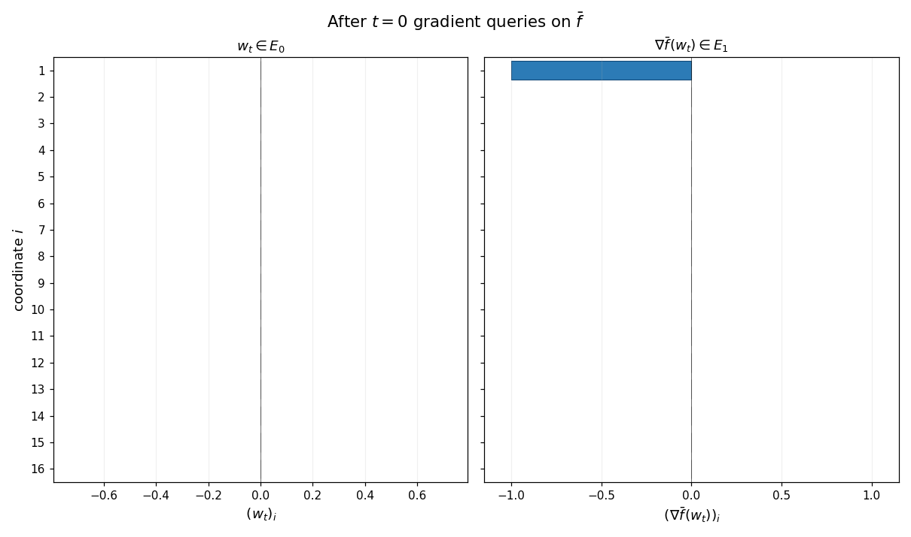
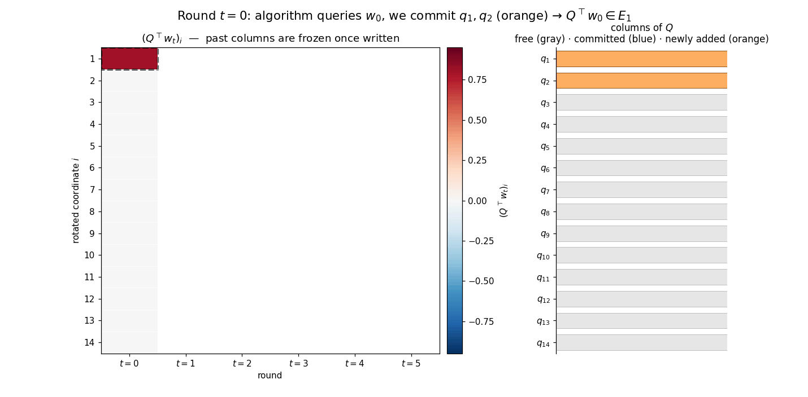

# Convex Quadratics III: Lower Bounds for First-Order and Stochastic Algorithms

[← Back to course page](./)

**Lecture notes on convex quadratics:** [Part I (§1–6)](part1.html) · [Part II (§7–8)](part2.html) · **Part III (§9)** · [Part IV (§10)](part4.html)

---

This is Part III of the lecture notes on optimization algorithms for convex quadratics. The problem setup and notation are introduced in [Part I](part1.html#sec-1).

### Contents

- [9. Lower Bounds for First-Order and Stochastic Algorithms](#sec-9)
- [Related Literature](#related)
- [References](#references)

---

## 9. Lower Bounds for First-Order and Stochastic Algorithms {#sec-9}

This section establishes that the upper bounds developed in [Sections 2--4](part1.html#sec-2) and [Section 8](part2.html#sec-8) are sharp, by exhibiting matching lower bounds in two settings of interest. The first is the **deterministic optimization** setting of [Sections 2--4](part1.html#sec-2): we close the loophole left by the polynomial/Krylov framework, which only constrains methods whose iterates lie in $x_0 + \mathcal{K}_k(A,r_0)$, and show that even algorithms allowed to query gradients at arbitrary points cannot beat the Chebyshev/CG rate $O(\sqrt{\kappa}\,\log(1/\varepsilon))$. The hard instance is the tridiagonal **chain quadratic** of Nemirovski and Yudin [NY83]. The second is the **stochastic estimation** setting of [Section 8](part2.html#sec-8): we show that on the well-specified additive-Gaussian-noise least-squares problem, no algorithm processing $T$ samples can extract excess risk smaller than $\sigma^2 d/(2T)$, matching tail-averaged streaming SGD up to an absolute constant. The argument is the elegant Bayesian-Gaussian-prior proof of Mourtada [Mou22].

For the first setting, we restrict to **deterministic first-order algorithms**, by which we mean a procedure $\mathcal{A}$ producing iterates $x_0, x_1, \ldots \in \mathbb{R}^d$ in which $x_0$ is a fixed deterministic vector --- depending on the problem only through known parameters--- and $x_{t+1}$ is a fixed deterministic function of the past gradients $g_0 = \nabla f(x_0), \ldots, g_t = \nabla f(x_t)$. This includes gradient descent with any sequence of stepsizes, conjugate gradients, and indeed any reasonable first-order method.

### Zero-chain quadratics

Write $E_m := \operatorname{span}\lbrace e_1,\dots,e_m\rbrace$ for the span of the first $m$ standard basis vectors of $\mathbb{R}^d$, with the convention $E_0 := \lbrace 0\rbrace$. The structural feature that drives the entire lower-bound argument is the following property of certain convex quadratics, which controls how the support of iterates can grow under first-order queries.

**Definition (Zero-chain quadratic).** A convex quadratic $\bar f : \mathbb{R}^d \to \mathbb{R}$ is called a **zero-chain quadratic** if it satisfies the *chain property*

$$
z \in E_m \quad \Longrightarrow \quad \nabla\bar f(z) \in E_{m+1}, \qquad \forall m = 0, 1, \ldots, d-1.
$$

In words: starting from any vector supported on the first $m$ coordinates, the gradient is supported on the first $m+1$ coordinates. *Each gradient query thus advances the support by at most one new coordinate.*

**Example (Tridiagonal chain quadratic).** The canonical example, due to Nemirovski and Yudin, is the quadratic on $\mathbb{R}^d$

$$
\bar f(z) \;=\; \tfrac{1}{2}\, z^\top T z - e_1^\top z,
$$

where $T \in \mathbb{R}^{d\times d}$ is the symmetric tridiagonal matrix

$$
T \;=\; \begin{pmatrix}
2 & -1 & 0 & \cdots & 0 \\
-1 & 2 & -1 & \ddots & \vdots \\
0 & -1 & 2 & \ddots & 0 \\
\vdots & \ddots & \ddots & \ddots & -1 \\
0 & \cdots & 0 & -1 & 2
\end{pmatrix}.
$$

The matrix $T$ is positive definite, with eigenvalues $\lambda_j(T) = 4\sin^2\bigl(j\pi/(2(d+1))\bigr)$ for $j=1,\ldots,d$, so $\bar f$ has a unique minimizer. This minimizer solves $T z^\ast = e_1$, and the tridiagonal recursion gives the explicit solution

$$
z^\ast_i \;=\; 1 - \frac{i}{d+1}, \qquad i = 1, \ldots, d;
$$

every coordinate of $z^\ast$ is nonzero, with magnitudes decreasing linearly from near $1$ at $i = 1$ to near $0$ at $i = d$. The chain property is immediate from tridiagonality of $T$: the $i$th entry of $\nabla\bar f(z) = Tz - e_1$ depends only on $z_{i-1}, z_i, z_{i+1}$, so a vector supported on the first $m$ coordinates produces a gradient supported on the first $m+1$. Hence $\bar f$ is a zero-chain quadratic.

The animation below shows the chain property at work: gradient descent is run on $\bar f$ from $x_0 = 0$, and at every step the supports of $x_t$ (left panel) and $\nabla\bar f(x_t)$ (right panel) are exactly $\{1,\ldots,t\}$ and $\{1,\ldots,t+1\}$. Untouched coordinates are gray; activated coordinates are blue.

**Example (Rescaling).** The class of zero-chain quadratics is closed under positive scalar rescaling of the input and output: if $\bar f$ is a zero-chain quadratic on $\mathbb{R}^d$ and $\alpha, \gamma > 0$ are any constants, then the rescaled function

$$
f(x) \;:=\; \alpha\,\bar f(\gamma\,x)
$$

is itself a zero-chain quadratic. Indeed, the chain rule gives $\nabla f(x) = \alpha\gamma\,\nabla\bar f(\gamma x)$ and the zero-chain property follows immediately. This closure under rescaling will let us tune the smoothness constant and the initial distance $\lVert x_0 - x^\ast\rVert$ to any prescribed values without losing the chain structure.

If we had a guarantee that the iterates of any deterministic first-order method always satisfied $x_t \in E_{2t+1}$, the chain property would already yield a clean lower bound on $\lVert x_t - x^\ast\rVert$ from the part of the minimizer that the iterate cannot reach. Of course, no such guarantee holds --- a method is free to query off-coordinate points. The next lemma resolves the difficulty: by composing a zero-chain quadratic with a carefully chosen rotation, we force any deterministic first-order method to discover new coordinates two at a time.

### The rotation lemma

**Lemma 9.1 (Rotation neutralizes arbitrary queries).** *Let $\bar f$ be a zero-chain quadratic on $\mathbb{R}^d$, fix $k \ge 0$, and assume $d \ge 2k + 2$. For every deterministic first-order algorithm $\mathcal{A}$ there exists an orthogonal matrix $Q \in \mathbb{R}^{d\times d}$ such that, when $\mathcal{A}$ is run on*

$$
f(x) \;:=\; \bar f(Q^\top x),
$$

*the iterates $x_0, x_1, \ldots, x_k$ produced by $\mathcal{A}$ satisfy*

$$
Q^\top x_t \in E_{2t+1}, \qquad Q^\top \nabla f(x_t) \in E_{2t+2}, \qquad t = 0, 1, \ldots, k.
$$

So although $\mathcal{A}$ is allowed to query *anywhere* in $\mathbb{R}^d$, on the rotated instance its information is forced into the controlled ladder $E_1, E_3, E_5, \ldots$. The proof constructs the columns of $Q$ inductively, exploiting the fact that the algorithm, being deterministic, must commit to its $(t+1)$-st query before seeing how $Q$ is completed past the columns already used.

*Proof.* Write $Q = [q_1, q_2, \ldots, q_d]$, with the columns $q_i$ to be chosen orthonormal. We construct them two at a time, maintaining the invariant

$$
Q^\top x_i \in E_{2i+1}, \qquad Q^\top g_i \in E_{2i+2}, \qquad g_i := \nabla f(x_i),
$$

for every completed round $i$. The animation below previews the construction: each round adds two new columns of $Q$ (orange strip on the right), the rotated iterate $Q^\top x_t$ acquires two new nonzero coordinates (heatmap column), and the rotated representations of earlier iterates remain frozen — the new $q$'s lie in the orthogonal complement of everything queried so far, so $Q^\top x_s$ for $s < t$ is unaffected by extending $Q$.

*Base step ($t = 0$).* The algorithm chooses $x_0$ before any gradients are available, so $x_0$ is a fixed deterministic vector. If $x_0 \neq 0$, choose $q_1 = x_0/\lVert x_0\rVert$; if $x_0 = 0$, choose $q_1$ to be any unit vector. In either case $x_0 \in \operatorname{span}\lbrace q_1\rbrace$, and therefore $Q^\top x_0 \in E_1$. Before the gradient oracle can return $g_0 = \nabla f(x_0) = Q\,\nabla\bar f(Q^\top x_0)$, we also commit $q_2$ to be any unit vector orthogonal to $q_1$. With $q_1, q_2$ fixed, the chain rule gives $Q^\top g_0 = \nabla \bar f(Q^\top x_0)$, and the chain property of $\bar f$ yields $Q^\top g_0 \in E_2$.

*Inductive step.* Suppose the invariant holds for rounds $0, \dots, t$ with $t \le k-1$, and that $q_1, \dots, q_{2t+2}$ have already been fixed. By assumption, $Q^\top x_i \in E_{2i+1}$ and $Q^\top g_i \in E_{2i+2}$ for all $i \le t$, so each of the past oracle answers $g_0, \dots, g_t$ is determined by the columns $q_1,\dots,q_{2t+2}$ alone. How we eventually complete $Q$ on the orthogonal complement of $\operatorname{span}\lbrace q_1,\dots,q_{2t+2}\rbrace$ does not affect any of those answers.

Since $\mathcal{A}$ is deterministic, the next iterate $x_{t+1} = \Phi_{t+1}(g_0, \dots, g_t)$ is a fixed vector of $\mathbb{R}^d$, known to us before any column of $Q$ outside $S_t := \operatorname{span}\lbrace q_1,\dots,q_{2t+2}\rbrace$ is committed. Decompose $x_{t+1}$ into its $S_t$- and $S_t^\perp$-components,

$$
x_{t+1} = P_{S_t} x_{t+1} + \underbrace{P_{S_t^{\perp}} x_{t+1}}_{=:r_{t+1}},
$$

and choose the next basis vector along the orthogonal projection of $x_{t+1}$ onto $S_t^\perp$: if $r_{t+1} \neq 0$, set $q_{2t+3} = r_{t+1}/\lVert r_{t+1}\rVert$; otherwise let $q_{2t+3}$ be any unit vector in $S_t^\perp$. In either case $q_{2t+3} \perp S_t$ and $x_{t+1} \in \operatorname{span}\lbrace q_1,\dots,q_{2t+3}\rbrace$, so $Q^\top x_{t+1} \in E_{2t+3}$.

Next we commit one more column, $q_{2t+4}$, taken to be any unit vector in $S_t^\perp$ orthogonal to $q_{2t+3}$. Such a vector exists because $\dim S_t^\perp = d - (2t+2) \ge 2$ when $t \le k-1$ and $d \ge 2k+2$. With $q_1, \dots, q_{2t+4}$ now committed, the chain rule $\nabla f(x) = Q\,\nabla\bar f(Q^\top x)$ gives $Q^\top g_{t+1} = \nabla\bar f(Q^\top x_{t+1})$. Plugging the containment $Q^\top x_{t+1} \in E_{2t+3}$ into the chain property of $\bar f$ then yields

$$
Q^\top g_{t+1} \in E_{2t+4},
$$

which completes the inductive step. The remaining columns $q_{2k+3}, \dots, q_d$ play no role during the first $k$ rounds and may be completed to an orthonormal basis arbitrarily once the algorithm has terminated. $\square$

Lemma 9.1 is the formal reason that off-Krylov queries do not break worst-case lower bounds. Such queries do break the *literal* claim that all iterates lie in a Krylov subspace, but on a suitably rotated zero-chain quadratic they still uncover new information only one dimension at a time. The lower-bound recipe is therefore:

1. Pick a zero-chain quadratic $\bar f$, possibly after rescaling.
2. Use Lemma 9.1 to reduce any deterministic first-order method on a rotated instance to a *zero-respecting* method on $\bar f$ --- one whose iterates lie in the growing chain of coordinate subspaces $E_1 \subseteq E_3 \subseteq E_5 \subseteq \cdots$.
3. Lower-bound the error of any point supported on only the first $2k+1$ coordinates.

Step 3 is now an explicit calculation on the tridiagonal example.

### The lower bound

**Theorem 9.2 (Lower bound).** *Fix $k \ge 1$ and $\beta, R > 0$, and set $d := 4k+2$. There exist a convex quadratic $f : \mathbb{R}^d \to \mathbb{R}$ with $\lVert\nabla^2 f\rVert_{\mathrm{op}} \le \beta$ and an initialization $x_0$ with $\lVert x_0 - x^\ast\rVert = R$ such that for every deterministic first-order algorithm $\mathcal{A}$ the iterates satisfy*

$$
f(x_k) - f^\ast \;\ge\; \frac{3}{128}\cdot\frac{\beta\,R^2}{(k+1)^2}.
$$

*Proof.* Set $d := 4k+2$ and let $\bar f(z) = \tfrac12 z^\top T z - z^\top e_1$ be the tridiagonal chain quadratic on $\mathbb{R}^d$, with $T$ the tridiagonal Hessian and $z^\ast$ its minimizer. Fix the rescalings

$$
\alpha \;:=\; \frac{\beta\,R^2}{\lVert T\rVert_{\mathrm{op}}\,\lVert z^\ast\rVert^2}, \qquad \gamma \;:=\; \frac{\lVert z^\ast\rVert}{R}.
$$

By the rescaling example, $\tilde f(z) := \alpha\,\bar f(\gamma\,z)$ is itself a zero-chain quadratic. Lemma 9.1 applied to $\tilde f$ therefore furnishes an orthogonal $Q$ such that, when $\mathcal{A}$ is run from $x_0 = 0$ on the hard instance

$$
f(x) \;:=\; \tilde f(Q^\top x) \;=\; \alpha\,\bar f\bigl(\gamma\,Q^\top x\bigr),
$$

the iterates satisfy

$$
Q^\top x_t \;\in\; E_{2t+1}, \qquad \forall\, t = 0, 1, \ldots, k.
$$

This function $f$ has the required parameters: its Hessian is $\alpha\gamma^2\,Q T Q^\top$, so $\lVert\nabla^2 f\rVert_{\mathrm{op}} = \alpha\gamma^2\,\lVert T\rVert_{\mathrm{op}} = \beta$, and its minimizer is $x^\ast = Q\,z^\ast/\gamma$ with $\lVert x_0 - x^\ast\rVert = \lVert z^\ast\rVert/\gamma = R$.

Setting $w := \gamma\,Q^\top x_k \in E_{2k+1}$, we obtain

$$
f(x_k) - f^\ast \;=\; \alpha\,\bigl(\bar f(w) - \bar f^\ast\bigr) \;\ge\; \alpha\,\bigl(\,\textstyle\min_{u \in E_{2k+1}}\,\bar f(u)\, -\, \bar f^\ast\bigr).
$$

The minimizer of $\bar f$ over $E_{2k+1}$ solves the truncated tridiagonal system $T_{2k+1}\,u_{1:2k+1} = e_1$, with explicit solution 

$$u_i = 1 - \frac{i}{2k+2} \qquad\forall i \le 2k+1,$$ 

and $u_i = 0$ otherwise. Since any minimizer of $y$ of a truncated chain satisfies $T_m\,y_{1:m} = e_1$, plugging this expression into $\bar f$ directly shows $\bar f(y) = -\tfrac{1}{2}\,y_1$. Therefore we deduce

$$
\min_{u \in E_{2k+1}} \bar f(u) - \bar f^\ast \;=\; \frac{1}{2}\!\left[\frac{d}{d+1} - \frac{2k+1}{2k+2}\right] \;=\; \frac{d - 2k - 1}{2\,(d+1)(2k+2)} \;=\; \frac{2k+1}{2\,(4k+3)(2k+2)}.
$$

The elementary bounds $\lVert T\rVert_{\mathrm{op}} \le 4$ and 

$$\lVert z^\ast\rVert^2 \;=\; \frac{1}{(d+1)^2}\sum_{i=1}^d i^2 \;=\; \frac{d(2d+1)}{6(d+1)} \;\le\; \frac{d}{3} \;=\; \frac{4k+2}{3}$$

 yield $\alpha \ge 3\,\beta R^2 / (4(4k+2))$. Substituting gives

$$
f(x_k) - f^\ast \;\ge\; \frac{3\,\beta R^2}{4(4k+2)} \cdot \frac{2k+1}{2(4k+3)(2k+2)} \;=\; \frac{3\,\beta R^2}{32\,(4k+3)\,(k+1)} \;\ge\; \frac{3}{128}\cdot\frac{\beta R^2}{(k+1)^2},
$$

as claimed. $\square$

The bound matches the upper bound $\beta R^2/(8k^2)$ of [Theorem 6.2](part1.html#thm-6-2) up to an absolute constant: the $O(\sqrt{\beta R^2/\varepsilon})$ iteration complexity of Chebyshev acceleration and conjugate gradients in the smooth convex regime is therefore optimal among deterministic first-order methods on quadratics, even allowing arbitrary off-Krylov queries.

The hard quadratic and the rotation argument are due to Nemirovski and Yudin [NY83]; modern treatments appear in Nesterov [Nes04, Nes18]. The same chain construction underlies the corresponding lower bounds for general smooth strongly convex and smooth convex minimization beyond the quadratic class, with only minor adjustments to the choice of $T$ and the way the chain quadratic is embedded in $\mathbb{R}^d$.

### Lower bounds with structured spectrum

Theorem 9.2 closes the gap in the *worst case*: no deterministic first-order method beats Chebyshev/CG on every quadratic with $\lVert\nabla^2 f\rVert_{\mathrm{op}} \le \beta$. Recall, however, that [Section 7](part2.html#sec-7) showed that *structured* spectra --- power-law densities $\phi(\lambda) = M\lambda^{a-1}$ and Marchenko--Pastur laws, for instance --- yield much faster CG rates than the worst case allows. A natural question is whether these structured rates are themselves tight against arbitrary deterministic first-order methods.

The answer is that the structured rate is tight: *the same residual polynomial that drives the CG upper bound also certifies a matching lower bound for every deterministic first-order method*, up to a constant shift $k \mapsto 2k+1$. Our goal is to show why this is the case. 

We begin by recalling from [Section 7](part2.html#sec-7) the **spectral measure** $\mu := \sum_{i=1}^d c_i^2\,\delta_{\lambda_i}$ on $[0,\beta]$, where $c_i$ are the coordinates of the initial error $x_0 - x^\ast$ in the eigenbasis of $A$. Rewriting [$(4b)$](part1.html#eq-4b) as an integral against $\mu$ gives the spectral-measure form of the CG identity:

$$
f(x_k^{\mathrm{CG}}) - f^\ast \;=\; \tfrac{1}{2}\min_{\substack{p \in \mathcal{P}_k \\ p(0) = 1}}~\int_0^\beta \lambda\,p(\lambda)^2\,d\mu(\lambda), \tag{61}
$$

We will now show that the conjugate gradient method is optimal in a much stronger sense than the minimax bound we have already proved: the worst-case instance for any deterministic first-order algorithm can be chosen to have *any prescribed spectral measure*.

We will need the following simple helper lemma. We call a tridiagonal matrix $A\in\mathbb{R}^{d\times d}$ *irreducible* if all of its off-diagonal entries are nonzero:

$$
A_{i,i+1} = A_{i+1,i} \ne 0, \qquad \forall\, i = 1, \ldots, d-1.
$$

**Lemma 9.3 (Krylov subspaces of irreducible tridiagonal matrices).** *If $A \in \mathbb{R}^{d \times d}$ is irreducible and tridiagonal, then the Krylov subspace $\mathcal{K}_t(A, e_1)$ coincides with the coordinate subspace $E_t$ for every $t \ge 1$.*

*Proof.* Since $A$ is tridiagonal, the inclusion $A E_m \subset E_{m+1}$ holds, and therefore

$$
\operatorname{span}\{e_1,\, Ae_1,\, \ldots,\, A^{m-1} e_1\} \subset E_m. \tag{62}
$$

Conversely, the $(j+1)$-st coordinate of $A^j e_1$ is

$$
A_{j+1,j}\,A_{j,j-1}\cdots A_{2,1},
$$

which is nonzero by irreducibility. Thus we have $A^j e_1 \in E_{j+1} \setminus E_j$, and by dimension counting the inclusion $(62)$ holds as equality. $\square$

Next, we need the following lemma that constructs an irreducible, positive semidefinite, tridiagonal problem with any prescribed spectral measure.

**Lemma 9.4 (Exact Jacobi realization of a finite measure).** *Consider an atomic measure $\mu = \sum_{i=1}^d w_i\,\delta_{\theta_i}$ with atoms $0 < \theta_1 < \cdots < \theta_d \le \beta$ and weights $w_i > 0$. Then there exist an irreducible, positive-semidefinite, tridiagonal matrix $A \in \mathbb{R}^{d \times d}$ with $\lVert A\rVert_{\mathrm{op}} \le \beta$ and a scalar $\tau > 0$ such that the spectral measure $\mu_{A,x^\ast}$ of the convex quadratic problem with data*

$$
x_0 = 0, \qquad b := \tau e_1, \qquad x^\ast := A^{-1} b,
$$

*coincides exactly with $\mu$.*

*Proof.* Set $M_2 := \int \lambda^2\,d\mu$ and define

$$
d\nu \;:=\; \frac{\lambda^2}{M_2}\,d\mu.
$$

Then $\nu$ is a probability measure supported on the same $d$ atoms as $\mu$. The space $L^2(\nu)$ is simply the $d$-dimensional space of functions on these atoms, and the monomials $1, \lambda, \ldots, \lambda^{d-1}$ span it. Applying Gram--Schmidt to these monomials, we obtain an orthonormal basis

$$
q_0 \equiv 1,\; q_1,\; \ldots,\; q_{d-1},
$$

where $q_i$ has degree exactly $i$ and is orthogonal to every polynomial of degree at most $i-1$.

Let $M_\lambda$ be the operator of multiplication by $\lambda$ on $L^2(\nu)$, and let $A$ be its matrix in the basis $\{q_0, \ldots, q_{d-1}\}$, that is:

$$
A_{ij} \;:=\; \langle q_{i-1},\, \lambda\,q_{j-1}\rangle_{L^2(\nu)}, \qquad i,j = 1, \ldots, d.
$$

The matrix $A$ is symmetric. It is also tridiagonal: if $i > j+1$, then $\lambda\,q_{j-1}$ has degree $j \le i-2$ and is therefore orthogonal to $q_{i-1}$. Symmetry gives the same conclusion when $i < j-1$.

We next show that $A$ is irreducible. Choose each $q_n$ to have positive leading coefficient $\kappa_n > 0$. Comparing leading terms in the expansion of $\lambda\,q_n$ in the orthonormal basis gives

$$
\lambda\,q_n \;=\; \frac{\kappa_n}{\kappa_{n+1}}\,q_{n+1} + \text{lower-degree terms}.
$$

Taking inner products with $q_{n+1}$, we get

$$
A_{n+2,n+1} \;=\; \langle q_{n+1},\, \lambda\,q_n\rangle_{L^2(\nu)} \;=\; \frac{\kappa_n}{\kappa_{n+1}} \;>\; 0.
$$

Thus every off-diagonal entry of $A$ is nonzero.

The spectral bounds are immediate from the multiplication operator. If $p \in L^2(\nu)$ is nonzero, then

$$
\langle p,\, M_\lambda\,p\rangle_{L^2(\nu)} \;=\; \int \lambda\,p(\lambda)^2\,d\nu(\lambda) \;>\; 0,
$$

and, since $\nu$ is supported on $(0, \beta]$,

$$
\langle p,\, M_\lambda\,p\rangle_{L^2(\nu)} \;\le\; \beta\,\lVert p\rVert_{L^2(\nu)}^2.
$$

Hence $A$ is positive definite and $\lVert A\rVert_{\mathrm{op}} \le \beta$.

It remains to identify the spectral measure. For any vector $z$ and any polynomial $p$, the spectral measure of $z$ satisfies

$$
z^\top p(A)\,z \;=\; \int p(\lambda)\,d\mu_{A,z}(\lambda); \tag{63}
$$

this is immediate from an eigenvalue decomposition of $A$. Set $\tau := \sqrt{M_2}$, $b := \tau\,e_1$, and

$$
x^\ast \;:=\; A^{-1} b \;=\; \tau\,A^{-1} e_1.
$$

The vector $e_1$ corresponds to the constant polynomial $q_0 \equiv 1$, and $A$ represents multiplication by $\lambda$. Therefore, for every polynomial $p$, we have

$$
\begin{aligned}
(x^\ast)^\top p(A)\,x^\ast
&= \tau^2\,e_1^\top A^{-1} p(A)\,A^{-1} e_1 \\
&= \tau^2\,\langle 1,\, \lambda^{-1}\,p(\lambda)\,\lambda^{-1}\rangle_{L^2(\nu)} \\
&= \tau^2 \int \lambda^{-2}\,p(\lambda)\,d\nu(\lambda) \\
&= \int p(\lambda)\,d\mu(\lambda).
\end{aligned}
$$

Combining this identity with $(63)$ shows that $\mu_{A,x^\ast}$ and $\mu$ integrate every polynomial in the same way. Since both measures are finite atomic, they are equal. $\square$

We are now ready to prove the optimality of CG. To simplify notation, for a positive measure $\nu$ on $(0,\beta]$, define

$$
\mathcal{E}_t(\nu) \;:=\; \tfrac{1}{2}\min_{\substack{p \in \mathcal{P}_t \\ p(0)=1}}\int_0^\beta \lambda\,p(\lambda)^2\,d\nu(\lambda).
$$

**Theorem 9.5 (Optimality of CG).** *Fix an iteration counter $t \ge 0$, a constant $\beta > 0$, and a finite positive atomic measure $\mu$ on $(0,\beta]$ that has at least $2t+2$ atoms. Then for every deterministic first-order algorithm there exists a convex quadratic problem instance whose spectral error measure $\mu_{A,x^\ast}$ is exactly $\mu$ and whose $t$-th iterate after initialization $x_0 = 0$ satisfies*

$$
f(x_t) - f^\ast \;\ge\; \mathcal{E}_{2t+1}(\mu).
$$

*Proof.* Fix a deterministic first-order algorithm $\mathcal{A}$, and write

$$
\mu \;=\; \sum_{i=1}^d w_i\,\delta_{\lambda_i}, \qquad 0 < \lambda_1 < \cdots < \lambda_d \le \beta, \qquad w_i > 0,
$$

where $d \ge 2t + 2$. Applying Lemma 9.4 to $\mu$, we obtain an irreducible, tridiagonal, positive semidefinite matrix $A$ with $\lVert A\rVert_{\mathrm{op}} \le \beta$, a scalar $\tau > 0$, and the vector $b = \tau e_1$ such that the quadratic

$$
\bar f(z) \;=\; \tfrac{1}{2} z^\top A z - b^\top z
$$

has minimizer $x^\ast = A^{-1}b$ and spectral error measure $\mu_{A,x^\ast} = \mu$.

Moreover $\bar f$ is zero-chain, since tridiagonality gives $A E_m \subset E_{m+1}$ and $b \in E_1$. Applying Lemma 9.1, we deduce that there is an orthogonal matrix $Q$ such that the algorithm $\mathcal{A}$ applied to

$$
f(x) \;=\; \bar f(Q^\top x)
$$

produces iterates satisfying

$$
Q^\top x_s \in E_{2s+1}, \qquad \forall\, s = 0, 1, \ldots, t.
$$

Orthogonal changes of variables preserve the spectral error measure, and therefore the rotated instance $f$ also has spectral error measure $\mu$. Since $2t+1 \le d$ and $b$ is a nonzero multiple of $e_1$, the helper lemma above ensures the equality

$$
E_{2t+1} \;=\; \mathcal{K}_{2t+1}(A, b).
$$

Thus the inclusion $Q^\top x_t \in \mathcal{K}_{2t+1}(A, b)$ holds, and consequently

$$
f(x_t) - f^\ast \;=\; \bar f(Q^\top x_t) - \bar f^\ast \;\ge\; \min_{u \,\in\, \mathcal{K}_{2t+1}(A,b)} \bar f(u) - \bar f^\ast.
$$

Using the Krylov polynomial identity $(61)$ and the equality $\mu_{A,x^\ast} = \mu$, the right-hand side equals $\mathcal{E}_{2t+1}(\mu)$, which completes the proof. $\square$

Let us spell out what the construction gives in two common spectral regimes.

**Example (Atomic power laws).** For $a > -1$ and $d \ge 2t + 2$, set

$$
\mu_d \;=\; \sum_{i=1}^d w_i\,\delta_{\lambda_i}, \qquad \lambda_i \asymp \frac{i}{d}, \qquad w_i \asymp d^{-a}\,i^{a-1}.
$$

Theorem 9.5 gives the lower bound $\mathcal{E}_{2t+1}(\mu_d)$. For $d$ large relative to $t$, the atomic measure $\mu_d$ is a Riemann discretization of the continuum power-law density $\phi(\lambda) = \lambda^{a-1}$ on $(0,1]$, so

$$
\mathcal{E}_{2t+1}(\mu_d) \;\asymp\; \min_{\substack{p \in \mathcal{P}_t \\ p(0)=1}}\; \int \lambda\,p(\lambda)^2\,\lambda^{a-1}\,d\lambda \;\asymp\; t^{-2(a+1)}.
$$

This is exactly the rate established for CG under a power-law spectral density in [Theorem 7.6](part2.html#thm-7-6). Thus the lower bound scales as $t^{-2(a+1)}$, matching the CG upper bound up to the universal $k \leftrightarrow 2k+1$ degree shift.

**Example (Atomic Marchenko--Pastur hard edge).** For $d \ge 2t + 2$, set

$$
\mu_d \;=\; \sum_{i=1}^d w_i\,\delta_{\lambda_i}, \qquad \lambda_i \asymp \left(\frac{i}{d}\right)^{\!2}, \qquad w_i \asymp d^{-1}.
$$

Then $\mu_d([0, s]) \asymp s^{1/2}$, so the continuum hard-edge limit is the power-law case $a = 1/2$. For $d$ large relative to $t$,

$$
\mathcal{E}_{2t+1}(\mu_d) \;\asymp\; \min_{\substack{p \in \mathcal{P}_t \\ p(0)=1}}\; \int \lambda\,p(\lambda)^2\,\lambda^{-1/2}\,d\lambda \;\asymp\; t^{-3}.
$$

This is the $a = 1/2$ specialization of the previous example via [Theorem 7.6](part2.html#thm-7-6), and matches the $k^{-3}$ Marchenko--Pastur CG rate established in [Theorem 7.5](part2.html#thm-7-5). Thus the lower bound scales as $t^{-3}$.

Theorem 9.5 is stated for finite atomic measures, but the natural spectral models in [Section 7](part2.html#sec-7) --- power-law densities and the Marchenko--Pastur law --- are continuous. We now show that this distinction is irrelevant for any fixed iteration counter $t$: for any prescribed positive measure $\mu$ on $(0,\beta]$ and any deterministic first-order algorithm, there is a hard instance in $\mathbb{R}^{2t+2}$ matching the lower bound from Theorem 9.5, with a spectral measure that is indistinguishable from $\mu$ when tested against polynomials of degree at most $4t+3$. This is the content of Theorem 9.7 below.

The construction relies on a classical ingredient: Gauss quadrature. This basic technique, summarized in Lemma 9.6, shows that for any nondegenerate measure $\mu$ on a compact interval, there exists a measure $\mu_N$ **supported only on $N$ points**, such that every polynomial of degree at most $2N-1$ integrates to the same quantity with respect to both $\mu$ and $\mu_N$. In this way, we can reduce a general measure $\mu$ to an atomic measure $\mu_N$ supported on $N \approx t$ points, to which Theorem 9.5 then applies.

**Lemma 9.6 (Gauss quadrature).** *Let $\mu$ be a positive Borel measure on $[0,\beta]$ supported on at least $N+1$ distinct points, with finite moments up to order $2N-1$. Then there exist points $\theta_1 < \cdots < \theta_N$ in the interior of the convex hull of $\mathrm{supp}(\mu)$ and positive weights $w_1,\ldots,w_N > 0$ such that the atomic measure*

$$\mu_N \;:=\; \sum_{j=1}^N w_j\,\delta_{\theta_j} \tag{64}
$$

*agrees with $\mu$ on every polynomial of degree at most $2N-1$:*

$$\int P\,d\mu_N \;=\; \int P\,d\mu \qquad \text{for every } P \in \mathcal{P}_{2N-1}. \tag{$\dagger$}
$$

The measure $\mu_N$ is called the **$N$-point Gauss quadrature rule** for $\mu$. Figure 9.1 illustrates the rule for a Beta-like density: just $N=5$ atoms suffice to reproduce the continuous integral exactly on every polynomial of degree at most $2N-1 = 9$.

![Gauss quadrature for a non-uniform measure on $[0,1]$: left, the continuous density (blue) and the $N=5$ atoms of $\mu_N$ (red stems with heights proportional to the weights $w_j$); right, a test polynomial $P \in \mathcal{P}_9$ together with its values at the Gauss nodes — the continuous integral $\int P\,d\mu$ equals the discrete sum $\sum_j w_j\,P(\theta_j)$ exactly.](figures/gauss_quadrature.png)

*Proof.* We will choose the nodes first, then choose the weights so that all lower-degree polynomials are integrated correctly.

Apply Gram--Schmidt in $L^2(\mu)$ to the monomials $\{1,\lambda,\ldots,\lambda^N\}$, producing orthonormal polynomials $\tilde p_0,\ldots,\tilde p_N$ with $\deg \tilde p_n=n$. This construction is well-defined: after subtracting the projection of $\lambda^n$ onto the lower-degree polynomials, the remaining polynomial cannot have zero $L^2(\mu)$ norm unless it vanishes on $\mathrm{supp}(\mu)$; but a nonzero polynomial of degree at most $n\le N$ cannot vanish on the at least $N+1$ distinct support points of $\mu$. Take the quadrature nodes $\theta_1<\cdots<\theta_N$ to be the roots of $\tilde p_N$.

We claim that these roots are real, simple, and lie in the interior of the convex hull of $\mathrm{supp}(\mu)$. The key point is that $\tilde p_N$ must change sign at least $N$ times across the support of $\mu$. To see this, suppose instead that it changes sign only $m<N$ times. Let $\xi_1<\cdots<\xi_m$ denote the corresponding sign-change locations. Between consecutive $\xi_i$'s, the sign of $\tilde p_N$ is constant, and crossing a $\xi_i$ flips the sign. Hence the polynomial

$$r(\lambda):=\prod_{i=1}^m(\lambda-\xi_i)$$

changes sign at exactly the same locations. After multiplying $r$ by $-1$ if necessary, we therefore have $\tilde p\_N(\lambda)\,r(\lambda)\ge 0$ for every $\lambda\in \mathrm{supp}(\mu)$. Moreover, the product is not identically zero on $\mathrm{supp}(\mu)$: otherwise $\tilde p\_N$ would vanish on all of $\mathrm{supp}(\mu)$ except possibly the $m$ points $\xi\_i$, forcing the degree-$N$ polynomial $\tilde p\_N$ to have too many zeros. Since we have $r\in \mathcal{P}\_m\subseteq \mathcal{P}\_{N-1}$, we get

$$\int \tilde p_N(\lambda)\,r(\lambda)\,d\mu(\lambda)>0,$$

contradicting the orthogonality $\tilde p_N \perp \mathcal{P}_{N-1}$.

Thus $\tilde p_N$ has at least $N$ sign changes on the support. Each sign change gives a distinct real zero, while $\deg \tilde p_N=N$, so these are exactly the $N$ distinct roots of $\tilde p_N$. The roots lie between support points, hence in the interior of the convex hull of $\mathrm{supp}(\mu)$.

Now let $\ell_j$ be the polynomial:

$$\ell_j(\lambda):=\prod_{i\ne j}\frac{\lambda-\theta_i}{\theta_j-\theta_i} \qquad\textrm{and note}\qquad \ell_j(\theta_i)=\mathbf{1}_{i=j},
$$

Define the weights

$$w_j:=\int \ell_j(\lambda)\,d\mu(\lambda).
$$

We claim that these weights give exact integration on $\mathcal{P}\_{2N-1}$. Fix $P\in \mathcal{P}\_{2N-1}$. Since $\tilde p_N$ is a degree-$N$ polynomial, ordinary polynomial long division lets us write $P$ uniquely as

$$
P = \tilde p_N\,s + r, \qquad \deg(s),\,\deg(r) \le N-1.
$$

Here $s$ is the quotient and $r$ is the remainder. This decomposition is useful because the quotient term $\tilde p_N\,s$ contributes nothing to either side of the desired identity. Against $\mu$, it integrates to zero by orthogonality, since $s\in\mathcal{P}\_{N-1}$ and $\tilde p_N$ is orthogonal to $\mathcal{P}\_{N-1}$. Against $\mu_N$, it also integrates to zero because $\mu_N$ is supported exactly on the roots $\theta_j$ of $\tilde p_N$. Therefore, to prove exactness for $P$, it remains only to prove exactness for the lower-degree remainder $r\in\mathcal{P}\_{N-1}$.

Now use the fact that a polynomial of degree at most $N-1$ is completely determined by its values at $N$ distinct points. The Lagrange polynomials $\ell_1,\ldots,\ell_N$ were built precisely for this purpose: $\ell_j(\theta_i)=\mathbf{1}_{i=j}$, so the linear combination

$$\sum_{j=1}^N r(\theta_j)\,\ell_j.
$$

has the same value as $r$ at every node $\theta_i$. Since both sides have degree at most $N-1$, equality at the $N$ distinct nodes forces equality $r=\sum_{j=1}^N r(\theta_j)\,\ell_j$ as polynomials. Therefore

$$
\int r\,d\mu
=\sum_{j=1}^N r(\theta_j)\int \ell_j\,d\mu
=\sum_{j=1}^N r(\theta_j)w_j
=\int r\,d\mu_N.
$$

This proves exactness for the remainder. It remains only to check that the weights are positive. The polynomial $\ell_j-\ell_j^2$ vanishes at every node $\theta_i$, so it is divisible by $\tilde p_N$:

$$\ell_j-\ell_j^2=\tilde p_N\,h_j
$$

for some $h_j\in\mathcal{P}_{N-2}$. Orthogonality again gives $\int \tilde p_N h_j\,d\mu=0$, and therefore

$$w_j=\int \ell_j\,d\mu=\int \ell_j^2\,d\mu>0.
$$

Combining this with the reduction from $P$ to $r$ proves $(\dagger)$. $\square$

Combining the Gauss quadrature reduction of Lemma 9.6 with the atomic optimality result of Theorem 9.5 immediately delivers the general lower bound promised at the start of this subsection.

**Theorem 9.7 (Optimality of CG up to low-degree moments).** *Fix an iteration counter $t \ge 0$, a constant $\beta > 0$, and a positive Borel measure $\mu$ on $(0,\beta]$ supported on at least $2t+3$ distinct points. Then for every deterministic first-order algorithm there exists a convex quadratic problem instance on $\mathbb{R}^{2t+2}$ whose spectral error measure $\mu\_{A,x^\ast}$ agrees with $\mu$ on $\mathcal{P}\_{4t+3}$ and whose $t$-th iterate after initialization $x_0 = 0$ satisfies*

$$
f(x_t) - f^\ast \;\ge\; \mathcal{E}_{2t+1}(\mu).
$$

*Proof.* Fix a deterministic first-order algorithm and set $N := 2t + 2$. By Lemma 9.6, the $N$-point Gauss quadrature rule

$$
\mu_N \;=\; \sum_{j=1}^N w_j\,\delta_{\theta_j}, \qquad 0 < \theta_1 < \cdots < \theta_N \le \beta, \qquad w_j > 0,
$$

agrees with $\mu$ on $\mathcal{P}\_{2N-1} = \mathcal{P}\_{4t+3}$. Applying Theorem 9.5 to $\mu_N$, we obtain a convex quadratic instance on $\mathbb{R}^N$ whose spectral error measure equals $\mu_N$ exactly and whose $t$-th iterate satisfies

$$
f(x_t) - f^\ast \;\ge\; \mathcal{E}_{2t+1}(\mu_N).
$$

For every $p \in \mathcal{P}\_{2t+1}$, the integrand $\lambda\,p(\lambda)^2$ has degree at most $4t+3$, so the moment-matching identity gives $\mathcal{E}\_{2t+1}(\mu_N) = \mathcal{E}\_{2t+1}(\mu)$, completing the proof. $\square$

### A statistical lower bound for stochastic algorithms

We now turn from optimization on a fixed deterministic objective to estimation from noisy stochastic samples. The setting is the streaming least-squares problem of [Section 8](part2.html#sec-8) specialized to the well-specified additive Gaussian noise model

$$
y \;=\; \langle w_\ast, x\rangle + \eta, \qquad \eta \sim \mathcal{N}(0,\sigma^2)\ \text{independent of}\ x.
$$

In this regime $\Sigma = \sigma^2 H$ gives $\sigma_{\mathrm{MLE}}^2 = \tfrac12 d\sigma^2$ and $\rho_{\mathrm{misspec}} = 1$, and the variance bound of [Theorem 8.2](part2.html#thm-8-2) (after a burn-in long enough to eliminate the bias and at $\gamma R^2 = \tfrac12$) reduces to $4d\sigma^2/(T-t)$. We show that this $d\sigma^2/T$ scaling is sharp: no algorithm processing $T$ stochastic samples can achieve lower variance. Tail-averaged constant-stepsize SGD is therefore **minimax-optimal** on the well-specified least-squares problem.

The argument is short and elegant, and adapts Mourtada's [Mou22] fixed-design proof to the streaming setting. Recall that the population least-squares risk is

$$
L(w) \;:=\; \tfrac{1}{2}\,\mathbb{E}_{(x,y)}\!\left[(y - \langle w, x\rangle)^2\right],
$$

minimized at $w_\ast$, and the excess risk decomposes as $L(w) - L(w_\ast) = \tfrac{1}{2}\,\lVert w - w_\ast\rVert_H^2$, where $H := \mathbb{E}[x x^\top]$ is the feature covariance.

We will also use the following elementary fact from Bayesian estimation.

**Lemma 9.8 (Bayes estimator).** *Let $(w, z)$ be a pair of random vectors with $z$ observed and $w$ unknown, and fix a matrix $M \succeq 0$. Among all measurable estimators $a(z)$, the quantity*

$$
\mathbb{E}\,\lVert a(z) - w\rVert_M^2
$$

*is minimized by the conditional expectation $a(z) = \mathbb{E}[w \mid z]$. Moreover, if for each $z$ the conditional density $w \mapsto p(w \mid z)$ is Gaussian, then $\mathbb{E}[w \mid z]$ coincides with the unique maximizer of $w \mapsto p(w \mid z)$.*

*Proof.* Write $m(z) := \mathbb{E}[w \mid z]$. Conditioning on $z$ and expanding the squared $M$-norm gives

$$
\begin{aligned}
\mathbb{E}\!\left[\lVert a(z)-w\rVert_M^2 \mid z\right]
&= \lVert a(z)-m(z)\rVert_M^2 \\
&\qquad + \mathbb{E}\!\left[\lVert m(z)-w\rVert_M^2 \mid z\right],
\end{aligned}
$$

since the cross term has conditional expectation zero. The second term does not depend on $a$, so the first term is minimized by $a(z)=m(z)$. The second claim follows since a Gaussian density is symmetric about its mean, so when $p(\cdot \mid z)$ is Gaussian its unique maximizer is $\mathbb{E}[w \mid z]$. $\square$

**Theorem 9.9 (Minimax lower bound for streaming least squares).** *Fix $T \ge 1$, a noise level $\sigma > 0$, and a distribution on $\mathbb{R}^d$ with positive-definite covariance $H = \mathbb{E}[x x^\top]$. Suppose the well-specified Gaussian-noise model $y = \langle w_\ast, x\rangle + \eta$ with $\eta \sim \mathcal{N}(0, \sigma^2)$ independent of $x$. Then given $T$ iid samples $(x_1, y_1), \ldots, (x_T, y_T)$ and any (possibly randomized) measurable estimator $\hat w = \hat w(x_1, y_1, \ldots, x_T, y_T)$, there exists $w_{\ast}$ satisfying

$$
\mathbb{E}\bigl[L(\hat w) - L(w_\ast)\bigr] \;\ge\; \frac{\sigma^2 d}{2T}.
$$

*Proof.* By the excess-risk identity, $L(\hat w) - L(w_\ast) = \tfrac{1}{2}\,\lVert \hat w - w_\ast\rVert_H^2$, so it suffices to lower bound

$$
\sup_{w_\ast}\,\mathbb{E}\,\lVert \hat w - w_\ast\rVert_H^2.
$$

The supremum over $w_\ast$ is bounded below by the expected error under any prior on $w_\ast$. We choose the Gaussian prior $w_\ast \sim \mathcal{N}\bigl(0, \tfrac{\sigma^2}{T\lambda}\,I_d\bigr)$, with $\lambda > 0$ to be sent to zero at the end of the proof. Stack the samples into the data matrix $X \in \mathbb{R}^{T \times d}$ whose $i$-th row is $x_i^\top$, write $\hat H := \tfrac{1}{T}\,X^\top X$ for the empirical covariance, and set $y := X\,w_\ast + \eta$ with $\eta \sim \mathcal{N}(0, \sigma^2 I_T)$ independent of both $w_\ast$ and $X$.

**Identifying the Bayes estimator.** Set $m(X,y) := \mathbb{E}[w_\ast \mid X, y]$. By Lemma 9.8 applied to the random pair $\bigl(w_\ast,\,(X,y)\bigr)$ with weighting matrix $H$, every estimator $\hat w(X,y)$ satisfies $\mathbb{E}\,\lVert \hat w - w_\ast\rVert_H^2 \ge \mathbb{E}\,\lVert m(X,y) - w_\ast\rVert_H^2$. The conditional density of $w_\ast$ given $(X,y)$ is Gaussian (by Bayes' rule), so Lemma 9.8 also identifies $m(X,y)$ as the maximizer over $w_\ast$ of $p(w_\ast \mid X, y)$. By Bayes' rule, $p(w_\ast \mid X, y) \propto p(y \mid w_\ast, X)\,p(w_\ast)$ as a function of $w_\ast$ (the constant of proportionality $p(y \mid X)$ does not depend on $w_\ast$), and inserting the Gaussian densities $y \mid w_\ast, X \sim \mathcal{N}(X w_\ast, \sigma^2 I_T)$ and $w_\ast \sim \mathcal{N}(0, \tfrac{\sigma^2}{T\lambda} I_d)$ gives, on a log scale,

$$
\log p(w_\ast \mid X, y) \;=\; -\frac{1}{2\sigma^2}\,\lVert y - X\,w_\ast\rVert^2 \;-\; \frac{T\lambda}{2\sigma^2}\,\lVert w_\ast\rVert^2 \;+\; \text{const},
$$

where the constant collects all terms independent of $w_\ast$.

Equivalently, $m(X,y)$ minimizes the ridge cost $\lVert y - X w\rVert^2 + T\lambda\,\lVert w\rVert^2$. Differentiating in $w$ and setting the derivative to zero yields the expression

$$
m(X, y) \;=\; (X^\top X + T\lambda I)^{-1}\,X^\top y \;=\; \tfrac{1}{T}\,(\hat H + \lambda I)^{-1}\,X^\top y.
$$

**Computing the Bayes risk.** Substituting $y = X\,w_\ast + \eta$ and using the identity $(X^\top X + T\lambda I)^{-1}\,X^\top X - I = -T\lambda\,(X^\top X + T\lambda I)^{-1}$ gives the bias–variance decomposition

$$
m(X, y) - w_\ast \;=\; -\lambda\,(\hat H + \lambda I)^{-1}\,w_\ast \;+\; \tfrac{1}{T}\,(\hat H + \lambda I)^{-1}\,X^\top \eta.
$$

We now take the $H$-norm of both sides. Independence of $w_\ast$, $\eta$, and $X$ kills the cross term in $\lVert\,\cdot\,\rVert_H^2$. Computing the two diagonal contributions with $\mathbb{E}[w_\ast w_\ast^\top] = \tfrac{\sigma^2}{T\lambda}\,I$ and $\mathbb{E}[\eta\eta^\top] = \sigma^2 I_T$ yields, after the factorization $\lambda H + H^2 = H(\lambda I + H)$, the estimate

$$
\mathbb{E}_{w_\ast, \eta \mid X}\,\lVert m(X, y) - w_\ast\rVert_H^2 \;=\; \frac{\sigma^2}{T}\,\mathrm{Tr}\!\bigl[(\hat H + \lambda I)^{-1}\, H\bigr].
$$

**Averaging over $X$.** Operator convexity of $M \mapsto M^{-1}$ on $\mathbb{S}^d_{++}$, applied to the random PSD matrix $\hat H + \lambda I$ with mean $H + \lambda I$, gives the operator Jensen inequality

$$
\mathbb{E}_X\!\bigl[(\hat H + \lambda I)^{-1}\bigr] \;\succeq\; (H + \lambda I)^{-1}.
$$

Taking the trace against $H \succ 0$ and letting $\lambda \downarrow 0$ yields

$$
\mathbb{E}_X\,\mathrm{Tr}\!\bigl[(\hat H + \lambda I)^{-1}\, H\bigr] \;\ge\; \mathrm{Tr}\!\bigl[(H + \lambda I)^{-1}\, H\bigr] \;\xrightarrow{\lambda \downarrow 0}\; \mathrm{Tr}\!\bigl[H^{-1}\, H\bigr] \;=\; d.
$$

Inserting the factor of $\tfrac{1}{2}$ from the excess-risk identity completes the proof. $\square$

The matching with [Theorem 8.2](part2.html#thm-8-2) is direct: under the well-specified Gaussian-noise model, the variance term collapses to $4\sigma^2 d/(T-t)$ and the lower bound to $\sigma^2 d/(2T)$, so the two differ only by an absolute constant. No stochastic algorithm processing $T$ samples can beat the $\sigma^2 d/T$ rate of streaming SGD on this problem; in particular, neither tail averaging, mini-batching, nor any more elaborate scheme can extract more than $O(\sigma^2 d/T)$ excess risk.

Theorem 9.9 is the random-design, well-specified Gaussian-noise instance of the classical $\sigma^2 d/n$ minimax bound for linear regression; the elegant Bayesian-Gaussian-prior proof we follow adapts Mourtada's [Mou22] fixed-design argument, with the single extra operator-Jensen step needed to handle a random design.

---

## Related Literature {#related}

The results discussed in these notes are largely classical in numerical optimization, Krylov methods, inverse problems, and random matrix theory. The novelty of these notes is mostly **synthesis and alignment of viewpoints**: optimization complexity bounds, Krylov polynomial optimality, source-condition regularity, and random-matrix spectral asymptotics are presented in one unified quadratic framework.

- **Lower bounds for first-order methods.** The tridiagonal chain quadratic and the rotation argument behind Lemma 9.1 and Theorem 9.2 are due to Nemirovski and Yudin [NY83]; modern textbook treatments appear in Nesterov [Nes04, Nes18]. The same construction yields the matching $\Omega(\sqrt{\kappa}\,\log(1/\varepsilon))$ lower bound for general smooth strongly convex minimization beyond the quadratic class.
- **Lower bounds for stochastic algorithms on least squares.** The matching minimax lower bound in Theorem 9.9 is the well-specified Gaussian-noise instance of the classical $\sigma^2 d/n$ minimax bound for fixed-design linear regression; we follow the elegant Bayesian-Gaussian-prior proof of Mourtada [Mou22].

### References {#references}

- [Nes04] Nesterov, Y. (2004). *Introductory Lectures on Convex Optimization*. Kluwer.
- [Nes18] Nesterov, Y. (2018). *Lectures on Convex Optimization* (2nd ed.). Springer.
- [NY83] Nemirovski, A. S., and Yudin, D. B. (1983). *Problem Complexity and Method Efficiency in Optimization*. Wiley-Interscience.
- [Mou22] Mourtada, J. (2022). *Exact minimax risk for linear least squares, and the lower tail of sample covariance matrices*. Annals of Statistics, 50(4):2157--2178. arXiv:1912.10754.

---

[← Back to course page](./)
