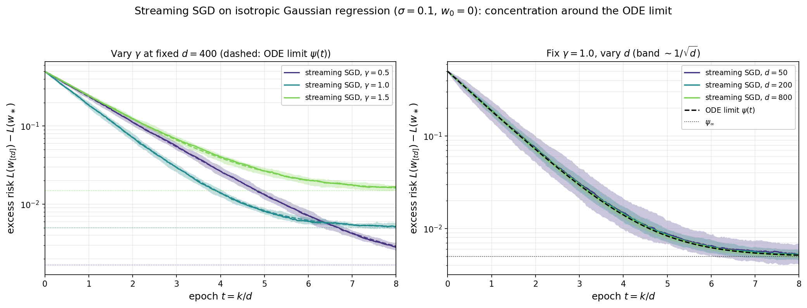
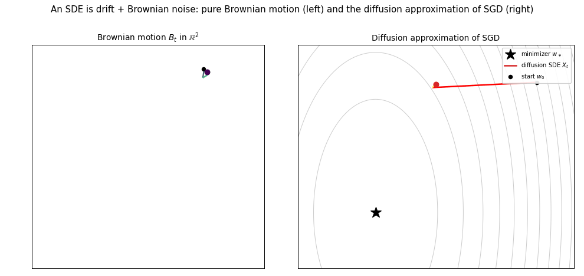
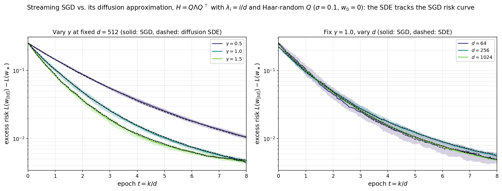
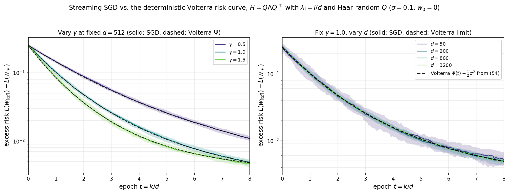
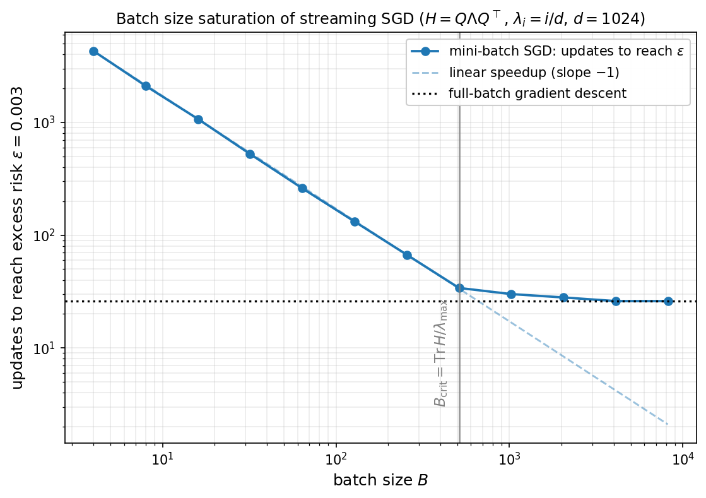

# Convex Quadratics IV: High-Dimensional Limits of Streaming SGD

[← Back to course page](./)

**Lecture notes on convex quadratics:** [Part I (§1–6)](part1.html) · [Part II (§7–8)](part2.html) · [Part III (§9)](part3.html) · **Part IV (§10)**

---

This is Part IV of the lecture notes on optimization algorithms for convex quadratics. The problem setup and notation are introduced in [Part I](part1.html#sec-1).

### Contents

- [10. High-Dimensional Limits of Streaming SGD](#sec-10)
- [Related Literature](#related)
- [References](#references)

---

## 10. High-Dimensional Limits of Streaming SGD {#sec-10}

The last-iterate analysis in [Section 8](part2.html#sec-8) fixed the dimension $d$ and let the number of samples grow. In the well-specified isotropic model, the last iterate contracts geometrically until it reaches a stochastic noise floor whose size is proportional to the stepsize times $d\sigma^2$. Thus, in high dimension, the natural way to keep this floor at constant order is to use a stepsize of size $\gamma/d$. With this scaling, each SGD step makes only an $O(1/d)$ change, so the natural time variable is the **epoch time** $t=k/d$. This section studies precisely this **proportional regime**: $d \to \infty$ with $k = td$ for $t \in [0,\infty)$ fixed. The central phenomenon is that the random last-iterate curve $t \mapsto L(w_{[td]}) - L(w_\ast)$ concentrates as $d \to \infty$ around a deterministic limit. Where [Section 8](part2.html#sec-8) gives a last-iterate rate bound for each fixed $d$, this section identifies the limiting loss trajectory itself, including the transition from bias-dominated behavior to the stochastic noise floor.

Throughout this section we work with streaming SGD as usual: at each step a fresh sample $(x_{k+1}, y_{k+1}) \sim \mathcal{D}$ is drawn iid from the data distribution, and the iterate is updated by

$$
w_{k+1} \;=\; w_k \;-\; \frac{\gamma}{d}\,\bigl(\langle w_k, x_{k+1}\rangle - y_{k+1}\bigr)\,x_{k+1}, \qquad k = 0,1,2,\ldots \tag{43}
$$

This is the streaming least-squares iteration [$(26)$](part2.html#eq-26) with stepsize $\gamma/d$ in place of $\gamma$. As before, we write $H := \mathbb{E}[xx^\top]$ for the feature covariance and $L(w) = \tfrac{1}{2}\mathbb{E}[(y-\langle w,x\rangle)^2]$ for the population loss, minimized at $w_\ast$. We begin by motivating the $1/d$ scaling of the stepsize $\gamma$ and will primarily focus on an isotropic problem where the covariance of the data is identity. This case is amenable to relatively straightforward analysis. The anisotropic case requires much more sophisticated tools and we will comment on it at the end of the section.

### The isotropic problem

Consider the additive-noise model of [Section 8](part2.html#sec-8) with isotropic features: $x \sim \mathcal{N}(0, I_d)$, and noise $\eta \sim \mathcal{N}(0, \sigma^2)$ independent of $x$, with the observation model $y = \langle w_\ast, x\rangle + \eta$ with $\lVert w_\ast\rVert  = 1$. The population loss and its gradient are then clearly

$$
L(w) = \tfrac{1}{2}\bigl(\sigma^2 + \|w-w_\ast\|^2\bigr), \qquad \nabla L(w) = w - w_\ast. \tag{44}
$$

Note that the optimal value is $L_{\ast}=\frac{1}{2}\sigma^2$. The following lemma computes the one-step change of the loss under $(43)$. Henceforth, we let $\mathbb{E}_k[\cdot]$ denote the expectation conditional on the first $k$ samples $(x_1,y_1),\dots,(x_k,y_k)$.

**Lemma 10.1 (One-step update).** *Let $L_\ast := L(w_\ast) = \tfrac{1}{2}\sigma^2$ denote the noise floor. The streaming iterates $(43)$ satisfy*

$$
d\cdot \mathbb{E}_k\bigl[L(w_{k+1}) - L(w_k)\bigr] \;=\; -2\gamma\,\bigl(L(w_k) - L_\ast\bigr) \;+\; \gamma^2\,L(w_k) \;+\; \frac{\rho_k}{d}, \tag{45}
$$

*where $\rho_k$ depends on the iterates only through $L(w_k)$ and satisfies $0\le \rho_k\le 2\gamma^2\,L(w_k)$.*

*Proof.* Define the stochastic gradient $g_{k+1} := (\langle w_k,x_{k+1}\rangle - y_{k+1})\,x_{k+1}$, so that $w_{k+1}=w_k-(\gamma/d)g_{k+1}$. Write $v := w_k-w_\ast$. Since $L(w)=\tfrac{1}{2}\sigma^2+\tfrac{1}{2}\|w-w_\ast\|^2$, the one-step loss change is

$$
\begin{aligned}
L(w_{k+1}) - L(w_k)
&= \frac{1}{2}\left\|v-\frac{\gamma}{d}g_{k+1}\right\|^2 - \frac{1}{2}\|v\|^2 \\
&= -\frac{\gamma}{d}\,\langle v,g_{k+1}\rangle + \frac{\gamma^2}{2d^2}\,\|g_{k+1}\|^2.
\end{aligned}
$$

Thus it remains to compute the conditional first and second moments of $g_{k+1}$. For this, write $x := x_{k+1}$ and $\eta := \eta_{k+1}$ for brevity. Substituting $y_{k+1}=\langle w_\ast,x\rangle+\eta$ into the residual gives

$$
g_{k+1} \;=\; (\langle v, x\rangle - \eta)\,x \;=\; (v^\top x)\,x \;-\; \eta\,x.
$$

The conditional first moment is

$$
\mathbb{E}_k[g_{k+1}] \;=\; \mathbb{E}\bigl[(v^\top x)\,x\bigr] \;-\; \mathbb{E}[\eta\,x] \;=\; \mathbb{E}[xx^\top]\,v \;-\; 0 \;=\; v.
$$

For the conditional second moment, expand

$$
\|g_{k+1}\|^2 \;=\; (v^\top x - \eta)^2\,\|x\|^2 \;=\; (v^\top x)^2\,\|x\|^2 \;-\; 2\eta\,(v^\top x)\,\|x\|^2 \;+\; \eta^2\,\|x\|^2.
$$

The cross term vanishes in expectation by independence of $\eta$ from $x$ combined with $\mathbb{E}[\eta]=0$. The pure-noise term gives $\mathbb{E}[\eta^2\|x\|^2]=\sigma^2\,\mathbb{E}[\|x\|^2]=d\sigma^2$. The remaining quadratic term is computed using the Gaussian fourth-moment identity

$$
\mathbb{E}\bigl[(v^\top x)^2\,\|x\|^2\bigr] \;=\; v^\top\,\mathbb{E}\bigl[\|x\|^2\,xx^\top\bigr]\,v \;=\; (d+2)\,\|v\|^2,
$$

where $\mathbb{E}[\|x\|^2xx^\top]=(d+2)I_d$. Hence

$$
\mathbb{E}_k\bigl[\|g_{k+1}\|^2\bigr] \;=\; (d+2)\,\|v\|^2 \;+\; d\,\sigma^2.
$$

Taking conditional expectations in the loss-increment identity gives

$$
\mathbb{E}_k\bigl[L(w_{k+1})-L(w_k)\bigr] \;=\; -\tfrac{\gamma}{d}\,\|w_k-w_\ast\|^2 \;+\; \tfrac{\gamma^2}{2d^2}\,\bigl((d+2)\,\|w_k-w_\ast\|^2 \;+\; d\,\sigma^2\bigr).
$$

Multiplying by $d$ and rewriting using $\tfrac{1}{2}\|w_k - w_\ast\|^2 = L(w_k) - L_\ast$ and $\tfrac{1}{2}\sigma^2 = L_\ast$ gives

$$
d\,\mathbb{E}_k\bigl[L(w_{k+1})-L(w_k)\bigr]
=(-2\gamma+\gamma^2)\bigl(L(w_k)-L_\ast\bigr)+\gamma^2 L_\ast+\frac{2\gamma^2}{d}\bigl(L(w_k)-L_\ast\bigr).
$$

The first two terms combine into the leading drift $-2\gamma(L(w_k)-L_\ast)+\gamma^2 L(w_k)$, and the last term equals $\rho_k/d$ with $\rho_k=2\gamma^2(L(w_k)-L_\ast)$. It is nonnegative, depends on the iterate only through $L(w_k)$, and since $L_\ast\ge0$ obeys $\rho_k\le 2\gamma^2 L(w_k)$. This is $(45)$. $\square$

Now, the important point is that the right-hand side of $(45)$ depends on the iterate **only through the scalar $L(w_k)$**. Let us see now informally what happens to the dynamics $(45)$ as we let $d$ and $k$ both tend to infinity at a proportional scaling. To this end, define the function $\psi_d(t) := \mathbb{E}[L(w_{[td]})]$ indexed by *epoch time* $t = k/d$. Then taking expectations in $(45)$ and using that the remainder is of order $1/d$ yields the recursion

$$
\psi_d\!\bigl(t + \tfrac{1}{d}\bigr) - \psi_d(t) \;=\; \frac{1}{d}\Bigl(-2\gamma\,\bigl(\psi_d(t) - L_\ast\bigr) + \gamma^2\,\psi_d(t)\Bigr) + O\!\left(\frac{1}{d^2}\right).
$$

Dividing by the time increment $1/d$, the left-hand side is the forward Euler difference quotient for the time derivative $\dot\psi_d(t)$ with step $\Delta t = 1/d$. As $d\to\infty$ this step shrinks to zero and the right-hand side converges to a continuous drift in $\psi$, so the limiting curve $\psi$ solves the one-dimensional ODE

$$
\dot\psi \;=\; -2\gamma\,(\psi - L_\ast) \;+\; \gamma^2\,\psi, \qquad \psi(0) = L(w_0). \tag{46}
$$

In other words, one step of streaming SGD in expectation acts as one Euler step of $(46)$ on the time grid $t_k = k/d$, with a vanishing $O(d^{-1})$ truncation error per step.

The linear ODE $(46)$ has the explicit solution

$$
\psi(t) \;=\; \bigl(L(w_0) - \psi_\infty\bigr)\,e^{-\gamma(2-\gamma)\,t}+\psi_\infty \qquad\textrm{where}\qquad \psi_\infty \;:=\; \frac{\sigma^2}{2-\gamma}. \tag{46a}
$$

Stability and the rate of convergence can be read off directly from the exponent $\gamma(2-\gamma)$. The ODE is stable precisely when $0 < \gamma < 2$, in which case $\psi(t)$ converges to the steady-state loss $\psi_\infty$ at the exponential rate $\gamma(2-\gamma)$, maximized at $\gamma = 1$. The corresponding limiting *excess* risk is $\psi_\infty - L_\ast = \tfrac{\gamma\sigma^2}{2(2-\gamma)}$, and is monotone increasing in $\gamma$ on $(0,2)$ — the familiar bias–variance trade-off: aggressive stepsizes speed up convergence but leave a larger stochastic floor.

The function $\psi(t)$ is the candidate dimension-independent limit of the loss along streaming SGD. It remains to argue that the entire trajectory of the loss (and not just the expectation) is governed by the same ODE.

**Numerical illustration.** The figure below shows two complementary views of streaming SGD on the isotropic Gaussian model with $\sigma = 0.1$ and $w_0 = 0$; in both panels the solid curve is the median excess risk $L(w_{[td]}) - L_\ast$ over independent SGD trials and the shaded ribbon is the corresponding $10$–$90\%$ interquantile band. The **left panel** fixes $d = 400$ and overlays three stepsizes $\gamma \in \lbrace 0.5, 1.0, 1.5\rbrace $, with each excess-risk ODE limit $\psi(t) - L_\ast$ from $(46)$ dashed and its stationary value $\psi_\infty - L_\ast = \gamma\sigma^2/(2(2-\gamma))$ dotted. The three regimes illustrate the bias–variance trade-off predicted by $(46)$: the decay rate $2\gamma-\gamma^2$ is maximized at $\gamma=1$, while the stationary risk $\psi_\infty$ is monotone increasing in $\gamma$ on $(0,2)$. The **right panel** instead fixes $\gamma = 1$ and varies $d \in \lbrace 50, 200, 800\rbrace$. The ODE limit $\psi(t)$ is dimension-independent, so all three medians follow the same dashed curve; only the width of the band changes. As $d$ grows the band narrows around the ODE curve — empirically at the rate $1/\sqrt{d}$ predicted by the $O(d^{-2})$ per-step fluctuation in Lemma 10.1 — which is exactly the concentration asserted by Theorem 10.2.

### Concentration around the ODE limit

It remains to show that the loss itself $L(w_{[td]})$, rather than its expectation, concentrates around a deterministic limit. In order to establish this result, we require a few preliminaries on martingales and discrete approximation of ODE solutions. We begin with the following standard definition.

**Definition (Square-integrable martingale).** *A sequence of random variables $(M_\ell)_{\ell\ge0}$ is a **martingale** if each $M_\ell$ is integrable ($\mathbb{E}\lvert M_\ell\rvert<\infty$) and its conditional expectation given the entire past equals its current value:*

$$
\mathbb{E}[M_{\ell+1}\mid M_0,M_1,\ldots,M_\ell]=M_\ell \qquad\text{for every }\ell\ge0.
$$

*It is **square-integrable** if in addition $\mathbb{E}[M_\ell^2]<\infty$ for every $\ell\ge0$.*

The next lemma bounds the supremum of a martingale by the second moment of its last term.

**Lemma (Doob's $L^2$ maximal inequality).** *Let $(M_\ell)_{\ell\ge0}$ be a square-integrable martingale with $M_0=0$. Then for every $n\ge0$, it holds:*

$$
\mathbb{E}\!\left[\max_{0\le \ell\le n} M_\ell^2\right] \;\le\; 4\,\mathbb{E}[M_n^2].
$$

*Proof.* Define $S_n:=\max_{0\le \ell\le n}\lvert M_\ell\rvert$. Our goal tail identity for the second moment:

$$
\mathbb{E}[S_n^2]=\int_0^\infty 2\lambda\,\mathbb{P}(S_n\ge\lambda)\,d\lambda, \tag{47}
$$

which reduces the problem to controlling the tail $\mathbb{P}(S_n\ge\lambda)$ — the probability that the martingale reaches level $\lambda>0$ by time $n$. The crux of the proof is to show the **maximal crossing estimate**

$$
\lambda\,\mathbb{P}(S_n\ge\lambda)\;\le\; \mathbb{E}\bigl[\lvert M_n\rvert\,\mathbf{1}_{\{S_n\ge\lambda\}}\bigr]
\qquad\text{for every }\lambda>0. \tag{$\ast$}
$$

**Proof of the crossing estimate $(\ast)$.** We decompose the event $\{S_n\ge\lambda\}$ according to the first time the level $\lambda$ is reached. Namely, let $A_j$ be the event that the first crossing of level $\lambda$ occurs at time $j$:

$$
A_j:=\{\lvert M_0\rvert<\lambda,\ldots,\lvert M_{j-1}\rvert<\lambda,\ \lvert M_j\rvert\ge\lambda\}.
$$

The events $A_0,\ldots,A_n$ are disjoint and their union is $\{S_n\ge\lambda\}$. On $A_j$ we have $\lvert M_j\rvert\ge\lambda$, and therefore

$$
\lambda\,\mathbb{P}(A_j)\le \mathbb{E}\bigl[\lvert M_j\rvert\,\mathbf{1}_{A_j}\bigr].
$$

Because $A_j$ is determined by $M_0,\ldots,M_j$, iterating the martingale property gives $\mathbb{E}[M_n\mid M_0,\ldots,M_j]=M_j$ for every $n\ge j$. By Jensen's inequality, we deduce

$$
\lvert M_j\rvert=\bigl\lvert\mathbb{E}[M_n\mid M_0,\ldots,M_j]\bigr\rvert
\le \mathbb{E}\bigl[\lvert M_n\rvert\mid M_0,\ldots,M_j\bigr].
$$

Multiplying by $\mathbf{1}_{A_j}$ and taking expectations yields

$$
\mathbb{E}\bigl[\lvert M_j\rvert\,\mathbf{1}_{A_j}\bigr]
\le \mathbb{E}\bigl[\lvert M_n\rvert\,\mathbf{1}_{A_j}\bigr].
$$

Summing over $j=0,\ldots,n$ and using disjointness gives $(\ast)$.

**Conclusion.** Substituting $(\ast)$ into the identity $(47)$ and applying Cauchy--Schwarz, yields

$$
\begin{aligned}
\mathbb{E}[S_n^2]
&= \int_0^\infty 2\lambda\,\mathbb{P}(S_n\ge\lambda)\,d\lambda \\
&\le 2\int_0^\infty \mathbb{E}\bigl[\lvert M_n\rvert\,\mathbf{1}_{\{S_n\ge\lambda\}}\bigr]\,d\lambda \\
&=2\,\mathbb{E}\bigl[\lvert M_n\rvert\,S_n\bigr]
\le 2\,\bigl(\mathbb{E}[M_n^2]\bigr)^{1/2}\bigl(\mathbb{E}[S_n^2]\bigr)^{1/2},
\end{aligned}
$$

where the middle equality uses the pointwise identity

$$
\int_0^\infty \mathbf{1}_{\{S_n\ge\lambda\}}\,d\lambda = S_n.
$$

If $\mathbb{E}[S_n^2]=0$ there is nothing to prove. Otherwise, divide by $\bigl(\mathbb{E}[S_n^2]\bigr)^{1/2}$ to get $\mathbb{E}[S_n^2]\le 4\,\mathbb{E}[M_n^2]$. Since $S_n^2=\max_{0\le\ell\le n}M_\ell^2$, this is the desired inequality. $\square$

Next, we will need the following helper lemma on growth of sequences. It can be understood as a discrete version of the observation that an estimate of the form $\dot{\phi}(t)\leq \phi(t)$ forces $\phi$ to grow at most exponentially in time $t$.

**Lemma (Discrete Gronwall inequality).** *Let $a_0,\ldots,a_n$ be nonnegative numbers. Suppose that for some constants $B,C\ge0$, we have*

$$
a_\ell \;\le\; B + C\sum_{k=0}^{\ell-1}a_k,
\qquad \forall\ell=0,\ldots,n.
$$

*Then the estimate holds:*

$$
\max_{0\le\ell\le n}a_\ell \;\le\; B\,e^{Cn}.
$$

*Proof.* Define $
b_\ell:=B+C\sum_{k=0}^{\ell-1}a_k.$ Then we have $a_\ell\le b_\ell$ by assumption, and $b_{\ell}$ satisfies the identity

$$
b_{\ell+1}=b_\ell+C\,a_\ell\le (1+C)b_\ell.
$$

Since $b_0=B$, induction gives

$$
b_\ell\le B(1+C)^\ell\le B e^{C\ell}.
$$

We conclude $a_\ell\le b_\ell\le B e^{C\ell}\le B e^{Cn}$ for every $\ell\le n$, as claimed. $\square$

The main use of the discrete Gronwall inequality is to establish consistency of discrete approximations of an ODE solution. This is the content of the following lemma.

**Lemma (Stability of approximate ODE solutions).** *Consider a function $G:\mathbb{R}\to\mathbb{R}$ that is Lipschitz continuous with constant $L_G$. Fix a stepsize $h>0$ and a horizon $T>0$, and set $t_\ell=\ell h$ and $n=\lfloor T/h\rfloor$. Suppose $\phi$ solves the ODE*

$$
\phi(t)=z_0+\int_0^t G(\phi(s))\,ds,\qquad \forall t\in[0,T],
$$

*Consider a discrete curve $(z_\ell)_{0\le\ell\le n}$ satisfying*

$$
z_\ell=z_0+h\sum_{k=0}^{\ell-1}G(z_k)+\xi_\ell.
$$

*Write $\varepsilon:=\max_{0\le\ell\le n}\lvert\xi_\ell\rvert$ for the largest residual and set $M:=\sup_{t\in[0,T]}\lvert G(\phi(t))\rvert$. Then the estimate holds:*

$$
\max_{0\le\ell\le n}\lvert z_\ell-\phi(t_\ell)\rvert\;\le\;\Bigl(\varepsilon+\tfrac{1}{2}L_G M T\,h\Bigr)\,e^{L_G T}.
$$

*Proof.* Subtract the integral equation for $\phi$ from the discrete equation for $z_\ell$. Defining $e_\ell:=z_\ell-\phi(t_\ell)$ and noting the equality $\int_0^{t_\ell}G(\phi(s))\,ds=\sum_{k=0}^{\ell-1}\int_{t_k}^{t_{k+1}}G(\phi(s))\,ds$, we thus obtain

$$
e_\ell
=h\sum_{k=0}^{\ell-1}\bigl[G(z_k)-G(\phi(t_k))\bigr]+\xi_\ell-\sum_{k=0}^{\ell-1}\int_{t_k}^{t_{k+1}}\bigl[G(\phi(s))-G(\phi(t_k))\bigr]\,ds.
$$

We bound the three terms in order. For the first, $L_G$-Lipschitzness gives $\lvert G(z_k)-G(\phi(t_k))\rvert\le L_G\lvert e_k\rvert$. For the second term, by assumption we have $\lvert\xi_\ell\rvert\le\varepsilon$. For the last term, Lipschitz continuity of $G$ together with $M$-Lipschitz continuity of $\phi$ gives

$$
\Bigl\lvert\int_{t_k}^{t_{k+1}}\bigl[G(\phi(s))-G(\phi(t_k))\bigr]\,ds\Bigr\rvert
\le L_G\int_{t_k}^{t_{k+1}}M\,(s-t_k)\,ds=\tfrac{1}{2}L_G M\,h^2,
$$

Observe that the $\ell\le n\le T/h$ such terms sum to at most $\tfrac{1}{2}L_G M T\,h$. Summarizing, we have obtained the estimate

$$
\lvert e_\ell\rvert\le L_G h\sum_{k=0}^{\ell-1}\lvert e_k\rvert+\varepsilon+\tfrac{1}{2}L_G M T\,h.
$$

Apply the discrete Gronwall lemma with $C=L_G h$ and $B=\varepsilon+\tfrac{1}{2}L_G M T\,h$. Taking into account $Cn=L_G h\,\lfloor T/h\rfloor\le L_G T$, this yields

$$
\max_{0\le\ell\le n}\lvert e_\ell\rvert\le\Bigl(\varepsilon+\tfrac{1}{2}L_G M T\,h\Bigr)e^{L_G T},
$$

as claimed. $\square$

We are now done with the preliminaries and are ready to prove the main result of the section.  

**Theorem 10.2 (Deterministic limit of the loss).** *Fix $0<\gamma<2$, $\sigma > 0$, and consider streaming SGD $(43)$ on the isotropic Gaussian model of Lemma 10.1 from a deterministic initialization $w_0$ whose initial loss converges, $L(w_0)\to\psi_0$ as $d\to\infty$. Let $\psi : [0,\infty) \to \mathbb{R}$ be the solution of $(46)$ with initial condition $\psi(0) = \psi_0$, given explicitly by $(46a)$. Then for every $T > 0$, it holds:*

$$
\sup_{t \in [0,T]}\,\bigl\lvert L(w_{[td]}) - \psi(t)\bigr\rvert \;\xrightarrow[d\to\infty]{\mathbb{P}}\; 0.
$$

*Proof.* Define $L_k := L(w_k)$ and define 

$$
G(u) := -2\gamma\,(u - L_\ast) + \gamma^2\,u
$$

to be the velocity field of the limiting ODE $(46)$, so that $\psi$ solves $\dot\psi=G(\psi)$ with $\psi(0)=\psi_0$. Note that $G$ is affine, hence globally Lipschitz with constant $L_G := \lvert\gamma^2 - 2\gamma\rvert$. Recall that Lemma 10.1 reads

$$
\mathbb{E}_k[L_{k+1}-L_k] \;=\; \frac{1}{d}\,G(L_k) \;+\; r_k, \qquad r_k := \frac{\rho_k}{d^2},
$$

where, by Lemma 10.1, the remainder $r_k\ge0$ is determined by the first $k$ samples and satisfies $r_k\le 2\gamma^2 L_k/d^2$.

**Strategy.** We will rewrite the loss curve $L_\ell$ (with $\ell=\lfloor td\rfloor$) as an approximate Euler discretization of this ODE — that is, in the precise form required by the ODE-stability lemma above — and then show the residual is uniformly small. So that the moments below stay controlled, we fix a level $R$ and run the argument up to the stopping time

$$
\tau_R:=\inf\{k:L_k>R\}.
$$

Every estimate below is therefore read for $\ell\le Td\wedge\tau_R$; at the very end we choose $R$ large enough that the stopping is asymptotically irrelevant.

**Doob decomposition.** Split each increment of $L$ into its conditional mean and a martingale difference:

$$
\begin{aligned}
L_{k+1} - L_k
&= \mathbb{E}_k[L_{k+1}-L_k]
    +\Bigl((L_{k+1}-L_k)-\mathbb{E}_k[L_{k+1}-L_k]\Bigr) \\
&= \frac{1}{d}\,G(L_k)+r_k+\Delta_{k+1},
\end{aligned}
$$

where we define

$$
\Delta_{k+1}:=(L_{k+1}-L_k)-\mathbb{E}_k[L_{k+1}-L_k]=L_{k+1}-\mathbb{E}_k[L_{k+1}].
$$

The partial sums $M_\ell := \sum_{k=0}^{\ell-1}\Delta_{k+1}$ clearly form a **martingale**. Summing the increment identity from $k=0$ to $\ell-1$ and setting $t_\ell:=\ell/d$ therefore gives

$$
\begin{aligned}
L_\ell
&=\psi_0+\frac{1}{d}\sum_{k=0}^{\ell-1}G(L_k)+\xi_\ell,
\qquad \forall\ell\le Td\wedge\tau_R, \\
\xi_\ell
&:=(L_0-\psi_0)+M_\ell+\sum_{k=0}^{\ell-1}r_k,
\end{aligned}
$$

where we have written $L_0=\psi_0+(L_0-\psi_0)$ so that the discrete curve starts at the same value $\psi_0=\psi(0)$ as the ODE. This is exactly the approximate integral equation of the ODE-stability lemma, with discrete curve $z_\ell=L_\ell$, velocity field $G$, stepsize $h=1/d$, and residual $\xi_\ell$. The whole proof now reduces to showing that the residual is uniformly small,

$$
\sup_{\ell\le Td\wedge\tau_R}\lvert\xi_\ell\rvert\xrightarrow[d\to\infty]{\mathbb{P}}0.
$$

The residual has three pieces — the initial gap $L_0-\psi_0$, the finite-$d$ drift correction $\sum_k r_k$, and the martingale $M_\ell$ — which we treat in turn. The initial gap is deterministic and vanishes by hypothesis, since $\lvert L_0-\psi_0\rvert=\lvert L(w_0)-\psi_0\rvert\to0$.

**Drift correction.** Before the stopping time $L_k\le R$, each remainder obeys $0\le r_k\le 2\gamma^2 R/d^2$. Therefore, we deduce:

$$
\sup_{\ell\le Td\wedge\tau_R}\;\sum_{k=0}^{\ell-1}r_k
\;\le\; Td\cdot\frac{2\gamma^2 R}{d^2}
\;=\;\frac{2\gamma^2 R\,T}{d}.
$$

**Martingale piece.** To control $M_\ell$ we need a second-moment bound on the increments, namely the fluctuation estimate

$$
\mathbb{E}_k\bigl[(L_{k+1}-L_k)^2\bigr] \;\le\; \frac{C_R}{d^2} \qquad \text{whenever } L_k \le R.
$$

To prove it, write $v_k=w_k-w_\ast$ and $g_{k+1}=(v_k^\top x_{k+1}-\eta_{k+1})x_{k+1}$, so that

$$
L_{k+1}-L_k
=-\frac{\gamma}{d}\,\langle v_k,g_{k+1}\rangle+\frac{\gamma^2}{2d^2}\,\|g_{k+1}\|^2.
$$

If $L_k\le R$, then $\|v_k\|^2=2(L_k-L_\ast)$ is bounded by a constant depending only on $R$ and $\sigma$. The first term in the loss increment is controlled by

$$
\begin{aligned}
\mathbb{E}_k\bigl[\langle v_k,g_{k+1}\rangle^2\bigr]
&= \mathbb{E}\bigl[((v_k^\top x)^2-\eta\,v_k^\top x)^2\bigr] \\
&= 3\|v_k\|^4+\sigma^2\|v_k\|^2 \\
&\le C_R.
\end{aligned}
$$

For the second term, use $g_{k+1}=(v_k^\top x-\eta)x$. Since $v_k^\top x-\eta$ is Gaussian with variance $\|v_k\|^2+\sigma^2\le C_R$, its eighth moment is bounded by a constant depending only on $R$ and $\sigma$, while $\mathbb{E}\|x\|^8=O(d^4)$. By Cauchy--Schwarz,

$$
\begin{aligned}
\mathbb{E}_k\|g_{k+1}\|^4
&= \mathbb{E}\bigl[(v_k^\top x-\eta)^4\|x\|^4\bigr] \\
&\le \Bigl(\mathbb{E}(v_k^\top x-\eta)^8\Bigr)^{1/2}\Bigl(\mathbb{E}\|x\|^8\Bigr)^{1/2} \\
&\le C_R d^2.
\end{aligned}
$$

Combining the two terms proves the claim:

$$
\begin{aligned}
\mathbb{E}_k\bigl[(L_{k+1}-L_k)^2\bigr]
&\le \frac{2\gamma^2}{d^2}\,\mathbb{E}_k\bigl[\langle v_k,g_{k+1}\rangle^2\bigr]
    +\frac{\gamma^4}{2d^4}\,\mathbb{E}_k\|g_{k+1}\|^4 \\
&\le \frac{C_R}{d^2}.
\end{aligned}
$$

Since the conditional variance is at most the conditional second moment, the increments $\Delta_{k+1}$ inherit the same bound:

$$
\mathbb{E}_k[\Delta_{k+1}^2] \;\le\; \mathbb{E}_k\bigl[(L_{k+1}-L_k)^2\bigr] \;\le\; \frac{C_R}{d^2}.
$$

The martingale differences are orthogonal, so $\mathbb{E}[M_\ell^2] = \sum_{k=0}^{\ell-1}\mathbb{E}[\Delta_{k+1}^2]\le C_R \ell/d^2$ before the stopping time. Applying Doob's $L^2$ maximal inequality above with $\ell\leq Td\wedge\tau_R$ gives $\mathbb{E}[\sup_{\ell\le Td\wedge\tau_R} M_\ell^2] \le 4C_R T/d$, hence

$$
\sup_{\ell\le Td\wedge\tau_R}\,\lvert M_\ell\rvert \;\xrightarrow{\mathbb{P}}\; 0.
$$

Together with the $O(1/d)$ drift bound above, this proves $\sup_{\ell\le Td\wedge\tau_R}\lvert\xi_\ell\rvert\xrightarrow{\mathbb{P}}0$.

**Comparison with the ODE.** The ODE-stability lemma above now applies to the approximate integral equation, with discrete curve $z_\ell=L_\ell$, solution $\psi$, stepsize $h=1/d$, and residual $\varepsilon=\sup_{\ell\le Td\wedge\tau_R}\lvert\xi_\ell\rvert$; the constant $M=\sup_{t\in[0,T]}\lvert G(\psi(t))\rvert$ is finite because $\psi$ is bounded on $[0,T]$ and $G$ is affine. The lemma bounds the discrepancy by $\bigl(\varepsilon+O(1/d)\bigr)e^{L_G T}$, and since $\varepsilon\xrightarrow{\mathbb{P}}0$ we conclude

$$
\sup_{\ell\le Td\wedge\tau_R}\lvert L_\ell-\psi(t_\ell)\rvert
\xrightarrow[d\to\infty]{\mathbb{P}}0.
$$

This proves concentration around $\psi$ up to the stopping level $R$. It remains to check that, for a large enough fixed $R$, the stopping time is unlikely to occur.

Because $0<\gamma<2$, the explicit formula $(46a)$ shows that $\psi$ is bounded on the time interval $[0,T]$:

$$
B_T:=\sup_{0\le t\le T}\psi(t)<\infty.
$$

Choose $R>B_T+1$. If the stopped process exits before time $Td$, meaning $\tau_R\le Td$, then by definition $L_{\tau_R}>R$. On the other hand, $\psi(\tau_R/d)\le B_T$. Therefore, on the event $\{\tau_R\le Td\}$, we have

$$
\sup_{\ell\le Td\wedge\tau_R}\lvert L_\ell-\psi(t_\ell)\rvert
\ge \lvert L_{\tau_R}-\psi(\tau_R/d)\rvert
> R-B_T
> 1.
$$

On the other hand, the stopped convergence proved above says that the left-hand side converges to zero in probability. Hence $\mathbb{P}(\tau_R\le Td)\to0$. With probability tending to one, the stopped and unstopped processes agree on the whole interval $[0,T]$, so the unstopped convergence follows, completing the proof. $\square$

### Failure of the scalar reduction for correlated features

Theorem 10.2 relies crucially on the fact that the conditional drift of $L(w_k)$ in the isotropic Gaussian model is itself a function of $L(w_k)$ (Lemma 10.1), which is what allowed us to compare the discrete chain to a scalar autonomous ODE. This property breaks for correlated features $x \sim \mathcal{N}(0, H)$ with $H \neq I_d$. Namely, a quick computation shows that the analogue of Lemma 10.1 takes the form

$$
d\,\mathbb{E}_k\bigl[L(w_{k+1}) - L(w_k)\bigr] \;=\; -\gamma\,(w_k-w_\ast)^\top H^2 (w_k-w_\ast) \;+\; O(d^{-1}).
$$

The leading term involves the second spectral moment $(w-w_\ast)^\top H^2 (w-w_\ast)$, which is *not* a function of the excess loss $L - L_\ast = \tfrac{1}{2}(w-w_\ast)^\top H (w-w_\ast)$. Tracking the second spectral moment as an additional scalar does not help either: its drift involves the third moment $(w-w_\ast)^\top H^3 (w-w_\ast)$, and so on. Indeed, no *finite* collection of polynomial functions of $w_k$ allows one to rewrite the dynamics in a self-consistent (closed) way. Each new scalar statistic spawns another with a higher power of $H$, so any closed description must retain the entire spectrum of $H$. We will now try to side-step this issue by establishing the following 

This motivates the two-step program for the rest of the section:

- **Approximate SGD by an SDE.** Keep the full $d$-dimensional iterate as the state and approximate it (in a rigorous sense) by a continuous-time process — homogenized SGD.
- **Find the limiting risk curve.** We will then see that the risk itself has a deterministic high-dimensional limit, described by a closed **Volterra integro-differential equation** which encodes the full spectrum of $H$ — precisely the information no finite set of scalar statistics can capture.

These two results are quite difficult to prove. Therefore, instead of providing formal proofs, we will focus on developing an informal intuition and motivation.

Throughout, we focus on the following Gaussian model of the data. 

**Assumption 10.3 (Gaussian streaming data).** *Each sample $(x,y)$ is drawn independently with*

*(i) Gaussian features $x \sim \mathcal N(0, H)$, where $H := \mathbb{E}[xx^\top]$ has operator norm bounded by a quantity that is independent of $d$;*

*(ii) labels are $y = \langle x, w_\ast\rangle + \zeta$ with $\zeta \sim \mathcal N(0,\sigma^2)$ independent of $x$;*

*(iii) bounded signal: $\lVert w_\ast\rVert$ is bounded by a quantity independent of $d$.*

#### Forming a companion SDE by moment matching

It helps to first recall the general heuristic that links a discrete stochastic recursion to a continuous-time process. Suppose a discrete stochastic process evolves by small random increments $w_{k+1}=w_k+\Delta_k$. Suppose that the natural unit of time packs many steps together — here a single epoch $t=k/d$ contains $\sim d$ steps, each of size $O(1/d)$. Attach the time $\Delta t = 1/d$ to a single step, and split each increment into its conditional mean and a mean-zero fluctuation:

$$
w_{k+1}=w_k+\underbrace{\mathbb{E}_k[\Delta_k]}_{=\;b(w_k)\,\Delta t}+\underbrace{\xi_k}_{\text{mean-zero}},
\qquad \operatorname{Cov}_k(\xi_k)=\Sigma(w_k)\,\Delta t.
$$

The first piece is a deterministic drift step whose direction $b(w_k)$ is a function of the *current* iterate $w_k$ and the second is a random fluctuation. This suggests approximating the process by the stochastic differential equation (SDE)

$$
dX_t=b(X_t)\,dt+\Sigma(X_t)^{1/2}\,dB_t,
$$

whose drift and diffusion are exactly the per-step conditional mean and covariance measured per unit time:

For readers unfamiliar with SDEs, the differential $dX_t=b(X_t)\,dt+\Sigma(X_t)^{1/2}\,dB_t$ is shorthand for a precise statement about small increments, driven by *Brownian motion* $B_t$ — the continuous-path process with $B_0=0$ whose increments $B_t-B_s$ (for $s<t$) are independent of the past and Gaussian with mean zero and covariance $(t-s)I$. Concretely, the equation means that conditionally on $X_t$, the increment over a small time $h$ satisfies

$$
\mathbb{E}\bigl[X_{t+h}-X_t\mid X_t\bigr]=b(X_t)\,h+o(h),
\qquad
\operatorname{Cov}\bigl[X_{t+h}-X_t\mid X_t\bigr]=\Sigma(X_t)\,h+o(h),
$$

and that the increment is Gaussian in the limit $h\to0$. A simple way to simulate the SDE is with the Euler–Maruyama step $X_{t+h}-X_t\approx b(X_t)\,h+\Sigma(X_t)^{1/2}(B_{t+h}-B_t)$. Reading the drift $b$ and diffusion $\Sigma$ off the one-step conditional mean and covariance of SGD — as in the display above, with $\Delta t$ in place of $h$ — is the recipe called **moment matching** (or the diffusion approximation).

The two ingredients are illustrated below. On the left is a pure planar Brownian motion $B_t$ — the driftless noise that drives the SDE. On the right is one trajectory of the moment-matched diffusion approximation $X_t$ of SGD on an anisotropic least-squares quadratic in $\mathbb{R}^2$: the path drifts toward the minimizer $w_\ast$ while fluctuating — drift plus Brownian noise, exactly the two terms of the SDE.

It cannot be overstressed that the correspondence arising from moment matching is purely **heuristic**. Matching the first two infinitesimal moments makes a particular SDE *plausible* as a limit, but it proves nothing on its own: the argument ignores the non-Gaussianity of individual steps, the higher-order moments, and — most importantly — how all of these errors accumulate over the $\sim d$ steps that make up one epoch. Whether the process and the SDE actually remain close, and in what sense and at what rate, is a separate question that must be settled by a theorem.

**Diffusion approximation of SGD.**
Let us now implement the moment matching technique for the SGD iterates. To this end, write $u_k:=w_k-w_\ast$ for the centered iterate, and let the stochastic gradient and the one-step displacement be

$$
g_{k+1}=(\langle w_k,x_{k+1}\rangle-y_{k+1})\,x_{k+1},
\qquad
\Delta_k:=w_{k+1}-w_k=-\frac{\gamma}{d}\,g_{k+1}.
$$

Taking conditional expectations $\mathbb{E}_k$ over the fresh sample, a quick computation shows

$$
\mathbb{E}_k[g_{k+1}]=Hu_k=\nabla L(w_k),
\qquad
\mathbb{E}_k\bigl[g_{k+1}g_{k+1}^\top\bigr]=\mathbb{E}\bigl[(x^\top u_k)^2\,xx^\top\bigr]+\sigma^2 H.
$$

Since $x$ is Gaussian, an elementary computation (Wick's formula) gives the exact identity $\mathbb{E}[(x^\top u)^2xx^\top]=(u^\top Hu)\,H+2Hu u^\top H$. Combined with the expression $2L(w)=\sigma^2+u^\top Hu$ this yields

$$
\mathbb{E}_k[\Delta_k]=-\frac{\gamma}{d}\,\nabla L(w_k),
\qquad
\mathbb{E}_k\bigl[\Delta_k\Delta_k^\top\bigr]=\frac{\gamma^2}{d^2}\Bigl(2L(w_k)\,H+2Hu_ku_k^\top H\Bigr).
$$

Moment matching now reads the drift and diffusion straight off the step. The drift is the conditional mean per unit time:

$$
b(w_k)=d\,\mathbb{E}_k[\Delta_k]=-\gamma\,\nabla L(w_k).
$$

The diffusion is the covariance of $\Delta_k$ per unit time:

$$
\Sigma(w_k)=d\,\operatorname{Cov}_k(\Delta_k)=d\Bigl(\mathbb{E}_k[\Delta_k\Delta_k^\top]-\mathbb{E}_k[\Delta_k]\,\mathbb{E}_k[\Delta_k]^\top\Bigr)=\frac{\gamma^2}{d}\bigl(2L(w_k)H+Hu_ku_k^\top H\bigr).
$$

Thus the diffusion SDE is given by

$$
dX_t=-\gamma\,\nabla L(X_t)\,dt+\frac{\gamma}{\sqrt d}\Bigl(2L(X_t)\,H+\nabla L(X_t)\nabla L(X_t)^\top \Bigr)^{1/2}\,dB_t.
$$

The diffusion above splits into two parts: a **bulk** term $\tfrac{\gamma^2}{d}\,2L(X_t)H$ spread across all eigendirections of $H$, and a **rank-one** correction $\nabla L(X_t)\nabla L(X_t)^\top$ acting along the single direction $\nabla L(X_t)$. The SDE built from the drift together with the bulk term alone is **homogenized SGD** (defined precisely below); the rank-one correction is dropped.

**Numerical illustration.** As an illustration, we take a correlated-feature model — covariance $H=Q\Lambda Q^\top$, where $\Lambda=\operatorname{diag}(\lambda_i)$ has eigenvalues $\lambda_i=i/d$ and $Q$ is a Haar-random rotation (so $H$ is *not* diagonal and the features are correlated across all coordinates, not axis-aligned), label noise $\sigma=0.1$, a fixed signal $w_\ast$ of norm $\|w_\ast\|=1$, and start $w_0=0$ — and overlay two excess-risk curves. The solid curves (with $10$–$90\%$ band over independent trials) are streaming SGD, $t\mapsto L(w_{[td]})-L(w_\ast)$. The dashed curves are the diffusion approximation $L(X_t)-L(w_\ast)$, with $X_t$ solving the diffusion SDE above, simulated by Euler–Maruyama on the epoch clock with step $h=1/d$. *Left:* at fixed dimension $d=512$, the SDE reproduces the SGD curve across stepsizes $\gamma\in\{0.5,1,1.5\}$, matching both the decay rate and the stochastic noise floor. *Right:* at fixed $\gamma=1$, the two curves lock together more tightly as $d$ grows while the $10$–$90\%$ band narrows like $1/\sqrt d$. 

#### In what sense does the SDE approximate SGD?

We now have a candidate continuous-time process and numerical evidence that it tracks SGD. But in what precise sense does $X_t$ approximate $w_k$? Certainly in $\mathbb{R}^d$ the two processes are driven by **different** sources of randomness — so as vectors they never stay close; their difference $\lVert w_k-X_{k/d}\rVert$ stays of order one. The right notion is agreement of *low-dimensional summaries*. Instead of comparing the full vectors, we compare smooth scalar **statistics** evaluated along the two trajectories: for a test function $q:\mathbb{R}^d\to\mathbb{R}$ we ask whether

$$
q(w_k)\;\approx\;q(X_{k/d}).
$$

These are exactly the observable quantities one cares about — the risk $L(w)=L(w_\ast)+\tfrac12(w-w_\ast)^\top H(w-w_\ast)$, squared norms, individual coordinates, projections onto fixed directions. We restrict to *quadratic* $q$: the natural and sufficient class, because it contains the risk, it is closed under the linear dynamics, and its second-order Taylor expansion is *exact*, leaving no higher-order remainder to control.

The plan for the rest of the section follows this idea. We first compute how a quadratic $q$ changes in one SGD step, and how it changes instantaneously along the candidate SDE — the latter through **Itô's formula**. Comparing the two, the drift and the leading diffusion match exactly, and the only discrepancy is a single rank-one term of size $O(1/d)$, negligible in the limit. This pins down the process we keep — the definition of **homogenized SGD** — and culminates in the comparison result, Theorem 10.6, which makes "$q(w_k)\approx q(X_{k/d})$" quantitative.

Setting the stage, let $q\colon\mathbb{R}^d\to\mathbb{R}$ be any quadratic function. As usual, we identify one iteration step with a time increment $h=1/d$ on the epoch clock $t=k/d$. We compute the expected one-step change of $q$ along the discrete trajectory — its drift rate. Since $q$ is quadratic, its second-order Taylor expansion is *exact*:

$$
\frac{1}{h}\,\mathbb{E}_k\bigl[q(w_{k+1})-q(w_k)\bigr]
=d\,\nabla q(w_k)^\top\mathbb{E}_k[\Delta_k]+\frac{d}{2}\bigl\langle\nabla^2 q,\,\mathbb{E}_k[\Delta_k\Delta_k^\top]\bigr\rangle.
$$

Substituting the already computed expressions for the two moments of $\Delta_k$ yields

$$
\frac{1}{h}\,\mathbb{E}_k\bigl[q(w_{k+1})-q(w_k)\bigr]
=-\gamma\,\nabla q(w_k)^\top\nabla L(w_k)
+\frac{\gamma^2 L(w_k)}{d}\operatorname{Tr}\!\bigl(H\nabla^2 q\bigr)
+\frac{\gamma^2}{d}\,u_k^\top H\nabla^2 q\,Hu_k. \tag{48}
$$

The right-hand side of $(48)$ is the **drift rate** of the statistic $q$ under streaming SGD — how fast $\mathbb{E}_k\,q$ moves per unit of epoch time. The first two terms are of **constant order**: the gradient term $-\gamma\,\nabla q(w_k)^\top\nabla L(w_k)$ is $O(1)$, and although the second carries an explicit $1/d$, its trace $\operatorname{Tr}(H\nabla^2 q)$ sums contributions from all $\sim d$ eigendirections, so it too is $O(1)$. The third term is  smaller: $u_k^\top H\nabla^2 q\,Hu_k$ is a *single* quadratic form, bounded once $\|u_k\|$ and $\|H\|$ are, so with the $1/d$ prefactor it is only $O(1/d)$. Thus the third term becomes negligible in high dimensions.

 The plan now is to compute the analogous drift rate for the diffusion approximation. This is immediate from Ito's calculus rule, summarized in the following lemma.

**Lemma (Itô's formula).** *Let $(X_t)_{t\ge0}$ solve the SDE $dX_t=b(X_t)\,dt+\Sigma(X_t)^{1/2}\,dB_t$ in $\mathbb{R}^d$, and let $q:\mathbb{R}^d\to\mathbb{R}$ be twice continuously differentiable. Then*

$$
dq(X_t)=\Bigl(\langle\nabla q(X_t),b(X_t)\rangle+\tfrac12\bigl\langle\nabla^2 q(X_t),\Sigma(X_t)\bigr\rangle\Bigr)\,dt+\nabla q(X_t)^\top\Sigma(X_t)^{1/2}\,dB_t.
$$

*In particular the $dB_t$ term has conditional mean zero, so the deterministic drift of $q(X_t)$ is governed by the **drift operator***

$$
\frac{d}{dt}\,\mathbb{E}\,q(X_t)=\mathbb{E}[\langle\nabla q(X_t),b(X_t)\rangle+\tfrac12\langle\nabla^2 q(X_t),\Sigma(X_t)\rangle].
$$

Applying the lemma to the diffusion SDE yields

$$
\frac{d}{dt}\,\mathbb{E}\,q(X_t)
=\mathbb{E}\Bigl[-\gamma\,\nabla q(X_t)^\top\nabla L(X_t)
+\frac{\gamma^2 L(X_t)}{d}\operatorname{Tr}\!\bigl(H\nabla^2 q\bigr)
+\frac{\gamma^2}{2d}\,u_t^\top H\nabla^2 q\,Hu_t\Bigr]. \tag{49}
$$

Inside the bracket of $(49)$, the first two terms are exactly the leading $O(1)$ part of the discrete drift rate $(48)$; the last — from the rank-one part of $\Sigma$ — is a single quadratic form of order $1/d$. So along the diffusion the expected statistic evolves at the same rate as along SGD, up to an $O(1/d)$ rank-one correction.

Since the rank-one term is $O(1/d)$, it has no effect on the leading-order evolution of any quadratic statistic both along SGD and the diffusion approximation. We may therefore discard it and keep only the bulk $\tfrac{\gamma^2}{d}\,2L(X)H$ in the covariance of the SDE. The resulting process is called the **homogenized SGD** and it is indistinguishable from the diffusion approximation in high dimensions on the level of quadratic statistics.

**Definition 10.4 (Homogenized SGD).** *Homogenized SGD with stepsize $\gamma$ and feature covariance $H$ is the $\mathbb{R}^d$-valued continuous-time process $(X_t)_{t\ge 0}$ with $X_0 = w_0$ solving*

$$
dX_t = -\gamma\,\nabla L(X_t)\,dt + \gamma\,\sqrt{\tfrac{2\,L(X_t)\,H}{d}}\;dB_t. \tag{50}
$$

We can now state the central theorem showing that the evolution of quadratic statistics along SGD and the homogenized SGD are indistinguishable in high dimensions. 

**Theorem 10.6 (Streaming SGD vs. homogenized SGD).** *Under Assumption 10.3, for every quadratic $q : \mathbb{R}^d \to \mathbb{R}$, every $\varepsilon > 0$, and every deterministic initialization $w_0$ with $\lVert w_0\rVert  \le 1$, there is a constant $C = C(\lVert H\rVert _{\mathrm{op}}, \varepsilon)$ such that for every $n \le d\log d/C$, the SGD iterates $\lbrace w_k\rbrace _{k=0}^n$ and the homogenized SGD process $\lbrace X_t\rbrace _{t=0}^{n/d}$ with the same initialization satisfy*

$$
\sup_{0\le k\le n}\bigl\lvert q(w_k) - q(X_{k/d})\bigr\rvert \;<\; \bigl(\|\nabla^2 q\|_{\mathrm{op}} + \|\nabla q(0)\|\bigr)\cdot e^{Cn/d}\cdot d^{-1/2 + \varepsilon}, \tag{51}
$$

*with overwhelming probability.*

Thus every quadratic statistic of streaming SGD agrees with its homogenized counterpart up to an order $O(d^{-1/2 + \varepsilon})$ error, uniformly over exponentially many steps. 

### The Volterra risk curve
We would like to now use the ODE in order to describe the entire risk curve $t\mapsto L(X_t)$ where $X_t$ is the homogenized SGD. The first step is to apply Ito's formula with $q=L$ to deduce the expression: 

$$
dL(X_t) = \Bigl(\tfrac{\gamma^2}{d}\operatorname{Tr}(H^2)\,L(X_t) - \gamma\,u_t^\top H^2 u_t\Bigr)\,dt + \gamma\sqrt{\tfrac{2L(X_t)}{d}}\;u_t^\top H^{3/2}\,dB_t.
$$

where we set $u_t := X_t - w_\ast$. Taking expectations annihilates the martingale and leaves an evolution equation for the expected loss,

$$
\frac{d}{dt}\,\mathbb{E}\,L(X_t) = \frac{\gamma^2}{d}\operatorname{Tr}(H^2)\,\mathbb{E}\,L(X_t) - \gamma\,\mathbb{E}\bigl[u_t^\top H^2 u_t\bigr].
$$

The problem is that this equation is *not* closed: the right-hand side involves $\mathbb{E}[u_t^\top H^2 u_t]$, which is not a function of $\mathbb{E}\,L(X_t)$ alone. A simple fix is that rather than monitoring the risk alone, we monitor all quadratic statistics simultaneously. Note that any quadratic form of $u_t$ can be written as a trace product ${\rm tr}(Au_tu_t^{\top})$ with respect to some symmetric matrix $A$, so its expectation is $\operatorname{tr}(A M_t)$ with $M_t := \mathbb{E}[u_tu_t^{\top}]$. It therefore suffices to track the evolution of the second-moment matrix $M_t$. In particular, the expected loss is recovered trivially by the formula

$$
\mathbb{E}\,L(X_t) = \tfrac12\sigma^2 + \tfrac12\,\mathbb{E}\bigl[u_t^\top H u_t\bigr] = \tfrac12\sigma^2 + \tfrac12\operatorname{Tr}\!\bigl(H M_t\bigr).
$$

Applying Ito's formula entrywise to $M_t$ yields the closed linear ODE for $M_t$:

$$
\dot M_t = \underbrace{-\gamma\,(H M_t + M_t H)}_{\text{drift}} + \underbrace{\frac{2\gamma^2\,\mathbb{E}\,L(X_t)}{d}\,H}_{\text{diffusion } \Sigma}.
$$

This is a linear matrix ODE — a *differential Lyapunov equation* — and it can be solved by standard techniques: vectorize using $\operatorname{vec}(HM)=(I\otimes H)\operatorname{vec}M$ and $\operatorname{vec}(MH)=(H\otimes I)\operatorname{vec}M$ to obtain an ordinary linear system, then apply the variation of parameters method (see [Rug96, BBH19]). The end result is the following formula which describes $M_t$ in terms of an integral involving $M_s$ for $s<t$:

$$
M_t = e^{-\gamma H t}\,M_0\,e^{-\gamma H t} + \int_0^t \frac{2\gamma^2\,\mathbb{E}\,L(X_s)}{d}\;e^{-\gamma H(t-s)}\,H\,e^{-\gamma H(t-s)}\,ds.
$$

Passing now to the expected loss yields a very simple evolution equation. Namely define

$$
F(s) := \tfrac12\sigma^2 + \tfrac12(w_0-w_\ast)^\top H e^{-2 s H}(w_0-w_\ast), \tag{52}
$$

which is exactly the loss along the noiseless gradient flow $\dot Y_t = -\gamma\nabla L(Y_t)$. The loss along the homogenized SGD then evolves according to the expression

$$
\mathbb{E}\,L(X_t) = F(\gamma t) + \int_0^t \frac{\gamma^2}{d}\operatorname{Tr}\!\bigl(H^2 e^{-2\gamma H(t-s)}\bigr)\,\mathbb{E}\,L(X_s)\,ds.
$$

This expression is an instance of a so-called Volterra renewal equation. 

**Definition 10.7 (Volterra risk model).** *With $F$ given by $(52)$ and the **memory kernel***

$$
\mathcal{K}_\gamma(t) := \frac{\gamma^2}{d}\operatorname{Tr}\bigl(H^2\,e^{-2\gamma H t}\bigr), \tag{53}
$$

*the **Volterra risk model** $\Psi : [0,\infty) \to [0,\infty)$ is the unique solution of*

$$
\Psi(t) = F(\gamma t) + \int_0^t \mathcal{K}_\gamma(t-s)\,\Psi(s)\,ds. \tag{54}
$$

Summarizing we have shown that the expected loss $\mathbb{E}L(w_k)$ along SGD is close to the expected loss $\mathbb{E}L(X_{k/d})$, with the latter being described by a solution of the Volterra integral equation $(54)$. Remarkably, the expectation can be dropped, yielding a deterministic equation for the loss that is an accurate approximation of the loss along the SGD iterates. 

**Theorem 10.8 (Volterra risk curve).** *Under Assumption 10.3, for every $T > 0$ and every $\varepsilon' > 0$,* the following holds:

$$
\sup_{0\le t \le T}\bigl\lvert L(X_t) - \Psi(t)\bigr\rvert \;<\; C(T, \|H\|_{\mathrm{op}})\cdot d^{-1/2 + \varepsilon'}, \tag{55}
$$

*with overwhelming probability.*

Combining Theorems 10.6 and 10.8 gives the end-to-end statement: on the epoch scale $t = k/d$, and up to errors of order $d^{-1/2 + O(\varepsilon)}$, the random risk curve $L(w_{[td]})$ of streaming SGD agrees with the deterministic Volterra solution $\Psi(t)$.

It is worth making explicit *what* the limiting curve actually depends on, because the high-dimensional problem enters $(54)$ only through the **spectrum of $H$**. Write the eigendecomposition $H = \sum_{i=1}^d \lambda_i\, v_i v_i^\top$, with eigenvalues $\lambda_1,\ldots,\lambda_d \ge 0$ and orthonormal eigenvectors $v_i$, and collect the eigenvalues in the **empirical spectral measure**

$$
\mu_H := \frac1d\sum_{i=1}^d \delta_{\lambda_i}.
$$

The memory kernel is then exactly a Laplace-type transform of $\mu_H$:

$$
\mathcal{K}_\gamma(t) = \frac{\gamma^2}{d}\operatorname{Tr}\!\bigl(H^2 e^{-2\gamma H t}\bigr) = \gamma^2 \int_0^\infty \lambda^2 e^{-2\gamma\lambda t}\,\mu_H(d\lambda). \tag{56}
$$

The forcing carries the same spectral structure, now weighted by how the initialization error $u_0 := w_0 - w_\ast$ aligns with the eigendirections. Setting $c_i := \langle v_i, u_0\rangle$ and defining the **signal-weighted spectral measure** $\nu := \sum_{i=1}^d c_i^2\,\delta_{\lambda_i}$ (of total mass $\nu(\mathbb{R}) = \|u_0\|^2$), the gradient-flow risk $(52)$ becomes

$$
F(s) = \tfrac12\sigma^2 + \tfrac12\int_0^\infty \lambda\, e^{-2 s\lambda}\,\nu(d\lambda). \tag{57}
$$

Hence the entire limiting risk curve — kernel, forcing, and therefore the solution $\Psi$ of $(54)$ — is a deterministic functional of the two spectral statistics $(\mu_H, \nu)$; the ambient dimension $d$ enters nowhere else. In particular, if these measures converge as $d\to\infty$ — for instance $\mu_H$ to the Marchenko–Pastur law of [Section 7](part2.html#sec-7), with the signal spread isotropically so that $\nu$ converges as well — then $\mathcal{K}_\gamma$, $F$, and $\Psi$ converge, and the limiting risk curve is **dimension-free**.

This closes the loop with the deterministic theory of [Section 7](part2.html#sec-7). There, the average-case complexity of gradient descent and conjugate gradients on a quadratic was dictated by the spectral density of the Hessian, with the small-eigenvalue (soft-edge) behavior fixing the asymptotic rate. The same spectral data now governs the high-dimensional limit of *streaming* SGD: the forcing $F$ is the noiseless gradient-flow risk — the continuous-time, full-gradient object of [Section 7](part2.html#sec-7), read off the very same integrals $(57)$ — while the convolution in $(54)$ layers on the accumulated effect of the one-pass gradient noise, again as a spectral integral $(56)$ against $\mu_H$. 

**Numerical illustration.** The figure below uses the same correlated-feature model as above — covariance $H = Q\Lambda Q^\top$ with $\Lambda = \operatorname{diag}(\lambda_i)$, $\lambda_i = i/d$ (linear-ramp spectrum on $(0,1]$) and $Q$ a Haar-random rotation, label noise $\sigma = 0.1$, a unit signal $\|w_\ast\| = 1$, and start $w_0 = 0$. In both panels the colored curve is the median of $t\mapsto L(w_{[td]}) - L(w_\ast)$ over independent trials, the shaded ribbon is the corresponding $10$–$90\%$ interquantile band, and the black curve is the deterministic Volterra solution $\Psi(t) - \tfrac12\sigma^2$ obtained by trapezoidal-rule integration of $(54)$ with the limiting spectral data of $(56)$–$(57)$ (evaluated at $d = 1024$ as a proxy for the limit). *Left:* at fixed dimension $d = 512$, the Volterra curve tracks streaming SGD across stepsizes $\gamma \in \lbrace 0.5, 1, 1.5\rbrace$, capturing both the decay rate and the noise floor. *Right:* at fixed $\gamma = 1$, as $d \in \lbrace 50, 200, 800, 3200\rbrace$ grows the bands shrink around the single deterministic Volterra curve, exactly as Theorem 10.8 predicts.

**Reading off consequences.** There are now a number of observations we cn extract from the Volterra equation $(54)$ that apply to the streaming SGD. Throughout, write $\bar\lambda := \int \lambda\,\mu_H(d\lambda) = \tfrac{1}{d}\operatorname{Tr} H$ for the average eigenvalue of $H$.

**1. Critical stepsize.** Let us first compute the maximal stepsize $\gamma$ that keeps the Volterra model bounded. To this end, a direct computation shows that the total mass of the memory kernel is

$$
\int_0^\infty \mathcal{K}_\gamma(t)\,dt
\;=\; \gamma^2 \int \int_0^\infty \lambda^2\, e^{-2\gamma\lambda t}\,dt\,\mu_H(d\lambda)
\;=\; \gamma^2 \int \frac{\lambda^2}{2\gamma\lambda}\,\mu_H(d\lambda)
\;=\; \frac{\gamma\bar\lambda}{2}. \tag{58}
$$

Define now the convolution operation $(f * g)(t) := \int_0^t f(t-s)\,g(s)\,ds$, so that $(54)$ reads as $\Psi = F(\gamma\,\cdot) + \mathcal{K}_\gamma * \Psi$. Substituting the equation into itself $n$ times unrolls it into

$$
\Psi \;=\; F(\gamma\,\cdot) \;+\; \mathcal{K}_\gamma * F(\gamma\,\cdot) \;+\; \mathcal{K}_\gamma^{*2} * F(\gamma\,\cdot) \;+\; \cdots \;+\; \mathcal{K}_\gamma^{*n} * F(\gamma\,\cdot) \;+\; \mathcal{K}_\gamma^{*(n+1)} * \Psi,
$$

where $\mathcal{K}\_\gamma^{\*n} := \mathcal{K}\_\gamma \* \cdots \* \mathcal{K}\_\gamma$ is the $n$-fold convolution. Each term in this sum is controlled by the kernel mass. Indeed, since we have $\mathcal{K}\_\gamma \ge 0$ and $F \le F(0)$, we obtain

$$
\sup_{t \ge 0}\;\bigl(\mathcal{K}_\gamma^{*n} * F(\gamma\,\cdot)\bigr)(t) \;\le\; F(0)\int_0^\infty \mathcal{K}_\gamma^{*n}(t)\,dt \;=\; F(0)\Bigl(\frac{\gamma\bar\lambda}{2}\Bigr)^{\!n},
$$

where the last equality uses that the integral of a convolution is the product of the integrals. If the mass $\gamma\bar\lambda/2$ is $< 1$, these bounds form a convergent geometric series and the remainder term vanishes as $n \to \infty$, leaving the **Neumann series** $\Psi = \sum\_{n\ge0} \mathcal{K}\_\gamma^{\*n} \* F(\gamma\,\cdot)$ with $\sup\_t \Psi(t) \le F(0)/(1 - \gamma\bar\lambda/2)$. If instead the mass is $\ge 1$ each term satisfies $(\mathcal{K}\_\gamma^{\*n} \* F(\gamma\,\cdot))(t) \ge \tfrac12\sigma^2 \int\_0^t \mathcal{K}\_\gamma^{\*n}(s)\,ds \to \tfrac12\sigma^2\,(\gamma\bar\lambda/2)^n$ as $t \to \infty$, so infinitely many terms each contribute at least $\tfrac12\sigma^2$, and $\Psi(t) \to \infty$. Streaming SGD therefore has a **critical stepsize**:

$$
\Psi \text{ remains bounded} \quad\Longleftrightarrow\quad \gamma \;<\; \gamma_c := \frac{2}{\bar\lambda} = \frac{2d}{\operatorname{Tr} H}.
$$

Thus, stability is governed by the *average* eigenvalue — the aggregate gradient noise generated across the whole spectrum — and not by $\lambda_{\max}$. Indeed, with stepsize $\gamma/d$, the classical curvature constraint of gradient descent reads $\gamma < 2d/\lambda_{\max}$. For the isotropic model $H = I$ we recover the threshold $\gamma_c = 2$ of the scalar ODE $(46)$.

**2. The noise floor.** Consider the stable regime $\gamma < \gamma_c$, so that $\Psi$ is bounded. Let us compute the value $\Psi(\infty) := \lim_{t\to\infty}\Psi(t)$ that the risk settles at (taking for granted that the limit exists, which can be justified). We pass to the limit $t \to \infty$ on both sides of $(54)$. From the expression $(57)$ we have $F(\gamma t) = \tfrac12\sigma^2 + \tfrac12\int \lambda\, e^{-2\gamma t\lambda}\,\nu(d\lambda)$, and therefore $F(\gamma t) \to \tfrac12\sigma^2$.

Next consider the convolution term. We change variables $u := t - s$ to put the kernel's argument in the integrand:

$$
\int_0^t \mathcal{K}_\gamma(t-s)\,\Psi(s)\,ds \;=\; \int_0^t \mathcal{K}_\gamma(u)\,\Psi(t-u)\,du.
$$

As $t \to \infty$, the factor $\Psi(t-u)$ tends to $\Psi(\infty)$ for every fixed $u$; since $\Psi$ is bounded and $\mathcal{K}\_\gamma$ is integrable, dominated convergence lets us pass the limit inside, and the right-hand side converges to $\Psi(\infty)\int\_0^\infty \mathcal{K}\_\gamma(u)\,du = \Psi(\infty)\cdot\tfrac{\gamma\bar\lambda}{2}$ by $(58)$. 

Thus in the limit $t\to \infty$ the Volterra equation collapses to a scalar fixed-point equation:

$$
\Psi(\infty) \;=\; \tfrac12\sigma^2 + \frac{\gamma\bar\lambda}{2}\,\Psi(\infty)
\qquad\Longrightarrow\qquad
\Psi(\infty) - \tfrac12\sigma^2 \;=\; \frac{\gamma\bar\lambda\,\sigma^2}{2\,(2 - \gamma\bar\lambda)}. \tag{59}
$$

The floor is proportional to $\gamma$ for small stepsizes and blows up as $\gamma \uparrow \gamma_c$. For $H = I$ it reduces to $\gamma\sigma^2/(2(2-\gamma))$, matching exactly the stationary value of the scalar ODE $(46)$.

**3. Rate of convergence and stepsize criticality.** At what exponential rate does $\Psi(t)$ approach its floor? Suppose as an ansatz that for large $t$ we have $\Psi(t) = \Psi(\infty) + C e^{-\lambda^* t}$ for some value $\lambda^* > 0$ and a constant $C \ne 0$, and substitute this guess into $(54)$. With the change of variables $u := t - s$, as in item 2, the convolution term splits into a constant piece and an exponential piece:

$$
\int_0^t \mathcal{K}_\gamma(t-s)\,\Psi(s)\,ds
\;=\; \Psi(\infty)\int_0^t \mathcal{K}_\gamma(u)\,du
\;+\; C\,e^{-\lambda^* t}\int_0^t e^{\lambda^* u}\,\mathcal{K}_\gamma(u)\,du.
$$

 Now let $t$ grow and compare the two sides of $(54)$ order by order. The constant terms reproduce the fixed-point equation of item 2 and cancel. Assuming the forcing decays faster than the ansatz (more on this below), the surviving terms of order $e^{-\lambda^* t}$ read

$$
C\,e^{-\lambda^* t} \;=\; C\,e^{-\lambda^* t}\int_0^\infty e^{\lambda^* u}\,\mathcal{K}_\gamma(u)\,du.
$$

Dividing through by $C e^{-\lambda^* t}$ forces the consistency condition

$$
\int_0^\infty e^{\lambda^* t}\,\mathcal{K}_\gamma(t)\,dt
\;=\; \gamma^2 \int\int_0^\infty \lambda^2\, e^{-(2\gamma\lambda - \lambda^*)t}\,dt\,\mu_H(d\lambda)
\;=\; \gamma^2 \int \frac{\lambda^2}{2\gamma\lambda - \lambda^*}\,\mu_H(d\lambda) \;=\; 1, \tag{60}
$$

where the $t$-integral is computed as in $(58)$ and converges precisely when $\lambda^* < 2\gamma\lambda_{\min}$, with $\lambda_{\min} := \min_i \lambda_i(H)$. This restriction is exactly the standing assumption above: the forcing decays at the gradient-flow rate, $F(\gamma t) - \tfrac12\sigma^2 \sim e^{-2\gamma\lambda_{\min}t}$ by $(57)$, so it is negligible at order $e^{-\lambda^* t}$ only when $\lambda^* < 2\gamma\lambda_{\min}$. The root $\lambda^*(\gamma) \in (0, 2\gamma\lambda_{\min})$ of $(60)$ is the decay rate of the risk when it exists; when no root exists the noise is subdominant and the rate is that of the forcing $2\gamma\lambda_{\min}$. 

**4. Critical batch size (informal).** Mini-batching ([Section 8](part2.html#sec-8)) averages $B$ independent gradients per update, leaving the drift unchanged and dividing the memory kernel by $B$. Therefore the critical stepsize becomes

$$
\gamma_c(B) \;=\; \frac{2B}{\bar\lambda}.
$$

However, we also know that due to discretization effects in the noiseless setting, we can not allow a stepsize larger than $\gamma= 2d/\lambda_{\max}(H)$. Equating the two quantities yields the **critical batch size**

$$
B_{\mathrm{crit}} \;=\; \frac{d\,\bar\lambda}{\lambda_{\max}} \;=\; \frac{\operatorname{Tr} H}{\lambda_{\max}(H)},
$$

One expects that past this threshold, larger batch sizes have a limited effect. This intuition can be made formal by showing that precisely at the value $B_{\mathrm{crit}}$, the discrete dynamics transition from noise-dominated to problem-dominated regimes. The complete argument based on a discrete Volterra equation can be found in [Lee+22].

**Numerical illustration.** The figure below exhibits this transition on the correlated-feature model of this section ($H = Q\Lambda Q^\top$, $\lambda_i = i/d$, Haar-random $Q$, $d = 1024$, $\sigma = 0.1$, $\|w_\ast\| = 1$, $w_0 = 0$), for which $\bar\lambda \approx \tfrac12$, $\lambda_{\max} = 1$, and hence $B_{\mathrm{crit}} = \operatorname{Tr}H/\lambda_{\max} \approx d/2 = 512$. For each batch size $B$, mini-batch streaming SGD is run at the stepsize $\gamma(B) = \tfrac18\min\lbrace 2B/\bar\lambda,\ 2d/\lambda_{\max}\rbrace$, and we record the number of updates needed to reach the excess risk $\varepsilon = 3\times 10^{-3}$. Below $B_{\mathrm{crit}}$ the count falls like $1/B$ (linear speedup, dashed guide); at $B_{\mathrm{crit}}$ (vertical line) it bends and plateaus, matching the update count of full-batch gradient descent run at the curvature-limited stepsize (dotted line). Larger batches past this point leave the iteration count unchanged.

The scalar-ODE reduction of Theorem 10.2 is in the spirit of Ben Arous, Gheissari, and Jagannath [BAGJ22] and goes back, in the neural-network context, to Saad and Solla [SS95]. The homogenized SGD comparison and the Volterra risk curve are due to Paquette, Paquette, Adlam, and Pennington [Paq+22a, Paq+22b], with extensions in Collins-Woodfin and Paquette [CP23]. The stepsize-criticality analysis of the Volterra equation appears in Paquette, Lee, Pedregosa, and Paquette [PLPP21], and the batch-size saturation analysis in Lee, Cheng, Paquette, and Paquette [Lee+22]. We have followed the lecture-note synthesis of Paquette [Paq23].

---

## Related Literature {#related}

The high-dimensional scaling limits of streaming SGD developed in this part connect to recent work on diffusion (SDE) approximations of stochastic algorithms and to average-case analysis in high dimension. The references below collect the relevant sources.

- **High-dimensional limits of streaming SGD.** The scalar-ODE reduction in §10.1--10.2 is an old idea in the physics literature on two-layer neural networks going back to Saad and Solla [SS95], and has been given a rigorous and general formulation by Ben Arous, Gheissari, and Jagannath [BAGJ22]. The homogenized-SGD SDE and the Volterra risk curve of §10.3--10.5 are due to Paquette, Paquette, Adlam, and Pennington [Paq+22a] and were further developed in [Paq+22b, CP23]; the lecture notes [Paq23] provide the expository synthesis we have followed.

### References {#references}

- [SS95] Saad, D., and Solla, S. A. (1995). *Exact solution for on-line learning in multilayer neural networks*. Physical Review Letters, 74(21):4337--4340.
- [BAGJ22] Ben Arous, G., Gheissari, R., and Jagannath, A. (2022). *High-dimensional limit theorems for SGD: Effective dynamics and critical scaling*. Communications on Pure and Applied Mathematics, to appear. arXiv:2206.04030.
- [Paq+22a] Paquette, C., Paquette, E., Adlam, B., and Pennington, J. (2022). *Homogenization of SGD in high-dimensions: exact dynamics and generalization properties*. arXiv:2205.07069.
- [Paq+22b] Paquette, C., Paquette, E., Adlam, B., and Pennington, J. (2022). *Implicit regularization or implicit conditioning? Exact risk trajectories of SGD in high dimensions*. NeurIPS 2022. arXiv:2206.07252.
- [PLPP21] Paquette, C., Lee, K., Pedregosa, F., and Paquette, E. (2021). *SGD in the Large: Average-case analysis, asymptotics, and stepsize criticality*. COLT 2021. arXiv:2102.04396.
- [Lee+22] Lee, K., Cheng, A., Paquette, E., and Paquette, C. (2022). *Trajectory of mini-batch momentum: batch size saturation and convergence in high dimensions*. NeurIPS 2022. arXiv:2206.01029.
- [CP23] Collins-Woodfin, E., and Paquette, E. (2023). *High-dimensional limit of one-pass SGD on least squares*. arXiv:2304.06847.
- [Paq23] Paquette, E. (2023). *High-dimensional limits of stochastic gradient descent*. Lecture notes, Stochastic Methods and Computation Summer School, Lehigh University.
- [Rug96] Rugh, W. J. (1996). *Linear System Theory* (2nd ed.). Prentice Hall. (State-transition matrix, variation-of-constants formula, and the differential Lyapunov equation.)
- [BBH19] Behr, M., Benner, P., and Heiland, J. (2019). *Solution formulas for differential Sylvester and Lyapunov equations*. Calcolo, 56(4):51. arXiv:1811.08327.

---

[← Back to course page](./)
