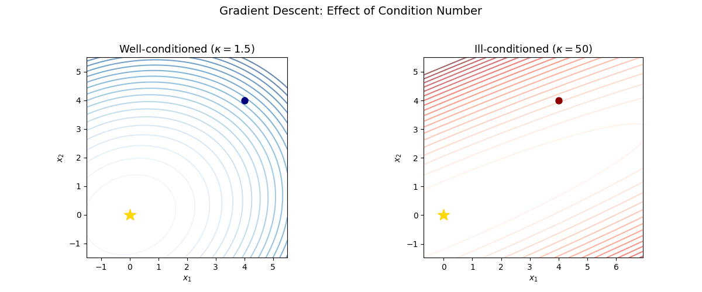
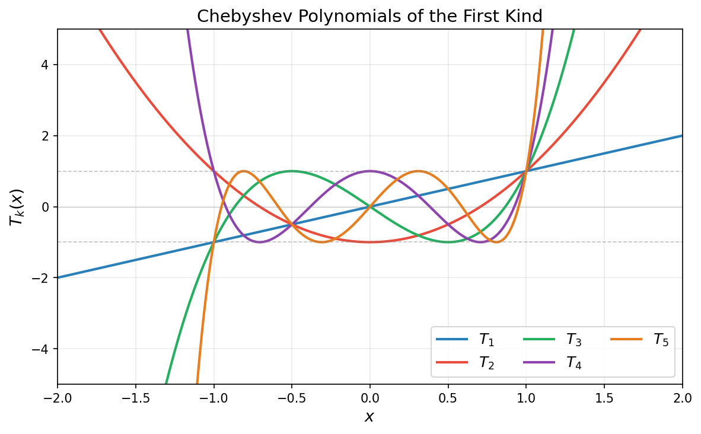
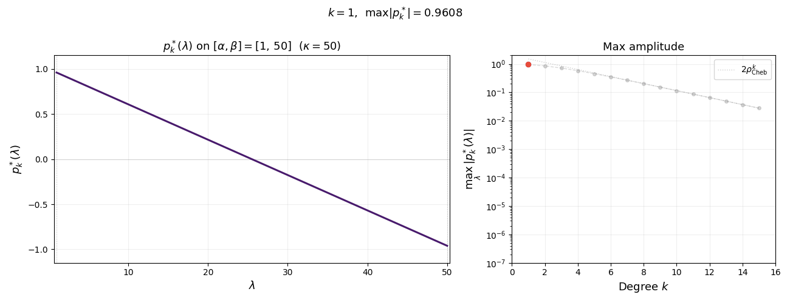
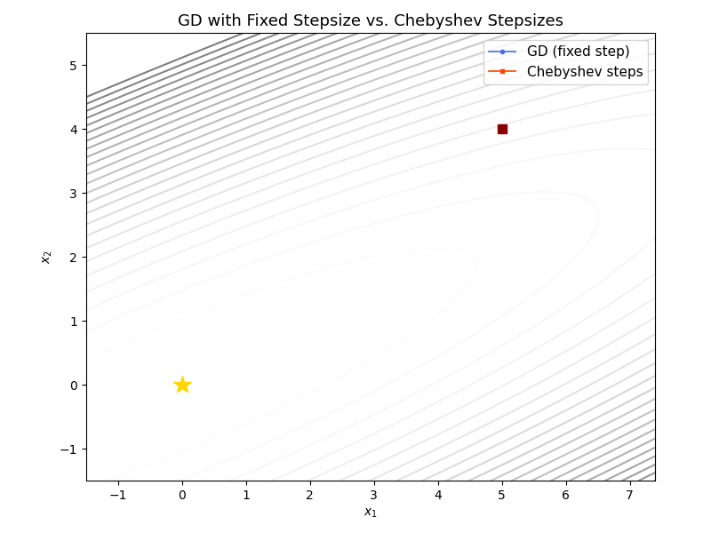
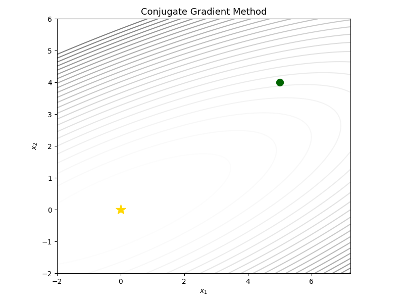
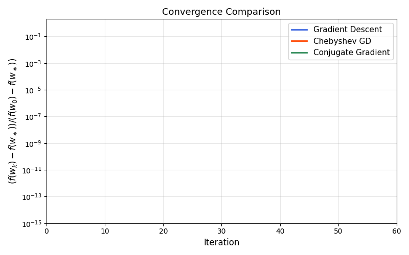

# Week 1: Convex Quadratics

[← Back to course page](./)

---

## Overview

This week we study optimization algorithms for the **convex quadratic problems**. This is the most basic and fundamental problem in numerical optimization. Surprisingly, many of the phonemona that hold for minimizng convex quadratics have direct analogues for highly nonlinear and complex models (e.g. deep learning). Since the objective function is a convex quadratic, this setting allows us to develop sharp intuition for convergence behavior using only basic linear algebraic tools. Moving beyond linear least squares will require combining linear algebra with analytic techniques---more on this later.

We cover three algorithms of increasing sophistication:

1. **Gradient descent** with a fixed stepsize
2. **Chebyshev-accelerated gradient descent**
3. **Conjugate Gradient method**

---

## 1. Problem Setup

We consider the quadratic minimization problem

$$\min_{x \in \mathbb{R}^d} \; f(x) = \tfrac{1}{2} x^\top A x - b^\top x,$$

where $A \in \mathbb{R}^{d \times d}$ is a symmetric positive semidefinite matrix, meaning $A = A^\top$ and $v^\top A v \geq 0$ for all $v \in \mathbb{R}^d$. The gradient is

$$\nabla f(x) = Ax - b.$$

In particular, the solutions of the problem are exactly the solutions of the linear system $Ax=b$. Note that this linear system is special in that $A$ is a positive definite matrix---a property with important consequences for numerical methods.

We denote the eigenvalues of $A$ by

$$
0 < \alpha = \lambda_1 \leq \lambda_2 \leq \cdots \leq \lambda_d = \beta
$$

and its **condition number** by $\kappa = \beta / \alpha$.

A key example of convex quadratic optimization is **linear least squares**:

$$
\min_{x \in \mathbb{R}^d} \;\tfrac{1}{2}\|Dx - y\|^2,
$$

under the correspondence $A = D^\top D$ and $b = D^\top y$. In applications, $D \in \mathbb{R}^{m \times d}$ is usually a data matrix and $y \in \mathbb{R}^m$ is a vector of observations. 

**Why convex quadratic minimization?** The linear system $Ax = b$ arises everywhere: in linear regression for inference, as a subroutine in Newton's method and interior-point algorithms, and as a building block for preconditioning. Understanding how to solve it iteratively is fundamental.

---

## 2. Gradient Descent

We will be interested in algorithms that access the matrix $A$ only by evaluating matrix-vector products $v\mapsto Av$ for any query vector $v$. This **matrix-free** abstraction is powerful for several reasons:

- **Storage.** In many applications $A$ is never formed explicitly. For instance, in least squares with $A = D^\top D$, the product $Av = D^\top(Dv)$ can be computed using two matrix-vector products with $D$ and $D^\top$, which costs $O(md)$ operations and requires storing only $D \in \mathbb{R}^{m \times d}$ rather than the $d \times d$ matrix $A$. When $m \ll d^2 / d = d$ or when $D$ is sparse or structured, this is a significant saving.

- **Structure.** Many matrices arising in practice (e.g., discrete Laplacians, convolution operators, fast transforms) admit fast matrix-vector products via the FFT or other algorithms, costing $O(d \log d)$ or even $O(d)$ per product—far less than the $O(d^2)$ cost of a general dense multiply, and enormously less than the $O(d^3)$ cost of a direct factorization.

- **Generality.** By treating $A$ as a "black box" that we can only query through products, we obtain algorithms that work unchanged whether $A$ is dense, sparse, or defined only implicitly through an operator. This abstraction cleanly separates the optimization algorithm from the problem-specific details of how $A$ acts on vectors.

All three methods studied this week—gradient descent, Chebyshev-accelerated gradient descent, and conjugate gradients—are matrix-free: their only access to $A$ is through one matrix-vector product per iteration.

### Algorithm

Starting from $x_0 \in \mathbb{R}^d$, gradient descent with stepsize $\eta > 0$ iterates

$$
\begin{aligned}
x_{k+1} = x_k - \eta \nabla f(x_k) &= x_k - \eta(Ax_k - b) \\
         &= x_k - \eta A(x_k - x^\star),
\end{aligned}
\tag{1}
$$

where $x^\star$ is any minimizer of $f$, i.e. one satisfying $Ax^\star=b$.

### Error recurrence

To analyze gradient descent, we introduce the **error vector** $e_k = x_k - x^\star$. Subtracting $x^\star$ from both sides of $(1)$ yields

$$e_{k+1} = (I - \eta A)\, e_k.$$

Unrolling the recurrence gives $e_k = (I - \eta A)^k e_0$. Next, observe that the function value gap can be expressed in terms of $e_k$ as

$$
\begin{aligned}
f(x_k) - f(x^\star)
&= \tfrac{1}{2} x_k^\top A x_k - b^\top x_k - \tfrac{1}{2} (x^\star)^\top A x^\star + b^\top x^\star \\
&= \tfrac{1}{2} x_k^\top A x_k - (Ax^\star)^\top x_k - \tfrac{1}{2} (x^\star)^\top A x^\star + (Ax^\star)^\top x^\star \\
&= \tfrac{1}{2} (x_k - x^\star)^\top A\, (x_k - x^\star) \\
&= \tfrac{1}{2}\, e_k^\top A\, e_k \\
&=: \tfrac{1}{2}\|e_k\|_A^2,
\end{aligned}
$$

where $\|v\|_A = \sqrt{v^\top A v}$ is the **$A$-norm** (or energy norm). This is the natural norm for measuring progress on quadratic problems.

### Convergence for a general stepsize

Let $v_1, \ldots, v_d$ be an orthonormal eigenbasis of $A$ with $Av_i = \lambda_i v_i$. Expanding the initial error as $e_0 = \sum_{i=1}^d c_i v_i$, the error at step $k$ is

$$
\begin{aligned}
e_k &= (I - \eta A)^k\, e_0 = (I - \eta A)^k \sum_{i=1}^d c_i\, v_i = \sum_{i=1}^d c_i\, (I - \eta A)^k\, v_i = \sum_{i=1}^d c_i\, (1 - \eta\lambda_i)^k\, v_i.
\end{aligned}
$$

The $A$-norm of the error therefore satisfies

$$
\|e_k\|_A^2 = \sum_{i=1}^d \lambda_i (1 - \eta\lambda_i)^{2k}\, c_i^2 \leq \max_{1 \leq i \leq d} (1 - \eta\lambda_i)^{2k} \cdot \sum_{i=1}^d \lambda_i\, c_i^2 = \rho(\eta)^{2k}\, \|e_0\|_A^2,
$$

where we set

$$
\rho(\eta) := \max_{1 \leq i \leq d} \lvert 1 - \eta\lambda_i\rvert=\max(\lvert 1 - \eta\alpha\rvert, \lvert 1 - \eta \beta\rvert).
$$

We have thus proved the following.

**Theorem 1 (Gradient descent).** *For any $\eta \in (0, \tfrac{2}{\beta})$ the inclusion $\rho(\eta)\in (0,1)$ holds and the gradient descent iterates enjoy the linear rate of convergence:*

$$f(x_k) - f(x^\star) \leq \rho(\eta)^{2k}\,\bigl(f(x_0) - f(x^\star)\bigr).$$

### Optimal stepsize

The rate $\rho(\eta)$ depends on the stepsize $\eta$. To find the ``optimal'' fixed stepsize, we minimize $\rho(\eta) = \max(\lvert 1 - \eta\alpha\rvert,\; \lvert 1 - \eta \beta\rvert)$ over $\eta$. Observe that $1 - \eta\alpha$ is decreasing in $\eta$ while $\eta \beta - 1$ is increasing. These two expressions balance when $1 - \eta\alpha = \eta \beta - 1$, which gives

$$\eta^\star = \frac{2}{\beta + \alpha}.$$

**Corollary 1 (Optimal fixed stepsize).** *With $\eta = \eta^\star = \frac{2}{\beta+\alpha}$, gradient descent satisfies*

$$f(x_k) - f(x^\star) \leq \left(\frac{\kappa - 1}{\kappa + 1}\right)^{2k}\bigl(f(x_0) - f(x^\star)\bigr).$$

*Proof.* Substituting $\eta^\star$ into the expression for $\rho$ yields

$$\rho(\eta^\star) = \left\lvert 1 - \frac{2\alpha}{\beta+\alpha}\right\rvert = \frac{\beta - \alpha}{\beta + \alpha} = \frac{\kappa - 1}{\kappa + 1}.$$

The result follows from Theorem 1. $\square$

### The practical stepsize $\eta = 1/\beta$

The optimal stepsize $\eta^\star = 2/(\beta+\alpha)$ requires knowledge of both the largest and smallest eigenvalues of $A$. In practice, the smallest eigenvalue $\alpha$ is often unknown or expensive to estimate. A natural and widely used alternative is the stepsize $\eta = 1/\beta$, which requires only an upper bound on the spectrum.

**Corollary 2 (Stepsize $1/\beta$).** *With $\eta = 1/\beta$, gradient descent satisfies*

$$f(x_k) - f(x^\star) \leq \left(1 - \frac{1}{\kappa}\right)^{2k}\bigl(f(x_0) - f(x^\star)\bigr).$$

*Proof.* Substituting $\eta = 1/\beta$ into Theorem 1 yields:

$$\rho(1/\beta) = \max\!\big(\lvert 1 - \alpha/\beta\rvert,\; \lvert 1 - 1\rvert\big) = 1 - \frac{1}{\kappa},$$

which completes the proof. $\square$

**Comparison of the two stepsizes.** For large $\kappa$, the two rates behave as

$$\rho^\star = \frac{\kappa - 1}{\kappa + 1} = 1 - \frac{2}{\kappa} + O(\kappa^{-2}), \qquad \rho(1/\beta) = 1 - \frac{1}{\kappa}.$$

Thus the optimal stepsize is roughly twice as fast per step as $\eta = 1/\beta$---a modest price to pay for not knowing $\alpha$.

### Iteration complexity

So far we have described how the suboptimality $f(x_k)-f(x^{\star})$ decays with with the iteration counted. An equivalent and often more informative viewpoint is to ask: *how many iterations are needed to reach a target accuracy $\varepsilon$?* This is the **iteration complexity** of the algorithm.

From Theorem 1 with stepsize $\eta = 1/\beta$, we may use the elementary inequality $1 - x \leq e^{-x}$ to deduce that

$$
k \geq \kappa\cdot\ln\left(\frac{1}{\varepsilon}\right)
$$

iterations suffice to achieve $\varepsilon$-accuracy $f(x_k)-f(x^\star)\leq \varepsilon$. This is the **iteration complexity** of gradient descent on quadratics.

This change of perspective---from contraction rate to iteration count---is valuable because it separates two distinct contributions to the difficulty of the problem: the **condition number** $\kappa$, which measures the intrinsic difficulty of the problem, and the **logarithmic accuracy** $\ln(1/\varepsilon)$, which measures how precisely we need to solve it.

### Visualizing the effect of condition number

The following animation shows gradient descent on two quadratics with the same starting point. On the left, the problem is well-conditioned ($\kappa = 1.5$); on the right, it is ill-conditioned ($\kappa = 50$). Notice the zig-zagging behavior on the ill-conditioned problem.

---

## 3. Acceleration by Chebyshev Stepsizes

The analysis of gradient descent so far was quite crude in that it was based on lower-bounding the improvement in function value in a single step. We now show that by monitoring performance across a longer time horizon, it is possible to choose a time-varying stepsize that yields a much faster rate of convergence.  To see this, consider gradient descent with *time-varying* stepsizes $\eta_0, \eta_1, \ldots, \eta_{k-1}$. We saw that the error $e_j = x_j - x^\star$ evolves as $e_{j+1} = (I - \eta_j A)\,e_j$. Therefore, after $k$ steps we have:

$$e_k = (I - \eta_{k-1}A)(I - \eta_{k-2}A)\cdots(I - \eta_0 A)\,e_0 = p_k(A)\,e_0,$$

where $p_k$ is the degree-$k$ polynomial

$$p_k(\lambda) = \prod_{j=0}^{k-1}(1 - \eta_j \lambda).$$

Note that $p_k(0) = 1$ regardless of the choice of stepsizes. Expanding $e_k$ in the eigenbasis of $A$ as before yields:

$$
\begin{aligned}
f(x_k) - f(x^\star) = \tfrac{1}{2}\|e_k\|_A^2
&= \tfrac{1}{2}\sum_{i=1}^d \lambda_i\, p_k(\lambda_i)^2\, c_i^2 \leq \max_{\lambda \in [\alpha, \beta]} p_k(\lambda)^2 \cdot \tfrac{1}{2}\|e_0\|_A^2.
\end{aligned}
$$

Rearranging yields

$$\frac{f(x_k) - f(x^\star)}{f(x_0) - f(x^\star)} \leq \max_{\lambda \in [\alpha, \beta]} p_k(\lambda)^2.$$

Fixed-stepsize gradient descent corresponds to the special case $p_k(\lambda) = (1 - \eta\lambda)^k$, but we are now free to choose *any* stepsizes. Notice that as we vary the stepsizes $\eta_0,\ldots \eta_{k-1}$, any degree $k$ polynomial $p(\lambda)$ satisfying $p(0)=1$ can be realized as $p_{k-1}(\lambda)$. Thus choosing time-varying stepsizes is equivalent to choosing such a polynomial.  The best possible convergence after $k$ steps is therefore determined by the **minimax polynomial problem**:

$$
\min_{\substack{p \in \mathcal{P}_k \\ p(0) = 1}} \max_{\lambda \in [\alpha, \beta]} p(\lambda)^2,
$$

where $\mathcal{P}_k$ denotes the set of polynomials of degree at most $k$. The solution to this classical approximation problem involves Chebyshev polynomials.

### Chebyshev polynomials

The **Chebyshev polynomial of the first kind** of degree $k$, denoted $T_k$, is defined recursively as follows. We set $T_0(x) = 1$ and $T_1(x) = x$ and define

$$T_{k+1}(x) = 2x\,T_k(x) - T_{k-1}(x) \qquad \forall k\geq 1.$$

An equivalent characterization of Chebychev polynomials is the equality

$$
T_k(\cos\theta) = \cos(k\theta) \qquad \forall \theta \in [0,\pi].
$$

Chebychev polynomials play a special role in numerical analysis because they solve the extremal problem: 

> Any degree-$k$ polynomial $p(x)$ with the same leading coefficient as $T_k$ satisfies
>
> $$\max_{x\in [-1,1]} \lvert p(x)\rvert\geq \max_{x\in [-1,1]} \lvert T_k(x)\rvert=1.$$

In words, among all degree-$k$ polynomials with the same leading coefficient as $T_k$, the Chebychev polynomial $T_k$ has the smallest maximum absolute value on $[-1,1]$. See the figure below.

Chebychev polynomials satisfy the following key properties:
1. **Boundedness:** The inequality $\lvert T_k(t)\rvert \leq 1$ holds for all $t \in [-1,1]$ with equality at $t_j = \cos(j\pi/k)$ for $j = 0, \ldots, k$. 

2. **Roots:** $T_k$ has $k$ roots in $(-1,1)$ at $t_j = \cos\!\left(\frac{(2j-1)\pi}{2k}\right)$ for $j = 1, \ldots, k$.

3. **Explosion:** For $\lvert t\rvert > 1$, we have $T_k(t) = \cosh(k\,\operatorname{arccosh}(t))$.

### The optimal polynomial
Returning to gradient descent, we rescale the interval $[\alpha, \beta]$ to $[-1,1]$ with the affine change of coordinates $\lambda\mapsto\frac{\beta + \alpha - 2\lambda}{\beta - \alpha}$. Not that this transformation sends $\lambda = 0$ to the point $\sigma := \frac{\beta + \alpha}{\beta - \alpha} = \frac{\kappa + 1}{\kappa - 1} > 1$. Thus, under this substitution, any degree-$k$ polynomial $p(\lambda)$ with $p(0) = 1$ corresponds to a degree-$k$ polynomial $q$ with $q(\sigma) = 1$, and

$$\max_{\lambda \in [\alpha, \beta]}\lvert p(\lambda)\rvert = \max_{t \in [-1,1]}\lvert q(t)\rvert.$$

We must therefore find the degree-$k$ polynomial $q$ with $q(\sigma) = 1$ that has the smallest maximum on $[-1,1]$. By properties 1 and 3 above, $T_k$ is bounded by 1 on $[-1,1]$ yet $T_k(\sigma) \gg 1$ for large $k$. This makes the rescaled polynomial

$$q_k^*(t) = \frac{T_k(t)}{T_k(\sigma)}$$

an excellent candidate: it satisfies $q_k^*(\sigma) = 1$ and $\max_{t \in [-1,1]}\lvert q_k^*(t)\rvert = 1/T_k(\sigma)$, which is small because $T_k(\sigma)$ grows exponentially in $k$. Transforming back to the $\lambda$-variable, the optimal polynomial is

$$p_k^*(\lambda) = \frac{T_k\!\left(\frac{\beta + \alpha - 2\lambda}{\beta - \alpha}\right)}{T_k\!\left(\frac{\kappa + 1}{\kappa - 1}\right)}.$$

The animation below shows $p_k^*(\lambda)$ on $[\alpha, \beta]$ for increasing degree $k$. As $k$ grows, the polynomial oscillates more rapidly yet its maximum amplitude $1/T_k(\sigma)$ shrinks exponentially---this is the mechanism behind the accelerated convergence.

Summarizing, we have the following lemma. 

**Lemma 1 (Chebyshev minimax).** *With $\sigma = \frac{\kappa+1}{\kappa-1}$, the minimax value satisfies*

$$\min_{\substack{p \in \mathcal{P}_k \\ p(0) = 1}} \max_{\lambda \in [\alpha,\beta]} \lvert p(\lambda)\rvert \leq \frac{1}{T_k(\sigma)} \leq 2\left(\frac{\sqrt{\kappa}-1}{\sqrt{\kappa}+1}\right)^k.$$

*Proof.* The first inequality follows from a feasible choice. Indeed, the rescaled polynomial

$$
p_k^*(\lambda) = \frac{T_k\!\big(\frac{\beta+\alpha-2\lambda}{\beta-\alpha}\big)}{T_k(\sigma)},
$$

is a polynomial of degree at most $k$ satisfying the condition $p_k^*(0)=1$. Moreover, the boundedness of the Chebyshev polynomial on the interval $[-1,1]$ yields the estimate

$$
\max_{\lambda \in [\alpha,\beta]} \lvert p_k^*(\lambda)\rvert = \frac{1}{T_k(\sigma)}.
$$

This proves the first inequality.

For the second inequality, we use the identity $T_k(x) = \cosh(k\,\operatorname{arccosh}(x))$ valid for every real number $x>1$. Applying this identity with the quantity $\sigma$ gives the relation

$$
\begin{aligned}
\operatorname{arccosh}(\sigma)
&= \ln\!\big(\sigma + \sqrt{\sigma^2 - 1}\big)  = \ln\frac{\sqrt{\kappa}+1}{\sqrt{\kappa}-1}.
\end{aligned}
$$

Consequently, the representation

$$
\begin{aligned}
T_k(\sigma) &= \cosh\!\left(k\ln\frac{\sqrt{\kappa}+1}{\sqrt{\kappa}-1}\right) = \frac{1}{2}\left[\left(\frac{\sqrt{\kappa}+1}{\sqrt{\kappa}-1}\right)^k + \left(\frac{\sqrt{\kappa}-1}{\sqrt{\kappa}+1}\right)^k\right] \geq \frac{1}{2}\left(\frac{\sqrt{\kappa}+1}{\sqrt{\kappa}-1}\right)^k,
\end{aligned}
$$

holds. Taking reciprocals gives the second claim. This completes the proof. $\square$

Returning to choosing stepsizes for gradient descent, the roots of $p^*_k(\lambda)$ on $[\alpha, \beta]$ are the images of the Chebyshev roots $t_j$ under the inverse map $t \mapsto \frac{\beta+\alpha}{2} - \frac{\beta-\alpha}{2}\,t$, giving the stepsizes $\eta_j = 1/\lambda_j$. We thus have arrived at the main theorem of this section.

**Theorem 2 (Chebyshev stepsizes).** *Define the stepsizes*

$$\eta_j = \tfrac{1}{\lambda_j}~~ \textrm{where}~~\lambda_j = \tfrac{\beta + \alpha}{2} - \tfrac{\beta - \alpha}{2}\cos\!\left(\tfrac{(2j - 1)\pi}{2k}\right) ~~\textrm{for}~ j = 1, \ldots, k.$$

*Then the gradient descent iterates satisfy*

$$f(x_k) - f(x^\star) \leq 4\left(\frac{\sqrt{\kappa} - 1}{\sqrt{\kappa} + 1}\right)^{2k}\bigl(f(x_0) - f(x^\star)\bigr). \tag{2}$$

*Proof of Theorem 2.* The polynomial estimate established above yields

$$
\frac{f(x_k) - f(x^\star)}{f(x_0) - f(x^\star)} \leq \max_{\lambda \in [\alpha, \beta]} p_k^*(\lambda)^2 = \frac{1}{T_k(\sigma)^2}.
$$

Applying Lemma 1 gives the bound

$$
\frac{1}{T_k(\sigma)^2} \leq 4\left(\frac{\sqrt{\kappa}-1}{\sqrt{\kappa}+1}\right)^{2k}.
$$

Combining the preceding two estimates yields the conclusion $(2)$. This completes the proof. $\square$

Thus, the iteration complexity of Chebyshev-accelerated gradient descent is $O(\sqrt{\kappa}\,\ln(1/\varepsilon))$---a **square-root improvement** over the $O(\kappa\,\ln(1/\varepsilon))$ complexity of fixed-stepsize gradient descent. For $\kappa = 100$, this is the difference between roughly $10$ and $100$ iterations.

### Comparing trajectories

The animation below overlays gradient descent (blue) and Chebyshev-accelerated GD (red) on the same ill-conditioned quadratic. The Chebyshev method reaches the minimizer much faster.

---

## 4. The Conjugate Gradient Method

### From polynomials to Krylov subspaces

The Chebyshev method achieves the iteration complexity $O(\sqrt{\kappa}\,\ln(1/\varepsilon))$ by cleverly choosing time-varying stepsizes---but it requires advance knowledge of the extreme eigenvalue $\alpha$. Moreover, the maximal number of iterations needs to be set in order to define the stepsizes. A natural question arises:

> can we match this rate adaptively, without knowing the spectrum nor setting the time horizon?

The key observation is that gradient descent with *any* sequence of stepsizes produces iterates that lie in a specific linear subspace. Due to the recursion $x_{j+1} = x_j - \eta_j(Ax_j - b)$, one readily verifies the inclusion

$$
x_k \in x_0 + \mathcal{K}_k(A, r_0).
$$

where $r_0 := b - Ax_0$ is the initial residual and

$$
\mathcal{K}_k(A, r_0) := \mathrm{span}\{r_0,\, Ar_0,\, A^2 r_0,\, \ldots,\, A^{k-1}r_0\}.
$$

is the **Krylov subspace** of order $k$. Both fixed-stepsize gradient descent and the Chebyshev method search within this subspace. The **Conjugate Gradient (CG)** method is more agressive: at each step, it computes the point in $x_0 + \mathcal{K}_k(A, r_0)$ that minimizes $f$.

### Algorithm

How can we minimize $f$ over $x_0 + \mathcal{K}_k(A, r_0)$ efficiently? A direct approach would solve a $k \times k$ least-squares problem at each step---but the cost per iteration would grow with $k$. The CG method avoids this cost blow up by maintaining a basis of the Krylov subspaces that is orthogonal with respect to the inner product $\langle x,y\rangle_A=x^\top Ay$ so that each successive minimization is cheap. To see how this can be done, suppose that the iterate $x_k$ indeed minimizes $f$ over $x_0 + \mathcal{K}_k(A, r_0)$. Then the residual $r_k=b-Ax_k=-\nabla f(x_k)$ satisfies the orthogonality relation

$$
r_k\perp \mathcal{K}_k(A, r_0).
$$

Imagine now that we are able to choose a direction $p_k\in \mathcal{K}_{k+1}(A, r_0)$ that is $A$-orthogonal to $\mathcal{K}_{k}(A, r_0)$. Then it is straightforward to see that the next iterate

$$
x_{k+1}=\argmin_{\eta}f(x_k+\eta p_k)
$$

will be a minimizer of $f$ on $x_0 + \mathcal{K}_{k+1}(A, r_0)$. The directions $p_k$ can be generated iteratively by a Gram--Schmidt process relative to the inner product $\langle\cdot,\cdot \rangle_A$. Namely, each new direction $p_{k+1}$ is constructed by taking the new residual $r_{k+1}$ and subtracting its $A$-projection onto the previous search space. The special structure of CG implies that this correction collapses to a one-term recurrence involving only $p_k$.

Concretely, the conjugate gradient method takes the form:

**Algorithm 1** (Conjugate Gradient Method)

**Input:** $x_0 \in \mathbb{R}^d$

1. Set $r_0 = b - Ax_0$, $\;p_0 = r_0$
2. **For** $k = 0, 1, 2, \ldots$ do:
3. $\qquad \eta_k = \dfrac{r_k^\top r_k}{p_k^\top A p_k}$
4. $\qquad x_{k+1} = x_k + \eta_k\, p_k$
5. $\qquad r_{k+1} = r_k - \eta_k\, A p_k$
6. $\qquad \beta_k = \dfrac{r_{k+1}^\top r_{k+1}}{r_k^\top r_k}$
7. $\qquad p_{k+1} = r_{k+1} + \beta_k\, p_k$

Note that each iteration requires one matrix-vector product $Ap_k$, the same per-step cost as gradient descent. The vectors $r_k = b - Ax_k$ are the **residuals** (note that the identity $r_k = -\nabla f(x_k)$ holds) and the vectors $p_k$ are the **search directions**. The stepsize $\eta_k$ minimizes $f$ along the ray $x_k + \eta\, p_k$, while $\beta_k$ ensures that $p_{k+1}$ is orthogonal to all previous directions with respect to the inner product $\langle\cdot,\cdot \rangle_A$.

### $A$-conjugacy and optimality
We now analyze CG formally.  The CG iterates satisfy two key orthogonality conditions that together guarantee optimality over the Krylov subspace.

**Theorem 3 (CG optimality).** *The CG residuals and search directions satisfy, for all valid indices:*

1. *$r_i^\top r_j = 0$ for $i \neq j$ (mutual orthogonality of residuals),*
2. *$p_i^\top A p_j = 0$ for $i \neq j$ ($A$-conjugacy of search directions),*
3. *$\mathrm{span}\{p_0, \ldots, p_{k-1}\} = \mathrm{span}\{r_0, \ldots, r_{k-1}\} = \mathcal{K}_k(A, r_0)$.*

*Consequently, $x_k$ minimizes $f$ over the affine subspace $x_0 + \mathcal{K}_k(A, r_0)$.*

*Proof.* We prove properties 1--3 by induction on the index $k$. The base case $k=0$ is immediate, since the identity $p_0=r_0$ holds and the equality $\mathcal{K}_1(A,r_0)=\mathrm{span}\{r_0\}$ is valid. For the inductive step, assume that properties 1--3 hold through step $k$. The CG updates give the relations

$$
r_{k+1}=r_k-\eta_kAp_k, \qquad p_{k+1}=r_{k+1}+\beta_kp_k.
$$

We first verify property 1. Fix an index $j<k$. The inductive hypothesis gives the orthogonality relation $r_k^\top r_j=0$. In addition, property 3 implies that the vector $r_j$ belongs to the span $\mathrm{span}\{p_0,\ldots,p_j\}$. Since the vector $p_k$ is $A$-conjugate to every earlier search direction, the relation $p_k^\top Ar_j=0$ follows. Substituting these two relations into the residual update gives the identity

$$
r_{k+1}^\top r_j = r_k^\top r_j - \eta_k\,p_k^\top Ar_j = 0.
$$

For the remaining index $j=k$, the relation $r_k=p_k-\beta_{k-1}p_{k-1}$ and the $A$-conjugacy relation $p_k^\top Ap_{k-1}=0$ imply the identity $p_k^\top Ar_k=p_k^\top Ap_k$. Using the definition of the stepsize $\eta_k$ therefore yields the relation

$$
r_{k+1}^\top r_k = r_k^\top r_k - \eta_k\,p_k^\top Ap_k = \|r_k\|^2-\|r_k\|^2=0.
$$

Thus the residuals remain mutually orthogonal.

We next verify property 3. The inductive hypothesis implies that the vector $p_k$ belongs to the Krylov subspace $\mathcal{K}_{k+1}(A,r_0)$. Hence the vector $Ap_k$ belongs to the larger Krylov subspace $\mathcal{K}_{k+2}(A,r_0)$. Since the vector $r_k$ also belongs to $\mathcal{K}_{k+1}(A,r_0)$, the residual update yields the inclusion

$$
r_{k+1}=r_k-\eta_kAp_k \in \mathcal{K}_{k+2}(A,r_0).
$$

The search-direction update then gives the inclusion $p_{k+1}\in \mathcal{K}_{k+2}(A,r_0)$ as well. Moreover, the relations $p_{k+1}=r_{k+1}+\beta_kp_k$ and $r_{k+1}=p_{k+1}-\beta_kp_k$ show that adjoining the vector $r_{k+1}$ or adjoining the vector $p_{k+1}$ produces the same span. Consequently, the identity

$$
\mathrm{span}\{r_0,\ldots,r_{k+1}\}=\mathrm{span}\{p_0,\ldots,p_{k+1}\}.
$$

holds.

If the residual $r_{k+1}$ is nonzero, then property 1 shows that the vectors $r_0,\ldots,r_{k+1}$ are mutually orthogonal and therefore linearly independent. Their span therefore has dimension $k+2$. Since this span is contained in $\mathcal{K}_{k+2}(A,r_0)$, and since the Krylov subspace $\mathcal{K}_{k+2}(A,r_0)$ is generated by the $k+2$ vectors $r_0, Ar_0,\ldots,A^{k+1}r_0$, the dimension of $\mathcal{K}_{k+2}(A,r_0)$ is at most $k+2$. Hence the inclusion above is in fact an equality, and property 3 follows. If instead the residual $r_{k+1}$ vanishes, then the iterate $x_{k+1}$ already equals the minimizer and all later statements are trivial. Therefore property 3 holds in every valid case.

We now verify property 2. The residual recursion implies the identity

$$
Ap_j=\frac{r_j-r_{j+1}}{\eta_j}.
$$

For every index $j<k$, property 1 gives the orthogonality relations $r_{k+1}^\top r_j=0$ and $r_{k+1}^\top r_{j+1}=0$. Substituting these relations into the identity above yields the relation

$$
r_{k+1}^\top Ap_j = \frac{r_{k+1}^\top r_j-r_{k+1}^\top r_{j+1}}{\eta_j}=0.
$$

Combining the preceding relation with the inductive hypothesis $p_k^\top Ap_j=0$ yields the identity

$$
p_{k+1}^\top Ap_j = r_{k+1}^\top Ap_j + \beta_k\,p_k^\top Ap_j = 0.
$$

For the remaining index $j=k$, the same identity with index $k$ gives the relation

$$
r_{k+1}^\top Ap_k = \frac{r_{k+1}^\top r_k-\|r_{k+1}\|^2}{\eta_k} = -\frac{\|r_{k+1}\|^2}{\eta_k}.
$$

where the orthogonality relation $r_{k+1}^\top r_k=0$ comes from property 1. Using again the definitions of $\beta_k$ and $\eta_k$, we obtain the calculation

$$
\beta_k\,p_k^\top Ap_k = \frac{\|r_{k+1}\|^2}{\|r_k\|^2}\cdot \frac{\|r_k\|^2}{\eta_k}=\frac{\|r_{k+1}\|^2}{\eta_k}.
$$

Combining the preceding two identities yields the relation

$$
p_{k+1}^\top Ap_k = r_{k+1}^\top Ap_k + \beta_k\,p_k^\top Ap_k = 0.
$$

Therefore, the search directions remain $A$-conjugate.

It remains to prove optimality. Recall that a point $x_k$ minimizes the strictly convex quadratic $f$ over an affine subspace $x_0+V$ if and only if the gradient $\nabla f(x_k)$ is orthogonal to the subspace $V$. Since the negative gradient equals the residual $r_k = -\nabla f(x_k)$, the optimality condition reads

$$
r_k \perp \mathcal{K}_k(A,r_0).
$$

By property 3, the Krylov subspace $\mathcal{K}_k(A,r_0)$ coincides with the span $\mathrm{span}\{r_0,\ldots,r_{k-1}\}$. Property 1 states that the residual $r_k$ is orthogonal to every earlier residual $r_j$ with $j<k$. Combining these two facts shows that the orthogonality condition above holds, and therefore $x_k$ minimizes $f$ over the affine space $x_0+\mathcal{K}_k(A,r_0)$. This completes the proof. $\square$

*Remark.* The CG algorithm can be viewed as performing Gram--Schmidt orthogonalization in the $A$-inner product $\langle u,v\rangle_A = u^\top Av$. Each new search direction $p_{k+1}$ is obtained by $A$-orthogonalizing the residual $r_{k+1}$ against the previous directions. The remarkable feature of CG is that the Krylov structure ensures a **short recurrence**: only the immediately preceding direction $p_k$ needs to be subtracted, rather than all previous directions. This is why each CG iteration costs $O(d)$ work beyond the single matrix-vector product.

### Convergence rate and finite termination

The connection to the polynomial framework of Section 3 now yields the convergence guarantee.

**Theorem 4 (CG convergence).** *The conjugate gradient iterates satisfy*

$$
f(x_k) - f(x^\star) \leq 4\left(\frac{\sqrt{\kappa} - 1}{\sqrt{\kappa} + 1}\right)^{2k}\bigl(f(x_0) - f(x^\star)\bigr).
\tag{3}
$$

*Moreover, if $A$ has only $m \leq d$ distinct eigenvalues, CG converges in at most $m$ iterations.*

*Proof.* For simplicity, let $\mathcal{K}_k$ denote the Krylov subspace $\mathcal{K}_k(A,r_0)$ throughout the proof. By Theorem 3, the iterate $x_k$ minimizes the objective function $f$ over the affine space $x_0+\mathcal{K}_k$. Recall from Section 2 that the identity

$$
f(x) - f(x^\star) = \tfrac{1}{2}\|x - x^\star\|_A^2.
$$

holds for every vector $x$. Since the value $f(x^\star)$ is constant, minimizing the function $f$ over a subset is equivalent to minimizing the corresponding $A$-norm distance to the minimizer $x^\star$. Applying this observation with the subset $x_0+\mathcal{K}_k$ gives

$$
\tfrac{1}{2}\|e_k\|_A^2 = \tfrac{1}{2}\|x_k - x^\star\|_A^2 = \min_{x\,\in\, x_0 + \mathcal{K}_k}\; \tfrac{1}{2}\|x - x^\star\|_A^2.
\tag{4}
$$

We now convert the geometric minimization problem in $(4)$ into a polynomial one. A vector $x$ belongs to the affine space $x_0+\mathcal{K}_k$ if and only if there exists a polynomial $q$ of degree at most $k-1$ such that

$$
x = x_0 + q(A)\,r_0.
$$

Using the identity $r_0=b-Ax_0=-Ae_0$, we obtain the representation

$$
x - x^\star = e_0 - q(A)\,Ae_0 = p(A)\,e_0.
$$

where the polynomial $p(\lambda):=1-\lambda q(\lambda)$ has degree at most $k$ and satisfies the normalization condition $p(0)=1$. The correspondence between the polynomials $p$ and $q$ is one-to-one. Substituting this representation into $(4)$ gives the estimate

$$
\|e_k\|_A^2 = \min_{\substack{p \in \mathcal{P}_k \\ p(0) = 1}} \|p(A)\,e_0\|_A^2 \leq \min_{\substack{p \in \mathcal{P}_k \\ p(0) = 1}} \max_{\lambda \in [\alpha,\beta]} p(\lambda)^2 \cdot \|e_0\|_A^2.
$$

Applying Lemma 1 yields the bound

$$
\|e_k\|_A^2 \leq \frac{\|e_0\|_A^2}{T_k(\sigma)^2} \leq 4\left(\frac{\sqrt{\kappa}-1}{\sqrt{\kappa}+1}\right)^{2k}\|e_0\|_A^2.
$$

This proves the estimate $(3)$.

For finite termination, let $\mu_1,\ldots,\mu_m$ denote the distinct eigenvalues of the matrix $A$, and consider the polynomial

$$
p(\lambda) = \prod_{i=1}^{m}\left(1 - \lambda/\mu_i\right).
$$

This polynomial has degree $m$, satisfies the normalization condition $p(0)=1$, and vanishes at every eigenvalue of the matrix $A$. Hence the matrix identity $p(A)=0$ holds. Applying the polynomial representation above with this choice gives the equality $\|e_m\|_A=0$. This completes the proof. $\square$

The convergence bound $(3)$ is identical to the Chebyshev bound $(2)$ of Theorem 2, but CG achieves it *without knowing $\alpha$ or $\beta$*. The iteration complexity is the same $O(\sqrt{\kappa}\,\ln(1/\varepsilon))$, and finite termination provides an absolute guarantee of at most $d$ steps that no polynomial method can offer. In practice, clustered eigenvalues lead to far fewer iterations than the worst-case bound suggests.

### Visualizing CG

The animation below shows CG on a 2D quadratic. Notice that it converges in exactly 2 steps (the dimension of the problem). The red arrows indicate the search directions, which are $A$-conjugate: they are orthogonal with respect to the inner product $\langle u, v \rangle_A = u^\top A v$, not with respect to the standard dot product.

---

## 5. Convergence Comparison

The animation below compares the convergence of all three methods on the same ill-conditioned quadratic, plotting the relative suboptimality $f(x_k)/f(x_0)$ on a logarithmic scale.

- **Gradient descent** (blue): linear convergence with iteration complexity $O(\kappa\,\ln(1/\varepsilon))$.
- **Chebyshev GD** (red): accelerated convergence with iteration complexity $O(\sqrt{\kappa}\,\ln(1/\varepsilon))$, but requires knowledge of $\alpha$ and $\beta$.
- **Conjugate Gradients** (green): matches the Chebyshev rate adaptively and terminates in at most $d$ steps.

---

## Summary

| Method | Per-step cost | Iteration complexity | Requires $\alpha, \beta$? |
|--------|--------------|---------------------|-------------------|
| Gradient descent | One matvec | $O(\kappa\,\ln(1/\varepsilon))$ | Yes (for optimal step) |
| Chebyshev GD | One matvec | $O(\sqrt{\kappa}\,\ln(1/\varepsilon))$ | Yes |
| Conjugate Gradients | One matvec | $O(\sqrt{\kappa}\,\ln(1/\varepsilon))$, at most $d$ steps | No |

The key takeaway: on quadratics, CG achieves the accelerated $\sqrt{\kappa}$ rate *adaptively*, without needing to know the eigenvalues, and terminates (in exact precision) in a number of steps that is bounded by the number of distinct eigenvalues of $A$. In practice CG doesn't exactly terminate after finitely many steps due to compounding of numerical errors. 

---

[← Back to course page](./)
