# Week 1: Convex Quadratics

[← Back to course page](./)

---

## Overview

This week we study optimization algorithms for the **convex quadratic 
problems**. This is the most basic and fundamental problem in numerical 
optimization. Surprisingly, many of the phonemona that hold for 
minimizing convex quadratics have direct analogues for highly nonlinear 
and complex models (e.g. deep learning). Since the objective function 
is a convex quadratic, this setting allows us to develop sharp 
intuition for convergence behavior using only basic linear algebraic 
tools. Moving beyond quadratics will require combining linear 
algebra with analytic techniques---more on this later.
We cover three algorithms of increasing sophistication:

1. **Gradient descent** with a fixed stepsize
2. **Chebyshev-accelerated gradient descent**
3. **Conjugate Gradient method**

---

## 1. Problem Setup

We consider the quadratic minimization problem

$$\min_{x \in \mathbb{R}^d} \; f(x) = \tfrac{1}{2} x^\top A x - b^\top x,$$

where $A \in \mathbb{R}^{d \times d}$ is a symmetric positive semidefinite matrix, meaning $A = A^\top$ and $v^\top A v \geq 0$ for all $v \in \mathbb{R}^d$. The gradient of $f$ is

$$\nabla f(x) = Ax - b.$$

In particular, minimizing $f$ is equivalent to solving the linear system $Ax=b$. Note that this linear system is special in  that $A$ is a positive semidefinite matrix---a property with important consequences for numerical methods. Throughout, we let $x^\ast$ be any minimizer of $f$ and set $f^\ast:=f(x^\ast)$.

We denote the eigenvalues of $A$ by

$$
0 \leq  \alpha = \lambda_1 \leq \lambda_2 \leq \cdots \leq \lambda_d = \beta
$$

When $\alpha > 0$, we denote the **condition number** by $\kappa = \beta / \alpha$.

A key example of convex quadratic optimization is **linear least squares**:

$$
\min_{x \in \mathbb{R}^d} \;\tfrac{1}{2}\|Dx - y\|^2,
$$

under the correspondence $A = D^\top D$ and $b = D^\top y$. In applications, $D \in \mathbb{R}^{m \times d}$ is usually a data matrix and $y \in \mathbb{R}^m$ is a vector of observations. 

**Why convex quadratic minimization?** The linear system $Ax = b$ arises everywhere: in linear regression for inference, as a subroutine in Newton's method and interior-point algorithms, and as a building block for preconditioning. Understanding how to solve the linear system iteratively is fundamental.

---

## 2. Gradient Descent: linear convergence with constant stepsize

We will be interested in algorithms that access the matrix $A$ only by evaluating matrix-vector products $v\mapsto Av$ for any query vector $v$. This **matrix-free** abstraction is powerful for several reasons:

- **Storage.** In many applications $A$ is never formed explicitly. For instance, in least squares with $A = D^\top D$, the product $Av = D^\top(Dv)$ can be computed using two matrix-vector products with $D$ and $D^\top$, which costs $O(md)$ operations and requires storing only $D \in \mathbb{R}^{m \times d}$ rather than the $d \times d$ matrix $A$. When $m \ll d$, or when $D$ is sparse/structured, this can be a major saving.

- **Structure.** Many matrices arising in practice (e.g., discrete Laplacians, convolution operators, fast transforms) admit fast matrix-vector products via the FFT or other algorithms, costing $O(d \log d)$ or even $O(d)$ per product—far less than the $O(d^2)$ cost of a general dense multiply, and enormously less than the $O(d^3)$ cost of a direct factorization.

- **Generality.** By treating $A$ as a "black box" that we can only query through products, we obtain algorithms that work unchanged whether $A$ is dense, sparse, or defined only implicitly through an operator. This abstraction cleanly separates the optimization algorithm from the problem-specific details of how $A$ acts on vectors.

All three methods studied this week---gradient descent, Chebyshev-accelerated gradient descent, and CG---are matrix-free: their only access to $A$ is through one matrix-vector product per iteration.

### Algorithm

Starting from $x_0 \in \mathbb{R}^d$, gradient descent with stepsize $\eta > 0$ iterates

$$
\begin{aligned}
x_{k+1} = x_k - \eta \nabla f(x_k) &= x_k - \eta(Ax_k - b) \\
         &= x_k - \eta A(x_k - x^\ast),
\end{aligned}
\tag{1}
$$

where $x^\ast$ is any minimizer of $f$, i.e. one satisfying $Ax^\ast=b$.

### Error recurrence

To analyze gradient descent, we introduce the **error vector** $e_k = x_k - x^\ast$. Subtracting $x^\ast$ from both sides of $(1)$ yields

$$e_{k+1} = (I - \eta A)\, e_k.$$

Unrolling the recurrence gives $e_k = (I - \eta A)^k e_0$. Next, observe that the function value gap can be expressed in terms of $e_k$ as

$$
\begin{aligned}
f(x_k) - f^\ast
&= \tfrac{1}{2} x_k^\top A x_k - b^\top x_k - \tfrac{1}{2} (x^\ast)^\top A x^\ast + b^\top x^\ast \\
&= \tfrac{1}{2} x_k^\top A x_k - (Ax^\ast)^\top x_k - \tfrac{1}{2} (x^\ast)^\top A x^\ast + (Ax^\ast)^\top x^\ast \\
&= \tfrac{1}{2} (x_k - x^\ast)^\top A\, (x_k - x^\ast) \\
&= \tfrac{1}{2}\, e_k^\top A\, e_k \\
&=: \tfrac{1}{2}\|e_k\|_A^2,
\end{aligned}
$$

where $\|v\|_A = \sqrt{v^\top A v}$ is the **$A$-norm**---a measure of length that is adapted to the spectrum of $A$. This is the natural norm for measuring progress on quadratic problems.

### Convergence for a general stepsize

Let $v_1, \ldots, v_d$ be an orthonormal eigenbasis of $A$ with $Av_i = \lambda_i v_i$. Expanding the initial error as $e_0 = \sum_{i=1}^d c_i v_i$, the error at step $k$ is

$$
\begin{aligned}
e_k &= (I - \eta A)^k\, e_0 = (I - \eta A)^k \sum_{i=1}^d c_i\, v_i = \sum_{i=1}^d c_i\, (I - \eta A)^k\, v_i = \sum_{i=1}^d c_i\, (1 - \eta\lambda_i)^k\, v_i.
\end{aligned}
$$

The $A$-norm of the error therefore satisfies

$$
\|e_k\|_A^2 = \sum_{i=1}^d \lambda_i (1 - \eta\lambda_i)^{2k}\, c_i^2 \leq \max_{1 \leq i \leq d} (1 - \eta\lambda_i)^{2k} \cdot \sum_{i=1}^d \lambda_i\, c_i^2 = \rho(\eta)^{2k}\, \|e_0\|_A^2,
$$

where we set

$$
\rho(\eta) := \max_{1 \leq i \leq d} \lvert 1 - \eta\lambda_i\rvert=\max(\lvert 1 - \eta\alpha\rvert, \lvert 1 - \eta \beta\rvert).
$$

We have thus proved the following.

**Theorem 2.1 (Gradient descent).** *For any $\eta \in (0, \tfrac{2}{\beta})$ the inclusion $\rho(\eta)\in (0,1)$ holds and the gradient descent iterates enjoy the linear rate of convergence:*

$$f(x_k) - f^\ast \leq \rho(\eta)^{2k}\,\bigl(f(x_0) - f^\ast\bigr)\qquad \forall k\geq 0.$$

### Optimal stepsize

The rate $\rho(\eta)$ depends on the stepsize $\eta$. To find the ``optimal'' fixed stepsize, we minimize $\rho(\eta) = \max(\lvert 1 - \eta\alpha\rvert,\; \lvert 1 - \eta \beta\rvert)$ over $\eta$. Observe that $1 - \eta\alpha$ is decreasing in $\eta$ while $\eta \beta - 1$ is increasing. These two expressions balance when $1 - \eta\alpha = \eta \beta - 1$, which gives

$$\eta^\ast = \frac{2}{\beta + \alpha}.$$

**Corollary 2.1 (Optimal fixed stepsize).** *Suppose $\alpha>0$ and set $\eta = \eta^\ast = \frac{2}{\beta+\alpha}$. Then gradient descent satisfies*

$$f(x_k) - f^\ast \leq \left(\frac{\kappa - 1}{\kappa + 1}\right)^{2k}\bigl(f(x_0) - f^\ast\bigr)\qquad \forall k\geq 0.$$

*Proof.* Substituting $\eta^\ast$ into the expression for $\rho$ yields

$$\rho(\eta^\ast) = \left\lvert 1 - \frac{2\alpha}{\beta+\alpha}\right\rvert = \frac{\beta - \alpha}{\beta + \alpha} = \frac{\kappa - 1}{\kappa + 1}.$$

The result follows from Theorem 2.1. $\square$

### The practical stepsize $\eta = 1/\beta$

The optimal stepsize $\eta^\ast = 2/(\beta+\alpha)$ requires knowledge of both the largest and smallest eigenvalues of $A$. In practice, the smallest eigenvalue $\alpha$ is often unknown or expensive to estimate. A natural and widely used alternative is the stepsize $\eta = 1/\beta$, which requires only an upper bound on the spectrum.

**Corollary 2.2 (Stepsize $1/\beta$).** *Suppose $\alpha>0$ and set $\eta = 1/\beta$. Then gradient descent satisfies*

$$f(x_k) - f^\ast \leq \left(1 - \frac{1}{\kappa}\right)^{2k}\bigl(f(x_0) - f^\ast\bigr)\qquad \forall k\geq 0.$$

*Proof.* Substituting $\eta = 1/\beta$ into Theorem 2.1 yields

$$\rho(1/\beta) = \max\!\big(\lvert 1 - \alpha/\beta\rvert,\; \lvert 1 - 1\rvert\big) = 1 - \frac{1}{\kappa},$$

which completes the proof. $\square$

### Iteration complexity

So far we have described how the suboptimality $f(x_k)-f^\ast$ decays with the iteration count. In order to compare performance of different algorithms, such as GD with different stepsizes, it is instructive to shift focus to iteration complexity. Namely, the **iteration complexity** of the algorithm is *how many iterations suffice for it to reach a target accuracy $\varepsilon$?*

 A simple way to estimate iteration complexity of linearly convergent algorithms is as follows.  Given an inequality $s\leq  (1-q)^{k}c$ with $q\in (0,1)$, we may upper bound the right side by an exponential
$$s\leq c(1-q)^{k}\leq c\exp(-qk)$$and then set the right side to $\varepsilon$. We may then be sure that the inequality $s\leq \varepsilon$ holds after $k\geq \lceil q^{-1}\log\left(\frac{c}{\varepsilon}\right) \rceil$ iterations. Using this strategy with Theorem 2.1 and Corollary 2.2 shows that GD with either choice of stepsize $\frac{2}{\beta+\alpha}$ or $\frac{1}{\beta}$ enjoys iteration complexity $\kappa\cdot\log(\frac{f(x_0)-f^\ast}{\varepsilon})$ up to a multiplication by a numerical constant.

The change of perspective---from the rate of convergence to iteration complexity---is also valuable because it separates two distinct contributions to the difficulty of the problem: the **condition number** $\kappa$ and the **logarithmic dependence on accuracy and initialization scale** $\log(\frac{f(x_0)-f^\ast}{\varepsilon})$.

### Visualizing the effect of condition number

The following animation shows gradient descent on two quadratics with the same starting point. On the left, the problem is well-conditioned ($\kappa = 1.5$); on the right, it is ill-conditioned ($\kappa = 50$). Notice the zig-zagging behavior on the ill-conditioned problem.

As a concrete numerical illustration, the  plot below shows gradient descent with stepsize $\eta=1/\beta$ on convex quadratics with varying condition numbers, with all runs initialized at the origin. The vertical axis is $\log\bigl(f(x_k)-f^\ast\bigr)$ (shown on a semilog scale): larger $\kappa$ produces slower decay.

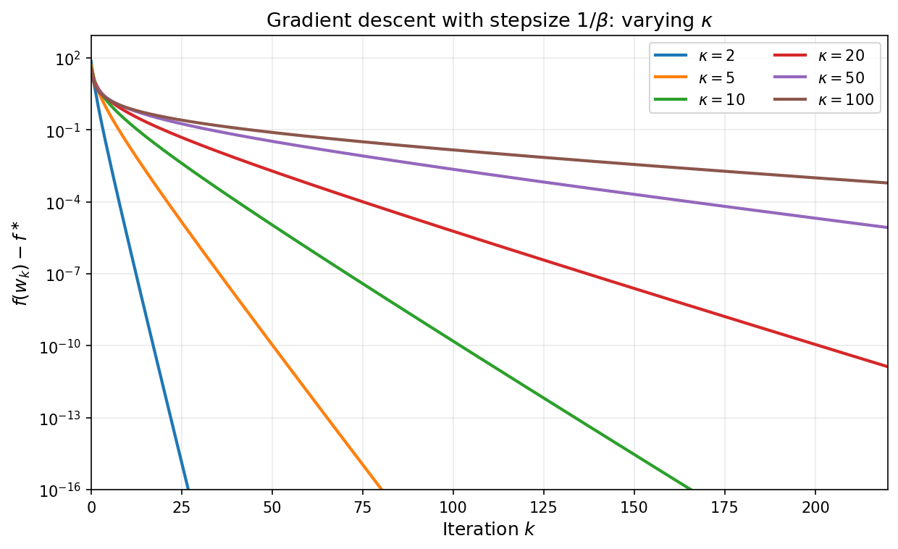

At this point we have extracted essentially the best guarantee available from one fixed stepsize by ensuring a contraction in every step, and then iterating the bound. The natural next question is whether coordinating multiple steps can outperform optimizing each step in isolation. The answer turns out to be yes, and leads to a dramatic improvement in iteration complexity wherein the linear dependence on $\kappa$ is replaced by a linear dependence on $\sqrt{\kappa}$.

---

## 3. Acceleration by Chebyshev Stepsizes

The analysis of gradient descent so far was quite crude in that it was based on lower-bounding the improvement in function value after $k$ iteration using a fixed step-size; in essense, the argument reduced to choosing a fixed step-size that guarantees the largest function value decrease in a single step and then iterating the bound. We now show that by monitoring performance across the entire time horizon, it is possible to choose a **time-varying stepsize** that yields a much faster rate of convergence. To see this, consider gradient descent with *time-varying* stepsizes $\eta_0, \eta_1, \ldots, \eta_{k-1}$. We saw that the error $e_j = x_j - x^\ast$ evolves as $e_{j+1} = (I - \eta_j A)\,e_j$. Therefore, after $k$ steps we have:

$$e_k = (I - \eta_{k-1}A)(I - \eta_{k-2}A)\cdots(I - \eta_0 A)\,e_0 = p_k(A)\,e_0,$$

where $p_k$ is the degree-$k$ polynomial

$$p_k(\lambda) = \prod_{j=0}^{k-1}(1 - \eta_j \lambda).$$

Note that we have $p_k(0) = 1$ regardless of the choice of stepsizes. Expanding $e_k$ in the eigenbasis of $A$ as before yields:

$$
\begin{aligned}
f(x_k) - f^\ast = \tfrac{1}{2}\|e_k\|_A^2
&= \tfrac{1}{2}\sum_{i=1}^d \lambda_i\, p_k(\lambda_i)^2\, c_i^2 \leq \max_{\lambda \in [\alpha, \beta]} p_k(\lambda)^2 \cdot \tfrac{1}{2}\|e_0\|_A^2.
\end{aligned}
$$

Rearranging we deduce

$$\frac{f(x_k) - f^\ast}{f(x_0) - f^\ast} \leq \max_{\lambda \in [\alpha, \beta]} p_k(\lambda)^2.$$

Fixed-stepsize gradient descent corresponds to the special case $p_k(\lambda) = (1 - \eta\lambda)^k$, but we are now free to choose *any* stepsizes. Notice that as we vary the stepsizes $\eta_0,\ldots,\eta_{k-1}$, any polynomial $p(\lambda)$ of degree at most $k$, having all real roots, and satisfying $p(0)=1$ can be realized as $p_k(\lambda)$. Thus choosing time-varying stepsizes is equivalent to choosing such a polynomial. The best possible convergence after $k$ steps is therefore determined by the **minimax polynomial problem**:

$$\min_{\substack{p \in \mathcal{P}^{r}_k \\ p(0) = 1}} \max_{\lambda \in [\alpha, \beta]} p(\lambda)^2. \tag{2}$$

where $\mathcal{P}^r_k$ denotes the set of polynomials of degree at most $k$ with all real roots. The solution to this classical variational problem is described through so-called Chebyshev polynomials of the first kind.

### Chebyshev polynomials

The **Chebyshev polynomial of the first kind** of degree $k$, denoted $T_k$, is defined recursively: set $T_0(x) = 1$ and $T_1(x) = x$ and define

$$T_{k+1}(x) = 2x\,T_k(x) - T_{k-1}(x) \qquad \forall k\geq 1.$$

An equivalent characterization of Chebyshev polynomials is the expression

$$
T_k(\cos\theta) = \cos(k\theta) \qquad \forall \theta \in [0,\pi].
$$

Chebyshev polynomials play a special role in numerical analysis because they solve the extremal problem:

> Any degree-$k$ polynomial $p(x)$ with the same leading coefficient as $T_k$ satisfies
>
> $$\max_{x\in [-1,1]} \lvert p(x)\rvert\geq \max_{x\in [-1,1]} \lvert T_k(x)\rvert=1.$$

In words, among all degree-$k$ polynomials with the same leading coefficient as $T_k$, the Chebyshev polynomial $T_k$ has the smallest maximum absolute value on $[-1,1]$. See the figure below that illustrates a few Chebyshev polynomial $T_k$. 

Chebyshev polynomials satisfy the following key properties:
1. **Boundedness:** The inequality $\lvert T_k(t)\rvert \leq 1$ holds for all $t \in [-1,1]$. 

2. **Roots:** $T_k$ has $k$ roots in $(-1,1)$ at $t_j = \cos\left(\frac{(2j-1)\pi}{2k}\right)$ for $j = 1, \ldots, k$.

3. **Explosion:** For $t > 1$, we have $T_k(t) = \cosh(k\,\operatorname{arccosh}(t))$.

In summary, the Chebyshev polynomials $T_k$ are designed to be highly oscillatory on the interval $[-1,1]$ so as to stay bounded by one in absolute value, but this evidently forces these polynomials to grow rapidly outside the interval $[-1,1]$. 

### The optimal polynomial
Returning to gradient descent, let us see how Chebyshev polynomials yield a solution to the minimax problem $(2)$. We rescale the interval $[\alpha, \beta]$ to $[-1,1]$ with the affine change of coordinates $\varphi(\lambda)=\frac{\beta + \alpha - 2\lambda}{\beta - \alpha}$. Note that $\varphi$ sends $\lambda = 0$ to the point $\sigma := \frac{\beta + \alpha}{\beta - \alpha} = \frac{\kappa + 1}{\kappa - 1}$, assuming $\alpha>0$. Thus, under this substitution, any degree-$k$ polynomial $p(\lambda)$ with $p(0) = 1$ corresponds to a degree-$k$ polynomial $q=p\circ\varphi^{-1}$ with $q(\sigma) = 1$, and

$$\max_{\lambda \in [\alpha, \beta]}\lvert p(\lambda)\rvert = \max_{t \in [-1,1]}\lvert q(t)\rvert.$$

We must therefore find the degree-$k$ polynomial $q$ with $q(\sigma) = 1$ that has the smallest maximum on $[-1,1]$. By properties 1 and 3 above, $T_k$ is bounded by $1$ on $[-1,1]$ while $T_k(\sigma) \gg 1$ for large $k$. This makes the rescaled polynomial

$$q_k^*(t):= \frac{T_k(t)}{T_k(\sigma)}$$

an excellent candidate: it satisfies $q_k^{\ast}(\sigma) = 1$ and $\max_{t \in [-1,1]}\lvert q_k^{\ast}(t)\rvert = 1/T_k(\sigma)$, which is small because $T_k(\sigma)$ grows exponentially in $k$. Transforming back to the $\lambda$-variable, the optimal polynomial is

$$p_k^*(\lambda) :=(q_k^*\circ\varphi)(\lambda)= \frac{T_k\!\left(\frac{\beta + \alpha - 2\lambda}{\beta - \alpha}\right)}{T_k\!\left(\frac{\kappa + 1}{\kappa - 1}\right)}.$$

Note that $p_k^*$ has all real roots. The figure below illustrates the reparametrization for $k=5$: on the left, $p_k^{\ast}$ satisfies the constraint $p_k^{\ast}(0)=1$ and oscillates with small amplitude on $[\alpha,\beta]$; on the right, $q_k^{\ast}$ satisfies $q_k^{\ast}(\sigma)=1$ and oscillates on $[-1,1]$ with the same small amplitude $1/T_k(\sigma)$.

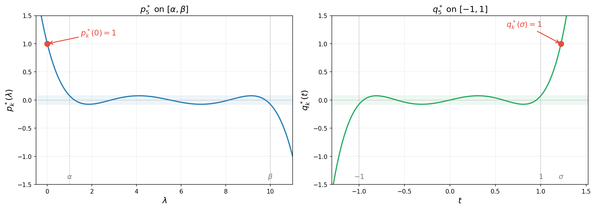

The animation below shows $p_k^{\ast}(\lambda)$ on $[\alpha, \beta]$ for increasing degree $k$. As $k$ grows, the polynomial oscillates more rapidly yet its maximum amplitude $1/T_k(\sigma)$ shrinks exponentially---this is the mechanism behind the accelerated convergence.

Summarizing, we have the following lemma. Note that the first inequality holds as equality, as quickly follows from the extremal property of $T_k$. We omit the argument since it is not needed for what follows.

**Lemma 3.1 (Chebyshev minimax).** *Suppose $\alpha>0$. Then with $\sigma = \frac{\kappa+1}{\kappa-1}$, the minimax value satisfies*

$$\min_{\substack{p \in \mathcal{P}^r_k \\ p(0) = 1}} \max_{\lambda \in [\alpha,\beta]} \lvert p(\lambda)\rvert \leq \frac{1}{T_k(\sigma)} \leq 2\left(\frac{\sqrt{\kappa}-1}{\sqrt{\kappa}+1}\right)^k.$$

*Proof.* We already proved the first inequality. For the second inequality, we use the identity $T_k(x) = \cosh(k\,\operatorname{arccosh}(x))$ valid for every real number $x>1$. Applying this identity with the quantity $\sigma$ gives the relation

$$
\begin{aligned}
\operatorname{arccosh}(\sigma)
&= \ln\!\big(\sigma + \sqrt{\sigma^2 - 1}\big)  = \ln\frac{\sqrt{\kappa}+1}{\sqrt{\kappa}-1}.
\end{aligned}
$$

Consequently, the representation

$$
\begin{aligned}
T_k(\sigma) &= \cosh\!\left(k\ln\frac{\sqrt{\kappa}+1}{\sqrt{\kappa}-1}\right) = \frac{1}{2}\left[\left(\frac{\sqrt{\kappa}+1}{\sqrt{\kappa}-1}\right)^k + \left(\frac{\sqrt{\kappa}-1}{\sqrt{\kappa}+1}\right)^k\right] \geq \frac{1}{2}\left(\frac{\sqrt{\kappa}+1}{\sqrt{\kappa}-1}\right)^k,
\end{aligned}
$$

holds. Taking reciprocals gives the second claim. This completes the proof. $\square$

Returning to choosing stepsizes for gradient descent, the roots of $p^{\ast}_k(\lambda)$ on $[\alpha, \beta]$ are the images of the Chebyshev roots $t_j$ under the inverse map $\varphi^{-1}(t) = \frac{\beta+\alpha}{2} - \frac{\beta-\alpha}{2}\,t$, yielding the stepsizes $\eta_j = 1/\lambda_j$. We thus have arrived at the main theorem of this section.

**Theorem 3.1 (Chebyshev stepsizes).** *Define the stepsizes*

$$\eta_j = \tfrac{1}{\lambda_j}~~ \textrm{where}~~\lambda_j = \tfrac{\beta + \alpha}{2} - \tfrac{\beta - \alpha}{2}\cos\!\left(\tfrac{(2j - 1)\pi}{2k}\right) ~~\textrm{for}~ j = 1, \ldots, k.$$

*Then as long as $\alpha>0$ the gradient descent iterates satisfy*

$$f(x_k) - f^\ast \leq 4\left(\frac{\sqrt{\kappa} - 1}{\sqrt{\kappa} + 1}\right)^{2k}\bigl(f(x_0) - f^\ast\bigr). \tag{3}$$

*Proof.* Combining the estimate $(2)$ and Lemma 3.1 directly yields
$$
\frac{f(x_k) - f^\ast}{f(x_0) - f^\ast} \leq \max_{\lambda \in [\alpha, \beta]} p_k^*(\lambda)^2 = \frac{1}{T_k(\sigma)^2}\leq 4\left(\frac{\sqrt{\kappa}-1}{\sqrt{\kappa}+1}\right)^{2k}.
$$ This completes the proof. $\square$

Thus, the iteration complexity of Chebyshev-accelerated gradient descent is $O(\sqrt{\kappa}\,\log((f(x_0)-f^\ast)/\varepsilon))$---a **square-root improvement** over the $O(\kappa\,\log((f(x_0)-f^\ast)/\varepsilon))$ complexity of fixed-stepsize gradient descent. For $\kappa = 100$, this is the difference between roughly $10$ and $100$ iterations.

### Visualizing the stepsizes and performance of the accelerated algorithm

Note that the convergence guarantees are not ``anytime''. The stepsize must be determined with the number of total iterations $k$ in mind. The next figure shows the Chebyshev stepsizes for each choice of total iteration count $k$ from 1 to 20. Each row displays the $k$ stepsizes as points along the horizontal axis. As $k$ grows, the stepsizes fill out the interval $[1/\beta,\,1/\alpha]$ with increasing density near the endpoints---reflecting the characteristic clustering of Chebyshev roots.

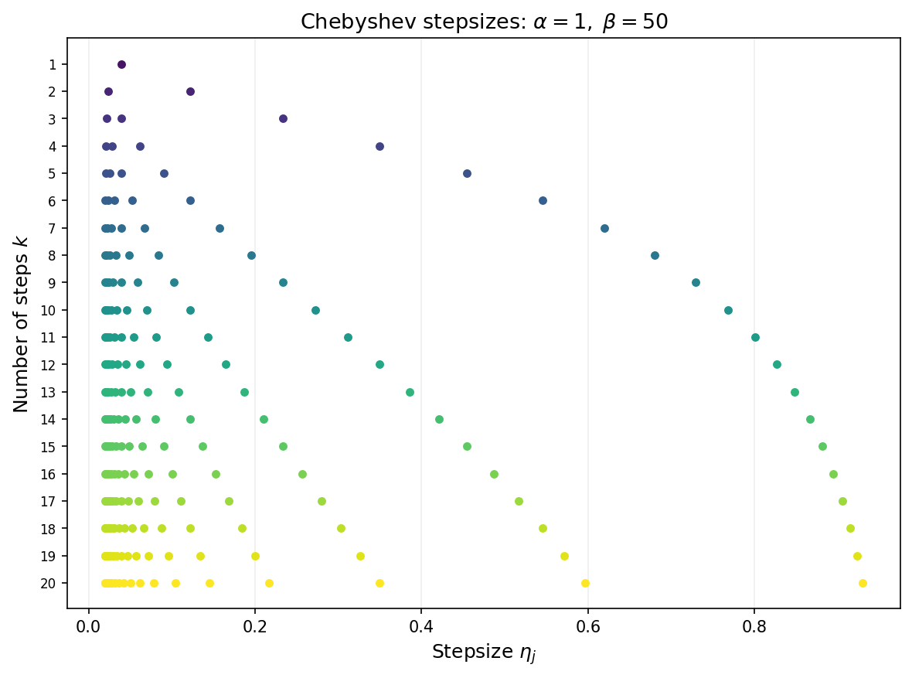

The animation below overlays gradient descent (blue) and Chebyshev-accelerated GD (red) on the same ill-conditioned quadratic. The Chebyshev method reaches the minimizer much faster.

As a final illustration, the plot below overlays GD with stepsize $1/\beta$ (solid) and Chebyshev-accelerated GD with $k = 220$ (dashed) for varying condition numbers. The Chebyshev curves stay nearly flat during the cycle and then drop sharply near the final iteration, reaching machine precision much sooner than GD for every value of $\kappa$.

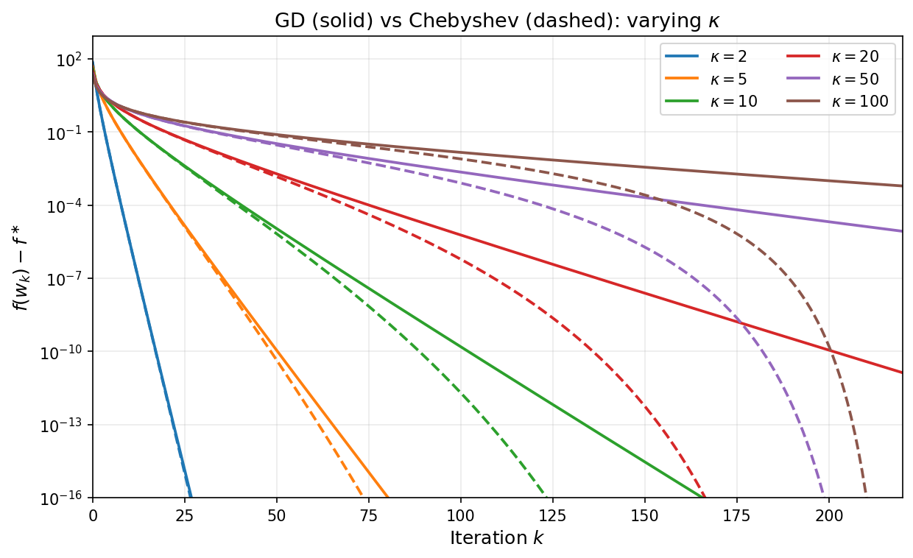

---

## 4. The Krylov Subspace Method and Conjugate Gradient

### From polynomials to Krylov subspaces

The Chebyshev method discussed in Section 3 achieves the iteration complexity $O(\sqrt{\kappa}\,\ln((f(x_0)-f^\ast)/\varepsilon))$ by cleverly choosing time-varying stepsizes---but it requires advance knowledge of the extreme eigenvalues $\alpha$ and $\beta$. Moreover, the total number of iterations must be set in advance in order to define the stepsizes. A natural question arises:

> Can we design an adaptive algorithm that matches this rate adaptively, without knowing the spectrum nor setting the time horizon?

The key observation is that gradient descent with *any* sequence of stepsizes produces iterates that lie in a specific linear subspace. Due to the recursion $x_{j+1} = x_j - \eta_j(Ax_j - b)$, one readily verifies the inclusion

$$
x_k \in x_0 + \mathcal{K}_k(A, r_0),
$$

where $r_0 := b - Ax_0$ is the initial residual and

$$
\mathcal{K}_k(A, r_0) := \mathrm{span}\{r_0,\, Ar_0,\, A^2 r_0,\, \ldots,\, A^{k-1}r_0\}
$$

is the **Krylov subspace** of order $k$. Both fixed-stepsize gradient descent and the Chebyshev method search within this subspace but do not fully exploit it. The natural idea is to search *optimally* within the Krylov subspace at each step.

### The Krylov subspace method

The **Krylov subspace method** is the idealized algorithm that, at each step $k$, sets

$$x_k = \argmin_{x \,\in\, x_0 + \mathcal{K}_k(A,\,r_0)} f(x). \tag{4}$$

The convergence analysis of the Krylov subspace method follows almost immediately from the polynomial framework developed in Section 3.

**Theorem 4.1 (Krylov method convergence).** *Assuming $\alpha > 0$, the Krylov subspace method $(4)$ satisfies*

$$
f(x_k) - f^\ast \leq 4\left(\frac{\sqrt{\kappa} - 1}{\sqrt{\kappa} + 1}\right)^{2k}\bigl(f(x_0) - f^\ast\bigr)
\qquad \forall k\geq 0.
$$

*Moreover, the method converges in at most $m$ iterations, where $m$ is the number of distinct eigenvalues of $A$.*

*Proof.* The linear rate follows directly from Theorem $3.1$: the $k$th iterate produced by the Chebyshev stepsizes lies in $x_0+\mathcal{K}_k(A,r_0)$, whereas the Krylov method minimizes $f$ over that entire affine space, and so cannot do worse.

To prove finite termination, define $e_0:=x_0-x^\ast$ as usual. It suffices to show that $x^\ast$ lies in $x_0+\mathcal{K}_m(A,r_0)$. Observe that a point lies in $x_0+\mathcal{K}_k(A,r_0)$ if and only if it can be written as $x_0+q(A)r_0$ for some polynomial $q$ of degree at most $k-1$. Since equality $r_0=-Ae_0$ holds, we may write

$$
x_0-x^{\ast}+q(A)r_0=e_0-q(A)Ae_0=p(A)e_0, \tag{5}
$$

 where $p(\lambda)=1-\lambda q(\lambda)$ has degree at most $k$ and satisfies $p(0)=1$. Observe that the polynomials $p$ that have this form are exactly the polynomials of degree at most $k$ having zero as a root. With this in mind, define

$$
p(\lambda):=\prod_{i=1}^m\left(1-\frac{\lambda}{\lambda_i}\right),
$$

where $\lambda_1,\ldots,\lambda_m$ are the distinct eigenvalues of $A$. Since this polynomial $p$ vanishes at every eigenvalue of $A$, we deduce that the right-hand-side of equation $(5)$ is zero. Rearranging yields $x^\ast=x_0+q(A)e_0$ and thefore $x^\ast$ lies in $x_0+\mathcal{K}_m(A,r_0)$ as claimed. $\square$

The convergence bound in Theorem 4.1 is identical to the Chebyshev bound in Theorem 3.1, and the iteration complexity has the same order $O(\sqrt{\kappa}\,\ln((f(x_0)-f^\ast)/\varepsilon))$. Importantly, the Krylov method achieves this complexity *without knowing $\alpha$ or $\beta$ and without requiring to specify the time horizon $k$*; moreover, finite termination provides an absolute guarantee of at most $m$ steps, where $m$ is the number of distinct eigenvalues. In practice, clustered eigenvalues lead to far fewer iterations than the worst-case bound suggests.

### The Conjugate Gradient algorithm implements the Krylov method 

The Krylov subspace method $(4)$ is conceptual: a direct implementation would solve a $k$-dimensional linear optimization problem at each step, with cost growing as $k$ increases. The **Conjugate Gradient (CG)** algorithm is an implementation of the Krylov method that uses only **one matrix-vector product per iteration**.

The key idea is to iteratively build a basis of the Krylov subspaces that is orthogonal with respect to the inner product $\langle x,y\rangle_A=x^\top Ay$, so that each successive minimization reduces to a single line search. Conceptually, this basis is formed by a Gram--Schmidt process. The special structure of Krylov subspaces ensures that each Gram--Schmidt update requires only the immediately preceding direction---a **short recurrence**---rather than all previous directions. 

Concretely, suppose that we have constructed an $A$-orthogonal basis $\{p_i\}_{i=0}^{k-1}$ for $\mathcal{K}_{k-1}$ and that we have available a minimizer  $x_k$ of $f$ on $x_0 + \mathcal{K}_k$. Let us see how we can efficiently extend the $A$-orthogonal basis to $\mathcal{K}_{k}$ and construct the minimizer $x_{k+1}$ of $f$ on $x_0 + \mathcal{K}_{k+1}$. To this end, define the residuals $$r_i=-\nabla f(x_i)=b-Ax_i.$$

Observe that we may write $r_k=b-Ax_k=r_0-A(x_k-x_0)$ and therefore $r_k$ lies in $\mathcal{K}_{k+1}$. Now, set 
$$p_{k}=r_k+\beta_{k-1} p_{k-1},$$ for a constant $\beta_{k-1}$ to be chosen. We would like to ensure that $p_{k}$ is $A$-orthogonal to $\{p_i\}_{i=0}^{k-1}$ . To this end, setting $p_{k}^\top Ap_{k-1}=0$ yields the unique choice of $\beta_{k-1}=-\frac{r_k^\top Ap_{k-1}}{p_{k-1}^\top Ap_{k-1}}$. Now for any $i<k-1$ we compute
$$p_{k}^{\top}A p_{i}=r_k^\top A p_{i}+\beta_{k-1}p_{k-1}^{\top}Ap_i.$$ Observe that $p_{k-1}^{\top}Ap_i=0$ by assumed A-orthogonality of $\{p_i\}_{i=0}^{k-1}$ and $r_k^\top A p_{i}=0$ because $A p_{i}$ lies in $\mathcal{K}_{i+1}$ and the optimality conditions for $x_k$ imply  $r_k\perp K_{k}$. Thus $\{p_i\}_{i=0}^{k}$ is indeed an A-orthogonal basis for $\mathcal{K}_{k}$.
It remains to declare 
$$x_{k+1}=\argmin_{\eta} f(x_k+\eta p_{k}). \tag{6}$$Indeed, taking the derivative in $\eta$ implies $r_{k+1}\perp p_{k}$ and for any $i<k$ we have orthogonality
$$r_{k+1}^\top p_{i}=(r_k-\eta_k Ap_k)^{\top}p_i=r_k^\top p_i-\eta_k p_k^\top Ap_i=0,$$
where $\eta_k$ is the minimizer of $(6)$. Thus $x_{k+1}$ is indeed the minimizer of $f$ on $x_0+\mathcal{K}_{k+1}$.
The algorithm we just constructed is called the conjugate gradient method and is summarized in the following.

**Algorithm 1** (Conjugate Gradient Method)

**Input:** $x_0 \in \mathbb{R}^d$

1. Set $r_0 = b - Ax_0$, $\;p_0 = r_0$
2. **For** $k = 0, 1, 2, \ldots$ do:
3. $\qquad \eta_k = \dfrac{r_k^\top r_k}{p_k^\top A p_k}$
4. $\qquad x_{k+1} = x_k + \eta_k\, p_k$
5. $\qquad r_{k+1} = r_k - \eta_k\, A p_k$
6. $\qquad \beta_k = -\dfrac{r_{k+1}^\top A p_k}{p_k^\top A p_k}$
7. $\qquad p_{k+1} = r_{k+1} + \beta_k\, p_k$

Each iteration of the conjugate gradient method requires one matrix-vector product $Ap_k$, the same per-step cost as gradient descent. The vectors $r_k = b - Ax_k$ are the **residuals** satisfying $r_k = -\nabla f(x_k)$, while the vectors $p_k$ are the **search directions**. The stepsize $\eta_k$ minimizes $f$ along the ray $x_k + \eta\, p_k$, while $\beta_k$ ensures $A$-orthogonality of consecutive search directions.

*Remark.* In the literature, the update for $\beta_k$ is usually written in the equivalent form $\beta_k = \|r_{k+1}\|^2/\|r_k\|^2$. The equivalence is straightforward to establish from the residual recursion $Ap_k = (r_k - r_{k+1})/\eta_k$; we omit the argument for brevity. 

### Visualizing CG

The figure below compares GD and CG on the same ill-conditioned 2D quadratic ($\kappa = 12$). Gradient descent (blue) zig-zags along the narrow valley, requiring many iterations to approach the minimum. CG (red) reaches the minimum in exactly 2 steps---the dimension of the problem---by choosing $A$-orthogonal search directions that span the full space.

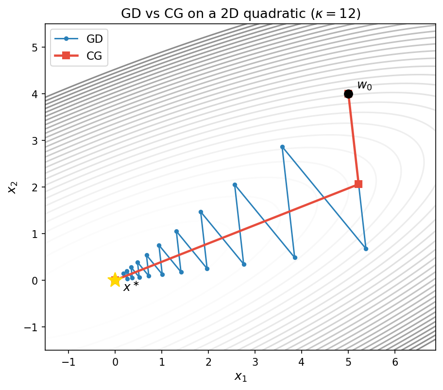

The next figure repeats the varying-$\kappa$ experiment from Section 3, now with CG (dotted) added alongside GD (solid) and Chebyshev (dashed). For each condition number, CG converges much faster than gradient descent and the Chebyshev method---without requiring knowledge of $\alpha$ or $\beta$, and without presetting the number of iterations.

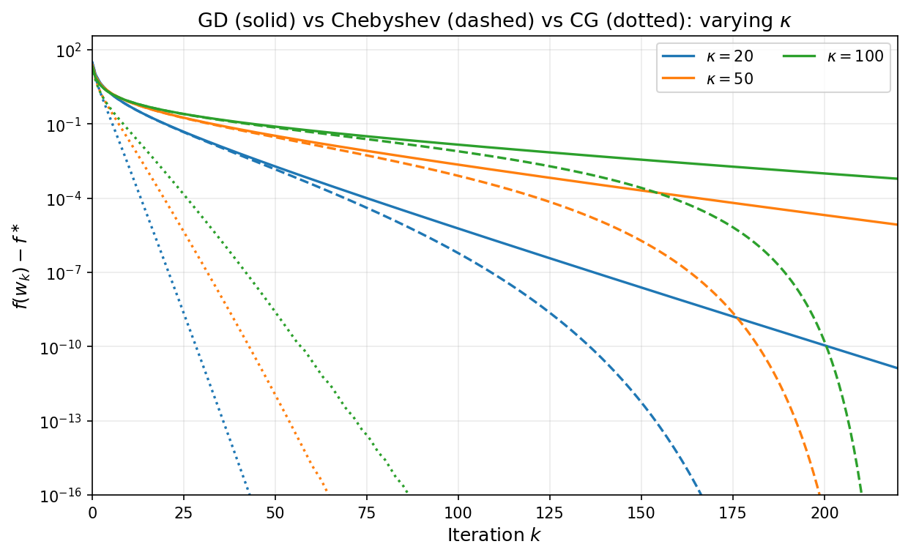

---

## 6. The Positive Semidefinite Case

### Motivation

The convergence guarantees of the previous sections all rely on the assumption $\alpha > 0$---that is, $A$ is positive definite. When $\alpha$ is very close to zero, however, the condition number $\kappa = \beta/\alpha$ can become arbitrarily large and the linear convergence bounds of Theorems 1, 2, and 3 essentially become vacuous. This situation arises often in practice. As a concrete example let us look at the prototypical problem of solving a linear system generated by a **kernel matrix**.

**Example (Kernel matrices and spectral decay).**
A **kernel function** $k\colon\mathbb{R}^d\times\mathbb{R}^d\to\mathbb{R}$ is a symmetric function such that the **kernel matrix** $K\in\mathbb{R}^{n\times n}$ defined by $K_{ij}=k(x_i,x_j)$ is positive semidefinite for every finite collection of points $x_1,\dots,x_n\in\mathbb{R}^d$. Kernel matrices are ubiquitous: they arise in Gaussian process regression, support vector machines, kernel ridge regression, and radial-basis-function interpolation. Given a target vector $y\in\mathbb{R}^n$, the core computational task reduces to solving the linear system

$$K\alpha = y,$$
which is exactly the quadratic minimization problem $\min_\alpha \tfrac{1}{2}\alpha^\top K\alpha - y^\top \alpha$.

Two of the most widely used kernels depend only on the $\ell_2$ distance $\|x-y\|$ and a length-scale parameter $\sigma>0$, called the bandwidth. The **Gaussian (RBF) kernel** is
$$k_{\mathrm{RBF}}(x,y)=\exp\!\left(-\frac{\|x-y\|^2}{2\sigma^2}\right).$$
It is infinitely differentiable ($C^\infty$). The **Laplace kernel** is
$$k_{\mathrm{Lap}}(x,y)=\exp\!\left(-\frac{\|x-y\|}{\sigma}\right).$$
It is continuous but not differentiable at the origin ($C^0$). The Laplace kernel is the Matérn kernel with $\nu=\tfrac12$. More generally, the Matérn family interpolates between Laplace and Gaussian by introducing a smoothness parameter $\nu>0$. The general **Matérn kernel** is
$$k_\nu(x,y)=\frac{2^{1-\nu}}{\Gamma(\nu)}\left(\frac{\sqrt{2\nu}\,\|x-y\|}{\sigma}\right)^\nu K_\nu\!\left(\frac{\sqrt{2\nu}\,\|x-y\|}{\sigma}\right),$$

where $K_\nu$ is the modified Bessel function of the second kind. The parameter $\nu$ controls the smoothness: the Matérn kernel with parameter $\nu$ is $\lceil \nu\rceil -1$ times continuously differentiable. Several important finite-$\nu$ cases, together with the Gaussian limit, are summarized in the following table:

| Kernel | $\nu$ | Closed form | Smoothness |
|---|---|---|---|
| Laplace | $\tfrac12$ | $\exp\bigl(-\tfrac{\|x-y\|}{\sigma}\bigr)$ | $C^0$ |
| Matérn 3/2 | $\tfrac32$ | $\bigl(1+\tfrac{\sqrt{3}\|x-y\|}{\sigma}\bigr)\exp\bigl(-\tfrac{\sqrt{3}\|x-y\|}{\sigma}\bigr)$ | $C^1$ |
| Matérn 5/2 | $\tfrac52$ | $\bigl(1+\tfrac{\sqrt{5}\|x-y\|}{\sigma}+\tfrac{5\|x-y\|^2}{3\sigma^2}\bigr)\exp\bigl(-\tfrac{\sqrt{5}\|x-y\|}{\sigma}\bigr)$ | $C^2$ |
| Gaussian (RBF) | $\infty$ | $\exp\bigl(-\tfrac{\|x-y\|^2}{2\sigma^2}\bigr)$ | $C^\infty$ |

In the limit $\nu\to\infty$ the Matérn kernel recovers the Gaussian kernel.

For reasonable distributions of data points (e.g., Gaussian, uniform, or with a bounded density on a compact set), the eigenvalues of the normalized kernel matrix $(1/n)K$ resemble those of an associated linear integral operator, whose spectral decay can be analyzed explicitly. More precisely suppose that the points are drawn from a distribution $\nu$ on $\R^d$. For any function $f\in L_2(\nu)$ define the n-dimensional vector 

$$f^{(n)}=(f(x_1),\ldots, f(x_n)).$$

Then $\frac{1}{n}K$ send $f^{(n)}$ to a vector with $j$'th coordinate given by
$$\left(\tfrac{1}{n}Kf^{(n)}\right)_j = \frac{1}{n}\sum_{\ell=1}^n k(x_j,x_\ell)f(x_\ell) \approx \int k(x_j,x')f(x')\,d\nu(x').$$
We can think of the right side as a another function evaluated at $x_j$. Thus we can define a linear operator on functions $T\colon L_2(\nu)\to L_2(\nu)$ given by 

$$(Tf)(x)=\int k(x,x')f(x')\,d\nu(x').$$

Indeed, under mild conditions the eigenvalues of $\tfrac{1}{n}Kf^{(n)}$ become close to the eigenvalues of the integral operator $T$. Let $\mu_1\geq\mu_2\geq\cdots$ denote the eigenvalues of $T$, and let $p$ denote the intrinsic dimension of the data support. The end result is the following asymptotic estimate that holds for all sufficiently large eigenvalue indices $i$:

| Kernel | Eigenvalue decay | Rate for $\mu_i$ |
|---|---|---|
| Laplace ($\nu=\tfrac12$) | polynomial | $\mu_i\asymp i^{-(1+p)/p}$ |
| Matérn (smoothness $\nu$) | polynomial | $\mu_i\asymp i^{-(2\nu+p)/p}$ |
| Gaussian (RBF) | super-exponential | $\mu_i\lesssim C\exp(-c\, i^{2/p})$ |

As a consequence, kernel matrices are typically extremely ill-conditioned: the effective condition number $\lambda_1/\lambda_n$ grows rapidly with $n$, and for large $n$ many eigenvalues are numerically zero. This is precisely the regime where the positive definite theory becomes vacuous.

The figure below illustrates this phenomenon on synthetic data. We draw $n=5000$ points independently from the standard Gaussian distribution $\mathcal{N}(0,I_{100})$ in $\mathbb{R}^{100}$, use the same sample for all three kernels, choose the bandwidth $\sigma$ by the median heuristic, and plot the normalized eigenvalues $\lambda_i/\lambda_1$ on a log-log scale. A noticeable bend appears around index $i\approx d=100$; this is a finite-sample crossover caused by the interaction between the ambient dimension, the sampling distribution, and the kernel bandwidth, rather than a direct prediction of the asymptotic estimates above. The asymptotic theory instead describes the tail behavior after such pre-asymptotic effects: past the bend, the three kernels separate clearly. The Gaussian kernel (blue) exhibits the fastest decay, the Laplace kernel (red) the slowest, and the Matérn 5/2 kernel (green) is intermediate, in qualitative agreement with the rates in the table.
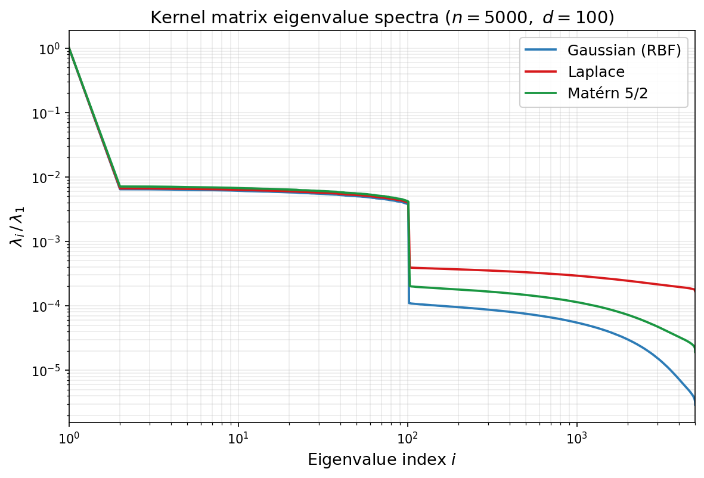

We will now develop convergence guarantees for all of the methods we have seen---gradient descent, Chebyshev-accelerated gradient descent, and the Krylov method---that are insensitive to the minimal eigenvalue of $A$. The price to pay is that the logarithmic dependence on $1/\varepsilon$ in the positive definite case degrades to a polynomial dependence on $1/\varepsilon$.

### Setup

We consider the same quadratic objective $f(x) = \tfrac{1}{2}x^\top Ax - b^\top x$, but now we allow $\alpha = 0$. We assume throughout that $b \in \mathrm{range}(A)$, ensuring that the solution set

$$S = \{x \in \mathbb{R}^d : Ax = b\}$$

is nonempty and we let $x^{\ast}\in S$ be arbitrary. 

The eigenvalues of $A$ are ordered as

$$0 = \lambda_1 = \cdots = \lambda_r < \lambda_{r+1} \leq \cdots \leq \lambda_d = \beta,$$

where $r \geq 1$ is the dimension of $\ker(A)$.

### Gradient descent

We begin with the convergence rate of gradient descent. The key idea is that we have previously shown the exact relation 
$$f(x_k) - f^\ast = \frac{1}{2}\sum_{i=1}^{d}\lambda_i(1-\eta\lambda_i)^{2k}\,c_i^2$$
where $\eta$ is the stepsise and  $c_i$ are the coefficients of the initial error in the eigenbasis of $A$. Previously, we pulled out $\sup_{\lambda\in [\alpha,\beta]}(1-\eta\lambda)^{2k}$ from the sum. We now instead pull out $\sup_{\lambda\in [\alpha,\beta]}\lambda(1-\eta\lambda)^{2k}$.

**Theorem 6.1 (Sublinear convergence of gradient descent).** *With stepsize $\eta = 1/\beta$, the gradient descent iterates satisfy*

$$f(x_k) - f^\ast \leq \frac{\beta}{2(2k+1)}\,\|x_0 - x^\ast\|^2 \tag{7}.$$

*Proof.* Writing out the the initial error $e_0=x_0-x^\ast=\sum_{i=1}^d c_i v_i$ in the eigen-basis of $A$ yields

$$
f(x_k) - f^\ast = \frac{1}{2}\sum_{i=1}^{d}\lambda_i(1-\lambda_i/\beta)^{2k}\,c_i^2 \leq \frac{1}{2}\max_{\lambda \in [0,\beta]}\lambda(1-\lambda/\beta)^{2k}\cdot\|e_0\|^2.
$$

Elementary calculus shows $\sup_{t\in [0,1]}t(1-t)^{q}=\frac{1}{1+q}(\frac{q}{1+q})^q\leq \frac{1}{1+q}$. Therefore setting $q=2k$ yields 

$$\max_{\lambda \in (0,\beta]}\lambda(1-\lambda/\beta)^{2k} \leq \frac{\beta}{2k+1},$$

which completes the proof. $\square$

From Theorem 6.1, converting to complexity, the bound $f(x_k) - f^\ast \leq \varepsilon$ is guaranteed to hold whenever

$$k \geq \frac{\beta\,\|x_0 - x^\ast\|^2}{4\varepsilon}.$$

Thus the iteration complexity is

$$O\!\left(\frac{\beta\,\|x_0 - x^\ast\|^2}{\varepsilon}\right).$$

Compared with the $O(\kappa\,\ln(1/\varepsilon))$ complexity of gradient descent in the positive definite case, the dependence on accuracy has changed from **logarithmic** to **polynomial**: achieving an additional digit of accuracy now requires a tenfold increase in iterations, rather than a fixed additive cost. This is the hallmark of sublinear convergence.

Note that an important feature of Theorem 6.1 is that the convergence bound involves the squared Euclidean distance $\|x_0 - x^\ast\|^2$ rather than the initial function gap $f(x_0) - f^\ast$, and this is unavoidable.

### Acceleration by Chebyshev stepsizes

As in the positive definite case, the $O(1/k)$ rate of fixed-stepsize gradient descent can be improved by varying the stepsize across iterations. Recall that the Chebyshev stepsizes arose in the positive definite case from the fact the the Chebychev polynomial of the first kind $T_k$ minimizes $\max_{\lambda \in [-1,1]} p(\lambda)^2$ over all degree at most $k$ polynomials with the same leading coeffient. In the positive semidefinite case, the Chebychev polynomials of the second kind will play an analogoues role.

### Chebyshev polynomials of the second kind

 **Chebyshev polynomials of the second kind** are defined by the same recurrence as $T_k$ but with a different initial condition: set $U_0(x) = 1$ and $U_1(x) = 2x$ and define

$$U_{j+1}(x) = 2x\,U_j(x) - U_{j-1}(x) \qquad \forall j\geq 1.$$

An equivalent trigonometric characterization is

$$U_j(\cos\theta) = \frac{\sin\bigl((j+1)\theta\bigr)}{\sin\theta},$$

from which one directly sees $U_j(1) = j+1$. See the figure below.

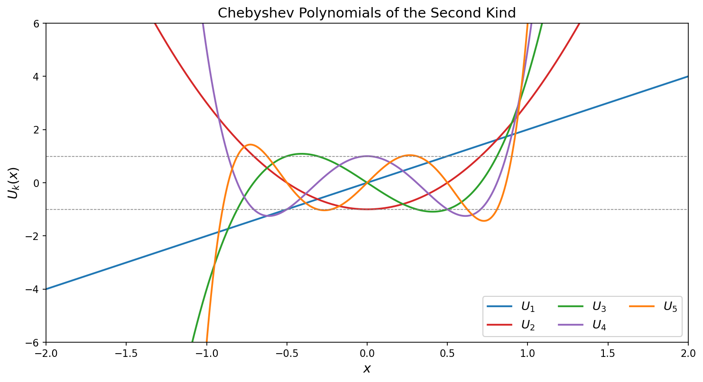

The Chebyshev polynomials of the second kind solve a weighted analogue of the extremal problem for $T_k$:

> Any degree-$k$ polynomial $p(x)$ with the same leading coefficient as $U_k$ satisfies
>
> $$\max_{x\in [-1,1]} \sqrt{1-x^2}\,\lvert p(x)\rvert\geq \max_{x\in [-1,1]} \sqrt{1-x^2}\,\lvert U_k(x)\rvert=1.$$

The equality on the right follows from the identity $\sqrt{1-x^2}\,U_k(x) = \sin((k+1)\theta)$ when $x=\cos\theta$. As we will see, the weight $\sqrt{1-x^2}$ is precisely what arises from the extra factor of $\lambda$ in the PSD minimax problem after the change of variables.

The key properties, paralleling those of $T_k$, are:
1. **Boundedness:** $\lvert U_k(\cos\theta)\rvert \leq k+1$ for all $\theta$, and moreover $\lvert \sin\theta\, U_k(\cos\theta)\rvert = \lvert\sin((k+1)\theta)\rvert \leq 1$.
2. **Roots:** $U_{k}$ has $k$ roots in $(-1,1)$ at $\cos(j\pi/(k+1))$ for $j = 1, \ldots, k$.
3. **Growth at edges:** $U_k(1) = k+1$, so $U_k$ grows polynomially at $x=1$, in contrast to the exponential growth of $T_k$.

We now linearly reparametrize and rescale the $U_{k-1}$ and define $$\phi_k(\lambda) = \left(1 - \frac{\lambda}{\beta}\right)\frac{U_{k-1}(1 - 2\lambda/\beta)}{k}.$$
Note that we have $\phi_k(0) = 1$ and the roots of $\phi_k$ on $[0,\beta]$ are $\lambda_j = \beta\sin^2(j\pi/(2k))$ for $j = 1, \ldots, k$.

**Lemma 6.2 (Chebyshev minimax, PSD case).** *The polynomial $\phi_k$ satisfies*

$$\max_{\lambda \in [0,\beta]}\,\lambda\,\phi_k(\lambda)^2 \leq \frac{\beta}{4k^2}. \tag{10}$$

*Proof.* Substitute $\cos\theta = 1 - 2\lambda/\beta$ for $\theta \in [0,\pi]$, so that $\lambda = \beta\sin^2(\theta/2)$ and $1 - \lambda/\beta = \cos^2(\theta/2)$. The Chebyshev identity gives $U_{k-1}(\cos\theta) = \sin(k\theta)/\sin\theta$, and the factorization $\sin\theta = 2\sin(\theta/2)\cos(\theta/2)$ yields

$$
\begin{aligned}
\lambda\,\phi_k(\lambda)^2
&= \beta\sin^2(\theta/2)\cdot\cos^4(\theta/2)\cdot\frac{\sin^2(k\theta)}{k^2\sin^2\theta} \\[4pt]
&= \beta\sin^2(\theta/2)\cdot\cos^4(\theta/2)\cdot\frac{\sin^2(k\theta)}{4k^2\sin^2(\theta/2)\cos^2(\theta/2)} \\[4pt]
&= \frac{\beta\cos^2(\theta/2)\,\sin^2(k\theta)}{4k^2}.
\end{aligned}
$$

Since $\cos^2(\theta/2) \leq 1$ and $\sin^2(k\theta) \leq 1$ for all $\theta$, the claim follows. $\square$

We are now ready to see the accelerated rate.

**Theorem 6.2 (Chebyshev stepsizes, PSD case).** *Define the stepsizes*

$$\eta_j = \frac{1}{\beta\sin^2(j\pi/(2k))} \qquad \textrm{for}~ j = 1, \ldots, k.$$

*Then the gradient descent iterates satisfy*

$$f(x_k) - f^\ast \leq \frac{\beta}{8k^2}\,\|x_0 - x^\ast\|^2. \tag{9}$$

*Proof.* Write the initial error in the eigenbasis of $A$ as
$
e_0=x_0-x^\ast=\sum_{i=1}^d c_i v_i.
$ For gradient descent with stepsizes $\eta_1,\dots,\eta_k$, define the degree-$k$ polynomial $
p_k(\lambda):=\prod_{j=1}^k(1-\eta_j\lambda).
$ By the choice $
\eta_j = \frac{1}{\beta\sin^2(j\pi/(2k))}
$ we have $
p_k(\lambda)=\phi_k(\lambda).
$ Therefore, the general error formula from Section 2 gives
$$
f(x_k) - f^\ast = \tfrac{1}{2}\sum_{i=1}^d \lambda_i\, \phi_k(\lambda_i)^2\, c_i^2
\leq \tfrac{1}{2}\max_{\lambda \in [0,\beta]} \lambda\,\phi_k(\lambda)^2 \sum_{i=1}^d c_i^2.
$$
Applying Lemma 6.2 and using $\sum_{i=1}^d c_i^2=\|e_0\|^2=\|x_0-x^\ast\|^2$, we obtain
$$
f(x_k) - f^\ast \leq \tfrac{1}{2}\cdot\frac{\beta}{4k^2}\cdot\|x_0-x^\ast\|^2
= \frac{\beta}{8k^2}\,\|x_0 - x^\ast\|^2.
$$
This completes the proof. $\square$

Thus, the iteration complexity of the Chebyshev accelerated algorithm is $O(\sqrt{\beta\,\|x_0 - x^\ast\|^2/\varepsilon})$---a **square-root improvement** over the $O(\beta\,\|x_0 - x^\ast\|^2/\varepsilon)$ complexity of fixed-stepsize gradient descent. This is a **quadratic improvement** in the complexity.

The corresponding stepsize schedule in the positive semidefinite case is shown below for several values of $k$.

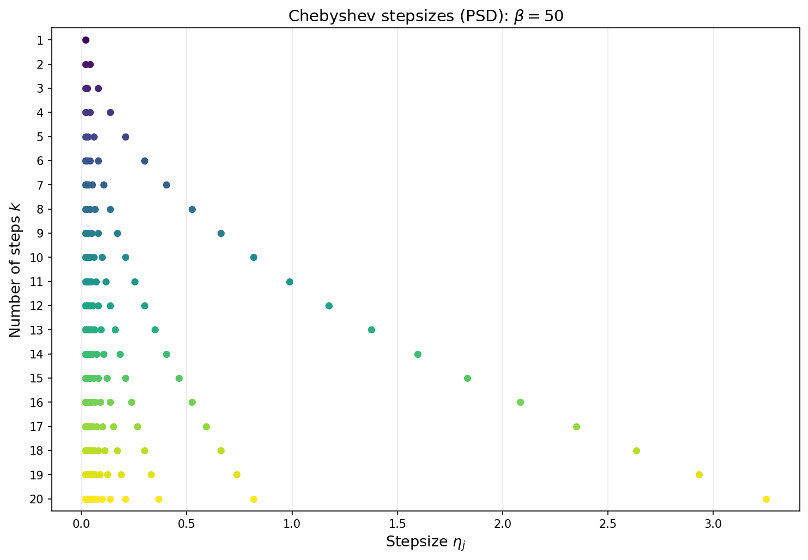

As in the positive definite case, the Chebyshev stepsizes require knowledge of $\beta$ and the total number of iterations $k$ must be fixed in advance.

### Conjugate gradient in the positive semidefinite case

The **Krylov subspace method** in the PSD setting is defined exactly as before: at step $k$, it minimizes $f$ over the affine space
$$
x_0+\mathcal{K}_k(A,r_0).
$$ The only new issue is that $A$ may be singular. However, since $b\in\mathrm{range}(A)$ and $Ax_0\in\mathrm{range}(A)$, the residual $
r_0=b-Ax_0
$ lies in $\mathrm{range}(A)$. Therefore the entire Krylov subspace $\mathcal{K}_k(A,r_0)$ is contained in $\mathrm{range}(A)$, and $A$ is positive definite on that subspace. Consequently, the same short-recurrence argument from Section 4 shows that, until termination, the conjugate gradient method is well-defined and implements the PSD Krylov method: at each step, the CG iterate $x_k$ minimizes $f$ over $x_0+\mathcal{K}_k(A,r_0)$.
With this observation in hand, the convergence analysis is immediate from Theorem 6.2, exactly as in the positive definite case.

**Theorem 6.3 (CG convergence, PSD case).** *The CG iterates satisfy*

$$f(x_k) - f^\ast \leq \frac{\beta}{8k^2}\,\|x_0 - x^\ast\|^2, \tag{11}$$

*and CG terminates in at most $m$ iterations, where $m$ is the number of distinct nonzero eigenvalues of $A$.*

*Proof.* The rate follows directly from Theorem 6.2: the $k$th iterate produced by the PSD Chebyshev stepsizes lies in $x_0+\mathcal{K}_k(A,r_0)$, whereas CG minimizes $f$ over that entire affine space and so cannot do worse. $\square$

The bound $(11)$ matches the PSD Chebyshev bound $(9)$; the gain of CG is that it attains this behavior adaptively, without requiring $\beta$ or a preset horizon.

### Numerical illustration

The figure below compares GD, PSD Chebyshev, and CG on a $d=200$ dimensional quadratic whose spectrum follows the power law $\lambda_i = i^{-3}$ (condition number $\approx 8\times 10^6$). For each horizon $k$, the PSD Chebyshev point plotted is the iterate after running all $k$ stepsizes from $x_0$. The sublinear separation between GD ($O(1/k)$) and Chebyshev ($O(1/k^2)$) is clearly visible, while CG reaches high accuracy in far fewer iterations.

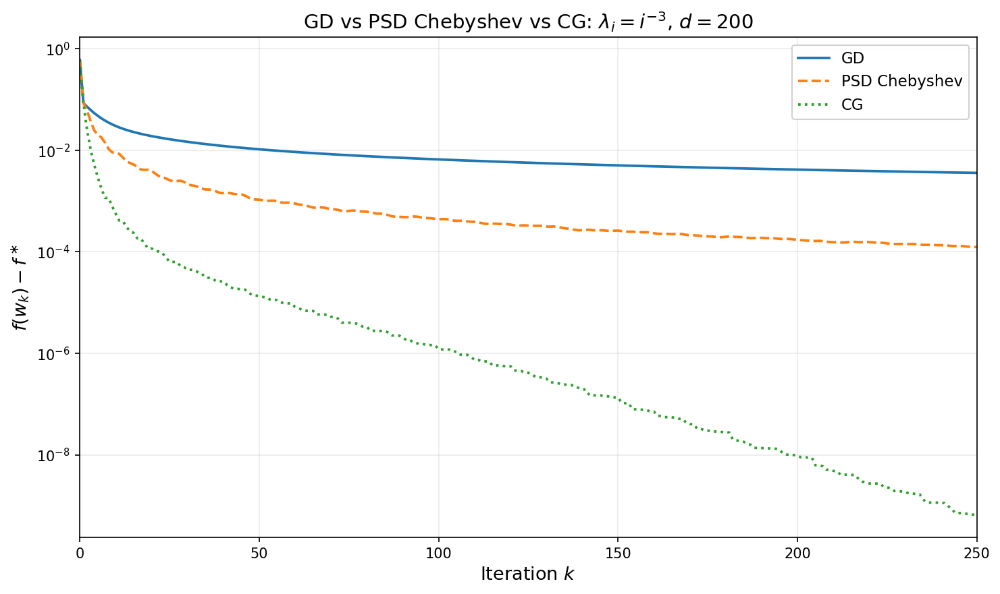

---

## 7. Convergence Under Spectral Structure

### Beyond worst-case analysis

Up to this point, we emphasized worst-case bounds obtained from extreme eigenvalues alone. In this section, we obtain refined and improved guarantees that take into account the entire spectrum of the matrix $A$, rather than its extreme eigenvalues. These refined bounds are important in practice because in high-dimensional problems, the *distribution* of eigenvalues is often far from the worst case, and exploiting this structure leads to substantially sharper estimates.

As motivation, recall from Section 2 that for gradient descent with time varying step-sizes $\eta_i$ we have the exact error formula:

$$
f(x_k) - f^\ast = \frac{1}{2}\sum_{i=1}^d \lambda_i\,p_k(\lambda_i)^{2}\,c_i^2, \tag{12}
$$

where we define $p_k(\lambda)=\prod_{j=1}^k(1-\eta_j\lambda)$ and $c_i$ are the coefficients of $e_0$ in the eigenbasis of $A$. The worst-case analysis bounds this sum by pulling out the maximum: $\max_{\lambda\in[\alpha,\beta]} p_k(\lambda)^2$ in the positive definite case, or $\max_{\lambda\in[0,\beta]} \lambda\, p_k(\lambda)^2$ in the positive semidefinite case. This upper bound ignores two sources of structure:

1. **Initial error.** If the components $c_i$ of the initial error are small for small eigenvalues, the sum is dominated by well-conditioned directions. This is captured by *source conditions*.

2. **Eigenvalue density.** If most eigenvalues lie far from the point where $\lambda p_k(\lambda)^{2}$ is largest, replacing the sum by an integral against the spectral density gives a sharper estimate. This is the *spectral integral* approach.

We develop both ideas in turn, then combine them.

### Source conditions

A **source condition** of order $s \geq 0$ is the assumption

$$e_0 = A^s\,w \qquad \text{for some } w \in \mathbb{R}^d.$$

In the eigenbasis, this means $c_i = \lambda_i^s\,\tilde{c}_i$ where $\tilde{c}_i = v_i^\top w$. The factor $\lambda_i^s$ suppresses the components of $e_0$ along eigenvectors with small eigenvalues, so the initial error is concentrated in the large-eigenvalue directions of $A$. 

**Example (Source conditions in kernel regression).**
The source condition arises naturally in kernel regression, where it is equivalent to a classical smoothness condition on the target function.

**Setup.** Suppose data points $x_1,\dots,x_n$ are drawn i.i.d. from a measure $\nu$ on $\mathbb{R}^d$, and the labels are generated by an unknown function: $y_i = h(x_i)$. As recalled in Section 5, kernel regression solves the linear system $K\alpha = y$, where $K_{ij} = k(x_i,x_j)$ is the kernel matrix and $y = (y_1,\dots,y_n)^\top$. The corresponding estimate of $h$ is then the function $x\mapsto \sum_{i=1}^n \alpha_i k(x,x_i).$  The question is: when does the source condition hold for this problem, and what does it say about $h$? To answer this, we pass through the continuous integral operator $T$ associated with the kernel, which serves as the large-$n$ limit of the linear system.

**The integral operator.** As we have seen in Section 6, the kernel $k$ and the data distribution $\nu$ define an **integral operator** $T\colon L^2(\nu) \to L^2(\nu)$ by

$$(Tf)(x) = \int k(x,x')\,f(x')\,d\nu(x').$$

By the celebrated Mercer's theorem this operator admits an eigendecomposition

$$T\phi_i = \mu_i\,\phi_i, \qquad \mu_1 \geq \mu_2 \geq \cdots > 0,$$

with eigenfunctions $\phi_i$ forming an orthonormal basis for $L^2(\nu)$. For the Laplace kernel on $[0,1]$, these eigenfunctions have increasing spatial frequency as $i$ grows: $\phi_1$ is a smooth hump, $\phi_2$ has one oscillation, and successive eigenfunctions oscillate more and more rapidly. The animation below illustrates this for the Laplace kernel on $[0,1]$ with uniform measure and bandwidth $\sigma = 0.1$. Similar oscillatory behavior can also be seen for the eigenvalue functions of other common kernels as well.

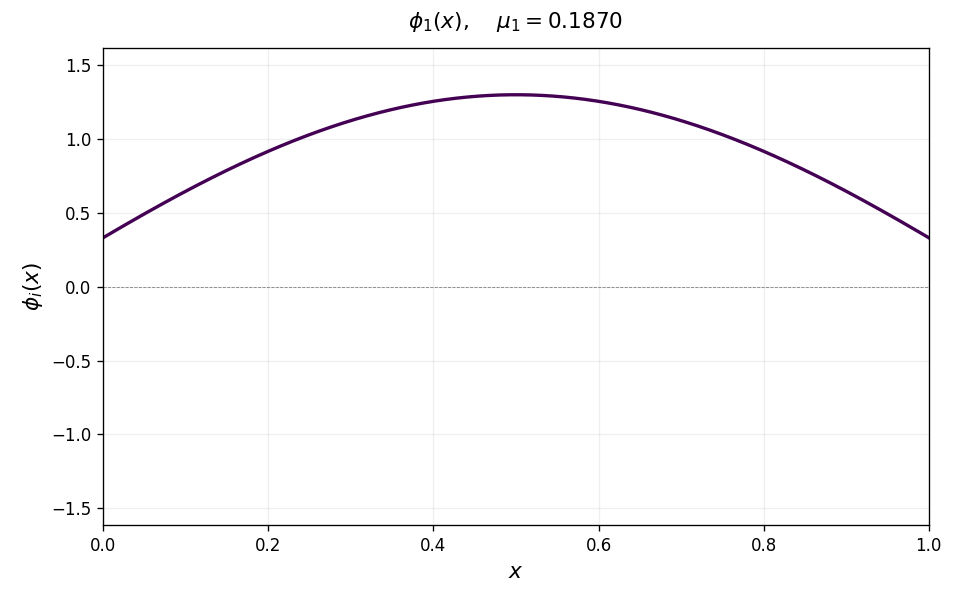

**Source condition as smoothness/lack of oscillations.** Any function $h \in L^2(\nu)$ can be expanded in the eigenbasis as

$$h = \sum_{i\geq 1} \hat{h}_i\,\phi_i.$$

The source condition $h = T^s g$ with $\|g\|^2_{L_2(\nu)}\leq M$ reads, in the eigenbasis, as

$$\hat{h}_i = \mu_i^s\,\hat{g}_i, \qquad \sum_{i\geq 1} \hat{g}_i^2 \leq M^2,$$

where $\hat{h}_i$ and $\hat{g}_i$ denote the coefficients of $h$ and $g$ in the eigenbasis, i.e.,

$$\hat{h}_i := \langle h, \phi_i \rangle_{L^2(\nu)}, \qquad \hat{g}_i := \langle g, \phi_i \rangle_{L^2(\nu)}.$$

Equivalently, this amounts to requiring

$$\sum_{i\geq 1} \mu_i^{-2s}\,\lvert\hat{h}_i\rvert^2 \leq M^2.$$

This forces the coefficients of $h$ to decay at least as fast as $\mu_i^s$. For most interesting kernels, the higher-indexed eigenfunctions have increasing oscillations/frequency.

There is also a close connection of the source condition to a quantitative measure of smoothness. This connection is cleanest in one dimension. For the Laplace kernel on $[0,1]$, the eigenvalues decay as $\mu_i \asymp i^{-2}$ and the eigenfunctions closely approximate sines and cosines (up to boundary effects), so the coefficients $\hat{h}_i = \langle h, \phi_i \rangle$ are closely related to the Fourier coefficients of $h$. The standard Fourier characterization of Sobolev spaces says that $f \in H^m$ (i.e., $f$ has $m$ square-integrable derivatives) if and only if $\sum_i i^{2m}\lvert\hat{f}_i\rvert^2 < \infty$. Since $\mu_i \asymp i^{-2}$, the source condition $\sum_i \mu_i^{-2s}\lvert\hat{h}_i\rvert^2 \leq M^2$ becomes $\sum_i i^{4s}\lvert\hat{h}_i\rvert^2 \leq M^2$, which turns out to precisely characterize the Sobolev space $H^{2s}([0,1])$. Thus $s = 1/2$ corresponds to one derivative, $s = 1$ to two derivatives, and so on. 

**From operator to matrix.** We now connect the function-level source condition to the finite-sample linear system. Let $\hat\mu_i$ and $v_i$ denote the eigenvalues and eigenvectors of the normalized kernel matrix $\tfrac{1}{n}K$. Given a function $f$, define its sampled vector by evaluation,

$$f^{(n)} := \bigl(f(x_1),\dots,f(x_n)\bigr)^\top \in \mathbb{R}^n.$$

We claim that one expects $\hat\mu_i \approx \mu_i$ and $(v_i)_j \approx \phi_i(x_j)/\sqrt{n}$  for large $n$. The reason is that $\tfrac{1}{n}K$ is the empirical version of the integral operator $T$:  multiplying $\tfrac{1}{n}K$ by the vector $f^{(n)}$, the $j$-th component satisfies

$$\left(\tfrac{1}{n}Kf^{(n)}\right)_j = \frac{1}{n}\sum_{\ell=1}^n k(x_j,x_\ell)f(x_\ell) \approx \int k(x_j,x')f(x')\,d\nu(x') = (Tf)(x_j),$$

 Therefore, if $\phi_i$ is an eigenfunction of $T$ with $T\phi_i = \mu_i \phi_i$, then the sampled vector with entries $\phi_i(x_j)$ should be approximately an eigenvector of $\tfrac{1}{n}K$, after normalization by $1/\sqrt{n}$ to make its Euclidean norm $O(1)$. This leads to the heuristic correspondences $\hat\mu_i \approx \mu_i$ and $(v_i)_j \approx \phi_i(x_j)/\sqrt{n}$. Consequently, we have

$$v_i^\top y = \sum_{j=1}^n (v_{i})_j\,h(x_j) \;\approx\; \frac{1}{\sqrt{n}}\sum_{j=1}^n \phi_i(x_j)\,h(x_j) \;\approx\; \sqrt{n}\int \phi_i(x)\,h(x)\,d\nu(x) \;=\; \sqrt{n}\,\hat{h}_i.$$

Now consider running gradient descent on the normalized system $\tfrac{1}{n}K\alpha = \tfrac{1}{n}y$, which has the same solution $\alpha^\ast = K^{-1}y$ but now $A = \tfrac{1}{n}K$ has bounded eigenvalues $\hat\mu_i \approx \mu_i$. Starting from $\alpha_0 = 0$, the initial error $e_0 = \alpha^\ast$ has coefficients

$$c_i \;:=\; v_i^\top e_0 \;=\; \frac{v_i^\top(\tfrac{1}{n}y)}{\hat\mu_i} \;\approx\; \frac{\hat{h}_i}{\sqrt{n}\,\mu_i}.$$

If the function-level source condition $h = T^s g$ holds (so $\hat{h}_i = \mu_i^s\,\hat{g}_i$), this becomes

$$c_i \;\approx\; \frac{\mu_i^{s-1}}{\sqrt{n}}\,\hat{g}_i \;=\; \hat\mu_i^{s-1}\,w_i, \qquad \text{where}\quad w_i = \frac{\hat{g}_i}{\sqrt{n}}.$$

Note that

$$\|w\|_2^2=\frac{1}{n}\sum_{i=1}^n \hat{g}_i^2\approx \|g\|^2_{L_2(\nu)}.$$

Thus we have the matrix-level source condition $e_0 = A^{s'}w$ with exponent $s' = s - 1$. The exponent shift is the essential point: **a function-level source condition of order $s$ translates to a matrix-level source condition of order $s' = s-1$.** In particular, one needs $s > 1$ (e.g. $h \in H^{2+\epsilon}$ for the Laplace kernel).

**Numerical illustration.** The figure below demonstrates this on a Laplace kernel ($\sigma = 0.15$) with $n = 1000$ points drawn uniformly from $[0,1]$. We plot the initial-error coefficients $\lvert c_i\rvert$ versus $\hat\mu_i$ on a log-log scale; the slope of the log-log fit directly reveals the matrix-level source parameter $s'$ that enters Theorem 7.1. For a smooth target $h(x) = \sin(2\pi x) + \tfrac12\cos(4\pi x)$ (left panel), the fitted slope is $s' \approx 0.4$, so Theorem 7.1 gives rate $O(k^{-1.8})$. For a rough target of random signs (right panel), the fitted slope is $s' \approx -0.9$: the initial error is concentrated in the small-eigenvalue directions, so no source condition holds.

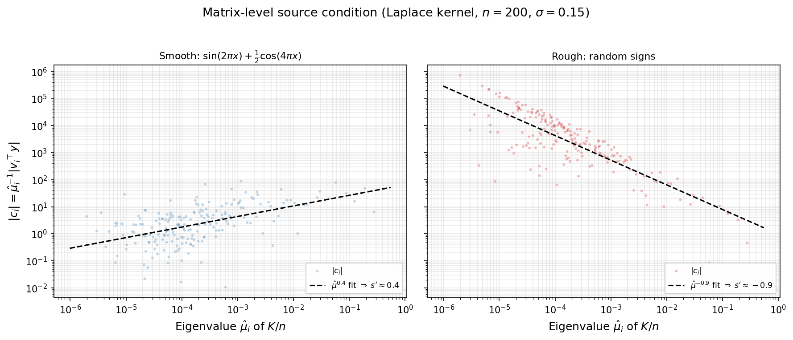

We now show how the source condition improves the rate of convergence of gradient descent. The conclusion is that when the source condition holds, the GD rate automatically accelerates to $O(\tfrac{1}{k^{1+2s}})$ as $k$ tends to infinity.

**Theorem 7.1 (GD with source condition).** *If the initial error satisfies $e_0 = A^s w$ for some $s \geq 0$, then GD with $\eta = 1/\beta$ satisfies*

$$f(x_k) - f^\ast \leq \frac{\beta^{1+2s}}{2}\left(\frac{1+2s}{2k+1+2s}\right)^{1+2s}\|w\|^2. \tag{13}$$

*In particular, $f(x_k) - f^\ast = O\!\left(\beta^{1+2s}\,k^{-(1+2s)}\,\|w\|^2\right)$ as $k \to \infty$.*

*Proof.* Write $c_i = \lambda_i^s \tilde{c}_i$, where $\tilde{c}_i = v_i^\top w$. Substituting into $(12)$ yields:

$$
f(x_k) - f^\ast = \frac{1}{2}\sum_{i=1}^d \lambda_i^{1+2s}\,(1-\lambda_i/\beta)^{2k}\,\tilde{c}_i^2,
$$

and therefore

$$
f(x_k) - f^\ast \leq \frac{\|w\|^2}{2}\,\max_{\lambda \in [0,\beta]}\, \lambda^{1+2s}(1-\lambda/\beta)^{2k}. \tag{14}
$$

It suffices to maximize $g(t) = t^{1+2s}(1-t)^{2k}$ over $t \in [0,1]$, with the identification $\lambda = \beta t$. An elementary computation shows

$$
\max_{t\in [0,1]}g(t) = \left(\frac{1+2s}{2k+1+2s}\right)^{1+2s}\left(\frac{2k}{2k+1+2s}\right)^{2k} \leq \left(\frac{1+2s}{2k+1+2s}\right)^{1+2s}.
$$

Multiplying by $\beta^{1+2s}/2$ and $\|w\|^2$ gives the bound $(13)$. $\square$

The source condition can also be exploited by time-varying stepsizes. The relevant polynomial problem is now
$$
\min_{\substack{p \in \mathcal P_k^r\\ p(0)=1}} \max_{\lambda \in [0,\beta]} \lambda^{1+2s}p(\lambda)^2.
$$
After the affine change of variables $\lambda = \frac{\beta}{2}(1-t)$, this becomes a minimax problem on $[-1,1]$ with weight $(1-t)^{1+2s}$. The solutions of this extremal problem are the **Jacobi polynomials**. You will derive this minimax construction in the next homework and will prove the following theorem.

**Theorem 7.2 (Time-varying stepsizes with source condition).** *For every $s \geq 0$ and every horizon $k \geq 1$, there exists a sequence of stepsizes $\eta_1,\dots,\eta_k$ such that the corresponding GD iterate satisfies*

$$
f(x_k)-f^\ast
\leq C_s\,\beta^{1+2s}\,k^{-2(1+2s)}\,\|w\|^2. \tag{15}
$$

*where $C_s>0$ depends only on $s$. *

In particular, the rate improves from $O(k^{-2})$ for Chebyshev accelerated GD without the source condition to $O(k^{-2(1+2s)})$ when the source condition holds. In principle, the stepsizes in the theorem are given by the reciprocals of the roots of the relevant Jacobi polynomial. Unlike the Chebyshev roots, these roots do not have a simple closed form. This is not a serious drawback, however, because the same convergence rate is inherited by the conjugate gradient method, which achieves it adaptively without needing the stepsizes explicitly.

**Corollary 7.1 (CG with source condition).** *If the initial error satisfies $e_0 = A^s w$ for some $s \geq 0$, then the CG iterates satisfy*

$$
f(x_k^{\mathrm{CG}})-f^\ast
\leq C_s\,\beta^{1+2s}\,k^{-2(1+2s)}\,\|w\|^2,
$$

*and CG terminates in at most $m$ iterations, where $m$ is the number of distinct nonzero eigenvalues of $A$.*

### The spectral integral

Source conditions improve rates by constraining the *initial error*. A complementary improvement comes from constraining the *eigenvalue distribution*. Define the **spectral error measure**

$$\mu = \sum_{i=1}^d c_i^2\,\delta_{\lambda_i},$$

so that $\|e_0\|^2 = \mu([0,\beta])$ and $(12)$ reads

$$
f(x_k) - f^\ast = \frac{1}{2}\int_0^\beta \lambda\,(1-\lambda/\beta)^{2k}\,d\mu(\lambda). \tag{16}
$$

When $d$ is large and the eigenvalues are well-spread, the discrete measure $\mu$ is well-approximated by a continuous density. Suppose $d\mu(\lambda) \approx \phi(\lambda)\,d\lambda$ for a nonnegative function $\phi$---the **spectral error density**. The density $\phi$ encodes both the eigenvalue distribution and the initial error profile: if the eigenvalue density of $A$ is $\rho_A$ and the error components are roughly uniform ($c_i^2 \approx \|e_0\|^2/d$), then $\phi(\lambda) \approx \|e_0\|^2\rho_A(\lambda)$.

Under this approximation, $(16)$ becomes

$$
f(x_k) - f^\ast \approx \frac{1}{2}\int_0^\beta \lambda\,(1-\lambda/\beta)^{2k}\,\phi(\lambda)\,d\lambda.
$$

The integrand $\lambda(1-\lambda/\beta)^{2k}$ is sharply peaked near $\lambda^\ast = \beta/(2k+1)$ for large $k$ and decays rapidly away from this point. The integral is therefore controlled by the behavior of $\phi$ near $\lambda^\ast$---which shifts toward zero as $k$ grows. The next two subsections exploit this concentration to obtain convergence rates that depend on the spectral density.

### Power-law spectral density

When the spectral error density follows a power law near the origin,

$$\phi(\lambda) = M\,\lambda^{a-1} \qquad \text{on } (0, \beta],$$

the exponent $a > 0$ controls the spectral mass near zero. For $a > 1$, the density vanishes at zero (few eigenvalues near the origin); for $a = 1$, the density is flat; for $0 < a < 1$, the density diverges (but remains integrable). This model captures many natural eigenvalue distributions: polynomial eigenvalue decay $\lambda_i \propto i^{-\alpha}$ corresponds to spectral exponent $a = 1/\alpha$.

Combining with a source condition of order $s$ replaces $\phi(\lambda)$ by $M\lambda^{a-1+2s}$, and the integral evaluates exactly via the Beta function.

**Theorem 7.2 (Power-law spectral density).** *Assume the spectral error measure is absolutely continuous on $(0,\beta]$ with density $\phi(\lambda)=M\lambda^{a-1+2s}$ for some $M>0$, $a>0$, and $s\ge 0$. Then the gradient descent iterates with $\eta = 1/\beta$ satisfy*

$$f(x_k) - f^\ast = \frac{M\,\beta^{a+2s+1}}{2}\cdot\frac{\Gamma(a+2s+1)\,\Gamma(2k+1)}{\Gamma(2k+a+2s+2)}.$$

*In particular, as $k \to \infty$,*

$$f(x_k) - f^\ast \sim \frac{M\,\Gamma(a+2s+1)\,\beta^{a+2s+1}}{2\,(2k)^{a+2s+1}}. \tag{17}$$

*Proof.* Substituting $t = \lambda/\beta$:

$$
\int_0^\beta \lambda^{a+2s}(1-\lambda/\beta)^{2k}\,d\lambda = \beta^{a+2s+1}\int_0^1 t^{a+2s}(1-t)^{2k}\,dt = \beta^{a+2s+1}\,B(a+2s+1,\, 2k+1),
$$

where $B(p,q) = \Gamma(p)\Gamma(q)/\Gamma(p+q)$ is the Beta function. The asymptotics follow from the standard estimate $\Gamma(n+c)/\Gamma(n) \sim n^c$ as $n \to \infty$, applied with $n = 2k+1$ and $c = a+2s+1$. $\square$

The rate $O(k^{-(a+2s+1)})$ improves with both the spectral exponent $a$ (fewer eigenvalues near zero) and the source order $s$ (smoother initial error). Compared with the pointwise bound of Theorem 7.1, which gives $O(k^{-(1+2s)})$ regardless of the eigenvalue distribution, the spectral integral gains an extra factor of $k^{-a}$. This improvement is largest when $a$ is large---that is, when the spectral density is thin near zero.

| Spectral exponent $a$ | Description | Rate ($s = 0$) | Rate (general $s$) |
|---|---|---|---|
| $0^+$ | Singular at $0$ | $O(1/k)$ | $O(k^{-(1+2s)})$ |
| $1/2$ | Square-root vanishing | $O(1/k^{3/2})$ | $O(k^{-(3/2+2s)})$ |
| $1$ | Uniform | $O(1/k^2)$ | $O(k^{-(2+2s)})$ |
| $2$ | Linear vanishing | $O(1/k^3)$ | $O(k^{-(3+2s)})$ |

*Example (uniform spectrum).* If $A$ has eigenvalues uniformly spread in $(0, \beta]$ and the initial error is isotropic ($c_i^2 \approx \|e_0\|^2/d$), then $a = 1$ and $s = 0$, giving $f(x_k) - f^\ast = O(1/k^2)$. This is a quadratic improvement over the worst-case $O(1/k)$ bound of Theorem 6.1, obtained solely from the uniform distribution of eigenvalues.

The figure below illustrates both dimensions of Theorem 7.2: varying the spectral exponent $a$ and varying the source order $s$.

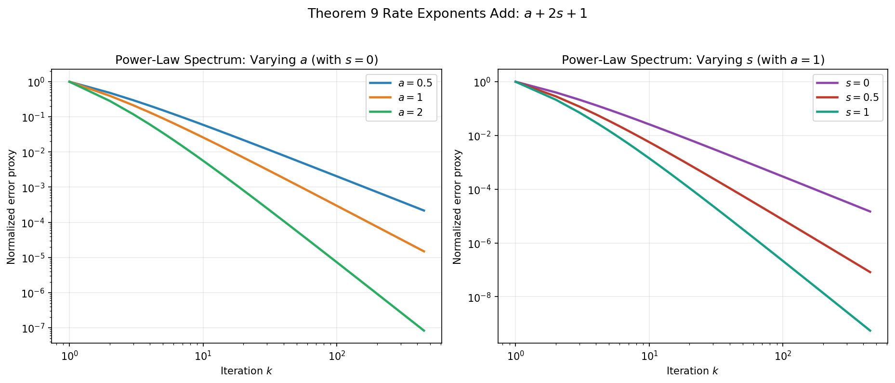

### The Laplace method for positive definite spectra

When $A \succ 0$, the eigenvalues lie in $[\alpha, \beta]$ with $\alpha > 0$, and the base rate of convergence is exponential: $O((1-\alpha/\beta)^{2k})$. The spectral integral can still yield improvements, but they take the form of a *polynomial correction* to the exponential rate rather than a change in the polynomial exponent.

The key tool is the **Laplace method** for integrals. In $(16)$, the factor $(1-\lambda/\beta)^{2k}$ is largest at $\lambda = \alpha$ and decays exponentially as $\lambda$ moves away from $\alpha$. For large $k$, the integral is dominated by a neighborhood of $\lambda = \alpha$ whose width shrinks as $O(1/k)$. The behavior of the spectral error density $\phi$ near $\lambda = \alpha$ therefore determines the polynomial correction (a standard edge-asymptotic viewpoint in spectral analysis; see [BS10]).

**Theorem 7.3 (Laplace estimate).** *Let $A \succ 0$ with eigenvalues in $[\alpha, \beta]$, and suppose the spectral error density $\phi$ is continuous on $[\alpha, \beta]$ with*

$$\phi(\lambda) = C\,(\lambda - \alpha)^p\bigl(1 + O(\lambda - \alpha)\bigr) \quad \textit{as } \lambda \to \alpha^+$$

*for constants $C > 0$ and $p > -1$. Then GD with $\eta = 1/\beta$ satisfies*

$$f(x_k) - f^\ast \sim \frac{C\,\alpha\,\Gamma(p+1)}{2}\left(\frac{\beta-\alpha}{2k}\right)^{p+1}\left(1-\frac{\alpha}{\beta}\right)^{2k} \quad \textit{as } k \to \infty. \tag{18}$$

*Proof.* Substitute $u = \lambda - \alpha$ in the spectral integral $(16)$:

$$
f(x_k) - f^\ast = \frac{1}{2}\int_0^{\beta-\alpha} (\alpha + u)\,\bigl(1 - \alpha/\beta - u/\beta\bigr)^{2k}\,\phi(\alpha + u)\,du.
$$

Factor out the dominant exponential using the identity $1-\alpha/\beta - u/\beta = (1-\alpha/\beta)(1 - u/(\beta - \alpha))$:

$$
= \frac{(1-\alpha/\beta)^{2k}}{2}\int_0^{\beta-\alpha} (\alpha + u)\left(1 - \frac{u}{\beta-\alpha}\right)^{2k}\phi(\alpha + u)\,du.
$$

For large $k$, the factor $(1-u/(\beta-\alpha))^{2k}$ concentrates the integrand near $u = 0$. Using the hypotheses $\phi(\alpha+u) = Cu^p(1+O(u))$ and $\alpha + u = \alpha(1+O(u))$, the integral is asymptotic to

$$
\alpha\,C\int_0^{\beta-\alpha} u^p\left(1 - \frac{u}{\beta-\alpha}\right)^{2k}du.
$$

The substitution $v = 2ku/(\beta-\alpha)$ converts this to

$$
\alpha\,C\left(\frac{\beta-\alpha}{2k}\right)^{p+1}\int_0^{2k} v^p\left(1-\frac{v}{2k}\right)^{2k}dv.
$$

As $k \to \infty$, the integrand converges pointwise to $v^p\,e^{-v}$ and is bounded by $v^p\,e^{-v}$ (since $(1-v/n)^n \leq e^{-v}$ for $v \in [0,n]$). By the dominated convergence theorem, the integral converges to $\Gamma(p+1)$. Combining and noting that $(\beta-\alpha)/\beta = 1-\alpha/\beta$ yields the formula $(18)$. $\square$

Compared with the worst-case bound $f(x_k) - f^\ast \leq (1-\alpha/\beta)^{2k}(f(x_0)-f^\ast)$, the Laplace estimate reveals a polynomial improvement of order $k^{-(p+1)}$ that depends on how the spectral density vanishes at the left edge of the spectrum. A flat density ($p = 0$) gives a $1/k$ improvement; a square-root vanishing ($p = 1/2$) gives $k^{-3/2}$; higher-order vanishing gives even larger gains.

The figure below compares several edge exponents $p$ against the same exponential backbone, showing the progressive polynomial correction predicted by Theorem 7.3.

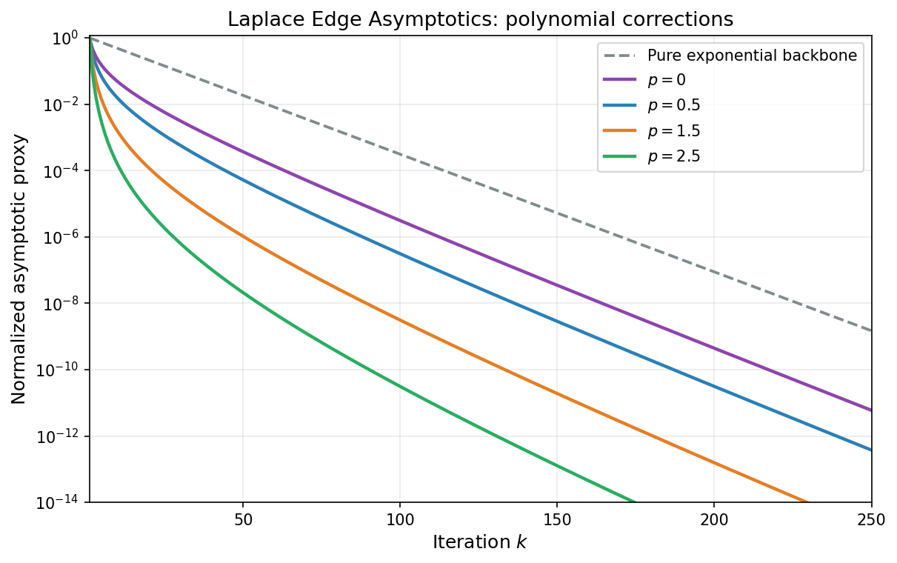

### Application: Marchenko--Pastur spectrum

The Marchenko--Pastur distribution arises as the limiting spectral distribution of sample covariance matrices $A = X^\top X/n$ when the entries of $X \in \mathbb{R}^{n \times d}$ are i.i.d. with zero mean and variance $1/d$, in the asymptotic regime $d/n \to \gamma > 0$ [MP67, BS10]. The absolutely continuous part has density

$$
\rho_{MP}(\lambda) = \frac{\sqrt{(\lambda_+ - \lambda)(\lambda - \lambda_-)}}{2\pi\gamma\,\lambda}, \qquad \lambda \in [\lambda_-, \lambda_+],
$$

where $\lambda_\pm = (1 \pm \sqrt{\gamma})^2$. The behavior depends on $\gamma$.

1. **$\gamma < 1$ (no atom at zero).** Here $\lambda_- > 0$, so the problem is positive definite with

$$\kappa = \frac{\lambda_+}{\lambda_-} = \frac{(1+\sqrt\gamma)^2}{(1-\sqrt\gamma)^2}.$$

Near the left edge $\lambda_-$, the density vanishes like a square root:

$$
\rho_{MP}(\lambda) \sim \frac{\sqrt{(\lambda_+ - \lambda_-)(\lambda - \lambda_-)}}{2\pi\gamma\,\lambda_-} = \frac{2\gamma^{1/4}\sqrt{\lambda - \lambda_-}}{2\pi\gamma\,(1-\sqrt\gamma)^2} \quad \text{as } \lambda \to \lambda_-^+.
$$

With isotropic initialization ($\phi = \|e_0\|^2\rho_{MP}$), Theorem 7.3 applies with $\alpha = \lambda_-$, $\beta = \lambda_+$, and $p = 1/2$. Since $\Gamma(3/2) = \sqrt\pi/2$, the estimate $(18)$ gives

$$
f(x_k) - f^\ast \sim \frac{\tilde{C}(\gamma)}{k^{3/2}}\left(1 - \frac{1}{\kappa}\right)^{2k}\|e_0\|^2 \quad \text{as } k \to \infty,
$$

where $\tilde{C}(\gamma)$ is an explicit constant depending on the aspect ratio $\gamma$.

2. **$\gamma = 1$ (hard edge at zero).** Then $\lambda_-=0$ and

$$
\rho_{MP}(\lambda) = \frac{\sqrt{4-\lambda}}{2\pi\sqrt{\lambda}} \sim \frac{1}{\pi\sqrt{\lambda}} \quad \text{as } \lambda \to 0^+.
$$

Thus $\phi(\lambda) \propto \lambda^{-1/2}$ (power-law exponent $a=1/2$ in Theorem 7.2 with $s=0$), and

$$
f(x_k)-f^\ast=O(k^{-3/2}).
$$

3. **$\gamma > 1$ (rank deficient).** The empirical spectrum has an atom at $0$ of asymptotic mass $1-1/\gamma$, so globally $\alpha=0$. However, the nonzero spectrum still lies in $[(\sqrt{\gamma}-1)^2,\ (\sqrt{\gamma}+1)^2]$. Since the objective gap carries the factor $\lambda$ in $(16)$, the nullspace part does not contribute to $f(x_k)-f^\ast$. Therefore the nonzero spectral component behaves as in the positive definite case, with

$$
\alpha_{\mathrm{eff}} = (\sqrt{\gamma}-1)^2,\qquad \beta=(\sqrt{\gamma}+1)^2,
$$

and the same asymptotic form

$$
f(x_k)-f^\ast\sim \frac{\hat{C}(\gamma)}{k^{3/2}}\left(1-\frac{\alpha_{\mathrm{eff}}}{\beta}\right)^{2k}\|e_0\|^2.
$$

In all three regimes, the square-root edge behavior of Marchenko--Pastur yields the same $k^{-3/2}$ polynomial factor; what changes is whether it multiplies an exponential term (gap $>0$) or appears alone (gap $=0$).

The first figure summarizes the three Marchenko--Pastur spectral shapes, including the atom at zero when $\gamma>1$.

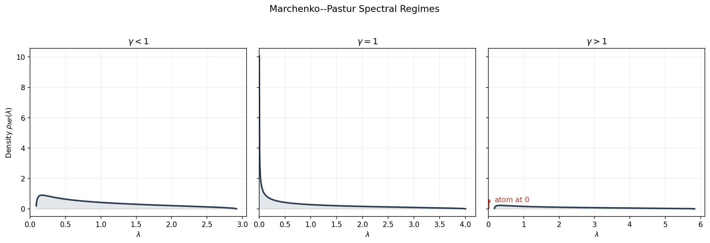

The next figure compares the corresponding convergence proxies over iterations.

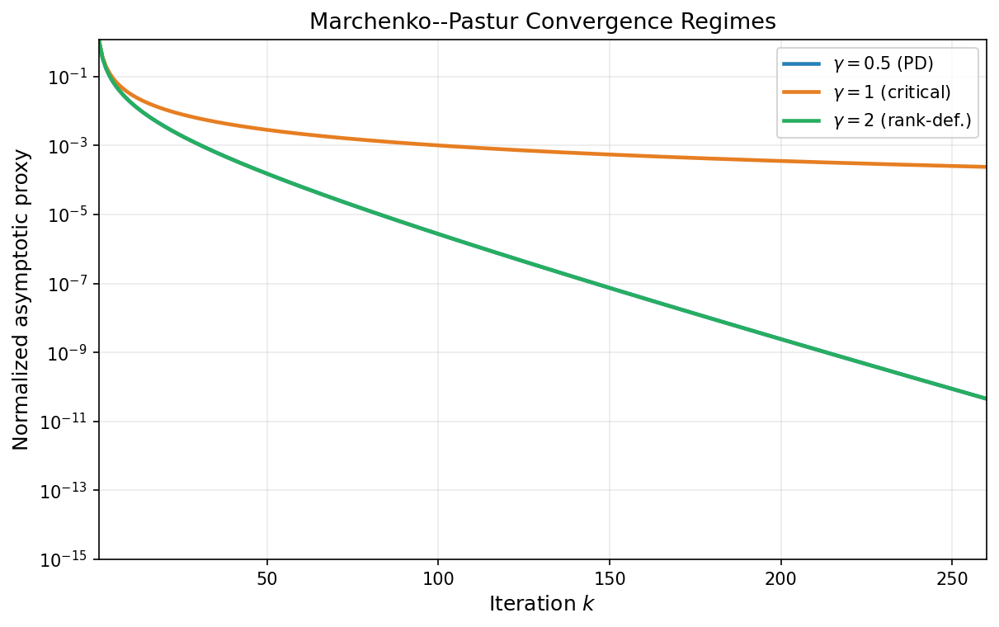

### Discussion

The two mechanisms---source conditions and spectral structure---are complementary and can be combined. With a source condition of order $s$ and a power-law spectral density with exponent $a$, the rate is $O(k^{-(a+2s+1)})$, improving both over the pointwise bound $O(k^{-(1+2s)})$ (Theorem 7.1) and the spectral bound without source condition $O(k^{-(a+1)})$.

In the positive definite setting with source condition $e_0=A^s w$, there is a clear phase transition around

$$
k_{\mathrm{trans}} \approx \frac{1+2s}{2}(\kappa-1).
$$

before this scale, the source-condition estimate behaves sublinearly as $k^{-(1+2s)}$, while beyond it the linear factor $(1-1/\kappa)^{2k}$ dominates and the source condition appears primarily through an improved constant.

The spectral integral approach also extends beyond gradient descent. In the polynomial framework of Section 3, any polynomial method with polynomial $p_k$ satisfying $p_k(0) = 1$ yields

$$
f(x_k) - f^\ast = \frac{1}{2}\int_0^\beta \lambda\,p_k(\lambda)^2\,d\mu(\lambda).
$$

For the Krylov subspace method and CG, $p_k$ is chosen optimally over $\mathcal{P}_k$. This gives a direct generalization of all Section 7 results.

**Theorem 7.4 (CG spectral variational form).** *Let $A \succeq 0$, assume $b \in \mathrm{range}(A)$, and let $x^\ast=\mathrm{proj}_S(x_0)$. For each CG iterate before termination,*

$$
f(x_k^{\mathrm{CG}})-f^\ast = \frac{1}{2}\min_{\substack{p \in \mathcal{P}_k\\ p(0)=1}} \int_0^\beta \lambda\,p(\lambda)^2\,d\mu(\lambda). \tag{19}
$$

*Consequently, for every admissible polynomial $q_k$ with $q_k(0)=1$,*

$$
f(x_k^{\mathrm{CG}})-f^\ast \leq \frac{1}{2}\int_0^\beta \lambda\,q_k(\lambda)^2\,d\mu(\lambda).
$$

Choosing $q_k(\lambda)=(1-\lambda/\beta)^k$ recovers gradient descent with stepsize $1/\beta$, hence

$$
f(x_k^{\mathrm{CG}})-f^\ast\le f(x_k^{\mathrm{GD}})-f^\ast.
$$

Therefore every spectral bound proved in Section 7 for GD transfers immediately to CG (with the same assumptions and constants): source-condition rates from Theorem 7.1, power-law rates from Theorem 7.2, Laplace edge asymptotics from Theorem 7.3, and the three Marchenko--Pastur regimes. In each case, CG is never worse and can be strictly better because it optimizes over all degree-$k$ polynomials rather than using the single fixed polynomial $(1-\lambda/\beta)^k$ (see [Saa03, Gre97]).

The figure below illustrates this dominance on a synthetic power-law spectrum: for matched initialization and steps, the CG curve stays below the GD curve.

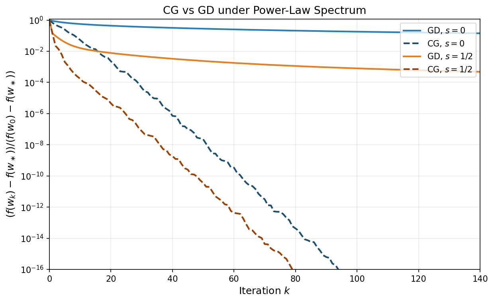

In particular, in the PSD baseline case ($s=0$), Theorem 6.3 already shows a sharper $O(1/k^2)$ CG rate versus the $O(1/k)$ GD rate from Theorem 6.1. Under favorable spectral structure (source conditions, edge decay, or Marchenko--Pastur geometry), the same mechanism yields at least the GD structured rate and often improves it further in practice.

The next figure compares GD and CG across the three Marchenko--Pastur regimes ($\gamma<1$, $\gamma=1$, $\gamma>1$), again showing the same regime transitions with CG typically ahead.

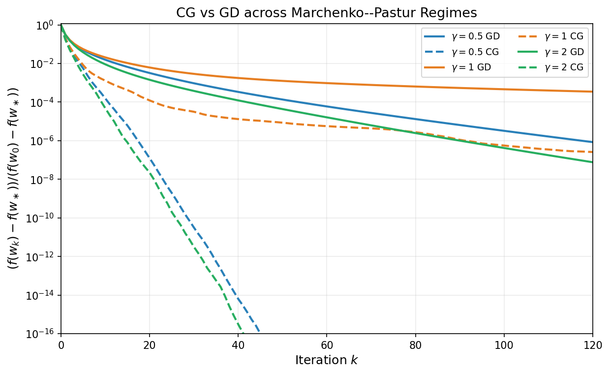

The key message is that worst-case bounds, while universal, can be highly pessimistic when the problem has spectral structure. The spectral integral converts qualitative knowledge about the eigenvalue distribution into quantitative improvements in convergence rates, and the Laplace method provides a systematic tool for extracting these improvements.

---

## 8. Related Literature

The main narrative of the notes is complete; this section situates the preceding results in the literature.
The results discussed in these notes are classical and widely documented in numerical optimization, Krylov methods, inverse problems, and random matrix theory.

- **Gradient descent and first-order complexity.** Linear-rate GD analysis for strongly convex quadratics and condition-number dependence are standard; see [Pol64, Nes04, Nes18].
- **Chebyshev acceleration and semi-iterative methods.** The minimax polynomial viewpoint and Chebyshev stepsizes are classical; see [Var62, You71, Saa03].
- **Conjugate gradient and Krylov optimality.** Foundational CG/Krylov results originate in [HS52, Lan52]; modern treatments include [Saa03, Gre97].
- **Source conditions and spectral-decay rates.** The source-condition framework and decay-dependent rates are standard in inverse problems and regularization theory; see [EHN96, Han95].
- **Marchenko--Pastur asymptotics.** The limiting spectral law is due to [MP67], with modern expositions in [BS10, Ver18].

### How the present results map to the cited literature

The notes combine ideas that appear in different communities; the table below makes this correspondence explicit.

| Result in these notes | Where it appears in the literature | Relation |
|---|---|---|
| Theorem 2.1 + Corollaries 1--2 (GD linear rates on PD quadratics) | [Pol64], [Nes04], [Nes18] | Standard spectral analysis of fixed-step gradient methods on strongly convex smooth quadratics. |
| Theorem 3.1 (Chebyshev stepsizes, $O(\sqrt{\kappa}\ln(1/\varepsilon))$) | [Var62], [You71], [Saa03] | Classical Chebyshev semi-iterative acceleration and minimax polynomial construction on $[\alpha,\beta]$. |
| Theorems 3--4 (Krylov optimality and CG correctness) | [HS52], [Lan52], [Saa03], [Gre97] | Canonical Krylov-space characterization: CG realizes the polynomial/Krylov minimizer with three-term recurrences. |
| Theorems 5--7 (PSD regime: $O(1/k)$ for GD, $O(1/k^2)$ for Chebyshev/CG) | [Saa03], [EHN96], [Han95] | Same polynomial-filter mechanism appears in semi-iterative and regularization analyses when small eigenvalues dominate. |
| Theorem 7.1 (source condition exponent $1+2s$) | [EHN96], [Han95] | Matches the inverse-problem viewpoint: smoothness/source conditions convert spectral decay assumptions into algebraic convergence exponents. |
| Theorem 7.2 (power-law spectral density asymptotics) | [EHN96], [BS10], [Ver18] | This note adapts standard spectral-density asymptotics to GD error filters; the explicit Beta-function form is a direct specialization to quadratics. |
| Theorem 7.3 (Laplace edge correction) | [BS10], [Ver18] | Uses edge asymptotics of spectral integrals; the $k^{-(p+1)}$ correction reflects local density behavior near the spectral edge. |
| Marchenko--Pastur subsection | [MP67], [BS10], [Ver18] | Imports MP density/edge behavior into the optimization bounds, yielding regime-dependent prefactors and the $k^{-3/2}$ edge signature. |
| Theorem 7.4 (CG variational spectral form) | [Saa03], [Gre97] | Restates the classical CG polynomial minimization property in the spectral-integral notation used in Section 7. |

In particular, the novelty of these notes is mostly **synthesis and alignment of viewpoints**: optimization complexity bounds, Krylov polynomial optimality, source-condition regularity, and random-matrix spectral asymptotics are presented in one unified quadratic framework.

### References

- [HS52] Hestenes, M. R., and Stiefel, E. (1952). *Methods of conjugate gradients for solving linear systems*. Journal of Research of the National Bureau of Standards.
- [Lan52] Lanczos, C. (1952). *An iteration method for the solution of the eigenvalue problem of linear differential and integral operators*. Journal of Research of the National Bureau of Standards.
- [Pol64] Polyak, B. T. (1964). *Some methods of speeding up the convergence of iteration methods*. USSR Computational Mathematics and Mathematical Physics.
- [Var62] Varga, R. S. (1962). *Matrix Iterative Analysis*. Prentice-Hall.
- [You71] Young, D. M. (1971). *Iterative Solution of Large Linear Systems*. Academic Press.
- [EHN96] Engl, H. W., Hanke, M., and Neubauer, A. (1996). *Regularization of Inverse Problems*. Kluwer.
- [Han95] Hanke, M. (1995). *Conjugate Gradient Type Methods for Ill-Posed Problems*. Longman.
- [Saa03] Saad, Y. (2003). *Iterative Methods for Sparse Linear Systems* (2nd ed.). SIAM.
- [Gre97] Greenbaum, A. (1997). *Iterative Methods for Solving Linear Systems*. SIAM.
- [MP67] Marchenko, V. A., and Pastur, L. A. (1967). *Distribution of eigenvalues for some sets of random matrices*. Mathematics of the USSR-Sbornik.
- [BS10] Bai, Z. D., and Silverstein, J. W. (2010). *Spectral Analysis of Large Dimensional Random Matrices* (2nd ed.). Springer.
- [Nes04] Nesterov, Y. (2004). *Introductory Lectures on Convex Optimization*. Kluwer.
- [Nes18] Nesterov, Y. (2018). *Lectures on Convex Optimization* (2nd ed.). Springer.
- [Ver18] Vershynin, R. (2018). *High-Dimensional Probability*. Cambridge University Press.

---

## Summary

**Positive definite case** ($\alpha > 0$):

| Method | Per-step cost | Iteration complexity | Requires $\alpha, \beta$? |
|--------|--------------|---------------------|-------------------|
| Gradient descent | One matvec | $O(\kappa\,\ln(1/\varepsilon))$ | Yes (for optimal step) |
| Chebyshev GD | One matvec | $O(\sqrt{\kappa}\,\ln(1/\varepsilon))$ | Yes |
| Conjugate Gradient | One matvec | $O(\sqrt{\kappa}\,\ln(1/\varepsilon))$, at most $m$ steps ($m\le d$) | No |

**Positive semidefinite case** ($\alpha = 0$):

| Method | Per-step cost | Iteration complexity | Rate type |
|--------|--------------|---------------------|-----------|
| Gradient descent | One matvec | $O(\beta\,\|x_0 - x^\ast\|^2/\varepsilon)$ | Sublinear $O(1/k)$ |
| Chebyshev GD | One matvec | $O(\sqrt{\beta\,\|x_0 - x^\ast\|^2/\varepsilon})$ | Sublinear $O(1/k^2)$ |
| Conjugate Gradient | One matvec | $O(\sqrt{\beta\,\|x_0 - x^\ast\|^2/\varepsilon})$, at most $m$ steps | Sublinear $O(1/k^2)$ |

The key takeaway: one spectral idea runs through the entire development. On quadratics, the Chebyshev and CG methods achieve a square-root improvement over gradient descent in *every* regime---whether measured by the condition number $\kappa$ in the positive definite case or by the iteration complexity in the positive semidefinite case. CG accomplishes this *adaptively*, without needing to know the eigenvalues or fixing the iteration count in advance, and terminates (in exact arithmetic) in a number of steps bounded by the number of distinct nonzero eigenvalues of $A$. In practice CG does not exactly terminate after finitely many steps due to compounding of numerical errors.

**Spectral structure** (Section 7):

| Setting | Assumption | GD rate | CG rate |
|---------|-----------|---------|---------|
| Source condition, order $s$ | $e_0 = A^s w$ | $O(k^{-(1+2s)})$ | At least $O(k^{-(1+2s)})$, typically better |
| Power-law density, exponent $a$ | $\phi(\lambda) \sim \lambda^{a-1}$ | $O(k^{-(a+2s+1)})$ | At least $O(k^{-(a+2s+1)})$, typically better |
| PD, edge exponent $p$ | $\phi(\lambda) \sim (\lambda-\alpha)^p$ | $(1-1/\kappa)^{2k} \cdot O(k^{-(p+1)})$ | At least same bound, with adaptive improvement possible |
| Marchenko--Pastur | $d/n \to \gamma$ | $\gamma \neq 1$: $(1-\alpha_{\mathrm{eff}}/\beta)^{2k}O(k^{-3/2})$, $\gamma=1$: $O(k^{-3/2})$ | At least same regime-wise rate, often faster in practice |

When the spectrum has structure---whether through a source condition on the initial error, a favorable eigenvalue density, or both---the worst-case bounds can be improved by polynomial factors in $k$. The spectral integral and Laplace method provide the tools for extracting these improvements.

---

[← Back to course page](./)
